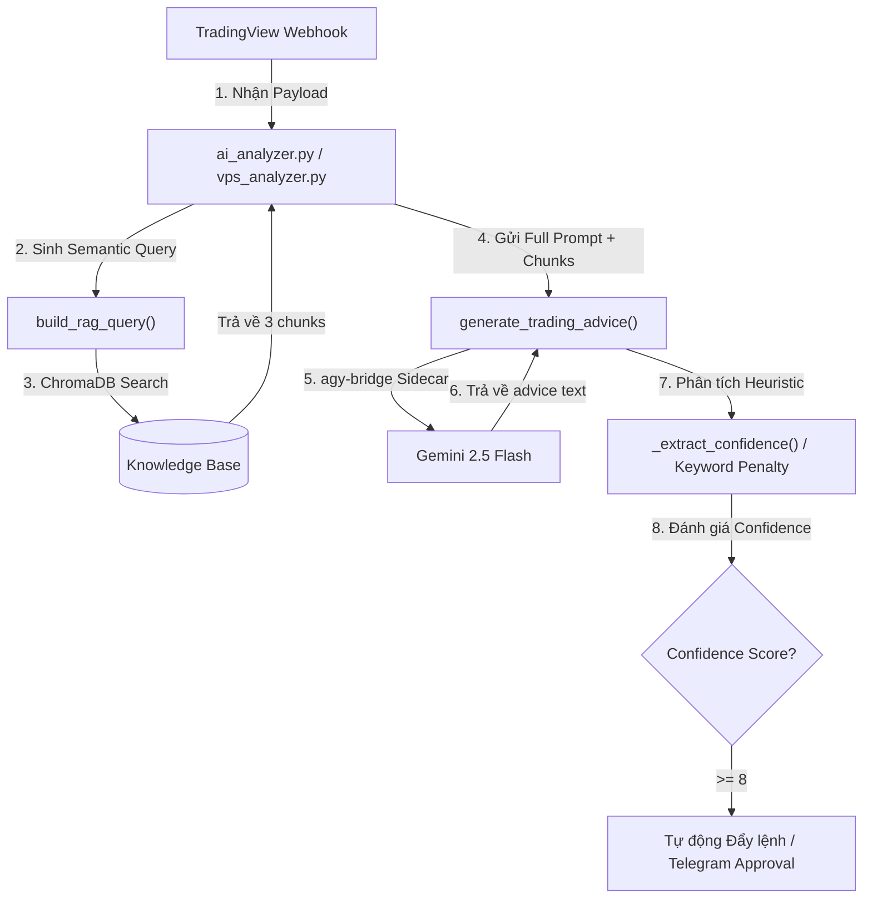

# Full Prompt Pipeline: Webhook Signal Analysis

Quy trình tự động hóa phân tích kỹ thuật và kiểm định tin cậy (Confidence Score) cho mọi tín hiệu giao dịch được chuyển từ Server A (VBS) hoặc Webhook trực tiếp qua Server C (AI Core) sử dụng Gemini và RAG.

## Luồng Xử Lý Chi Tiết (Pipeline Architecture)

Mỗi khi một tín hiệu validated đi vào Analyzer, quy trình sau được kích hoạt:



---

## Các Bước Thực Hiện Quy Trình

### 1. Bước 1: Trích xuất tri thức (RAG Query)
*   **Hàm gọi:** [build_rag_query](file:///home/botuser/trading-bot/nerves/workers/trading/rag.py#L585) trong [rag.py](file:///home/botuser/trading-bot/nerves/workers/trading/rag.py).
*   **Nhiệm vụ:** Phân tích payload để sinh câu truy vấn tối ưu. Ví dụ: Nếu `alert_type` là `VCP`, query trả về chứa cụm từ *"VCP Volatility Contraction Pattern breakout điểm mua pivot"*.
*   **Truy xuất DB:** Tìm kiếm 3 đoạn tài liệu (chunks) tương đồng nhất trong thư mục `docs/knowledge/trading_wizard/chunks/` bằng ChromaDB.

### 2. Bước 2: Xây dựng Prompt & Gửi Gemini
*   **Hàm gọi:** [generate_trading_advice](file:///home/botuser/trading-bot/nerves/workers/trading/rag.py#L285).
*   **Prompt kết hợp:** Gộp dữ liệu realtime (Mã, hành động, giá, volume hiện tại, volume trung bình, RSI) và 3 chunks tri thức Minervini.
*   **Truyền tin (Routing):**
    *   Hệ thống gọi API thông qua [AgyHarness](file:///home/botuser/trading-bot/nerves/workers/trading/agy_harness.py#L58) đến sidecar `agy-bridge` (FastAPI chạy trên host cổng `:9100`).
    *   `agy-bridge` sử dụng `google-genai` SDK để lấy câu phân tích từ Gemini và trả về.

### 3. Bước 3: Phân tích Phản hồi (Gemini Response Parse)
*   **Hàm phân tích:**
    *   [ai_analyzer.py](file:///home/botuser/trading-bot/nerves/workers/trading/analyzer/ai_analyzer.py#L225) tìm các từ khóa cảnh báo tiêu cực ("CẢNH BÁO", "YẾU", "CHỜ THÊM XÁC NHẬN") để trừ đi điểm tin cậy (Confidence).
    *   [vps_analyzer.py](file:///home/botuser/trading-bot/nerves/workers/trading/workers/vps_analyzer.py#L906) thông qua [_extract_confidence](file:///home/botuser/trading-bot/nerves/workers/trading/workers/vps_analyzer.py#L906) để phân loại mức độ tự tin (Mạnh: `85%`, Trung bình: `60%`, Yếu: `30%`).

---

## Hướng Dẫn Kiểm Thử & Giả Lập

Khi bạn (AI Agent) hoặc user muốn chạy xác minh quy trình này, hãy thực hiện các lệnh sau:

### 1. Chạy Tự Động Toàn Bộ Kiểm Thử Pipeline
Chạy bộ suite test tích hợp để kiểm tra luồng tin tức giữa Server A, C và B:
```bash
python3 -m pytest nerves/workers/trading/tests/test_pipeline_forwarding.py -v
```

### 2. Chạy Kiểm Thử VPS Analyzer
Xác minh tính đúng đắn của logic tính toán SL/TP, Position Size và các endpoint metrics:
```bash
python3 -m pytest nerves/workers/trading/tests/test_vps_analyzer.py -v
```

### 3. Giả Lập Pipeline Bằng Script Cục Bộ
Chạy script giả làm môi trường Server A & Server B cục bộ và trigger đẩy dữ liệu qua pipeline:
```bash
python3 scripts/simulate_pipeline.py
```
