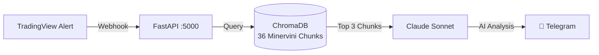
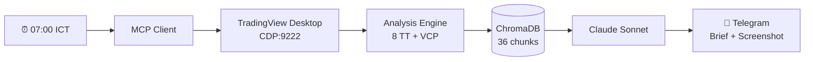

# 📈 TradingView Webhook Server — v7.0 (Forward-Test Edition)

Hệ thống tự động nhận tín hiệu từ **TradingView Alerts**, thực thi lệnh trên **Binance/WEEX**, phân tích bằng **RAG AI Agent**, scan **Trend Template + VCP**, gửi **Morning Brief** tự động qua Telegram, và hỗ trợ **Forward Test (Paper Trading)** thời gian thực song song với Back-test.

> Dựa trên chiến lược **SEPA (Specific Entry Point Analysis)** của **Mark Minervini** — kết hợp **SuperTrend VBS** cho Crypto (BTC · ETH · SOL).

---

## 🏗️ Architecture

```
TradingView Alert (Pine Script v5)
        │
        ▼
  Cloudflare Tunnel
        │
        ▼
  Server A — Gateway VPS (signal_queue.db)
        │
        ▼
  FastAPI Webhook Server v7.0 (:5000)  ← Server C
        │
        ├── 🔐 IP Whitelist + Secret Auth
        ├── 💾 SQLite Routing Layer (data/routing.py)
        │     ├── trades.db          ← LIVE / BACKTEST
        │     └── forward_trades.db  ← FORWARD TEST (paper) [NEW v7]
        ├── 🧠 RAG Agent (ChromaDB + Claude)
        ├── 🖥️ TradingView MCP (CDP:9222)
        │     ├── Trend Template Scanner (8 criteria)
        │     ├── VCP Detector (volume + range)
        │     └── Chart Screenshot capture
        ├── ⏰ Morning Brief Scheduler (07:00 ICT)
        ├── 📊 Binance / WEEX Order Execution
        └── 📱 Telegram / Discord (text + screenshot)
```

---

## ⚡ Quick Start

```bash
# 1. Cài đặt dependencies
uv sync          # hoặc: pip install -r requirements.txt

# 2. Cấu hình môi trường
cp .env.production .env.local
# Điền các API keys, secrets, webhook URL

# 3. Chạy server
uv run python nerves/workers/trading/main.py --port 5000

# 4. (Tùy chọn) Kích hoạt Forward Test
# Thêm trường "mode": "FORWARD" vào webhook payload
```

### 🛡️ Quality Gate & Security Check

Trước khi commit hoặc push code, bắt buộc chạy cổng kiểm thử chất lượng cục bộ:

```bash
# Setup pre-commit và ruff
python scripts/local_security_gate.py setup

# Quét an ninh nhanh
python scripts/local_security_gate.py check --quick

# Quét đầy đủ (CodeQL + coverage)
python scripts/local_security_gate.py check
```

### 📊 Sinh Báo Cáo Phân Tích

```bash
# Báo cáo Back-test (1100+ signals, HTML + Markdown)
python scripts/generate_backtest_report.py

# Báo cáo Forward-Test mẫu (28 paper trades, HTML + Markdown)
python scripts/generate_forward_test_report.py
```

---

## 📂 Project Structure

```
TradingViewProject/
├── nerves/workers/trading/      # Core server (FastAPI v7.0)
│   ├── main.py                  # 17+ API endpoints
│   ├── config.py                # Env config (thêm FORWARD_DB_PATH)
│   ├── database.py              # SQLite migrator (dual-DB)
│   ├── persistence_store.py     # CRUD với routing layer
│   ├── query_service.py         # Query với routing layer
│   ├── data/routing.py          # [NEW v7] Dynamic DB routing
│   ├── gateway/webhook.py       # Webhook handler + mode detection
│   ├── security/runtime_guard.py # SEC-04 runtime guards
│   ├── trades.db                # ← LIVE / BACKTEST data
│   └── forward_trades.db        # ← [NEW v7] FORWARD TEST data
│
├── scripts/
│   ├── local_security_gate.py       # SEC quality gate
│   ├── generate_backtest_report.py  # [NEW] Back-test report generator
│   └── generate_forward_test_report.py # [NEW] Forward-test report
│
├── reports/                         # Báo cáo phân tích
│   ├── backtest_signal_report.html  # [NEW] 1100 signals back-test
│   ├── backtest_signal_report.md    # [NEW] Back-test summary
│   ├── forward_test_sample_report.html # [NEW] Paper trading mẫu
│   ├── forward_test_sample_report.md   # [NEW] Forward-test template
│   ├── server_a_signals_report.md   # 285 signals từ Server A
│   ├── strategy_summary.html        # Strategy overview
│   ├── trade_replay.html            # Trade replay
│   ├── walkforward_validation.html  # Walk-forward analysis
│   └── trades_data.json             # Raw trade data (710 records)
│
├── tests/
│   ├── unit/                        # Unit tests
│   ├── integration/
│   │   └── test_forward_test_routing.py # [NEW] Forward test routing
│   └── stress/                      # Stress tests
│
├── docs/
│   ├── FORWARD_TEST_GUIDE.md    # [NEW] Hướng dẫn vận hành Forward Test
│   ├── REPORTS_INDEX.md         # [NEW] Chỉ mục toàn bộ báo cáo
│   ├── reports/v2.1.0-7.6.3/   # Back-test scenarios (S1-S6)
│   └── knowledge/               # Minervini SEPA knowledge base
│
├── pine/                        # Pine Script v5 strategies
│   ├── V1/                      # Trend Template Indicator
│   └── V2/                      # SEPA Strategy + SuperTrend VBS
│
├── eWE/                         # Infrastructure setup guides
│   ├── SETUPS/                  # Server A/B/C setup prompts
│   └── reports/                 # Detailed scenario reports
│
├── compliance/                  # Approval audit trail
├── Bao_Cao_Nghiem_Thu_Doc_Lap.md # SEC-04 independent audit
├── Security_Scars_Report.md     # Security lessons learned
└── README.md                    # ← Bạn đang đọc file này
```

---

## 🔌 API Endpoints

### Core
| Method | Endpoint | Mô tả |
|--------|----------|-------|
| `GET`  | `/` | Dashboard UI |
| `GET`  | `/tv_health_check` | Health check + version |
| `POST` | `/webhook` | Nhận TradingView alerts |
| `GET`  | `/trades` | Lịch sử giao dịch |
| `GET`  | `/trades/stats` | Win Rate, Profit Factor, Drawdown |
| `GET`  | `/trades/equity` | Equity curve data |
| `GET`  | `/api/signals` | Danh sách tín hiệu |

### Forward Test [NEW v7]
| Method | Endpoint | Mô tả |
|--------|----------|-------|
| `GET`  | `/trades?mode=FORWARD` | Lệnh paper trading |
| `GET`  | `/trades/stats?mode=FORWARD` | Thống kê Forward Test |
| `GET`  | `/trades/equity?mode=FORWARD` | Equity curve Forward Test |
| `GET`  | `/api/signals?mode=FORWARD` | Tín hiệu Forward Test |

### RAG (P5)
| Method | Endpoint | Mô tả |
|--------|----------|-------|
| `GET`  | `/api/rag/query?q=...` | Truy vấn Knowledge Base |
| `GET`  | `/api/rag/status` | Trạng thái Vector DB |

### MCP + Morning Brief (P6)
| Method | Endpoint | Mô tả |
|--------|----------|-------|
| `GET`  | `/api/watchlist` | List symbols |
| `POST` | `/api/watchlist` | Add symbol |
| `GET`  | `/api/scan/watchlist` | Trend Template + VCP scan |
| `POST` | `/api/brief/trigger` | Chạy Morning Brief ngay |

---

## 🆕 v7.0 — Forward Test Integration

### Tách biệt Database
```
LIVE / BACKTEST mode  →  trades.db          (DB gốc, không thay đổi)
FORWARD TEST mode     →  forward_trades.db  (DB riêng, ID từ 1.000.000)
```

### Webhook Payload cho Forward Test
```json
{
  "secret": "your_webhook_secret",
  "symbol": "BTCUSDT",
  "action": "buy",
  "price": "67500.00",
  "quoteQty": 100.0,
  "interval": "15",
  "mode": "FORWARD",
  "exchange": "binance",
  "sl": "66000.00",
  "tp": "70000.00"
}
```

Trường `"mode": "FORWARD"` kích hoạt định tuyến sang `forward_trades.db`.

### Kết quả Back-test (1100 Signals)
| Chỉ Số | Giá Trị |
| :--- | :--- |
| Tổng tín hiệu | **1,100** |
| Win Rate | **55.55%** |
| Profit Factor | **2.138** |
| Expectancy | **+3.27%/lệnh** |
| Total P&L | **+3,592.89%** |

---

## 🧠 RAG & AI Agent (P5)



```env
ANTHROPIC_API_KEY=sk-ant-xxxxxxxxxxxxxxxx
RAG_ENABLED=true
RAG_TOP_K=3
```

---

## 🖥️ MCP × Morning Brief (P6)



```env
MCP_ENABLED=true
BRIEF_ENABLED=true
BRIEF_CRON_TIME=07:00
WATCHLIST_SYMBOLS=BTCUSDT,ETHUSDT,SOLUSDT
```

---

## 🗺️ Roadmap

### ✅ Completed
- [x] P4: FastAPI Production Server (7 sprints)
- [x] **P5: RAG & Vector Database — ChromaDB + Claude AI**
- [x] **P6: TradingView MCP × Morning Brief (4 sprints)**
- [x] **P7: Security Hardening (SEC-01 → SEC-04)**
  - [x] SEC-01: Ruff inline diagnostics
  - [x] SEC-02: Pre-commit hooks + local gate
  - [x] SEC-04: Runtime Guards (SSRF, Path Traversal) — 56/56 PASSED
- [x] **P8: Forward Test Integration** ← **NEW v7.0**
  - [x] Tách biệt DB: `forward_trades.db` (paper) vs `trades.db` (live)
  - [x] Dynamic routing layer (`data/routing.py`)
  - [x] API mode parameter: `?mode=FORWARD`
  - [x] 930 unit/integration/stress tests — 100% PASSED
  - [x] Back-test report: 1,100 signals (WR 55.55%, PF 2.138)
  - [x] Forward-test sample report: 28 paper trades (WR 64.29%, PF 3.147)

### 🚧 In Progress
- [ ] Forward Test live run (kết nối Server A → Server C → `forward_trades.db`)
- [ ] Dashboard UI cập nhật hiển thị dual-mode (LIVE + FORWARD)

### 🗓️ Planned
- [ ] P9: Binance OCO Orders (Stop-Loss + Take-Profit tự động)
- [ ] P10: WebSocket real-time price stream
- [ ] P11: Multi-strategy Support (RSI, MACD, Custom indicators)
- [ ] P12: Production CI/CD Pipeline (GitHub Actions + Docker)

---

## 📋 Webhook Payload Reference

```json
{
  "secret": "your_super_secret_key",
  "action": "{{strategy.order.action}}",
  "symbol": "{{ticker}}",
  "price": "{{close}}",
  "quoteQty": 50,
  "time": "{{timenow}}",
  "mode": "FORWARD",
  "sl": "{{strategy.order.contracts}}",
  "tp": "{{plot_1}}"
}
```

Xem chi tiết: [`docs/FORWARD_TEST_GUIDE.md`](docs/FORWARD_TEST_GUIDE.md)

---

## 📚 References

- Mark Minervini — *Trade Like a Stock Market Wizard*
- Mark Minervini — *Think & Trade Like a Champion*
- [Pine Script v5 Manual](https://www.tradingview.com/pine-script-docs/)
- [Anthropic Claude API Docs](https://docs.anthropic.com/)
- [ChromaDB Documentation](https://docs.trychroma.com/)
- [TradingView MCP (CDP)](https://github.com/tradesdontlie/tradingview-mcp)
- [APScheduler Docs](https://apscheduler.readthedocs.io/)
- [Binance API Docs](https://binance-docs.github.io/apidocs/)
- [WEEX API Reference](lobes/knowledge/weex/weex_api_index.md)
