# 📊 Ý Tưởng Tích Hợp Đồ Thị Trực Quan Gửi Telegram (Minervini Bot)

Tài liệu này đề xuất ý tưởng kiến trúc và các phương án triển khai để tự động tạo và gửi hình ảnh đồ thị (candlestick chart hoặc sơ đồ mẫu hình) trực tiếp lên Telegram mỗi khi có tín hiệu mua/bán (Server A) hoặc phân tích AI Core (Server C).

---

## 🎯 Vấn Đề Hiện Tại

1. **Chưa trực quan**: Các tin nhắn cảnh báo từ **Server A** (`VBS Signal Queued`) và **Server C** (`AI Core Analysis`) hiện tại hoàn toàn ở dạng văn bản (text-only).
2. **Phụ thuộc vào hành động của user**: Người dùng phải bấm vào nút "Xem Chart" để mở TradingView trên trình duyệt thì mới xem được đồ thị. Việc này làm giảm tốc độ ra quyết định giao dịch, đặc biệt khi dùng điện thoại.
3. **Thiếu minh họa mẫu hình**: Phần đánh giá AI từ Server C mô tả các mẫu hình VCP (thu hẹp biến động), Stage 2 (Giai đoạn 2), nhưng không có hình ảnh trực quan đi kèm để đối chiếu.

---

## 💡 3 Phương Án Triển Khai Đồ Thị Lên Telegram

Dựa trên cấu trúc mã nguồn hiện tại của dự án, chúng ta có 3 phương án khả thi:

### 1. Phương Án 1 (Khuyên Dùng): Tự động Render Chart bằng Matplotlib/mplfinance (Local & Offline-First)

Tận dụng module `generate_chart_mpl` đã có sẵn tại `nerves/workers/trading/utils/chart_generator_mpl.py`.

* **Cách hoạt động**:
  1. Khi nhận sự kiện tín hiệu (`IndicatorSignalReceived` hoặc `AnalysisComplete`), hệ thống lấy ra `symbol` (ví dụ: `BTCUSDT`).
  2. Hệ thống gọi Binance API hoặc CCXT (đã có sẵn client) để tải dữ liệu lịch sử nến (OHLCV) của 50 - 100 nến gần nhất trên khung thời gian tương ứng (1D hoặc 1H).
  3. Gọi hàm `generate_chart_mpl` để vẽ đồ thị nến với **Dark Theme** chuẩn TradingView, tích hợp sẵn các đường đứt nét màu sắc cho **Entry**, **Stop Loss (SL)**, **Take Profit (TP)** và các đường trung bình động (EMA20, SMA50).
  4. Gửi ảnh PNG vừa tạo lên Telegram bằng API `sendPhoto` (`notifier.send_telegram_photo`), kèm theo text phân tích làm Caption.
* **Ưu điểm**:
  * Chạy hoàn toàn local, cực kỳ nhanh (dưới 1 giây).
  * Không phụ thuộc vào trình duyệt, tốn rất ít tài nguyên hệ thống (RAM/CPU).
  * Hiển thị sắc nét các mốc SL/TP trực tiếp trên đồ thị.

---

### 2. Phương Án 2: Chụp Screenshot TradingView thật bằng Playwright/CDP (Visual Realism)

Sử dụng TradingView MCP và trình duyệt Playwright để chụp ảnh đồ thị thật.

* **Cách hoạt động**:
  1. Khi có tín hiệu, bot kích hoạt tác vụ ngầm gửi lệnh qua Chrome DevTools Protocol (CDP) đến TradingView client đang chạy trên máy (hoặc VPS).
  2. Trình duyệt tự động mở chart của symbol đó, áp dụng template chỉ báo của người dùng.
  3. Thực hiện chụp ảnh màn hình vùng đồ thị (`capture_screenshot` với `region="chart"`).
  4. Gửi ảnh screenshot thật này lên Telegram.
* **Ưu điểm**:
  * Giống hệt biểu đồ thực tế người dùng đang cấu hình trên TradingView (chứa đầy đủ các chỉ báo tùy biến, mũi tên vẽ tay, v.v.).
* **Hạn chế**:
  * Tốn tài nguyên RAM/CPU để chạy trình duyệt headless.
  * Tốc độ chụp lâu hơn (khoảng 3 - 5 giây).
  * Cần duy trì kết nối MCP ổn định.

---

### 3. Phương Án 3: Vẽ Sơ Đồ Mẫu Hình Lý Thuyết (VCP/SEPA Pattern Visualizer)

Dùng cho phân tích AI từ Server C khi muốn minh họa các tiêu chí kỹ thuật lý thuyết.

* **Cách hoạt động**:
  1. Sử dụng thuật toán Matplotlib để vẽ một đồ thị đường (Line chart) giả lập hành vi co thắt giá của mẫu hình VCP (Volatility Contraction Pattern) với các nhịp co thắt $T_1, T_2, T_3$ nhỏ dần và đường nằm ngang tại vùng kháng cự (Pivot Line).
  2. Gửi ảnh minh họa lý thuyết này kèm theo nhận xét của AI Mentor để người dùng so sánh với đồ thị thực tế xem có khớp chuẩn VCP hay không.
* **Ưu điểm**:
  * Rất hữu ích cho mục đích giáo dục và huấn luyện giao dịch (AI Mentor).

---

## 🛠️ Luồng Xử Lý Dữ Liệu Đề Xuất (Mermaid Diagram)

Dưới đây là thiết kế luồng hoạt động khi tích hợp **Phương án 1 (Local Render)** vào hệ thống hiện tại:

```mermaid
sequenceDiagram
    autonumber
    participant TV as TradingView Alerts
    participant SrvA as Server A (Webhook Gateway)
    participant NH as NotificationHub (Python)
    participant SrvC as Server C (AI Core)
    participant Bin as Binance API / CCXT
    participant Render as chart_generator_mpl
    participant TG as Telegram Bot API

    TV->>SrvA: 1. Gửi alert webhook (VBS Signal)
    SrvA->>NH: 2. Emit IndicatorSignalReceived

    rect rgb(20, 25, 40)
        Note over NH, Render: Tiến trình tự động dựng biểu đồ nến
        NH->>Bin: 3. Fetch 100 nến gần nhất của Symbol
        Bin-->>NH: 4. Trả về dữ liệu OHLCV
        NH->>Render: 5. Render biểu đồ Dark Theme với SL/TP & EMA
        Render-->>NH: 6. Trả về file PNG cục bộ
    end

    NH->>TG: 7. Gửi ảnh bằng sendPhoto (Caption = Nội dung tin nhắn)
    TG-->>TG: 8. Hiển thị tin nhắn dạng Ảnh + Text trên Telegram
```

---

## 📈 Demo Giao Diện Biểu Đồ Matplotlib Dự Kiến

Đồ thị Matplotlib sẽ sử dụng tông màu tối, tương phản cao, bao gồm:
* Nến xanh lá: `#26a69a`, Nến đỏ: `#ef5350`
* Đường giá Entry: nét đứt xanh dương (`#2962ff`)
* Đường Stop Loss: nét đứt đỏ (`#ef5350`)
* Đường Take Profit: nét đứt xanh lá (`#26a69a`)
* Bảng thông tin nhỏ góc phải hiển thị: `SEPA Score`, `VCP Status`, `EMA20/SMA50 crossover`.

---

## 📋 Kế Hoạch Triển Khai Kỹ Thuật (3 Bước)

Để biến ý tưởng này thành hiện thực, chúng ta sẽ chỉnh sửa các file sau trong dự án:

### Bước 1: Viết Helper Tải Nến & Phối Hợp Vẽ Đồ Thị
Tạo file `server/utils/chart_helper.py` đảm nhận việc:
1. Kết nối CCXT / Binance client để lấy dữ liệu nến.
2. Gọi `generate_chart_mpl` vẽ đồ thị.
3. Quản lý dọn dẹp các tệp ảnh tạm sau khi gửi để tránh đầy bộ nhớ Server.

### Bước 2: Tích Hợp Vào `NotificationHub`
Chỉnh sửa `server/hub/notification_hub.py` trong hàm:
* `notify_indicator_signal` (Xử lý tín hiệu nạp VBS Signal).
* `process_analysis_complete` (Xử lý tín hiệu đã được Server C phân tích).
Tại đây, thay vì gọi `telegram_bot.send_interactive_indicator_alert` dạng text thông thường, ta sẽ:
1. Gọi helper ở Bước 1 để tạo ảnh đồ thị tương ứng với signal.
2. Chuyển sang gọi hàm gửi ảnh `telegram_bot.send_interactive_indicator_alert_with_photo`.

### Bước 3: Cập Nhật `telegram_bot.py`
Thêm hàm gửi ảnh tương tác:
* `send_interactive_indicator_alert_with_photo(signal_id, symbol, message, photo_path)`
Hàm này sử dụng `bot.send_photo` của thư viện `python-telegram-bot` thay vì `bot.send_message`, đính kèm bàn phím nút bấm tương tác bên dưới ảnh (Duyệt, Hủy, Quét AI).
