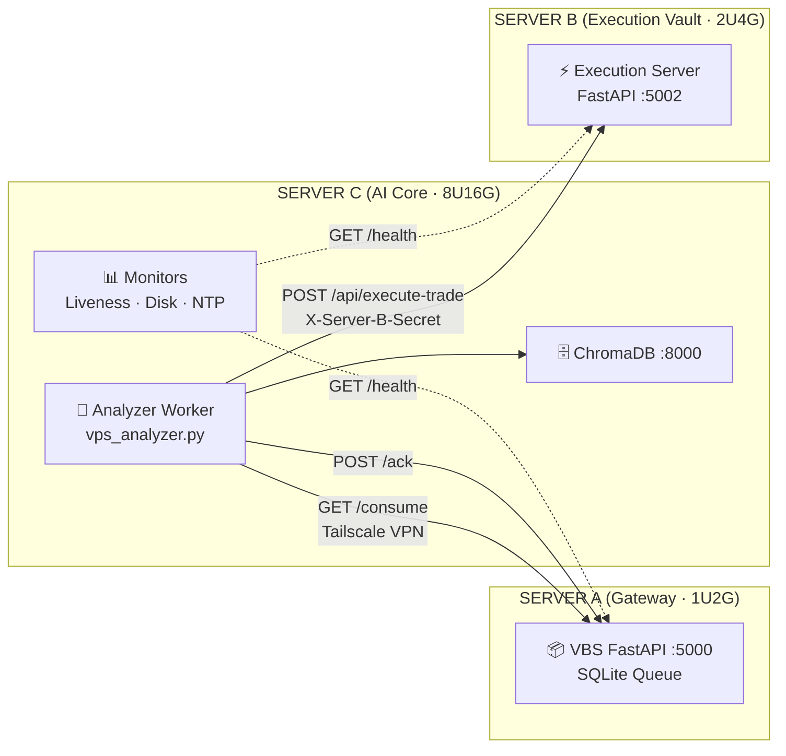
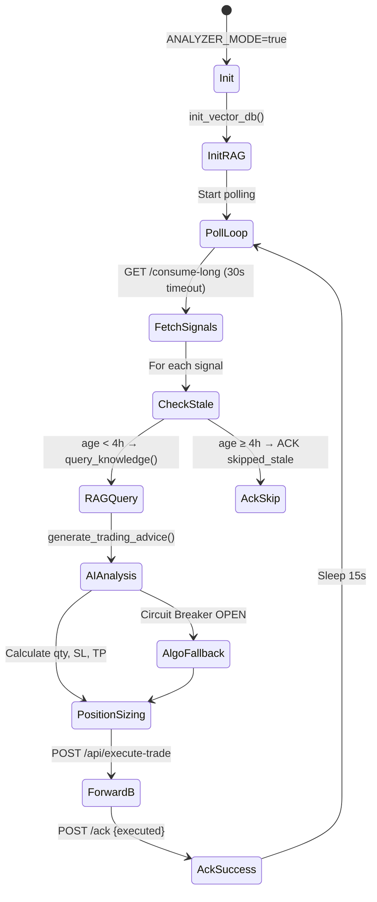
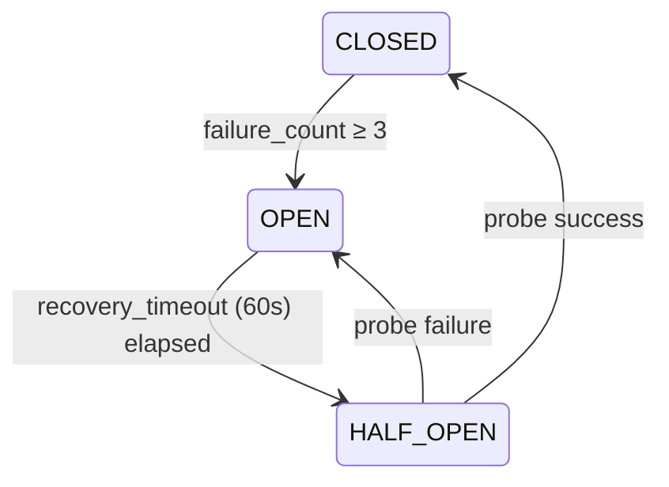
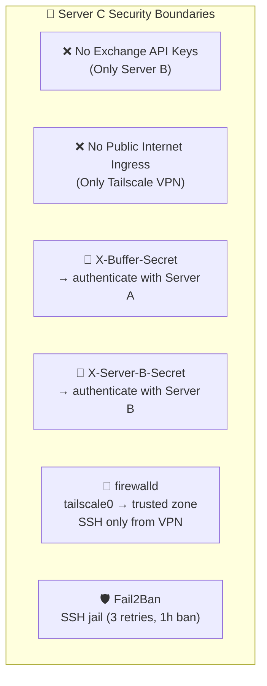
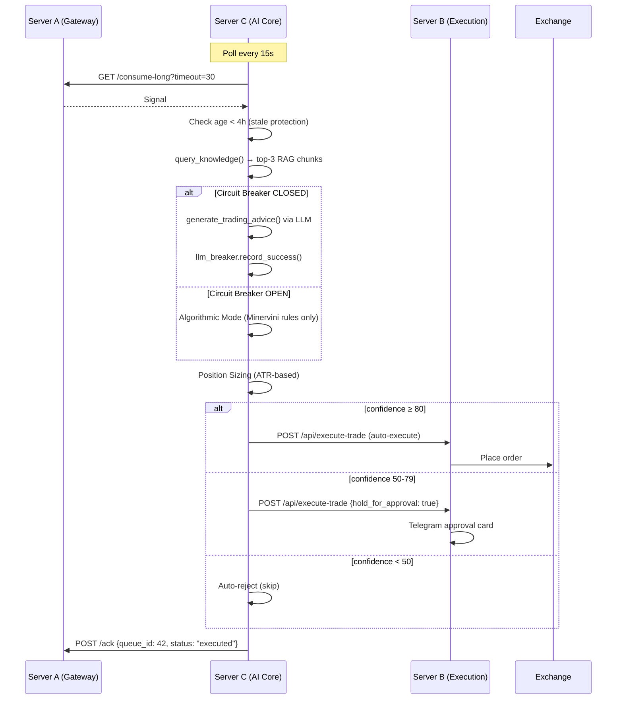

# 📡 Server C (AI Core) — Complete Dossier

> **Project:** TradingViewProject — Minervini Trading Bot  
> **Module:** 3-Server Decentralized Pipeline — Node C  
> **Scan Date:** 2026-06-01  
> **Status:** 🟢 Branch sẵn sàng cho development

---

## 📋 MỤC LỤC

1. [Tổng Quan Kiến Trúc](#1-tổng-quan-kiến-trúc)
2. [Phần Cứng & Hệ Điều Hành](#2-phần-cứng--hệ-điều-hành)
3. [Provisioning & Setup](#3-provisioning--setup)
4. [Docker Compose Services](#4-docker-compose-services)
5. [Codebase Map](#5-codebase-map)
6. [Core Worker: vps_analyzer.py](#6-core-worker-vps_analyzerpy)
7. [RAG System: rag.py](#7-rag-system-ragpy)
8. [Circuit Breaker: ai_circuit_breaker.py](#8-circuit-breaker-ai_circuit_breakerpy)
9. [V2 Hardened Monitoring Workers](#9-v2-hardened-monitoring-workers)
10. [Scheduler Integration](#10-scheduler-integration)
11. [API Contracts & Interface Map](#11-api-contracts--interface-map)
12. [Environment Variables](#12-environment-variables)
13. [Security Model](#13-security-model)
14. [CI/CD Pipeline](#14-cicd-pipeline)
15. [Interaction with Server A & B](#15-interaction-with-server-a--b)
16. [Known Gaps & Development Priorities](#16-known-gaps--development-priorities)

---

## 1. Tổng Quan Kiến Trúc

Server C is the **AI Core** in a 3-server decentralized trading signal pipeline:



### Role & Responsibilities
| Responsibility | Description |
|---|---|
| **Signal Consumption** | Long-polls Server A's `/consume` endpoint every 15s to fetch PENDING signals |
| **RAG Analysis** | Queries ChromaDB (Minervini SEPA knowledge) for semantic context |
| **AI Scoring** | Calls Claude/Gemini with RAG context to evaluate signal quality & compute position sizing |
| **Trade Forwarding** | Forwards approved trades to Server B's `/api/execute-trade` |
| **Monitoring** | Runs liveness, disk, and NTP drift checks against all 3 servers |
| **Circuit Breaking** | Gracefully degrades to algorithmic-only mode when LLM APIs fail |

### What Server C Does NOT Do
- ❌ **No Exchange API Keys** — only Server B holds them
- ❌ **No public internet ingress** — no Cloudflare Tunnel (that's Server A)
- ❌ **No order execution** — only analysis and forwarding

---

## 2. Phần Cứng & Hệ Điều Hành

| Attribute | Value |
|---|---|
| **OS** | Oracle Linux 9 (RHEL-compatible) |
| **CPU** | 8 vCPU |
| **RAM** | 16 GB |
| **Swap** | 2 GB (vm.swappiness=10) |
| **Location** | Remote VPS |
| **Network** | Tailscale VPN (100.x.x.x/8 mesh) |
| **Firewall** | firewalld + tailscale0 in trusted zone |
| **NTP** | chrony (time.google.com prefer) |

> [!IMPORTANT]
> The original docs reference Debian 12, but the actual provisioning script ([init_server_ol9.sh](file:///c:/Users/pesil/working/mj_trading/TradingViewProject/scripts/init_server_ol9.sh)) targets **Oracle Linux 9** with `dnf`, `firewalld`, and EPEL from `oracle-epel-release-el9`.

---

## 3. Provisioning & Setup

### 3.1 OS-Level Init Script

**File:** [scripts/init_server_ol9.sh](file:///c:/Users/pesil/working/mj_trading/TradingViewProject/scripts/init_server_ol9.sh) (93 lines)

7-step provisioning sequence:

| Step | Action | Key Commands |
|---|---|---|
| 1/7 | System update + packages | `dnf update`, EPEL, curl/git/htop/tmux/python3 |
| 2/7 | Timezone | `timedatectl set-timezone Asia/Ho_Chi_Minh` |
| 3/7 | NTP (Chrony) | Google NTP prefer, `makestep 1.0 3` |
| 4/7 | Swap 2GB | `fallocate -l 2G /swapfile`, swappiness=10 |
| 5/7 | Docker + Compose V2 | CentOS repo, `overlay2`, log rotation 10m×3 |
| 6/7 | Tailscale VPN | `tailscale up` (interactive auth link) |
| 7/7 | Firewalld + Fail2Ban | SSH jail, tailscale0 → trusted zone |

### 3.2 Deployment Wizard (PowerShell)

**File:** [setup_server_c.ps1](file:///c:/Users/pesil/working/mj_trading/TradingViewProject/setup_server_c.ps1) (104 lines)

Interactive wizard that:
1. Checks Docker is installed
2. Prompts for all env vars (Tailscale IPs, secrets, API keys)
3. Writes to `deploy/.env`
4. Runs `docker compose -f docker-compose.server-c.yml up -d`

### 3.3 Provisioning Verification

**File:** [scripts/verify_provisioning.py](file:///c:/Users/pesil/working/mj_trading/TradingViewProject/scripts/verify_provisioning.py)

Supports `--server c` to verify all 12 Server C checklist items:
- OS version, botuser+SSH, NTP, Docker, Tailscale, ChromaDB, Analyzer, connect→A, connect→B, liveness monitor, disk monitor, circuit breaker

---

## 4. Docker Compose Services

**File:** [deploy/docker-compose.server-c.yml](file:///c:/Users/pesil/working/mj_trading/TradingViewProject/deploy/docker-compose.server-c.yml) (105 lines)

### 4.1 ChromaDB

```yaml
chromadb:
  image: chromadb/chroma:latest
  container_name: tradingbot-chromadb
  ports: ["8000:8000"]
  volumes: [chroma_data:/chroma/chroma]
  environment:
    IS_PERSISTENT: "TRUE"
    ANONYMIZED_TELEMETRY: "FALSE"
  healthcheck:
    test: ["CMD", "bash", "-c", "exec 3<>/dev/tcp/127.0.0.1/8000"]
    interval: 30s
```

### 4.2 Analyzer Worker

```yaml
analyzer:
  build: {context: .., dockerfile: Dockerfile}
  container_name: tradingbot-analyzer
  command: ["python", "workers/vps_analyzer.py"]
  depends_on:
    chromadb: {condition: service_healthy}
  environment:
    ANALYZER_MODE: "true"
    CHROMA_REMOTE: "true"
    CHROMA_SERVER_HOST: chromadb  # Docker DNS
    # ... (see §12 for full env var list)
  healthcheck:
    test: python -c "check /proc for vps_analyzer.py process"
    interval: 10s
```

Both services share the `analyzer` Docker network and use `json-file` log driver with `max-size: 10m, max-file: 3`.

---

## 5. Codebase Map

All Server C code lives under the `nerves/workers/trading/` directory:

```
nerves/workers/trading/
├── workers/
│   ├── vps_analyzer.py          # 🔥 Core: Signal consumer + RAG + forwarding
│   ├── ai_circuit_breaker.py    # Circuit breaker for LLM API failures
│   ├── liveness_monitor.py      # Cross-server /health checker
│   ├── disk_monitor.py          # Disk space & log size monitor
│   └── ntp_monitor.py           # Cross-server clock drift monitor
├── rag.py                       # RAG module (ChromaDB + AI providers)
├── scheduler.py                 # APScheduler with V2 monitoring jobs
├── config.py                    # Configuration from .env
├── execution_server.py          # Server B (not Server C, but interacts)
└── ...
```

---

## 6. Core Worker: vps_analyzer.py

**File:** [nerves/workers/trading/workers/vps_analyzer.py](file:///c:/Users/pesil/working/mj_trading/TradingViewProject/nerves/workers/trading/workers/vps_analyzer.py)

### Lifecycle



### Key Behaviors

| Feature | Implementation |
|---|---|
| **Polling** | Long-poll via `GET /consume-long?timeout=30` with `aiohttp.ClientSession` |
| **Session Management** | `asyncio.Lock` guards `_session` lifecycle; reuses connections |
| **Stale Protection** | Double-check: Server A TTL (4h) + `age_minutes` from `/consume` response |
| **RAG Query** | `build_rag_query()` → `query_knowledge()` → 3 most relevant Minervini chunks |
| **AI Analysis** | `generate_trading_advice()` with provider chain: Claude CLI → SDK → Gemini |
| **Position Sizing** | ATR-based: `SL = price - 2×ATR`, `qty = (balance × risk%) / (price - SL)` |
| **Circuit Breaker** | `llm_breaker.is_available()` before LLM call; `record_success()`/`record_failure()` |
| **Forwarding** | `POST /api/execute-trade` with `X-Server-B-Secret` header |
| **Confidence Gating** | `ai_confidence 50-79` → `hold_for_approval: true`; `<50` → auto-reject; `≥80` → auto-execute |
| **Error Recovery** | Catches `aiohttp.ClientError`, logs, continues loop |

---

## 7. RAG System: rag.py

**File:** [nerves/workers/trading/rag.py](file:///c:/Users/pesil/working/mj_trading/TradingViewProject/nerves/workers/trading/rag.py) (573 lines)

### Architecture

```mermaid
graph TD
    CHUNKS["📚 docs/knowledge/trading_wizard/chunks/<br/>chunk_001.md ... chunk_036.md"]
    EMB["🧠 SentenceTransformer<br/>paraphrase-multilingual-MiniLM-L12-v2"]
    CHROMA["🗄️ ChromaDB<br/>Collection: minervini_knowledge<br/>Space: cosine"]
    QUERY["🔍 query_knowledge()"]
    AI["🤖 generate_trading_advice()"]

    CHUNKS -->|init_vector_db()| EMB
    EMB -->|upsert batch=10| CHROMA
    QUERY -->|semantic search| CHROMA
    QUERY -->|top-3 chunks| AI
    AI -->|prompt + context| LLM["Claude / Gemini"]
```

### AI Provider Priority Chain

```
1. Antigravity SDK (google.antigravity Agent 2.0)
   ↓ fallback
2. Claude CLI (OAuth session, no API key)
   ↓ fallback  
3. Anthropic SDK (ANTHROPIC_API_KEY)
   ↓ fallback
4. Gemini (GEMINI_API_KEY or Vertex AI ADC)
```

### ChromaDB Connection Modes

| Mode | Config | Client |
|---|---|---|
| **Remote** (Server C production) | `CHROMA_REMOTE=true` | `chromadb.HttpClient(host=chromadb, port=8000)` |
| **Local** (dev/monolith) | `CHROMA_REMOTE=false` | `chromadb.PersistentClient(path=...)` |

---

## 8. Circuit Breaker: ai_circuit_breaker.py

**File:** [nerves/workers/trading/workers/ai_circuit_breaker.py](file:///c:/Users/pesil/working/mj_trading/TradingViewProject/nerves/workers/trading/workers/ai_circuit_breaker.py) (220 lines)

### State Machine



### Configuration

| Env Var | Default | Description |
|---|---|---|
| `LLM_FAILURE_THRESHOLD` | 3 | Consecutive failures before OPEN |
| `LLM_RECOVERY_TIMEOUT_SEC` | 60 | Seconds before HALF_OPEN probe |
| `LLM_CALL_TIMEOUT_SEC` | 2.0 | Per-call LLM timeout |

### Fallback Behavior
When circuit is **OPEN**, the analyzer skips AI analysis and uses **Algorithmic Mode** — pure Minervini rules (Trend Template score + VCP detection) without LLM commentary. Trading continues uninterrupted.

### Telegram Alerts
- 🚨 **OPEN alert**: "Hệ thống đã chuyển sang ALGORITHMIC MODE"
- ✅ **RECOVERY alert**: "Hệ thống đã trở lại AI MODE"

Singleton: `llm_breaker = LLMCircuitBreaker()`

---

## 9. V2 Hardened Monitoring Workers

All 3 monitoring workers run on Server C via APScheduler (see §10).

### 9.1 Liveness Monitor

**File:** [liveness_monitor.py](file:///c:/Users/pesil/working/mj_trading/TradingViewProject/nerves/workers/trading/workers/liveness_monitor.py) (182 lines)

| Config | Value |
|---|---|
| **Schedule** | Every 5 minutes |
| **Targets** | `SERVER_A_HEALTH_URL`, `SERVER_B_HEALTH_URL` |
| **Alert threshold** | 2 consecutive failures |
| **Timeout** | 10s per check |
| **Recovery notify** | ✅ Yes |

Checks `/health` → expects `{"status": "healthy"|"ok"}`. Tracks `ServerHealth` dataclass with `consecutive_failures`, `is_healthy`, `last_success`.

### 9.2 Disk Monitor

**File:** [disk_monitor.py](file:///c:/Users/pesil/working/mj_trading/TradingViewProject/nerves/workers/trading/workers/disk_monitor.py) (122 lines)

| Config | Value |
|---|---|
| **Schedule** | Every 30 minutes |
| **Warning** | ≥80% disk used |
| **Critical** | ≥90% disk used + remediation guide |
| **Log dir scan** | `LOG_DIR` (default: `logs/`) |

Critical alert includes fix commands: `rm logs/*.log.*`, `docker system prune -f`, `ls -lh data/*.db`.

### 9.3 NTP Clock Drift Monitor

**File:** [ntp_monitor.py](file:///c:/Users/pesil/working/mj_trading/TradingViewProject/nerves/workers/trading/workers/ntp_monitor.py) (148 lines)

| Config | Value |
|---|---|
| **Schedule** | Every 5 minutes |
| **Threshold** | 500ms drift |
| **Method** | Compare `server_time_epoch` from `/health` vs local `time.time()` |
| **Latency correction** | Subtracts half RTT |

> [!WARNING]
> Binance rejects orders with timestamp drift >1000ms. The 500ms threshold provides a 2x safety margin. If drift exceeds threshold, NTP fix commands are included in the Telegram alert.

---

## 10. Scheduler Integration

**File:** [scheduler.py](file:///c:/Users/pesil/working/mj_trading/TradingViewProject/nerves/workers/trading/scheduler.py) (230 lines)

The `_register_monitoring_jobs()` function is **only called when `ANALYZER_MODE=true`** (i.e., on Server C):

```python
if os.getenv("ANALYZER_MODE", "").lower() == "true":
    _register_monitoring_jobs(scheduler)
```

### Registered Jobs on Server C

| Job ID | Function | Interval | Misfire Grace |
|---|---|---|---|
| `liveness_check` | `run_liveness_check()` | 5 min | 60s |
| `disk_monitor` | `check_disk_usage()` | 30 min | 300s |
| `ntp_monitor` | `check_clock_drift()` | 5 min | 60s |

Additionally, on all servers (including C):
- `tv_cdp_keepalive` — TradingView CDP check every 5 min
- `morning_brief` — Cron at 07:00 ICT daily (if `BRIEF_ENABLED`)

---

## 11. API Contracts & Interface Map

### 11.1 Server C → Server A (Consume)

| Endpoint | Method | Headers | Params |
|---|---|---|---|
| `/consume-long` | GET | `X-Buffer-Secret` | `consumer_id=server-c-analyzer&limit=10&timeout=30` |
| `/consume` | GET | `X-Buffer-Secret` | `consumer_id=server-c-analyzer&limit=10` |
| `/ack` | POST | `X-Buffer-Secret` | Body: `{"acks": [{"queue_id": N, "status": "executed"|"skipped_stale"}]}` |

### 11.2 Server C → Server B (Execute)

| Endpoint | Method | Headers |
|---|---|---|
| `/api/execute-trade` | POST | `X-Server-B-Secret` |

**Payload:**
```json
{
  "symbol": "BTCUSDT",
  "action": "buy",
  "price": 68420.5,
  "quantity": 0.002,
  "sl_price": 63000.0,
  "tp_price": 80000.0,
  "exchange": "binance",
  "rag_advice": "Strong breakout setup...",
  "ai_confidence": 85,
  "hold_for_approval": false
}
```

### 11.3 Server C Monitoring → A & B (Health)

| Target | URL Pattern | Expected Response |
|---|---|---|
| Server A | `http://100.x.x.1:5000/health` | `{"status": "healthy", "pending_count": N, "server_time_epoch": float}` |
| Server B | `http://100.x.x.2:5002/health` | `{"status": "ok", "server": "execution-vault-b"}` |
| ChromaDB | `http://localhost:8000/api/v1/heartbeat` | `{"nanosecond heartbeat": N}` |

---

## 12. Environment Variables

### Core Analyzer

| Variable | Default | Description |
|---|---|---|
| `ANALYZER_MODE` | `false` | **Must be `true`** on Server C to enable monitoring jobs |
| `VPS_BUFFER_URL` | — | Server A base URL (e.g., `http://100.x.x.1:5000`) |
| `VPS_BUFFER_SECRET` | — | Shared secret for `/consume` and `/ack` |
| `VPS_CONSUMER_ID` | `server-c-analyzer` | Consumer identity for dequeue |
| `SERVER_B_EXECUTE_URL` | — | Server B URL (e.g., `http://100.x.x.2:5002`) |
| `SERVER_B_SECRET` | — | Secret for `/api/execute-trade` |

### ChromaDB

| Variable | Default | Description |
|---|---|---|
| `CHROMA_REMOTE` | `false` | Set `true` for remote ChromaDB (production) |
| `CHROMA_SERVER_HOST` | `chromadb` | Docker service name or IP |
| `CHROMA_SERVER_PORT` | `8000` | ChromaDB HTTP port |

### AI Providers

| Variable | Default | Description |
|---|---|---|
| `AI_PROVIDER` | `anthropic` | `anthropic`, `gemini`, `claude_cli`, `antigravity` |
| `ANTHROPIC_API_KEY` | — | Claude SDK key (optional if using CLI) |
| `GEMINI_API_KEY` | — | Google AI Studio key |

### Risk Management

| Variable | Default | Description |
|---|---|---|
| `RISK_PER_TRADE` | `0.02` | 2% risk per trade |
| `STOP_LOSS_PCT` | `0.08` | 8% stop loss |

### Monitoring

| Variable | Default | Description |
|---|---|---|
| `SERVER_A_HEALTH_URL` | — | e.g., `http://100.x.x.1:5000/health` |
| `SERVER_B_HEALTH_URL` | — | e.g., `http://100.x.x.2:5002/health` |
| `NTP_DRIFT_THRESHOLD_MS` | `500` | Clock drift alert threshold |
| `DISK_WARNING_THRESHOLD_PCT` | `80` | Disk warning level |
| `DISK_CRITICAL_THRESHOLD_PCT` | `90` | Disk critical level |
| `LIVENESS_ALERT_AFTER_FAILURES` | `2` | Consecutive failures before alert |
| `LLM_FAILURE_THRESHOLD` | `3` | LLM failures before circuit opens |
| `LLM_RECOVERY_TIMEOUT_SEC` | `60` | Seconds before LLM recovery probe |
| `LLM_CALL_TIMEOUT_SEC` | `2.0` | Per-call LLM timeout |

### Logging

| Variable | Default | Description |
|---|---|---|
| `LOG_LEVEL` | `INFO` | Python logging level |
| `LOG_FILE` | `/app/logs/analyzer.log` | Log file path inside container |
| `LOG_MAX_SIZE_MB` | `10` | Log rotation size |
| `LOG_BACKUP_COUNT` | `5` | Number of rotated log files |

---

## 13. Security Model



| Security Control | Implementation |
|---|---|
| **Network isolation** | Only Tailscale VPN traffic; no public ports |
| **Auth to Server A** | `X-Buffer-Secret` header (hmac constant-time compare) |
| **Auth to Server B** | `X-Server-B-Secret` header (hmac constant-time compare) |
| **No API keys stored** | Exchange keys ONLY on Server B |
| **Secret rotation** | Via Docker environment variables |
| **Log sanitization** | Secrets not logged (SEC-03) |
| **Firewall** | firewalld with `tailscale0` in trusted zone |
| **Intrusion detection** | Fail2Ban on SSH with systemd journal backend |

---

## 14. CI/CD Pipeline

**File:** [.github/workflows/deploy.yml](file:///c:/Users/pesil/working/mj_trading/TradingViewProject/.github/workflows/deploy.yml)

### Deploy Job: `deploy-server-c`

| Step | Action |
|---|---|
| **Tailscale Connect** | Join VPN mesh via AuthKey secret |
| **SSH Key Setup** | Install private key, `ssh-keyscan` Server C IP |
| **SSH Reachability** | Test `ssh botuser@SERVER_C_IP "echo ok"` with 10s timeout |
| **Git Pull** | `cd ~/TradingViewProject && git pull origin main` |
| **Docker Build** | `docker compose -f deploy/docker-compose.server-c.yml up -d --build` |
| **Health Check** | Loop for 90s checking: ChromaDB healthcheck + Analyzer Docker health status |
| **Rollback** | On failure: `git checkout HEAD~1`, rebuild, log rollback |

### Deploy Triggers

- Push to `main` branch
- `[force deploy]` in commit message
- After lint + test jobs pass

### Health Verification

```bash
# ChromaDB
curl -sf http://localhost:8000/api/v1/heartbeat

# Analyzer
docker inspect --format='{{.State.Health.Status}}' tradingbot-analyzer
# Expected: "healthy"
```

---

## 15. Interaction with Server A & B

### Signal Lifecycle Through Server C



### Idempotency

Server B stores `vbs_queue_id` to prevent duplicate executions. If Server C sends the same signal twice (e.g., network retry), Server B returns the previous result.

---

## 16. Additional Source Files Discovered (Verification Sweep)

### 16.1 VPS Consumer Worker: vps_consumer.py

**File:** [vps_consumer.py](file:///c:/Users/pesil/working/mj_trading/TradingViewProject/nerves/workers/trading/workers/vps_consumer.py) (360 lines)

Alternative consumer that uses the **EventBus pattern** (unlike `vps_analyzer.py` which does direct HTTP forwarding). Key differences:

| Feature | vps_analyzer.py | vps_consumer.py |
|---|---|---|
| **Target** | Server C standalone daemon | Server C or Local monolith |
| **Dispatch** | Direct HTTP → Server B | EventBus → `SignalReceived` / `IndicatorSignalReceived` |
| **Idempotency** | Not shown | `SELECT FROM signals WHERE vbs_queue_id = ?` |
| **ACK** | Inline after forward | Async via EventBus callbacks (`on_trade_executed`, `on_trade_failed`) |
| **Error handling** | Simple retry | Exponential backoff with jitter (5s→60s max) |
| **Auth errors** | General | Special 401/403 handler with 60s backoff |

### 16.2 Complete Config Module: config.py

**File:** [config.py](file:///c:/Users/pesil/working/mj_trading/TradingViewProject/nerves/workers/trading/config.py) (232 lines)

Contains **50+ environment variables** organized into sections:
- Server, Security, Logging, Database
- Binance/Bybit/Weex exchange keys
- Multi-Exchange Routing
- Risk Management (Minervini SEPA)
- Telegram/Discord notifications
- RAG/ChromaDB/AI Provider
- Claude SDK Integration (P9)
- MCP/Morning Brief (P6)
- Stealth Capture Daemon (P11)
- VPS Buffer Consumer
- Pipeline Forwarding (Server B)

### 16.3 V2 Operational Hardening Spec

**File:** [02_V2_OPERATIONAL_HARDENING.md](file:///c:/Users/pesil/working/mj_trading/TradingViewProject/docs/SETUPS/02_V2_OPERATIONAL_HARDENING.md) (1342 lines)

Defines 5 critical hardening items for the 3-server pipeline, all directly applicable to Server C:

| # | Item | Severity | Server C Impact |
|---|---|---|---|
| 1 | NTP Time Synchronization | 🔴 CRITICAL | Drift > 500ms → alert, drift > 1000ms → Binance rejects orders |
| 2 | Long Polling Optimization | 🟠 HIGH | `/consume-long?timeout=30` reduces requests 50%, latency < 1s |
| 3 | LLM Fail-safe (Circuit Breaker) | 🔴 CRITICAL | 3-state machine, 2s timeout, algorithmic fallback |
| 4 | Log Rotation | 🔴 CRITICAL | `RotatingFileHandler` 10MB × 5 files, Docker json-file 10m × 3 |
| 5 | Keep-Alive & Liveness | 🟠 HIGH | Cross-server /health checks every 5 min |

Includes full reference implementations for all monitoring scripts.

### 16.4 CI/CD Pipeline Plan

**File:** [07_CICD_PIPELINE_PLAN.md](file:///c:/Users/pesil/working/mj_trading/TradingViewProject/docs/SETUPS/07_CICD_PIPELINE_PLAN.md) (664 lines)

Full CI/CD spec with Server C deploy stage (§2B). Key details:
- Deploy path on Server C: `/opt/trading-bot` or `/home/botuser/trading-bot`
- Health check: ChromaDB heartbeat `:8000` + Analyzer Docker health
- Rollback: `git checkout $ROLLBACK_SHA` + rebuild
- Smoke test: `curl POST /ingest` on Server A → pipeline flows through C → B
- GitHub Secrets required: `SERVER_C_IP`, `SSH_PRIVATE_KEY`, `TS_OAUTH_*`

### 16.5 Master Phase Map (All Phases DONE)

**File:** [05_MASTER_PHASE_MAP.md](file:///c:/Users/pesil/working/mj_trading/TradingViewProject/docs/SETUPS/05_MASTER_PHASE_MAP.md) (437 lines)

All 7 phases + Phase 6.5 are marked ✅ Done:

| Phase | Deliverable | Status |
|---|---|---|
| 1 | VBS Buffer Service (Server A) | ✅ Done |
| 2 | Local Bot Consumer Worker | ✅ Done |
| 3 | Dashboard & Observability | ✅ Done |
| 4 | Remote ChromaDB Config | ✅ Done |
| 5 | AI Analyzer Worker (Server C) | ✅ Done |
| 6 | Execution Server (Server B) | ✅ Done |
| 6.5 | Docker Compose Templates | ✅ Done |
| 7 | End-to-End Integration Test | ✅ Done |

RAM estimate for Server C: **4-8 GB** (ChromaDB ~2GB + SentenceTransformers ~1.5GB + AI inference).

### 16.6 Provisioning Verification Report (43/43 PASS)

**File:** [provisioning_verification_report.md](file:///c:/Users/pesil/working/mj_trading/TradingViewProject/docs/reports/provisioning_verification_report.md) (336 lines)

**Generated:** 2026-05-30T09:48:13Z — **43/43 PASS**, 0 failed, 0 skipped.

Server C specific checks (11.2.x):

| Check | Result | Detail |
|---|---|---|
| 11.2.1 OS | ✅ PASS | Oracle Linux Server |
| 11.2.2 botuser/SSH | ✅ PASS | botuser/opt_admin exists |
| 11.2.3 NTP chrony | ✅ PASS | Chrony NTP active |
| 11.2.4 Docker+Compose | ✅ PASS | Docker 29.5.2, Compose v5.1.4 |
| 11.2.5 Tailscale | ✅ PASS | IP: 100.90.37.5 |
| 11.2.6 ChromaDB | ✅ PASS | Running on :8000 |
| 11.2.7 Analyzer | ✅ PASS | Container active |
| 11.2.8 → Server A | ✅ PASS | /consume connection OK |
| 11.2.9 → Server B | ✅ PASS | /api/execute-trade OK |
| 11.2.10 Liveness | ✅ PASS | Script found |
| 11.2.11 Disk Monitor | ✅ PASS | Script found |
| 11.2.12 Circuit Breaker | ✅ PASS | Active |

Cross-server checks:
- 11.4.3 Clock drift: A=78.3ms, C=372.0ms (within 500ms threshold)
- 11.4.4 E2E pipeline: All components validated

---

## 17. Known Gaps & Development Priorities

> [!NOTE]
> The following items were identified during the documentation scan as areas requiring attention for Server C development.

### Code Gaps

| Area | Status | Detail |
|---|---|---|
| **ChromaDB data seeding** | ⚠️ Conditional | Remote mode skips ingestion if `knowledge_dir` absent; chunks must be pre-loaded or mounted |
| **Analyzer health endpoint** | ⚠️ Process-based | Uses `/proc` PID check, not HTTP health — no structured health JSON |
| **Clock drift on C** | ⚠️ 372ms | Provisioning report shows C at 372ms — approaching 500ms threshold |
| **Dual consumer ambiguity** | ⚠️ Architecture | Both `vps_analyzer.py` and `vps_consumer.py` exist — clarify which runs on Server C vs Local |

### Development Priorities

1. **Server C HTTP health endpoint** — Add a lightweight FastAPI health server alongside the analyzer daemon
2. **ChromaDB pre-seeding** — Ensure knowledge chunks are available in the Docker image or mounted volume
3. **Structured logging** — Centralize log format for grep/ELK compatibility
4. **Metrics export** — Expose Prometheus metrics for circuit breaker state, signal throughput, RAG latency
5. **Graceful shutdown** — Handle SIGTERM properly in the polling loop

---

## File Index

### Core Code (Server C Runtime)

| File | Role | Lines |
|---|---|---|
| [vps_analyzer.py](file:///c:/Users/pesil/working/mj_trading/TradingViewProject/nerves/workers/trading/workers/vps_analyzer.py) | Core worker: poll → RAG → AI → forward | ~400 |
| [vps_consumer.py](file:///c:/Users/pesil/working/mj_trading/TradingViewProject/nerves/workers/trading/workers/vps_consumer.py) | EventBus consumer (alternative pattern) | 360 |
| [rag.py](file:///c:/Users/pesil/working/mj_trading/TradingViewProject/nerves/workers/trading/rag.py) | ChromaDB + multi-provider AI | 573 |
| [ai_circuit_breaker.py](file:///c:/Users/pesil/working/mj_trading/TradingViewProject/nerves/workers/trading/workers/ai_circuit_breaker.py) | LLM Circuit Breaker | 220 |
| [liveness_monitor.py](file:///c:/Users/pesil/working/mj_trading/TradingViewProject/nerves/workers/trading/workers/liveness_monitor.py) | Cross-server health | 182 |
| [disk_monitor.py](file:///c:/Users/pesil/working/mj_trading/TradingViewProject/nerves/workers/trading/workers/disk_monitor.py) | Disk space monitor | 122 |
| [ntp_monitor.py](file:///c:/Users/pesil/working/mj_trading/TradingViewProject/nerves/workers/trading/workers/ntp_monitor.py) | Clock drift monitor | 148 |
| [scheduler.py](file:///c:/Users/pesil/working/mj_trading/TradingViewProject/nerves/workers/trading/scheduler.py) | APScheduler + V2 jobs | 230 |
| [config.py](file:///c:/Users/pesil/working/mj_trading/TradingViewProject/nerves/workers/trading/config.py) | Configuration (50+ env vars) | 232 |
| [execution_server.py](file:///c:/Users/pesil/working/mj_trading/TradingViewProject/nerves/workers/trading/execution_server.py) | Server B (interacts with C) | 356 |

### Infrastructure

| File | Role | Lines |
|---|---|---|
| [docker-compose.server-c.yml](file:///c:/Users/pesil/working/mj_trading/TradingViewProject/deploy/docker-compose.server-c.yml) | Docker Compose (ChromaDB + Analyzer) | 105 |
| [init_server_ol9.sh](file:///c:/Users/pesil/working/mj_trading/TradingViewProject/scripts/init_server_ol9.sh) | Oracle Linux 9 provisioning | 93 |
| [setup_server_c.ps1](file:///c:/Users/pesil/working/mj_trading/TradingViewProject/setup_server_c.ps1) | PowerShell deployment wizard | 104 |
| [deploy.yml](file:///c:/Users/pesil/working/mj_trading/TradingViewProject/.github/workflows/deploy.yml) | CI/CD pipeline (deploy-server-c job) | ~660 |

### Documentation

| File | Role | Lines |
|---|---|---|
| [SERVER_C_SETUP_PROMPT.md](file:///c:/Users/pesil/working/mj_trading/TradingViewProject/docs/SETUPS/SERVER_C_SETUP_PROMPT.md) | Master setup guide | — |
| [VPS_BUFFER_ARCHITECTURE.md](file:///c:/Users/pesil/working/mj_trading/TradingViewProject/docs/plans/arhitectures/VPS_BUFFER_ARCHITECTURE.md) | Architecture spec | 326 |
| [02_V2_OPERATIONAL_HARDENING.md](file:///c:/Users/pesil/working/mj_trading/TradingViewProject/docs/SETUPS/02_V2_OPERATIONAL_HARDENING.md) | V2 hardening (5 critical items) | 1342 |
| [05_MASTER_PHASE_MAP.md](file:///c:/Users/pesil/working/mj_trading/TradingViewProject/docs/SETUPS/05_MASTER_PHASE_MAP.md) | Phase 1-7 status (all ✅) | 437 |
| [07_CICD_PIPELINE_PLAN.md](file:///c:/Users/pesil/working/mj_trading/TradingViewProject/docs/SETUPS/07_CICD_PIPELINE_PLAN.md) | CI/CD plan with deploy + rollback | 664 |
| [3-Server Pipeline Plan](file:///c:/Users/pesil/working/mj_trading/TradingViewProject/docs/plans/3-Server%20Decentralized%20Pipeline%20Forwarding%20Plan_plan.md) | Original 3-server plan | 115 |
| [08_HYBRID_ARCHITECTURE_GUIDE.md](file:///c:/Users/pesil/working/mj_trading/TradingViewProject/docs/guides/08_HYBRID_ARCHITECTURE_GUIDE.md) | Monolith ↔ Distributed switching | — |
| [RAG_ARCHITECTURE_FLOW.md](file:///c:/Users/pesil/working/mj_trading/TradingViewProject/docs/RAG_ARCHITECTURE_FLOW.md) | RAG conceptual flow | — |
| [04_IMPLEMENTATION_PLAN.md](file:///c:/Users/pesil/working/mj_trading/TradingViewProject/docs/SETUPS/04_IMPLEMENTATION_PLAN.md) | Strategic implementation plan | — |
| [provisioning_verification_report.md](file:///c:/Users/pesil/working/mj_trading/TradingViewProject/docs/reports/provisioning_verification_report.md) | Live verification: 43/43 PASS | 336 |
