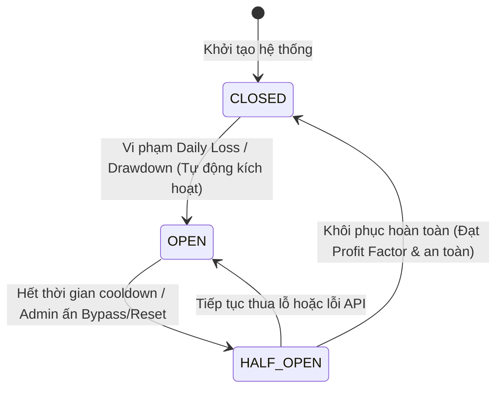
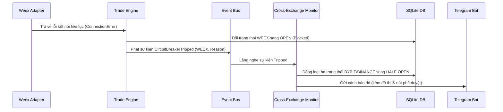

# 🛡️ Deep-Dive: Automatic Risk Response System (Hệ thống Tự động Phản ứng Rủi ro)

Tài liệu này cung cấp phân tích chi tiết về 4 khía cạnh cốt lõi của Hệ thống Tự động Phản ứng Rủi ro (Automatic Risk Response) trong pipeline giao dịch của Angati, đối chiếu trực tiếp với mã nguồn hiện tại trong [trade_engine.py](file:///c:/Users/pesil/working/mj_trading/TradingViewProject/server/engine/trade_engine.py), [database.py](file:///c:/Users/pesil/working/mj_trading/TradingViewProject/server/database.py), và [weex_adapter.py](file:///c:/Users/pesil/working/mj_trading/TradingViewProject/server/exchanges/weex_adapter.py).

---

## 🧭 1. Chu trình Tự phục hồi (Auto-Recovery State Machine)

Hệ thống quản lý trạng thái khả dụng của từng sàn giao dịch thông qua mô hình **Circuit Breaker** (Bộ ngắt mạch) 3 trạng thái: `CLOSED` (Bình thường), `OPEN` (Bị chặn), và `HALF-OPEN` (Phục hồi thử nghiệm).



### Cơ chế dịch chuyển trạng thái vật lý
1. **CLOSED $\rightarrow$ OPEN (Tripping)**:
   * **Tác nhân**: Khi một tín hiệu giao dịch mới được đưa vào [trade_engine.py](file:///c:/Users/pesil/working/mj_trading/TradingViewProject/server/engine/trade_engine.py), hệ thống sẽ tính toán:
     * **Daily Loss**: Lấy tổng lỗ thực tế trong 24 giờ qua bằng hàm `get_daily_loss(exchange)` trong [database.py](file:///c:/Users/pesil/working/mj_trading/TradingViewProject/server/database.py). Ngưỡng mặc định là **$10.00 USDT**.
     * **Rolling Drawdown**: Tính toán sụt giảm tài khoản dựa trên 20 giao dịch gần nhất bằng hàm `get_rolling_drawdown(20)`. Ngưỡng mặc định là **5.0%**.
   * **Hành động**: Nếu một trong hai ngưỡng bị vượt qua, `TradeEngine` lập tức thực hiện:
     * Cập nhật trạng thái sang `OPEN` trong bảng `risk_settings` qua `update_circuit_breaker_state(exchange, "OPEN")`.
     * Ghi nhận log sự kiện vào bảng `circuit_breaker_logs` qua `log_circuit_breaker()`.
     * Chặn đứng mọi smart order tiếp theo của sàn đó tại Ingress Gateway và chuyển hướng sang sàn Fallback (Bybit $\rightarrow$ Binance).
2. **OPEN $\rightarrow$ HALF-OPEN (Bypass/Cooldown)**:
   * Trạng thái này có thể chuyển dịch thông qua:
     * **Thời gian cooldown**: Tự động chuyển về sau 1 giờ nếu cấu hình cho phép.
     * **Telegram Bot/Dashboard**: Nút bấm trực tiếp cho phép gửi tín hiệu `Bypass 1h` hoặc `Reset Closed` của admin.
3. **HALF-OPEN $\rightarrow$ CLOSED hoặc OPEN (Verification)**:
   * **Quay về CLOSED**: Khi sàn ở chế độ `HALF-OPEN`, hệ thống theo dõi `recent_profit_factor(5)`. Nếu Profit Factor của 5 lệnh gần nhất vượt quá **1.5** và không vi phạm bất kỳ tham số rủi ro nào khác, hệ thống sẽ tự đóng mạch về `CLOSED`.
   * **Tripped lại OPEN**: Nếu phát sinh 1 lệnh thua lỗ lớn hoặc bất kỳ lỗi kết nối vật lý nào của sàn, mạch sẽ lập tức bị kéo ngược lại `OPEN`.

---

## 📉 2. Mô hình Thu hẹp Quy mô Động trong Trạng thái HALF-OPEN

Trong trạng thái `HALF-OPEN` hoặc khi chế độ an toàn `Safe Mode` được kích hoạt (Drawdown rolling vượt quá 10%), hệ thống áp dụng chiến lược **Size Halving** để giảm rủi ro cháy tài khoản nhưng vẫn cho phép kiểm thử tính ổn định của thị trường.

### Công thức tính toán Position Size động
1. **Kích thước gốc ($Q_{raw}$)**: Được tính dựa trên ATR-based Risk Sizing (R2) hoặc Tactical Breakout Sizing (2.5% balance cho BTC, 2.0% cho ETH, 1.5% cho SOL).
2. **Kích thước sau giảm thiểu ($Q_{scaled}$)**:
   $$Q_{scaled} = Q_{raw} \times 0.5$$
3. **Bộ lọc Cắt tỉa (Volume & Value Clamping)**:
   Để đảm bảo lệnh không bị API của sàn từ chối do quá nhỏ hoặc quá lớn, [weex_adapter.py](file:///c:/Users/pesil/working/mj_trading/TradingViewProject/server/exchanges/weex_adapter.py) thực hiện quy tắc cắt tỉa (Clamping Rules):

   | Tài sản (Symbol) | Kích thước tối thiểu (Min Qty) | Giá trị tối thiểu (Min Value) | Giá trị tối đa (Max Value) |
   | :--- | :--- | :--- | :--- |
   | **BTC** | `0.001 BTC` | — | Cập ở 95% Available Balance |
   | **ETH** | `0.01 ETH` | — | Cập ở 95% Available Balance |
   | **Other Assets** | Theo tỷ giá hiện tại | **$5.00 USDT** | **$10.00 USDT** |

> [!WARNING]
> Nếu kích thước sau khi giảm 50% ($Q_{scaled}$) rơi xuống dưới ngưỡng tối thiểu (ví dụ: $3 USDT đối với SOL), bộ lọc Clamping sẽ tự động đẩy giá trị lên tối thiểu **$5.00 USDT** để đảm bảo lệnh được khớp thực tế trên sàn.

---

## 🧹 3. Xử lý Lỗi Vị thế Mồ côi khi khớp lệnh một phần (Partial-Fill Orphan Clean-up)

Lỗi vị thế mồ côi (Orphan Position) xuất hiện khi lệnh vào vị thế (**Entry Order**) khớp thành công nhưng lệnh bảo vệ chốt lời/dừng lỗ (**OCO Exit Order**) bị sàn từ chối (do API lỗi, thiếu ký quỹ, hoặc tắc nghẽn mạng).

### Cơ chế Rollback bảo vệ
Trong [weex_adapter.py](file:///c:/Users/pesil/working/mj_trading/TradingViewProject/server/exchanges/weex_adapter.py), quy trình đặt lệnh được bao bọc chặt chẽ:
```python
# 1. Thực hiện lệnh entry trước (Market/Limit)
entry_result = await self.place_market_order(...)

# 2. Ngay lập tức đặt lệnh OCO exit trong khối try-except
try:
    oco_result = await self.place_oco_order(...)
except Exception as oco_err:
    log.error(f"Weex OCO failed: {oco_err}. Compulsory rollback activated.")
    # 3. Hủy bỏ ngay lệnh entry vừa đặt để tránh vị thế mồ côi
    await self.cancel_order(symbol_clean, entry_result.get("orderId"))
    raise ExchangeError(ExchangeErrorCategory.ORDER_REJECTED, ...)
```

### Chiến lược xử lý Khớp lệnh một phần (Partial-Fill)
Nếu lệnh Entry khớp được **một phần** (ví dụ: khớp 30% rồi OCO bị lỗi):
1. Gọi `cancel_order()` chỉ giải phóng 70% phần chưa khớp còn lại của lệnh Entry.
2. Để dọn dẹp triệt để 30% đã khớp (Partial-fill clean-up), hệ thống cần kích hoạt **Compulsory Market Close**:
   * Kiểm tra số lượng đã khớp thực tế (`executedQty` từ response của sàn).
   * Phát đi một lệnh thị trường đối ứng (ví dụ: `Market Sell` với cùng số lượng `executedQty` nếu lệnh entry là `Buy`) để xóa hoàn toàn vị thế mồ côi dư thừa.

---

## ⚡ 4. Cơ chế Kích hoạt Đồng thời (Cross-Exchange Coordinated Tripping)

Khi một sàn giao dịch đơn lẻ (ví dụ: Weex) gặp thảm họa hệ thống (outage hoặc trượt giá quá lớn), rủi ro liên đới có thể ảnh hưởng đến toàn bộ vốn trên các sàn giao dịch khác.



### Giải pháp kỹ thuật cho Coordinated Tripping
1. **Event Broadcasting**: Khi trạng thái ngắt mạch của một sàn được cập nhật, `TradeEngine` phát một sự kiện `CircuitBreakerTripped` lên `EventBus`.
2. **Cascading State Transition**: Một bộ lắng nghe (Listener) toàn cục sẽ đánh giá rủi ro hệ thống. Nếu rủi ro được phân loại là **Systemic Risk** (Lỗi mạng diện rộng, biến động thị trường cực đại), nó sẽ tự động cập nhật trạng thái của các sàn Fallback (Bybit, Binance) sang `HALF-OPEN` (hoặc `OPEN`) trong bảng `risk_settings`.
3. **Interactive Telegram Escalation**: Gửi thông điệp cảnh báo đỏ kèm theo 2 nút bấm tương tác:
   * `[Reset Closed]`: Kích hoạt khôi phục mạch về đóng (CLOSED) cho tất cả các sàn sau khi admin xác nhận hệ thống ổn định.
   * `[Bypass 1h]`: Cho phép bỏ qua trạng thái OPEN của sàn bị lỗi trong vòng 1 giờ để thử nghiệm khớp lệnh lại.
