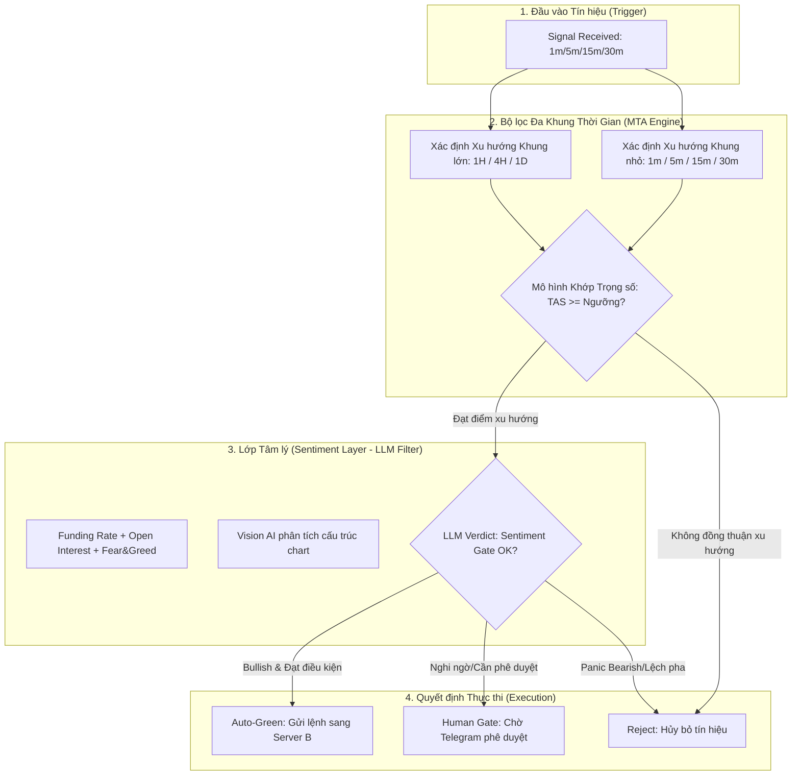

# Kiến trúc Căn chỉnh Khung thời gian & Mô hình Khớp Tín hiệu (Timeframe Alignment & Matching Model)

Tài liệu này đặc tả kiến trúc căn chỉnh đa khung thời gian (Multi-Timeframe Alignment - MTA) và Mô hình khớp tín hiệu giao dịch trong hệ thống **Angati (TradingViewProject)**. Việc kiểm duyệt và xác thực khung thời gian không đơn thuần là một bộ lọc kỹ thuật (bug validation) mà là **tầm nhìn chiến lược** nhằm bảo vệ tài khoản thực khỏi các tín hiệu nhiễu ở khung nhỏ và bảo đảm tỷ lệ thắng (Win Rate) tối ưu nhờ giao dịch thuận xu hướng lớn.

---

## 1. Triết lý Kiến trúc & Bản chất của Bộ lọc Khung thời gian

Trong giao dịch thuật toán, các tín hiệu kích hoạt ở khung thời gian nhỏ (1m, 5m, 15m, 30m) có độ nhiễu cực kỳ cao nếu đứng độc lập. Tuy nhiên, nếu chặn hoàn toàn các tín hiệu này, hệ thống sẽ bỏ lỡ các điểm vào lệnh tối ưu (optimum entry points) có tỷ lệ R:R (Risk/Reward) rất cao ngay đầu xu hướng.

Do đó, thay vì chặn cứng theo kiểu nhị phân, hệ thống áp dụng **Kiến trúc Căn chỉnh Đa khung thời gian (Multi-Timeframe Alignment - MTA)** và **Mô hình Khớp Tín hiệu (Matching Model)** dựa trên 3 yếu tố cốt lõi:
1. **Xác định xu hướng khung lớn (High Timeframe - HTF Trend):** Đo lường xu thế chủ đạo trên 1H, 4H, và 1D.
2. **Đánh giá Lớp Tâm lý (Sentiment Layer) bằng LLM:** Kết hợp chỉ số Fear & Greed, Funding Rate, Open Interest và phân tích Vision AI trên biểu đồ để làm bộ lọc động (Dynamic Filter).
3. **Mô hình Khớp Trọng số (Weighted Matching Model):** Tính toán độ đồng thuận xu hướng giữa các khung thời gian ngắn hạn và trung/dài hạn theo tỷ lệ phần trăm đóng góp cụ thể.



---

## 2. Xác định Xu hướng Khung lớn (High Timeframe - HTF Trend)

HTF Trend là bộ lọc định hướng chủ đạo. Xu hướng khung lớn được xác định độc lập trên các độ phân giải **1H (Giờ)**, **4H (4 Giờ)**, và **1D (Ngày)** dựa trên cấu trúc giá và các chỉ báo kỹ thuật:

### Phương pháp tính toán xu hướng cục bộ ($T_{tf}$):
Đối với mỗi khung thời gian $tf \in \{1H, 4H, 1D\}$, xu hướng được phân loại thành 3 trạng thái:
* **Bullish ($+1$):** Giá đóng cửa nằm trên đường EMA 50 và EMA 200, MACD Histogram $> 0$, và đỉnh sau cao hơn đỉnh trước (Higher Highs).
* **Bearish ($-1$):** Giá đóng cửa nằm dưới đường EMA 50 và EMA 200, MACD Histogram $< 0$, và đáy sau thấp hơn đáy trước (Lower Lows).
* **Chop/Sideways ($0$):** Giá dao động cắt qua lại đường EMA 50 và EMA 200, biên độ Bollinger Bands thu hẹp (Squeeze).

### Trọng số đóng góp của Khung lớn ($W_{HTF}$):
Hệ thống gán trọng số phân cấp cho từng khung lớn để phản ánh mức độ ảnh hưởng của chúng đến xu hướng dài hạn:

| Khung thời gian | Trọng số ($w_{tf}$) | Mô tả vai trò |
| :--- | :--- | :--- |
| **1D (Daily)** | 40% ($0.40$) | Định hình xu hướng dài hạn và cấu trúc vĩ mô của thị trường. |
| **4H** | 35% ($0.35$) | Xác định xu hướng trung hạn và các vùng hỗ trợ/kháng cự mạnh. |
| **1H** | 25% ($0.25$) | Cầu nối giữa xu hướng vĩ mô và dao động ngắn hạn của tín hiệu vào lệnh. |

**Công thức xác định Điểm Xu hướng Khung lớn (HTF Trend Score - $HTS$):**
$$HTS = 0.40 \cdot T_{1D} + 0.35 \cdot T_{4H} + 0.25 \cdot T_{1H}$$

Giá trị $HTS$ sẽ nằm trong khoảng $[-1.0, +1.0]$:
* $HTS \ge 0.6$: Xu hướng lớn Bullish mạnh mẽ.
* $HTS \le -0.6$: Xu hướng lớn Bearish mạnh mẽ.
* $-0.6 < HTS < 0.6$: Thị trường đang trong trạng thái tích lũy hoặc tranh chấp (Chop/Sideways).

---

## 3. Lớp Tâm lý (Sentiment Layer - LLM Filter)

Lớp Tâm lý đóng vai trò là bộ lọc động để điều chỉnh hoặc ngăn chặn (gate) lệnh dựa trên dữ liệu phi cấu trúc và chỉ số tâm lý thị trường thời gian thực.

### Đầu vào của Lớp Tâm lý:
1. **Fear & Greed Index (F&G):** Lấy từ Alternative.me hoặc Glassnode.
2. **Funding Rate (Tỷ lệ tài trợ):** Được tổng hợp từ các sàn Binance, Bybit và WEEX thông qua CCXT.
3. **Open Interest (OI - Hợp đồng mở):** Đo lường dòng tiền thông minh tích lũy trên thị trường phái sinh.
4. **Phân tích Vision AI (Biểu đồ):** LLM trực tiếp quét ảnh chụp màn hình biểu đồ 1H để nhận diện các mô hình hành vi giá (VCP, Cup and Handle, Double Bottom).

### Phán quyết của LLM & Bộ lọc Tâm lý:
LLM phân tích dữ liệu tâm lý kết hợp với cấu trúc biểu đồ để đưa ra điểm số Tâm lý ($S \in [-1.0, 1.0]$):

* **$S \ge 0.6$ (Bullish Sentiment):** 
  * Cho phép tự động duyệt (`Auto-Green`) các lệnh **BUY** ở khung nhỏ ngay cả khi điểm xu hướng khung lớn $HTS$ ở mức trung lập ($0.3$ - $0.5$).
  * Chặn hoàn toàn hoặc tăng yêu cầu duyệt thủ công đối với các lệnh **SELL**.
* **$S \le -0.6$ (Bearish/Panic Sentiment):**
  * Tự động chặn các lệnh **BUY** khung nhỏ để tránh hiện tượng bắt dao rơi (Catching a falling knife).
  * Cho phép thực thi lệnh **SELL** thuận xu hướng giảm.
* **$-0.6 < S < 0.6$ (Neutral/Chop Sentiment):**
  * Không tăng/giảm độ tự tin. Quyết định vào lệnh hoàn toàn phụ thuộc vào Mô hình Khớp Trọng số đa khung thời gian.

> [!IMPORTANT]
> **Ràng buộc an toàn (Circuit Breaker):** 
> Nếu Funding Rate vượt quá mức cực đoan ($> 0.05\%$ hoặc $< -0.05\%$) hoặc Open Interest sụt giảm đột biến ($> 15\%$ trong 1 giờ), Lớp Tâm lý sẽ ngay lập tức trả về phán quyết **BLOCK** (Từ chối giao dịch) bất chấp xu hướng kỹ thuật đồng thuận.

---

## 4. Mô hình Khớp Trọng số (Weighted Matching Model)

Mô hình Khớp Trọng số là trái tim của hệ thống kiểm duyệt lệnh đa khung thời gian. Nó định hình và so sánh mức độ đồng thuận giữa **Xu hướng ngắn hạn** và **Xu hướng trung/dài hạn** để đưa ra quyết định thực thi tối ưu.

```
+-------------------------------------------------------------------+
|                  BẢN ĐỒ PHÂN BỔ TRỌNG SỐ (WEIGHTS)                |
|                                                                   |
|   [ XU HƯỚNG NGẮN HẠN: 40% ]           [ XU HƯỚNG TRUNG/DÀI HẠN: 60% ] |
|                                                                   |
|   +-------+-------+--------+--------+  +--------+--------+--------+   |
|   |  1m   |  5m   |  15m   |  30m   |  |   1H   |   4H   |   1D   |   |
|   |  5%   |  10%  |  12%   |  13%   |  |  15%   |  20%   |  25%   |   |
|   +-------+-------+--------+--------+  +--------+--------+--------+   |
+-------------------------------------------------------------------+
```

### 4.1. Định hình Xu hướng Ngắn hạn (Short-Term Trend - STF)
Xu hướng ngắn hạn đo lường động lượng tức thời tại thời điểm phát tín hiệu, bao gồm các khung thời gian: **1m**, **5m**, **15m**, và **30m**.
* Trọng số đóng góp của xu hướng ngắn hạn ($W_{STF}$) chiếm **40%** tổng điểm xu hướng của hệ thống.
* Chi tiết phân bổ trọng số trong nhóm STF:
  * **30m:** $13\%$
  * **15m:** $12\%$
  * **5m:** $10\%$
  * **1m:** $5\%$

Điểm số xu hướng ngắn hạn ($STS$) được tính như sau:
$$STS = 0.325 \cdot T_{30m} + 0.30 \cdot T_{15m} + 0.25 \cdot T_{5m} + 0.125 \cdot T_{1m}$$
*(Trong đó $T_{tf} \in \{-1, 0, 1\}$, công thức quy đổi tương đương tổng trọng số STF đạt tối đa $1.0$)*

### 4.2. Định hình Xu hướng Trung/Dài hạn (Medium/Long-Term Trend - MLTF)
Xu hướng trung/dài hạn đo lường cấu trúc và động lượng vĩ mô, bao gồm các khung thời gian: **1H**, **4H**, và **1D**.
* Trọng số đóng góp của xu hướng trung/dài hạn ($W_{MLTF}$) chiếm **60%** tổng điểm xu hướng của hệ thống.
* Chi tiết phân bổ trọng số trong nhóm MLTF:
  * **1D (Daily):** $25\%$
  * **4H:** $20\%$
  * **1H:** $15\%$

Điểm số xu hướng trung/dài hạn ($MLTS$) được tính như sau:
$$MLTS = 0.417 \cdot T_{1D} + 0.333 \cdot T_{4H} + 0.25 \cdot T_{1H}$$
*(Tổng trọng số MLTF quy đổi đạt tối đa $1.0$)*

### 4.3. Điểm Đồng thuận Xu hướng (Combined Trend Alignment Score - TAS)
Điểm đồng consensus cuối cùng là tổng hòa của hai nhóm xu hướng trên:
$$TAS = 0.40 \cdot STS + 0.60 \cdot MLTS$$

Giá trị $TAS$ biểu thị mức độ đồng thuận xu hướng toàn phần:
* **$TAS \ge 0.5$:** Đồng thuận tăng giá (Bullish Consensus). Chỉ ưu tiên lệnh **BUY**.
* **$TAS \le -0.5$:** Đồng thuận giảm giá (Bearish Consensus). Chỉ ưu tiên lệnh **SELL**.
* **$-0.5 < TAS < 0.5$:** Trạng thái giằng co/Chop. Không đồng thuận xu hướng.

---

## 5. Quy tắc Khớp Lệnh & Thực thi Thực tế (Execution Rules)

Khi có một tín hiệu (ví dụ: Signal BUY ở khung 5m) được gửi tới thông qua Webhook, hệ thống sẽ chạy qua mô hình khớp để đưa ra quyết định:

### Bảng Ma trận Khớp & Thực thi Lệnh:

| Điểm Xu hướng ($TAS$) | Điểm Tâm lý ($S$) | Hướng tín hiệu | Quyết định Thực thi | Lý do kiến trúc |
| :---: | :---: | :---: | :---: | :--- |
| **$\ge 0.5$** | $\ge 0.5$ | **BUY** | **Auto-Green** ✅ | Đồng thuận tuyệt đối giữa kỹ thuật đa khung và tâm lý thị trường. |
| **$\ge 0.5$** | Neutral | **BUY** | **Auto-Green** ✅ | Xu hướng lớn đồng thuận mạnh mẽ, tâm lý bình ổn hỗ trợ xu hướng. |
| **$0.0$ đến $0.4$** | $\ge 0.6$ | **BUY** | **Human Gate** ⏳ | Xu hướng kỹ thuật yếu nhưng được thúc đẩy bởi tâm lý tích cực cực đoan. Cần con người xác thực. |
| **$< 0.0$** | $\ge 0.6$ | **BUY** | **REJECT** ❌ | Chặn đứng hành vi bắt đáy khi xu hướng lớn vẫn đang giảm mạnh. |
| **$\le -0.5$** | $\le -0.5$ | **SELL** | **Auto-Green** ✅ | Đồng thuận giảm giá kỹ thuật kết hợp với tâm lý hoảng loạn của thị trường. |
| **$-0.4$ đến $0.4$** | Neutral | Bất kỳ | **REJECT** ❌ | Thị trường đi ngang không xu hướng rõ ràng ở cả khung lớn và khung nhỏ. |

---

## 6. Kế hoạch Hiện thực hóa mã nguồn (Implementation Steps)

Để chuyển giao tài liệu thiết kế này thành tính năng hoạt động thực tế trên máy chủ, chúng ta cần thực hiện các bước sau:

### Bước 1: Cấu hình biến môi trường và thiết lập tham số
Bổ sung các tham số cấu hình trọng số vào [config.py](file:///c:/Users/pesil/working/mj_trading/TradingViewProject/nerves/workers/trading/config.py) để cho phép thay đổi động tỷ lệ mà không cần sửa code cốt lõi.

### Bước 2: Tích hợp Fetch Dữ liệu Đa Khung trong SignalProcessor
Cập nhật [signal_processor.py](file:///c:/Users/pesil/working/mj_trading/TradingViewProject/nerves/workers/trading/processor/signal_processor.py) để khi nhận được tín hiệu khung nhỏ (ví dụ 5m), hệ thống tự động gọi API fetch dữ liệu lịch sử giá của các khung lớn (1H, 4H, 1D) từ Capture Client để tính toán các giá trị $T_{1H}$, $T_{4H}$, $T_{1D}$.

### Bước 3: Nâng cấp AIAnalyzer để tính điểm TAS và kết hợp với Sentiment
Sửa đổi [ai_analyzer.py](file:///c:/Users/pesil/working/mj_trading/TradingViewProject/nerves/workers/trading/analyzer/ai_analyzer.py) để tính điểm số $TAS$ và tích hợp điểm Sentiment $S$ thành một chỉ số Độc lập trước khi quyết định gán trạng thái `should_trade` hoặc `interactive_required`.
