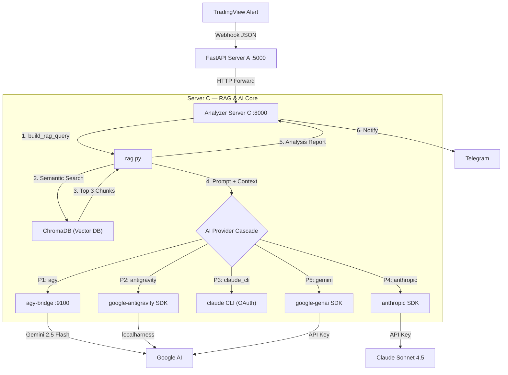
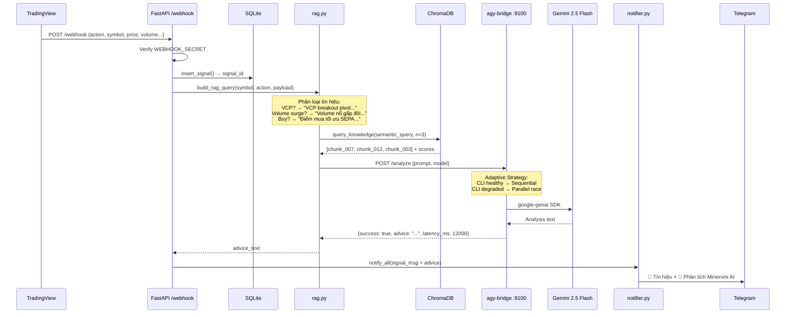

# Kiến trúc Hệ thống: Automated RAG Flow (TradingView & AI Agent)

Tài liệu này mô tả luồng kiến trúc (Architecture Flow) kết nối tín hiệu từ TradingView Webhook với Hệ thống Trí tuệ Nhân tạo (AI Agent) sử dụng cơ chế RAG (Retrieval-Augmented Generation). Mục đích là để AI tự động tra cứu bộ quy tắc của Mark Minervini (từ Knowledge Base) và phân tích tín hiệu giao dịch trước khi gửi thông báo.

## 1. Sơ đồ Luồng hoạt động (Architecture Flow)



## 2. Chi tiết các Bước thực thi

1. **TradingView bắn Webhook (Trigger):**
   - Khi công cụ Pine Script phát hiện tín hiệu (ví dụ: `VCP Breakout` hoặc đạt chuẩn `Trend Template`), TradingView bắn một gói dữ liệu JSON về server thông qua Cloudflare Tunnel (`localhost:5000/webhook`).

2. **Agent Nhận Tín Hiệu & Truy Vấn (Retrieval):**
   - Server FastAPI không gửi thông báo ngay. Thay vào đó, nó kích hoạt AI Agent.
   - Dựa trên loại tín hiệu (ví dụ: VCP), Agent tự động tạo truy vấn tìm kiếm và gọi vào **Vector Database** (được xây dựng từ các file `chunks` Markdown của cuốn sách).
   - Vector DB tính toán độ tương đồng và trả về 2-3 đoạn trích dẫn luật giao dịch chuẩn xác nhất liên quan đến điểm mua VCP.

3. **LLM Phân Tích (Generation):**
   - Agent nạp Dữ liệu Tín Hiệu (Mã cổ phiếu, Giá, Volume) + Dữ liệu Kiến Thức (Đoạn trích luật Minervini) vào cho LLM (Large Language Model).
   - LLM sẽ đóng vai trò là một chuyên gia giao dịch, đối chiếu tín hiệu thực tế với lý thuyết trong sách để đánh giá chất lượng của tín hiệu này (Tốt, Xấu, Cần lưu ý gì).

4. **Gửi Báo Cáo (Action):**
   - Thông qua module `notifier.py`, hệ thống đẩy một bản báo cáo phân tích chuyên sâu (kèm đánh giá của AI) về điện thoại của người dùng qua Telegram hoặc Discord.

---

## 3. Triển khai P5 (Đã hoàn thành ✅)

### Tech Stack

| Thành phần | Công nghệ | Vai trò |
|-----------|-----------|---------|
| Vector DB | **ChromaDB** (local, persistent) | Lưu trữ và truy vấn embedding vectors |
| Embedding | **sentence-transformers** (`paraphrase-multilingual-MiniLM-L12-v2`) | Chuyển text → vectors, hỗ trợ tiếng Việt |
| LLM | **Multi-Provider Cascade** (xem Section 5) | Phân tích tín hiệu dựa trên context Minervini |
| Framework | **FastAPI v5.0** | Webhook server + RAG endpoints |

### Files đã triển khai

```
server/
├── rag.py              ← [CORE] RAG module (601 LOC)
│   ├── init_vector_db()          # Embed 36 chunks → ChromaDB (startup)
│   ├── query_knowledge()         # Semantic search (cosine similarity)
│   ├── build_rag_query()         # Tạo query từ webhook payload
│   └── generate_trading_advice() # Multi-provider AI analysis
│
├── agy_harness.py      ← [CLIENT] HTTP client for agy-bridge (265 LOC)
│   └── AgyHarness                # 5-Gate harness pattern
│
├── config.py           ← [CONFIG] AI_PROVIDER, AGY_*, GEMINI_*, ANTHROPIC_*
├── main.py             ← [SERVER] v5.0 + RAG lifespan + /api/rag/* endpoints
├── requirements.txt    ← + chromadb, sentence-transformers, anthropic, google-genai
└── .env.example        ← + RAG config section

deploy/
├── agy-bridge.py       ← [SIDECAR] Host-level bridge for agy CLI (711 LOC)
└── .env.agy            ← ANTIGRAVITY_API_KEY, AGY_BRIDGE_SECRET
```

### API Endpoints

| Method | Endpoint | Mô tả |
|--------|----------|-------|
| `GET` | `/api/rag/query?q=VCP+breakout&n=3` | Test truy vấn Knowledge Base |
| `GET` | `/api/rag/status` | Kiểm tra trạng thái Vector DB |

### Cấu hình `.env`

```env
# AI Provider (production Server C)
AI_PROVIDER=agy

# agy-bridge sidecar
AGY_BRIDGE_URL=http://host.docker.internal:9100
AGY_BRIDGE_SECRET=your-secret-here
AGY_TIMEOUT_SEC=25
AGY_MODEL=gemini-2.5-flash

# Fallback keys
GEMINI_API_KEY=your-gemini-key
ANTHROPIC_API_KEY=sk-ant-xxxxxxxxxxxxxxxx

# RAG
RAG_ENABLED=true
RAG_TOP_K=3
```

---

## 4. Sơ đồ chi tiết: Webhook Processing Flow



---

## 5. Multi-Provider AI Architecture (V10+)

### Provider Cascade

```
AI_PROVIDER env var → rag.py generate_trading_advice()

┌──────────────────────────────────────────────────────────┐
│ Priority 1: agy         → agy-bridge :9100 → Gemini     │
│ Priority 2: antigravity → google-antigravity SDK Agent   │
│ Priority 3: claude_cli  → claude binary (OAuth session)  │
│ Priority 4: anthropic   → Anthropic SDK (API key)        │
│ Priority 5: gemini      → google-genai / Vertex AI       │
│                                                          │
│ Fallback: agy fail → gemini | anthropic fail → gemini    │
└──────────────────────────────────────────────────────────┘
```

### agy-bridge Sidecar Architecture

| Component | Mô tả |
|-----------|-------|
| **Dual Provider** | agy CLI (project auth/ADC) + google-genai SDK (GEMINI_API_KEY) |
| **Quota Isolation** | CLI → Vertex AI quota, SDK → AI Studio quota (separate pools) |
| **Adaptive Strategy** | Sequential (healthy) ↔ Parallel race (degraded CLI) |
| **Circuit Breaker** | CLOSED → OPEN (3 fails) → HALF_OPEN (120s cooldown) |
| **Response Cache** | SHA-256 key, 5min TTL, max 50 entries |
| **Auth** | `AGY_BRIDGE_SECRET` bearer token (timing-safe hmac comparison) |

### SCAR Registry

| SCAR | Mô tả |
|------|-------|
| SCAR-005 | agy CLI requires PTY — bridge uses `script -qfc` wrapper |
| SCAR-006 | Free tier API key hits quota — must use Tier 1 |
| SCAR-007b | Adaptive strategy saves tokens when CLI is healthy |
| SCAR-008 | Single API key for both paths = single quota failure. Fix: quota isolation (CLI=ADC, SDK=GEMINI_API_KEY) |
| SCAR-009 | `--dangerously-skip-permissions` bypasses ALL security. Fix: `--sandbox` + `settings.json` deny list (Defense-in-Depth) |

### Security: Defense-in-Depth (4 Layers)

| Layer | Cơ chế | Status |
|-------|--------|--------|
| **L1** | Hardened constrained_prompt (NON-NEGOTIABLE system rules) | ✅ Active |
| **L2** | `--sandbox` + `settings.json` deny list (20 rules: deny run_command/write_file) | ✅ Active |
| **L3** | systemd `ProtectSystem=strict`, `ProtectHome=read-only`, `NoNewPrivileges=true` | ✅ Active |
| **L4** | `nsjail` kernel namespace sandbox | ⚠️ Not installed |

**Config**: `deploy/agy-settings.json` → auto-deployed to `~/.gemini/antigravity-cli/settings.json` by CI.

---

## 6. Cập nhật Vận hành trên Linux & AI Provider "agy" (V10 Hardening)

### agy-bridge sidecar

- AI provider `agy` định tuyến prompt qua sidecar `agy-bridge` chạy trên host `:9100`.
- **Quota isolation**: CLI dùng project auth (ADC/gcloud), SDK dùng `GEMINI_API_KEY` — 2 pool riêng.
- Startup log cảnh báo nếu 2 key giống nhau: `⚠️ CLI and SDK use SAME key`.
- Docker container gọi bridge qua `host.docker.internal:9100` với `AGY_BRIDGE_SECRET` bearer token.

### Cross-platform SQLite Fallback

- `ingest_helper.py` ghi semantic memory vào `V3_brain.db`.
- Trên Windows: gọi `angati.exe memory ingest`.
- Trên Linux: fallback trực tiếp SQLite (no binary dependency).

### V4: Monitoring & Alerting (liveness_monitor.py)

| Alert | Trigger | Action |
|-------|---------|--------|
| 🚨 **AGY-BRIDGE DOWN** | HTTP unreachable × 2 liên tiếp | Telegram + Discord |
| 🔴 **CB OPEN** | Circuit Breaker transition → OPEN | Telegram (AI pipeline blocked) |
| ⚠️ **CLI DEGRADED** | Strategy transition → parallel | Telegram (2x token cost warning) |
| ✅ **RECOVERED** | Any of above returns to normal | Telegram (all-clear) |

**Alerting pattern**: Transition-based — fires ONCE per state change (no spam).
**Env var**: `AGY_BRIDGE_HEALTH_URL` (default: `http://localhost:9100/health`)


## 7. Tài liệu liên quan

- [`docs/plans/P5/architecture_mermaid.md`](plans/P5/architecture_mermaid.md) — 5 sơ đồ Mermaid chi tiết
- [`docs/plans/P5/implementation_log.md`](plans/P5/implementation_log.md) — Log kỹ thuật & checklist deploy
- [`docs/TRADINGVIEW_ALERT_SETUP.md`](TRADINGVIEW_ALERT_SETUP.md) — Hướng dẫn setup TradingView Alert
- [`docs/CICD_WORKFLOW.md`](CICD_WORKFLOW.md) — CI/CD PR-based workflow guide
