# 🗺️ A2A Integration Roadmap — Decentralized Satellite Orchestration

> **Version:** 1.0 | **Date:** 2026-06-03  
> **Status:** Draft Roadmap for Phase 2 Implementation  
> **Architecture:** A2A / Satellite Protocol v1.4  
> **Target Ports:** `:9108` (A2A Satellite Gateway)

---

## 📊 1. Tổng Quan Tiến Trình (Roadmap Overview)

Lộ trình nâng cấp từ cơ chế điều khiển thủ công qua **Manual SSH** (Human-in-the-loop) sang giao thức truyền tin trực tiếp **A2A / Satellite Protocol** giữa Antigravity IDE và `agy` trên **Server C (AI Core)** thông qua mạng mã hóa **Tailscale VPN**.

```mermaid
graph TD
    subgraph Local IDE Context
        IDE[Antigravity IDE / Agent]
    end

    subgraph Tailscale Encrypted Network
        IDE -- 1. Register / Trust Bootstrap --> SG[agy Gateway :9108]
        IDE -- 2. JSON-RPC Task Dispatch --> SG
        SG -- 3. Local Execute as Root --> Core[Server C AI Core]
        Core -- 4. Telemetry / Results --> IDE
    end
    
    style SG fill:#1e222d,stroke:#2962ff,stroke-width:2px;
    style IDE fill:#1c1c1e,stroke:#34c759,stroke-width:2px;
```



---

## 🔍 2. Phân Tích Hiện Trạng & Xác Định Lỗ Hổng (Gap Analysis)

| Yêu Cầu | Trạng Thái | Thành Phần Đang Có | Lỗ Hổng / Việc Cần Làm |
|---|---|---|---|
| **Satellite Protocol v1.4** | ⚠️ Sẵn sàng (Phần code) | Module Go `discover.go`, `platform.go` | Chưa deploy lên Server C dưới dạng daemon service. |
| **A2A Agent Card** | ✅ Đã định nghĩa | `spine/gateway/agent_card.py` | `agy` chưa expose JSON-RPC endpoint tại `:9108`. |
| **Tailscale VPN** | ✅ Sẵn sàng | Đã kết nối & thông tuyến IP | Cần giới hạn bind cổng `:9108` chỉ cho Tailscale interface. |
| **Trust Engine** | ⚠️ Sẵn sàng (Thuật toán) | Thuật toán ed25519 challenge-response | Chưa bootstrap trust giữa IDE và Server C. |
| **agy trên Server C** | ⚠️ Đang chạy | Chạy dưới dạng CLI tool đơn lẻ | Cần cấu hình chạy chế độ Server daemon lắng nghe cổng. |

---

## 🚀 3. Kế Hoạch Triển Khai Chi Tiết (Step-by-Step Implementation)

### 📌 Bước 1: Deploy & Expose Gateway A2A trên Server C
*   **Mục tiêu:** Cấu hình `agy` chạy ở chế độ A2A Server, mở cổng `:9108` để phục vụ Agent Card và JSON-RPC.
*   **Triển khai:**
    1.  Tạo systemd unit file `agy-gateway.service` trên Server C để quản lý dịch vụ chạy nền.
    2.  Mount mixins `AgentCardMixin` và `A2AHandlerMixin` từ `spine/gateway` vào server HTTP của `agy`.
    3.  Chỉ cấu hình lắng nghe trên Tailscale IP của Server C (`100.x.x.3`) nhằm đảm bảo an toàn tuyệt đối.
*   **Đầu ra (Deliverables):**
    *   `GET http://100.x.x.3:9108/.well-known/agent-card.json` trả về metadata của Satellite Node.
    *   `POST http://100.x.x.3:9108/a2a` tiếp nhận JSON-RPC request.

### 📌 Bước 2: Bootstrap Trust giữa IDE và Satellite Node
*   **Mục tiêu:** Thiết lập khóa bảo mật ed25519 để IDE Agent có quyền gửi Task điều khiển trực tiếp mà không qua trung gian.
*   **Triển khai:**
    1.  IDE Agent sinh cặp khóa ed25519 dùng riêng cho session.
    2.  Đẩy khóa public của IDE Agent vào danh sách được ủy quyền trên Server C (`~/.config/angati/authorized_agents.json`).
    3.  Thực hiện thử thách Challenge-Response: `agy` gửi một chuỗi ngẫu nhiên mã hóa, IDE Agent ký bằng private key và phản hồi lại để verify.
*   **Đầu ra (Deliverables):**
    *   Hợp đồng tin cậy được thiết lập (Trust Established), IDE Agent nhận được Session Token thời hạn dài.

### 📌 Bước 3: Triển Khai Giao Thức Gửi & Nhận Task (Task Dispatch & Execute)
*   **Mục tiêu:** Loại bỏ việc user copy-paste các câu lệnh thủ công, tự động hóa dispatching thông qua JSON-RPC 2.0.
*   **Triển khai:**
    1.  Ánh xạ A2A Task `tasks/send` sang các API nội bộ của Server C:
        *   `webhook-signal-processor` → `/webhook` endpoint.
        *   `scar-memory-query` → `rag.py` / ChromaDB.
        *   `trade-executor` → Gửi tín hiệu thực thi qua Server B.
    2.  Tích hợp cơ chế **The Route Proof Rule** (v7.6.2): Xác thực đường truyền vật lý trước khi đánh dấu task thành công.
*   **Đầu ra (Deliverables):**
    *   IDE Agent dispatch lệnh an toàn từ xa và nhận lại kết quả chạy thực tế dưới dạng cấu trúc JSON.

### 📌 Bước 4: Đồng Bộ Hóa Blocklist Thời Gian Thực (Real-time Guardrail Sync)
*   **Mục tiêu:** Đồng bộ lập tức danh sách blocklist từ IDE xuống cả 3 Server thay vì chờ cron-job 15 phút.
*   **Triển khai:**
    1.  Sử dụng WebSocket hoặc SSE (Cognitive Bus :9105) trên `agy` để nhận event thay đổi cấu hình từ IDE.
    2.  Khi có blocklist mới từ IDE → trigger ghi đè cấu hình local và reload bộ lọc `kg_guard` nguyên tử.

---

## 🧪 4. Kế Hoạch Xác Minh & Kiểm Thử (Verification Plan)

### Kiểm thử Tự động (Automated Tests)
1.  **Unit Test**: Mở rộng file `nerves/core/test_v10_integration.py` để mock cuộc gọi A2A qua cổng `:9108` và verify tính năng parse Agent Card.
2.  **Challenge Verification Test**: Viết script `test_trust_bootstrap.py` để verify thuật toán ký ed25519 hoạt động đúng chuẩn.
3.  **Command Execution Test**: Verify việc dispatch một task ngầm (ví dụ: `angati status`) qua JSON-RPC trả về đúng JSON output.

### Xác minh Thủ công (Manual Verification)
1.  Khởi chạy `agy` ở chế độ Server trên Server C qua Tailscale VPN.
2.  Từ Antigravity IDE, thực hiện lệnh `curl` kiểm tra endpoint Agent Card:
    ```bash
    curl -sf http://100.x.x.3:9108/.well-known/agent-card.json
    ```
3.  Thực hiện Dispatch thử một Task mẫu và theo dõi logs ghi nhận hành vi.

---

> [!IMPORTANT]
> **Quy Tắc Ưu Tiên (Priority Rule):**  
> Việc nâng cấp A2A sẽ được triển khai ngay sau khi hệ thống phòng thủ thủ công (Phase 1) hoạt động ổn định 100% và vượt qua toàn bộ các đợt kiểm thử tích hợp. An toàn vật lý (Physical Safety) luôn đi trước tiện ích tự động hóa.
