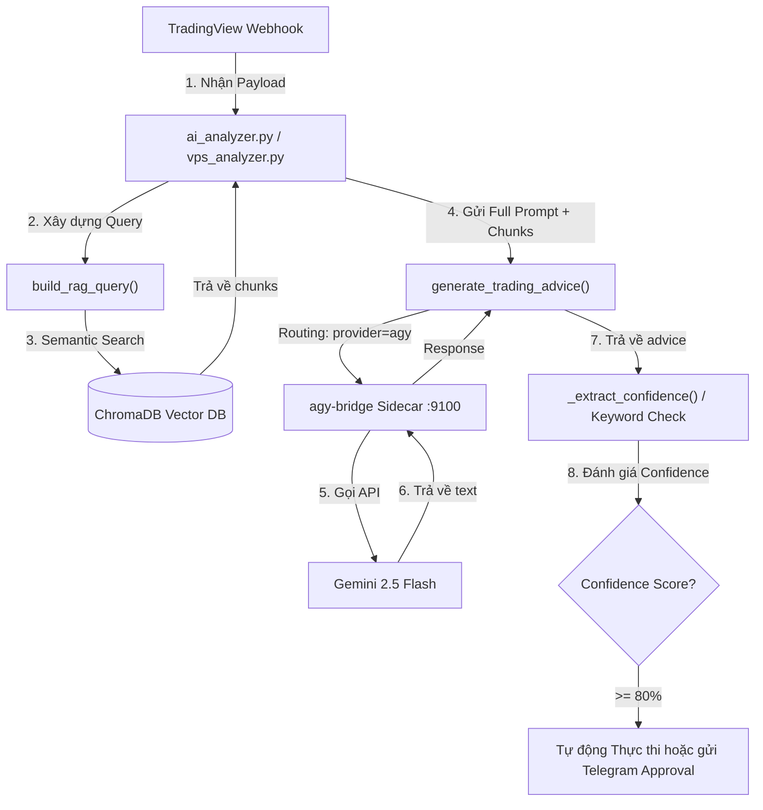

# AI Signal Analysis Pipeline — Full Technical Reference

> Complete pipeline documentation: TradingView Webhook → AI Analysis → Execution

---

## Pipeline Flow Overview



---

## Step 1: RAG Query (`build_rag_query`)

When a signal arrives, `rag.py::build_rag_query()` analyzes webhook payload fields
to create an optimized semantic query:

```python
def build_rag_query(symbol: str, action: str, payload: dict) -> str:
    alert_type = payload.get("alert_type", "")
    volume = payload.get("volume", 0)
    volume_avg = payload.get("volume_avg", 0)
    base = f"Quy tắc giao dịch Minervini khi {action}"

    if "vcp" in alert_type.lower() or "volatility contraction" in alert_type.lower():
        return f"VCP Volatility Contraction Pattern breakout điểm mua pivot {base}"
    if "trend template" in alert_type.lower():
        return f"Trend Template 8 tiêu chí Stage 2 xác nhận {base}"
    if volume and volume_avg:
        try:
            if float(volume) > float(volume_avg) * 1.5:
                return f"Volume nổ gấp đôi tăng bất thường xác nhận breakout {base}"
        except (TypeError, ValueError):
            pass
    if action == "buy":
        return f"Điểm mua tối ưu SEPA pivot breakout Stage 2 {symbol} {base}"
    if action == "sell":
        return f"Tín hiệu bán stop loss trailing stop quản lý vị thế {base}"

    return f"Quy tắc phân tích tín hiệu kỹ thuật SEPA Minervini {symbol} {base}"
```

After building the query, the system performs semantic search against ChromaDB via
`rag.query_knowledge()` to retrieve the most relevant Minervini knowledge chunks
(`config.RAG_TOP_K` default = 3).

### Query Examples

| Signal Type | Generated Query |
|-------------|----------------|
| VCP breakout buy | `VCP Volatility Contraction Pattern breakout điểm mua pivot Quy tắc giao dịch Minervini khi buy` |
| Trend Template | `Trend Template 8 tiêu chí Stage 2 xác nhận Quy tắc giao dịch Minervini khi buy` |
| High volume | `Volume nổ gấp đôi tăng bất thường xác nhận breakout Quy tắc giao dịch Minervini khi buy` |
| Standard buy | `Điểm mua tối ưu SEPA pivot breakout Stage 2 BTCUSDT Quy tắc giao dịch Minervini khi buy` |
| Standard sell | `Tín hiệu bán stop loss trailing stop quản lý vị thế Quy tắc giao dịch Minervini khi sell` |

---

## Step 2: Full Prompt to Gemini (`generate_trading_advice`)

`rag.py::generate_trading_advice()` combines real-time market data with RAG knowledge
chunks into a complete prompt:

### Prompt Template

```markdown
Bạn là chuyên gia giao dịch theo phương pháp SEPA của Mark Minervini.
Dưới đây là tín hiệu TradingView vừa nhận được và các quy tắc liên quan từ sách của Minervini.

## TÍN HIỆU GIAO DỊCH
- **Mã**: {symbol}
- **Hành động**: {action.upper()}
- **Giá**: {price}
- **Loại tín hiệu**: {alert_type}
- **Khung thời gian**: {timeframe}
- **Volume hiện tại**: {volume}
- **Volume trung bình**: {volume_avg}
- **RSI**: {rsi}

## KIẾN THỨC MINERVINI LIÊN QUAN (từ Knowledge Base)
[Tài liệu 1 | Chủ đề: {topic} | Độ liên quan: {score:.2%}]
{Nội dung chunk 1 — max 800 chars}

---

[Tài liệu 2 | Chủ đề: {topic} | Độ liên quan: {score:.2%}]
{Nội dung chunk 2}

## YÊU CẦU PHÂN TÍCH
Dựa trên tín hiệu trên và quy tắc của Minervini trong Knowledge Base:
1. **Đánh giá chất lượng tín hiệu** (Mạnh/Trung bình/Yếu) và lý do ngắn gọn
2. **Điểm phù hợp với Minervini** (có đáp ứng Trend Template, VCP, Volume không?)
3. **Khuyến nghị hành động** (Mua/Bán/Chờ thêm xác nhận) + Stop-loss gợi ý
4. **Cảnh báo rủi ro** (nếu có)

Trả lời NGẮN GỌN, súc tích (dưới 200 từ), dùng emoji để dễ đọc trên Telegram.
```

### Routing to Gemini via `agy`

When `AI_PROVIDER=agy`, the system uses `AgyHarness` (from `agy_harness.py`) to
dispatch the prompt via HTTP to the bridge sidecar on port `:9100`.

The bridge uses a **dual-strategy** approach:

1. **Primary: agy CLI binary** (`--print --dangerously-skip-permissions < prompt_file`)
   - Writes prompt to temp file in `~/.cache/`, invokes `agy --print` with file redirect
   - ~11-13s latency, returns stdout directly
2. **Fallback: google-genai SDK** (if CLI times out or errors)
   - Direct SDK call via `GEMINI_API_KEY`, ~8s latency

```
Container (rag.py) → AgyHarness → HTTP POST /analyze
  → agy-bridge.py (host :9100)
    Strategy 1: agy CLI binary → Gemini 2.5 Flash (~13s)  ← PRIMARY
    Strategy 2: google-genai SDK → Gemini 2.5 Flash (~8s) ← FALLBACK
  → Response JSON → advice text
```

---

## Step 3: Gemini Response & Parsing

The AI response is sent back to the Analyzer for extraction and evaluation:

### 3a. Confidence Score Extraction

In `vps_analyzer.py`, `_extract_confidence()` extracts confidence based on keywords:

```python
def _extract_confidence(self, advice: str) -> int:
    lower = advice.lower()
    if "mạnh" in lower or "strong" in lower:
        return 85
    if "trung bình" in lower or "medium" in lower:
        return 60
    if "yếu" in lower or "weak" in lower:
        return 30
    return 50
```

### 3b. Confidence Penalization

In `ai_analyzer.py`, negative keywords reduce the aggregate confidence score:

```python
advice_upper = rag_advice.upper()
if any(kw in advice_upper for kw in ("CẢNH BÁO", "WARNING", "YẾU", "CHỜ THÊM XÁC NHẬN")):
    confidence = max(1, confidence - 2)
```

### 3c. Decision Matrix

| Confidence | Action | Example |
|-----------|--------|---------|
| ≥ 80% (8+) | ✅ Auto-approve → Execute trade | `conf=85% → APPROVED` |
| 50-70% (5-7) | ⏳ Telegram Interactive Approval | User taps approve/reject |
| < 50% (< 5) | ❌ Auto-reject | Signal discarded |

---

## Environment Configuration

```env
# .env (Server C)
AI_PROVIDER=agy
AGY_BRIDGE_URL=http://host.docker.internal:9100
AGY_MODEL=gemini-2.5-flash
AGY_TIMEOUT_SEC=25
LLM_CALL_TIMEOUT_SEC=30
GEMINI_API_KEY=your_key_here
TELEGRAM_BOT_TOKEN=your_bot_token
TELEGRAM_CHAT_ID=your_chat_id
```

---

## Architecture Diagram

```
┌────────────────────────────────────────────────────────────────┐
│                    Server A (VBS Hub)                          │
│  TradingView Webhook → Queue (SQLite) → /consume-long API     │
└──────────────────────────────┬─────────────────────────────────┘
                               │ Long-poll
┌──────────────────────────────▼─────────────────────────────────┐
│                    Server C (AI Core)                          │
│  ┌─────────────────────────────────────────┐                  │
│  │  Docker: tradingbot-analyzer            │                  │
│  │  ├─ vps_analyzer.py (main loop)         │                  │
│  │  ├─ rag.py (RAG + prompt builder)       │                  │
│  │  ├─ agy_harness.py (bridge client)      │                  │
│  │  └─ ChromaDB (Minervini knowledge)      │                  │
│  └────────────────┬────────────────────────┘                  │
│                   │ HTTP POST /analyze                         │
│  ┌────────────────▼────────────────────────┐                  │
│  │  Host: agy-bridge.py (:9100)            │                  │
│  │  ├─ Strategy 1: agy CLI binary (primary)│                  │
│  │  └─ Strategy 2: genai SDK (fallback)    │                  │
│  └─────────────────────────────────────────┘                  │
└──────────────────────────────┬─────────────────────────────────┘
                               │ Forward (if approved)
┌──────────────────────────────▼─────────────────────────────────┐
│                    Server B (Execution Vault)                  │
│  /api/execute-trade → Binance API                             │
└────────────────────────────────────────────────────────────────┘

                          📱 Telegram
                   (Notifications + Approval)
```

---

## Performance Metrics (Production)

| Metric | Value | Provider |
|--------|-------|----------|
| Signal → AI response | ~13s | agy CLI (primary) |
| Signal → AI response | ~8s | genai SDK (fallback) |
| RAG query (ChromaDB) | ~0.1s | — |
| Gemini 2.5 Flash inference | ~10-12s | — |
| Telegram notification | ~1s | — |
| Container boot (cold start) | ~40s | — |
| Total pipeline (warm) | ~14s | agy CLI |
| Total pipeline (fallback) | ~10s | genai SDK |

---

## Related Documentation

- [AGY Usage Guide](11_AGY_USAGE_GUIDE.md) — CLI flags, configuration, bridge setup
- [Security Hardening Guide](10_SECURITY_HARDENING_GUIDE.md) — Server security
- [A2A Integration Roadmap](08_A2A_INTEGRATION_ROADMAP.md) — Agent-to-Agent protocol
