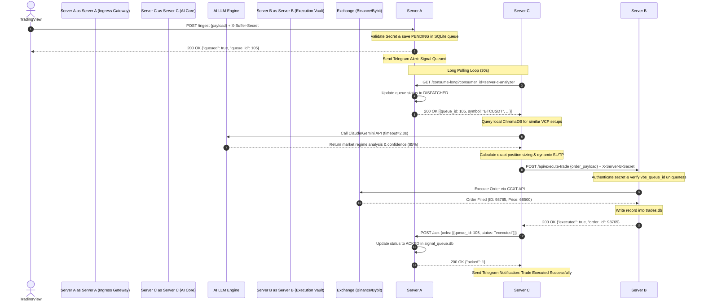
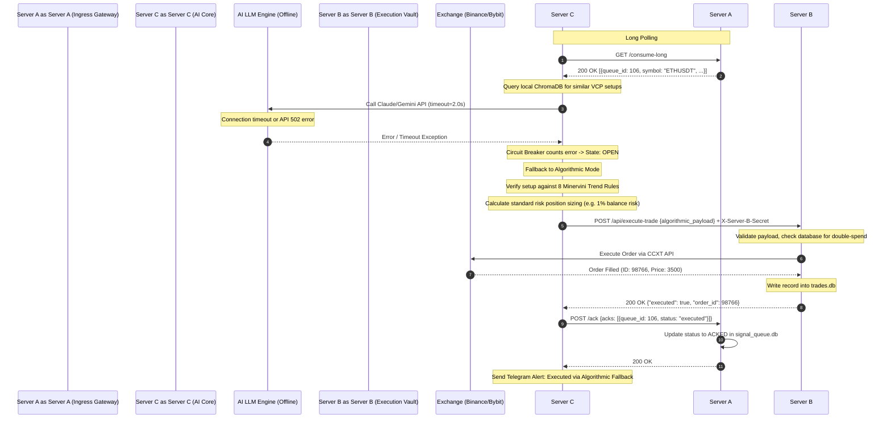

# 🏛️ Decentralized 3-Server Pipeline Architecture & System Design
## Technical Specifications & Security Blueprint

> **Module:** Decentralized Signal Processing & Execution Pipeline  
> **Version:** 1.0.0  
> **Date:** 2026-06-02  
> **Status:** ✅ Approved & Active  
> **Target Path:** `docs/decentralized_pipeline_design.md`  

---

## 📋 Table of Contents

1. [Architectural Overview & Motivation](#1-architectural-overview--motivation)
2. [3-Server Topology & Component Roles](#2-3-server-topology--component-roles)
   - [Server A: Ingress Gateway (The Shield)](#server-a-ingress-gateway-the-shield)
   - [Server C: AI Core & Knowledge Vault (The Brain)](#server-c-ai-core--knowledge-vault-the-brain)
   - [Server B: Execution Vault (The Muscle)](#server-b-execution-vault-the-muscle)
3. [Network Topology & Tailscale VPN Integration](#3-network-topology--tailscale-vpn-integration)
   - [Network Map](#network-map)
   - [Tailscale Access Control Lists (ACLs)](#tailscale-access-control-lists-acls)
4. [Signal Analysis Sequence Diagram](#4-signal-analysis-sequence-diagram)
   - [Happy Path: End-to-End Execution](#happy-path-end-to-end-execution)
   - [Fallback Path: LLM Downtime / Algorithmic Execution](#fallback-path-llm-downtime--algorithmic-execution)
5. [Security & Hardening Model](#5-security--hardening-model)
   - [Credential Isolation (API Keys Location)](#credential-isolation-api-keys-location)
   - [WAN Ingress Hardening & Cloudflare Tunnels](#wan-ingress-hardening--cloudflare-tunnels)
   - [Double-Secret Authentication Model](#double-secret-authentication-model)
   - [Linux/Windows Firewall & Tailscale Isolation](#linuxwindows-firewall--tailscale-isolation)
   - [SSH Hardening & Fail2ban Prevention](#ssh-hardening--fail2ban-prevention)
6. [Operational Playbook & Verification](#6-operational-playbook--verification)

---

## 1. Architectural Overview & Motivation

The system operates in a **Hybrid Lưỡng Hình** (Dual-Mode) architecture, allowing it to act either as a single monolithic process (for local development and backtesting) or as a **decentralized 3-server system** for live, high-capital production.

### Core Architectural Invariants:
1. **The Decoupled Buffer Principle**: The Ingress Gateway (Server A) has no knowledge of what the Trade Engine is doing, and the local Trade Engine has no knowledge of how alerts are generated. Communication is mediated exclusively through a persistent SQLite-backed queue.
2. **At-Least-Once Delivery**: Every signal from TradingView must be processed and executed. A signal is only removed from the active queue when an explicit acknowledgement (`ACK`) is received from the execution vault.
3. **API Key Isolation**: Exchange API keys (Binance/Bybit/Weex) are treated as cryptographic gold. Under no circumstances should they be accessible to or stored on servers exposing public internet interfaces (such as Server A) or servers executing non-deterministic LLM queries (such as Server C). They reside exclusively inside Server B.

---

## 2. 3-Server Topology & Component Roles

The decentralized pipeline partitions responsibilities across three dedicated instances, dividing the architecture into Ingress, Intelligence, and Execution layers.

```
                  ┌────────────────────────────────────────┐
                  │          TradingView Alerts            │
                  └──────────────────┬─────────────────────┘
                                     │ (Public WAN Webhook via HTTPS)
                                     ▼
                  ┌────────────────────────────────────────┐
                  │    SERVER A: Ingress Gateway           │
                  │    • VBS (FastAPI :5000)               │
                  │    • SQLite Queue (signal_queue.db)    │
                  └──────────────────┬─────────────────────┘
                                     │
                     (Private WAN    │  (Server C polls Server A
                      Tailscale IP)  │   via Long Polling)
                                     ▼
                  ┌────────────────────────────────────────┐
                  │    SERVER C: AI Core (8U16G)           │
                  │    • RAG Analyzer Worker               │
                  │    • ChromaDB Vector Server (:8000)    │
                  │    • LLM (Claude/Gemini) + Fallback    │
                  └──────────────────┬─────────────────────┘
                                     │
                     (Private WAN    │  (Forward Trade Request
                      Tailscale IP)  │   with X-Server-B-Secret)
                                     ▼
                  ┌────────────────────────────────────────┐
                  │    SERVER B: Windows Execution Vault   │
                  │    • Execution Server (:5002)          │
                  │    • Trade Engine (CCXT)               │
                  │    • SQLite Trades DB (trades.db)      │
                  └──────────────────┬─────────────────────┘
                                     │
                                     ▼
                       Binance / Bybit / Weex API
```

### Server A: Ingress Gateway (The Shield)
* **Operating System**: Debian 12 Minimal (Recommended: 1 CPU, 2GB RAM).
* **Network Exposure**: Accessible from the public internet *only* via a secure Cloudflare Tunnel (`bot.yourdomain.com`). No inbound ports are opened on Server A's public network interface.
* **Component Services**:
  * **VPS Buffer Service (VBS)**: A lightweight FastAPI app running on port `5000`.
  * **Persistence Layer**: An asynchronous SQLite database (`signal_queue.db`) storing signal lifecycle records (`PENDING`, `DISPATCHED`, `ACKED`, `STALE`, `SKIPPED`).
* **Behavior**:
  1. Receives alerts from TradingView via `POST /ingest` (authenticated with `X-Buffer-Secret`).
  2. Saves the payload locally in SQLite with a state of `PENDING` and stamps it with an expiration timestamp (`expires_at = datetime.utcnow() + 4h`).
  3. Triggers immediate Telegram notification informing the administrator of the queued signal.
  4. Exposes `/consume-long` for Server C to retrieve pending signals.
  5. Exposes `/ack` for Server C to confirm successful trade completion.

### Server C: AI Core & Knowledge Vault (The Brain)
* **Operating System**: Debian 12 Standard (Recommended: 8 CPU, 16GB RAM for Vector handling and local embeddings processing).
* **Network Exposure**: Private network only. Has no WAN ingress ports open. Reaches external APIs (OpenAI/Anthropic/Google Gemini) using outbound calls only.
* **Component Services**:
  * **RAG Analyzer Worker**: A background polling daemon running as an asynchronous system service.
  * **ChromaDB Server**: A vector database listening on `127.0.0.1:8000` containing historical trade setups, SEPA rules, and market context.
* **Behavior**:
  1. Polls Server A via Long Polling (`GET /consume-long?timeout=30s`) over the secure Tailscale interface.
  2. Upon receiving a signal, queries ChromaDB to retrieve similarity vectors matching current market dynamics.
  3. Calls LLM API (Claude/Gemini) with a strict `2.0s` timeout limit to classify the setup and calculate position size.
  4. If the LLM is unresponsive, times out, or errors out, an internal **Circuit Breaker** flips to `OPEN`, immediately switching Server C to **Algorithmic Fallback Mode** (validating signals using the 8 Minervini Trend Template rules and heuristics).
  5. Packs the validated execution payload and forwards it to Server B over Tailscale.
  6. Sends the final `ACK` to Server A upon receiving order confirmations from Server B.

### Server B: Execution Vault (The Muscle)
* **Operating System**: Windows Server / Windows Desktop (to enable native UI components, live chart monitors, and CDP CDP-keepalive scripts).
* **Network Exposure**: Private network only. No open public internet inbound ports.
* **Component Services**:
  * **Execution Server**: An isolated FastAPI process listening on port `5002`.
  * **Trade Engine**: Core execution wrapper containing CCXT exchange adapters.
  * **Trades Database**: `trades.db` storing executed orders and matching `vbs_queue_id` entries to ensure idempotency.
* **Behavior**:
  1. Listens for requests on `POST /api/execute-trade` (authenticated over Tailscale via `X-Server-B-Secret`).
  2. Verifies the request signature.
  3. Checks `trades.db` to prevent double-spending/duplicate orders (`vbs_queue_id` idempotency guard).
  4. Submits market or limit orders directly to Binance/Bybit/Weex exchange endpoints.
  5. Records the filled transaction in `trades.db`.
  6. Returns transaction data (price, order ID, fill timestamp) to Server C.

---

## 3. Network Topology & Tailscale VPN Integration

The system enforces network isolation by establishing a secure WireGuard mesh network using **Tailscale**. All inter-server traffic flows over this VPN interface (`tailscale0`).

### Network Map

```
    [ Internet ] ── HTTPS ──▶ [ Cloudflare Tunnel ]
                                    │ (Outbound connection)
                                    ▼
┌────────────────────────────────────────────────────────┐
│ SERVER A: Ingress Gateway                              │
│ Public IP: 198.51.100.1                                │
│ Tailscale IP: 100.115.20.1                             │
│ Local Interface: loopback:5000 (FastAPI VBS)           │
└──────────────────────────┬─────────────────────────────┘
                           │ (Tailscale Encrypted Tunnel)
                           ▼
┌────────────────────────────────────────────────────────┐
│ SERVER C: AI Core (Private VPS)                         │
│ Public IP: [Blocked]                                   │
│ Tailscale IP: 100.115.20.3                             │
│ Local Interface: loopback:8000 (ChromaDB)              │
└──────────────────────────┬─────────────────────────────┘
                           │ (Tailscale Encrypted Tunnel)
                           ▼
┌────────────────────────────────────────────────────────┐
│ SERVER B: Execution Vault                              │
│ Public IP: [Blocked]                                   │
│ Tailscale IP: 100.115.20.2                             │
│ Local Interface: loopback:5002 (Execution Server)       │
└────────────────────────────────────────────────────────┘
```

### Tailscale Access Control Lists (ACLs)

To enforce the principle of least privilege, Tailscale ACL policies are defined to restrict communication channels. This prevents a compromised gateway (Server A) from scanning or communicating directly with Server B, and keeps Server B isolated.

```jsonc
{
  // Declaring system nodes
  "hosts": {
    "server-a": "100.115.20.1",
    "server-b": "100.115.20.2",
    "server-c": "100.115.20.3"
  },

  // Access Control Policy Rules
  "acls": [
    // 1. Server C can poll Server A for signals
    {
      "action": "accept",
      "src": ["server-c"],
      "dst": ["server-a:5000"]
    },
    // 2. Server C can forward execution payloads to Server B
    {
      "action": "accept",
      "src": ["server-c"],
      "dst": ["server-b:5002"]
    },
    // 3. Prevent Server A from initiating connection to Server B or C
    // (Tailscale denies by default, no rule allows this route)

    // 4. Admin SSH access (if needed)
    {
      "action": "accept",
      "src": ["tag:admin-operator"],
      "dst": ["*:22"]
    }
  ]
}
```

---

## 4. Signal Analysis Sequence Diagram

### Happy Path: End-to-End Execution

This diagram details the sequence when all systems are online, and the LLM response time satisfies the latency timeout requirement.



### Fallback Path: LLM Downtime / Algorithmic Execution

This diagram details the safety mechanism when the external LLM API fails, triggering the Circuit Breaker and falling back to algorithmic trade sizing.



---

## 5. Security & Hardening Model

The security model assumes that any server exposed to the public internet (Server A) is subject to compromise, and that any code running LLMs (Server C) is susceptible to prompt injection. The architecture isolates impact accordingly.

### Credential Isolation (API Keys Location)

Exchange credentials and API access tokens are stored strictly on **Server B**.
* **Server A** and **Server C** have zero exposure to exchange keys.
* If Server A is compromised via a public exploit, the attacker gains access only to a list of historical trade signals, but has no ability to extract trading funds or execute unauthorized trades.
* If Server C is compromised via prompt injection, the attacker cannot execute orders directly, as Server B only executes trades matching strict validation contracts and limits configured locally on Server B.

### WAN Ingress Hardening & Cloudflare Tunnels

To eliminate scan vectors, both Server B and Server C run in private subnets with **all inbound WAN ports blocked**.

* **Server A** exposes its endpoints via an outbound **Cloudflare Tunnel (`cloudflared`)**.
* `cloudflared` establishes an outbound connection to Cloudflare's Edge network over port `443` (TCP/UDP).
* Consequently, Server A has no listening ports open to the public internet. Port scans against Server A's public IP will show `0 open ports`.
* Public clients (TradingView alerts) send requests to `https://bot.yourdomain.com/ingest`, which Cloudflare forwards through the established tunnel directly to `http://localhost:5000`.

### Double-Secret Authentication Model

Two distinct secrets guard communication paths:

1. **`X-Buffer-Secret`**:
   * Shared between TradingView, Server A, and Server C.
   * Required in HTTP headers to access endpoints `/ingest`, `/consume-long`, and `/ack` on Server A.
   * **Scope**: Guards the signal queue.
2. **`X-Server-B-Secret`**:
   * Shared between Server C and Server B.
   * Exchanged exclusively over the Tailscale VPN tunnel.
   * Required in the HTTP header to access `/api/execute-trade` on Server B.
   * **Scope**: Guards trade execution.

Both secrets must be at least 32-byte hexadecimal strings generated cryptographically:
```bash
python3 -c "import secrets; print(secrets.token_hex(32))"
```

### Linux/Windows Firewall & Tailscale Isolation

#### Server A (Linux - UFW configuration):
```bash
# Block all incoming traffic by default
sudo ufw default deny incoming
sudo ufw default allow outgoing

# Allow SSH only on default interface (locally or via VPN)
sudo ufw allow ssh

# Allow all incoming traffic on the Tailscale VPN interface
sudo ufw allow in on tailscale0

# Enable the firewall
sudo ufw enable
```

#### Server C (Linux - UFW configuration):
```bash
# Block all incoming traffic
sudo ufw default deny incoming
sudo ufw default allow outgoing

# Allow inbound connection on Tailscale interface ONLY
sudo ufw allow in on tailscale0

# Ensure ChromaDB (:8000) only binds to localhost
# Checked inside docker configuration or service bindings:
# -p 127.0.0.1:8000:8000
```

#### Server B (Windows Firewall rule):
Windows Defender Firewall is configured to reject any request on port `5002` that does not originate from the Tailscale subnet (`100.64.0.0/10` / `100.115.20.3`).
```powershell
New-NetFirewallRule -DisplayName "Block Execution WAN Ingress" `
    -Direction Inbound `
    -Action Block `
    -Protocol TCP `
    -LocalPort 5002

New-NetFirewallRule -DisplayName "Allow Tailscale Execution Ingress" `
    -Direction Inbound `
    -Action Allow `
    -Protocol TCP `
    -LocalPort 5002 `
    -RemoteAddress 100.115.20.3
```

### SSH Hardening & Fail2ban Prevention

To protect the Linux servers (Server A & C) against automated SSH brute-force attacks, the following configuration is applied:

1. **Disable Password Authentication**: Restrict SSH access to public-key authentication only.
2. **Config file `/etc/ssh/sshd_config.d/hardened.conf`**:
   ```ini
   PasswordAuthentication no
   ChallengeResponseAuthentication no
   PubkeyAuthentication yes
   PermitRootLogin no
   AllowUsers botuser
   MaxAuthTries 3
   ClientAliveInterval 300
   ClientAliveCountMax 2
   ```

3. **Deploy `fail2ban`**:
   Configured to audit `/var/log/auth.log` and automatically ban offending IP addresses for 1 hour after 3 failed login attempts.
   File `/etc/fail2ban/jail.local`:
   ```ini
   [DEFAULT]
   bantime  = 3600
   findtime = 600
   maxretry = 3

   [sshd]
   enabled = true
   port    = ssh
   filter  = sshd
   logpath = /var/log/auth.log
   ```

---

## 6. Operational Playbook & Verification

### Step 1: Health Probing
Verify that both Server A and Server B endpoint times match to confirm NTP synchronization. Probe the endpoints from Server C:

```bash
# Verify Server A (Gateway)
curl -H "X-Buffer-Secret: <your_secret>" http://100.115.20.1:5000/health
# Expected: {"status": "healthy", "server_time_epoch": 1780312000.123, ...}

# Verify Server B (Execution Vault)
curl -H "X-Server-B-Secret: <your_secret>" http://100.115.20.2:5002/health
# Expected: {"status": "healthy", "server_time_epoch": 1780312000.125, ...}
```

### Step 2: Signal Ingress Simulation
Simulate a TradingView breakout signal reaching Server A:

```bash
curl -X POST https://bot.yourdomain.com/ingest \
  -H "X-Buffer-Secret: <your_secret>" \
  -H "Content-Type: application/json" \
  -d '{
    "symbol": "BTCUSDT",
    "action": "buy",
    "price": "68420.5",
    "exchange": "binance",
    "payload": {
      "alert_type": "breakout",
      "volume": 2500.5,
      "volume_avg": 1200.0,
      "rsi": 65.5
    }
  }'
# Expected response: {"queued": true, "queue_id": 1, "status": "PENDING"}
```

### Step 3: Local Log Rotation Check
Ensure container and system logs are bounded using the log rotation configuration:
```bash
docker inspect --format='{{.HostConfig.LogConfig.Type}}' vbs-container
# Expected output: json-file

docker inspect --format='{{json .HostConfig.LogConfig.Config}}' vbs-container
# Expected output: {"max-file":"3","max-size":"10m"}
```
