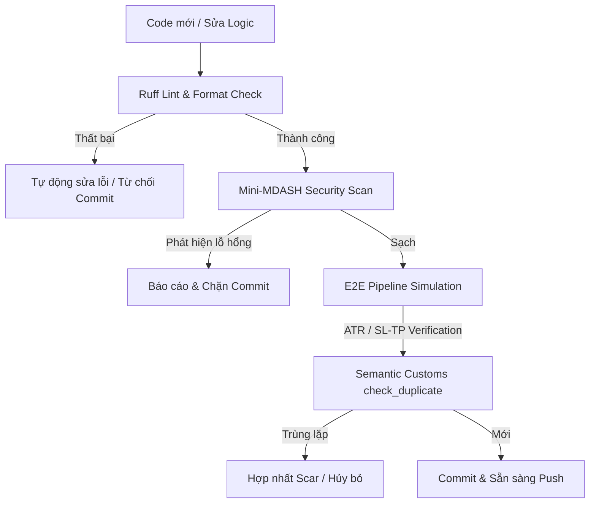
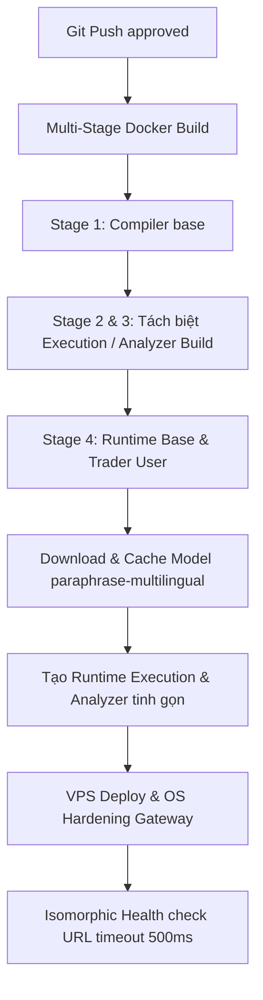

# Blueprint: Tách biệt Môi trường DEV -> PROD (Architect Gold - E5 Warning)
**Tác nhân:** Angati (Kiến trúc sư trưởng - Architect Gold)  
**Trạng thái:** Đề xuất / Đang xem xét  
**Mục tiêu:** Định hình ranh giới vật lý và logic giữa hai chu kỳ DEV và PROD, bịt kín các kẽ hở quy trình để đạt tiêu chuẩn **PRODUCTION GRADE** tối đa.

---

## I. Tầm Nhìn Chiến Lược: Dev -> Prod Separation

Trong hệ sinh thái lai trạng thái (Go-Python Hybrid Junction) của `TradingViewProject` và `Angati Daemon`, việc duy trì một môi trường duy nhất hoặc tách biệt không triệt để sẽ dẫn đến hiện tượng **Trôi Cấu Trúc (Cognitive Drift)** và **Bẫy Lỗi Đầu (First-Failure Trap)**.

> [!WARNING]
> **E5 Warning (Production Readiness Risk)**:  
> Việc chạy trực tiếp các lệnh Shell không được kiểm soát trên máy chủ production, nạp lại mô hình máy học (ML) lúc runtime, hoặc để lộ Stack Trace sẽ ngay lập tức vô hiệu hóa các bảo chứng an toàn của SEC-04. Chúng ta phải chia quy trình làm hai nửa độc lập tương đối nhưng đồng nhất về mặt giao thức (Isomorphic Contract).

---

## II. Phân Tích Hai Giai Đoạn Vận Hành

### 1. Giai Đoạn I: Dev Builder (Hộp Cát Kiểm Thử & Tự Động Hoá Tối Ưu)

Mục tiêu chính của Dev Builder là **Tự do phát triển nhưng Cưỡng chế an toàn** trước khi đẩy mã nguồn (pre-push).



#### Các thành phần cốt lõi của Dev Builder:
*   **Môi trường hộp cát (Sandbox Environment):**
    *   Chạy Binance Testnet thay vì Mainnet.
    *   Mô phỏng Server A và Server B thông qua mock server (`simulate_pipeline.py`) chạy trên localhost ports (`9101`, `9102`).
    *   Sử dụng SQLite `trades.db` cục bộ và ChromaDB phát triển độc lập.
*   **Hải quan Ngữ nghĩa (Deterministic Customs):**
    *   Mọi Scar hay tri thức phát sinh trong quá trình sửa lỗi (Self-Healing) phải vượt qua phép thử vector Qdrant (`check_duplicate` similarity > 0.90) để chống tràn ngập Issue (Issue Flooding).
*   **Tường lửa Tiền Kiểm (Pre-flight Pruning):**
    *   Chạy `local_security_gate.py check` trước khi commit để rà soát Ruff và kiểm tra an ninh tĩnh (Mini-MDASH).
    *   Xây dựng database CodeQL cục bộ bằng CLI (`codeql database create`) để bắt lỗi CWE-22 và CWE-209 trước khi đẩy lên Github Actions.

---

### 2. Giai Đoạn II: Prod Builder (Tối Ưu Hóa Trọng Tải & Độc Quyền Cơ Bắp)

Mục tiêu của Prod Builder là **Tối giản hóa diện tích tấn công (Attack Surface)**, triệt tiêu Cold Start của AI và bảo vệ các luồng thực thi cốt lõi (Protected Core).



#### Các thành phần cốt lõi của Prod Builder:
*   **Split-Image Architecture (Dockerfile Đa Tầng):**
    *   *Stage Base / Build:* Cài đặt compiler (`gcc`, `g++`) và BuildKit cache mount (`--mount=type=cache`) cho pip để tăng tốc tái dựng image.
    *   *Stage Runtime Execution:* Rất nhẹ, chỉ chứa python slim, dependencies chạy trade tối thiểu và file `execution_server.py`. Không chứa PyTorch hay SentenceTransformers.
    *   *Stage Runtime Analyzer:* Chứa PyTorch CPU và SentenceTransformers. Nạp sẵn model `paraphrase-multilingual-MiniLM-L12-v2` trực tiếp vào HuggingFace cache của Docker image trong quá trình build (`HF_HOME=/root/.cache/huggingface`). Điều này ngăn chặn hoàn toàn việc container tải model qua mạng khi khởi chạy trên production.
    *   *Đặc quyền tối thiểu (Least Privilege):* Container chạy dưới user `trader` không có quyền root, thư mục ghi tệp bị giới hạn nghiêm ngặt.
*   **Độc quyền Cơ bắp (Muscle Exclusivity):**
    *   Loại bỏ hoàn toàn khả năng mô hình LLM tự phịa các câu lệnh shell trên VPS. Mọi hành động chuyển trạng thái hệ thống phải được bọc trong lệnh Go-native compiled (`angati qa stage`).
*   **Cấu hình mạng & OS Hardening:**
    *   Tự động hóa cấu hình tường lửa UFW (chỉ mở SSH và mạng Tailscale).
    *   Chống brute-force bằng Fail2ban.
    *   Đồng bộ thời gian hệ thống qua Chrony NTP (sử dụng pool của Google/Cloudflare) để tránh sai lệch timestamp khi ký giao dịch Binance.
    *   Docker log rotation được cấu hình cứng (`max-size: 10m`, `max-file: 3`) để tránh treo I/O do đầy ổ cứng.

---

## III. Mảnh Ghép Còn Thiếu Để Đạt "PRODUCTION GRADE" Tối Đa (PRR Checklist)

Dưới đây là kết quả kiểm toán **Production Readiness Review (PRR)** chỉ ra những lỗ hổng (Gaps) hiện tại và giải pháp khắc phục bắt buộc để đạt điểm chất lượng tối đa:

| # | Lỗ Hổng Quy Trình (Process Gaps) | Giải Pháp Khắc Phục (PRR Remediation) | Mức Độ |
| :--- | :--- | :--- | :--- |
| **1** | **Bẫy phản ứng an ninh (GAP-1 & GAP-6)**: CodeQL chỉ chạy trên CI, phát hiện CWE muộn, lãng phí thời gian sửa lỗi sau khi push. | Tích hợp sâu CodeQL CLI / Semgrep quét cục bộ trong script `local_security_gate.py` ở chế độ deep scan (`--deep`). | 🔴 Cao |
| **2** | **Bỏ qua kiểm tra Lint tại local (GAP-2)**: Ruff không được tự động thực thi trước khi commit, dẫn đến commit rác chứa lỗi định dạng. | Kích hoạt bắt buộc `.pre-commit-config.yaml` thông qua `pre-commit install` trong script thiết lập dự án. | 🟡 Trung bình |
| **3** | **Không có Cổng Staging bắt buộc (GAP-3)**: Feature branch có thể merge trực tiếp vào `main` mà không cần deploy và Smoke Test thành công trên Staging. | Thiết lập GitHub Branch Protection Rule yêu cầu job `Staging Smoke Test` phải `Green` mới mở khóa nút Merge. | 🔴 Cao |
| **4** | **Thiếu phê duyệt độc lập (GAP-4)**: Tác giả tự tạo PR và tự merge. Thiếu đánh giá logic nghiệp vụ. | Thiết lập quy định Stacked Compliance: PR cần ít nhất 1 phê duyệt từ bot QA (Angati) và 1 phê duyệt từ con người (Human Architect). | 🔴 Cao |
| **5** | **Thiếu chỉ số sẵn sàng chất lượng (GAP-7)**: Dự án đánh giá merge chỉ dựa trên "CI Xanh", không đo lường kỹ thuật nợ (Tech Debt) và độ phủ test (Coverage). | Thiết lập chỉ số cứng: Độ phủ test không được giảm (Coverage Delta >= 0%), độ phức tạp hàm (Cyclomatic Complexity) <= 15. | 🟡 Trung bình |
| **6** | **Thiếu bằng chứng vận chuyển thực tế (Route Proof)**: Cơ chế Fallback tin tưởng vào thiết kế thay vì kiểm chứng vật lý của đường truyền. | Ép buộc mọi fallback pipeline (A2A) phải trình ra siêu dữ liệu thực tế (`route_verified=true`, HTTP status code, method JSON-RPC). | 🔴 Cao |
| **7** | **Thiếu giám sát ngắt kết nối (Network Telemetry)**: Không có cảnh báo thời gian thực khi cổng AI hoặc bot bị mất kết nối trên VPS. | Sử dụng Signal-Only Telemetry kết nối trực tiếp đến cổng sự kiện để cảnh báo qua Telegram tức thời khi phát hiện sự cố. | 🟡 Trung bình |

---

## IV. Đề Xuất Quy Trình Đột Phá Mới (Dev -> Staging -> Prod Pipeline)

Để tối ưu hóa chu kỳ phát triển và vận hành, hệ thống cần tuân thủ nghiêm ngặt mô hình đường ống (Pipeline) hội tụ sau:

```text
[DEV LOCAL] 
    └── Pre-commit: Ruff + Semgrep
    └── Pre-push: CodeQL Local (Deep Check)
          ↓ (Trực tiếp ngăn chặn đẩy code lỗi bảo mật lên repo)
[GITHUB CI / FEATURE BRANCH]
    └── Lint & Unit Tests Matrix
    └── Mini-MDASH Validation
          ↓ (Tự động chạy song song hai nhóm test: Fast & Browser)
[STAGING DEPLOYMENT GATE]
    └── Deploy to Staging Environment
    └── Execution of Automated Smoke Tests
          ↓ (Yêu cầu Route Proof & Isomorphic Health Check)
[CODE REVIEW & SIGN-OFF]
    └── Dual Approve: QA Bot Verification + Human Sign-off
    └── Technical Debt & Test Coverage delta audit
          ↓ (Thỏa mãn Stacked Compliance)
[PRODUCTION RELEASE]
    └── Docker Multi-stage packaging (Pre-baked ML models)
    └── OS-level Hardening (UFW, Fail2ban, Chrony, Log rotation)
```

---

> [!TIP]
> **Khuyến nghị kiến trúc (Architect Recommendation):**  
> Việc hiện thực hóa PRR không nằm ở việc viết thêm các quy tắc mô tả, mà nằm ở việc cấu hình các **Rào Cản Vật Lý (Structural Safety)**:
> 1. Thiết lập tệp cấu hình git hooks tự động.
> 2. Đóng gói toàn bộ cấu hình hạ tầng VPS thành các mã nguồn (Infrastructure as Code - IaC) trong thư mục `deploy/` để đồng nhất cấu hình giữa Staging và Production.
