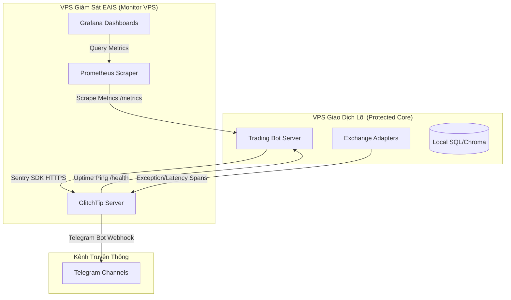

# Chiến lược Giám sát Vận hành: GlitchTip Observability Platform

Tài liệu này xác lập định hướng kiến trúc, nguyên tắc thiết lập và quy tắc vận hành cho nền tảng giám sát **GlitchTip** trong hệ sinh thái Angati (`TradingViewProject`), phục vụ giai đoạn vận hành tài khoản thực (Real-Money Trading).

---

## 1. Định vị Kiến trúc & Luồng Dữ liệu (Out-of-Band Observability)

Để bảo đảm tính độc lập vật lý và an toàn cao nhất, toàn bộ hệ thống giám sát được thiết kế theo mô hình **Out-of-Band (Ngoại băng)**:

### Nguyên tắc Phân tách Hạ tầng
1. **Sovereign Isolation (Cách ly SSoT):** 
   * VPS Giao dịch lõi chỉ thực thi các tác vụ giao dịch, quản trị rủi ro tại chỗ và ghi nhận dữ liệu vào cơ sở dữ liệu local.
   * VPS Giám sát (EAIS Monitor Server) gộp chung cả 3 vai trò: Prometheus (thu thập metrics), Grafana (hiển thị đồ thị) và GlitchTip (bắt lỗi và cảnh báo liveness).
2. **Zero Resource Contention (Không tranh chấp tài nguyên):**
   * VPS Giao dịch không chịu bất kỳ tải xử lý nào của hệ quản trị cơ sở dữ liệu giám sát (PostgreSQL/Redis của GlitchTip). Việc phân tích lỗi và lập chỉ mục (indexing) được thực hiện hoàn toàn trên Monitor VPS.

---

## 2. Chiến lược Bảo mật Dữ liệu (Data Scrubbing & Privacy)

Khi chạy tài khoản thực, telemetry không được phép làm rò rỉ thông tin tài khoản hoặc khóa giao dịch. Hệ thống áp dụng quy tắc tiền lọc nghiêm ngặt thông qua Sentry SDK `before_send` hook:

1. **Bộ lọc từ khóa nhạy cảm (Sensitive Keys):**
   * Tự động xóa hoặc thay thế bằng chuỗi `[SCRUBBED]` đối với các khóa: `api_key`, `secret`, `api_secret`, `passphrase`, `password`, `token`, `authorization`, và tất cả các khóa cấu hình sàn.
2. **Phân tích dấu vết đệ quy (Recursive Scrubbing):**
   * Quét toàn bộ HTTP Headers, Request Body, local variables trong stack trace, và breadcrumbs để triệt tiêu nguy cơ rò rỉ thông tin khóa API trong log sự kiện.
3. **Mã hóa địa chỉ IP:**
   * Cấu hình ẩn địa chỉ IP của VPS giao dịch lõi trong Sentry payload gửi đi, tránh lộ thông tin máy chủ trước các cuộc tấn công mạng.

---

## 3. Phân loại Mức độ Cảnh báo (Severity Triage Matrix)

Để tránh hiện tượng nhiễu cảnh báo (Alert Fatigue), các sự cố được phân loại thành 3 mức độ xử lý:

| Mức độ sự cố | Hiện tượng kích hoạt | Hành động của Hệ thống | Kênh cảnh báo |
| :--- | :--- | :--- | :--- |
| **FATAL** | - Circuit Breaker nhảy sang trạng thái `OPEN`.  - Lệnh OCO (SL/TP) bị lỗi khi đặt, có nguy cơ mồ côi vị thế (Orphan Position).  - Số dư tài khoản giảm dưới mức tối thiểu. | Tạm dừng nhận tín hiệu mới (Strict Stage Lock). | Telegram Alert (Cảnh báo đỏ) + Kênh khẩn cấp |
| **ERROR** | - Đặt lệnh MARKET/LIMIT thất bại do lỗi kết nối API sàn (`CONNECTION_ERROR`).  - Lỗi xác thực API Key / Auth.  - Bot Telegram tương tác bị sập ngầm. | Ghi nhận sự kiện lỗi, tự động định tuyến sang sàn failover (Bybit/Binance). | Sentry Event + Telegram Log |
| **WARNING** | - Hủy lệnh limit do trượt giá (slippage) quá thời gian 30s.  - Tỷ lệ trượt giá thực tế vượt ngưỡng 0.5%.  - Tỷ lệ gọi API tiệm cận giới hạn Rate Limit. | Tiếp tục vận hành bình thường, ghi nhận dấu vết (breadcrumb). | Sentry Warning |

---

## 4. Giám sát Sống/Chết (Liveness & Uptime Heartbeat)

GlitchTip đóng vai trò là chốt chặn cuối cùng kiểm tra trạng thái sống còn của VPS giao dịch thông qua:

1. **Uptime Monitor (Ping định kỳ):**
   * Monitor Server gửi yêu cầu HTTP GET tới `/health` của VPS giao dịch mỗi 60 giây.
   * Nếu VPS giao dịch không phản hồi trong 3 chu kỳ liên tiếp (180 giây), GlitchTip sẽ tự động phát tín hiệu **VPS OFFLINE** tới Telegram của quản trị viên.
2. **Heartbeat Monitor (Tác vụ định kỳ):**
   * Các tác vụ định kỳ của hệ thống (gửi Morning Brief lúc 07:00, Daily Report lúc 22:00) sẽ gửi một ping check-in tới GlitchTip khi hoàn tất.
   * Nếu tác vụ không hoàn thành đúng khung giờ quy định, GlitchTip báo lỗi trễ hạn tác vụ.

---

## 5. Kế hoạch Vận hành & Bảo trì Định kỳ (Maintenance Roadmap)

Để Monitor VPS hoạt động mượt mà lâu dài với chi phí tối thiểu (~$6 - $10/tháng), cần tuân thủ các quy tắc bảo trì sau:

1. **Giới hạn Lưu trữ Sự kiện (Retention Policy):**
   * Cấu hình GlitchTip chỉ lưu trữ tối đa **30 ngày** dữ liệu sự kiện (Events & Spans).
   * Các sự kiện cũ hơn sẽ tự động bị xóa (purged) để tránh đầy ổ cứng của Monitor VPS.
2. **Bảo trì Postgres định kỳ:**
   * Thiết lập lệnh `VACUUM` tự động cho cơ sở dữ liệu PostgreSQL của GlitchTip hàng tuần để tối ưu hóa không gian lưu trữ vật lý.
3. **Giám sát Dung lượng Đĩa:**
   * Cấu hình cảnh báo của hệ điều hành khi phân vùng chứa dữ liệu Docker của GlitchTip vượt quá **80%** dung lượng ổ đĩa.
