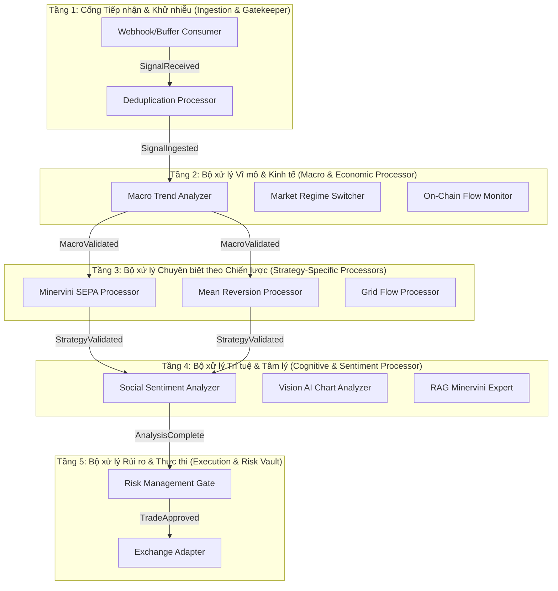

# Đề xuất Kiến trúc: Hệ thống Xử lý Tín hiệu Phi tập trung Đa tầng (Decentralized Multi-Layer Signal Processing Pipeline)

Tài liệu này đề xuất phương án cải tiến kiến trúc bộ xử lý tín hiệu đơn khối (`signal_processor.py`) hiện tại thành một chuỗi các bộ xử lý chuyên biệt độc lập (Decentralized Processors) hoạt động theo tầng, phục vụ cho các chiến lược giao dịch và phân tích kinh tế vĩ mô khác nhau, trong đó tất cả các tầng được kết nối và đồng bộ thông qua một trục truyền thông nhất quán.

---

## 1. Triết lý Thiết kế: Chia nhỏ Trách nhiệm (Separation of Concerns)

Hiện tại, `signal_processor.py` đang gánh vác quá nhiều vai trò: khử trùng lặp (dedup), kiểm tra khung thời gian, xác định trạng thái thị trường (regime), và lọc thô vĩ mô. Khi hệ thống mở rộng với nhiều chiến lược (Minervini SEPA, Mean Reversion, Grid Trading) và nhiều nguồn dữ liệu vĩ mô (chỉ số Dominance, On-chain, DXY), cấu trúc đơn khối này sẽ bị quá tải và trở nên rất khó bảo trì.

Kiến trúc mới đề xuất phân rã quy trình xử lý tín hiệu thành **5 Tầng Xử lý Chuyên biệt (Specialized Processor Layers)**:

---

## 2. Đặc tả Chi tiết các Tầng Xử lý

### Tầng 1: Cổng Tiếp nhận & Khử nhiễu (Ingestion & Gatekeeper)
*   **Nhiệm vụ:** Nhận payload từ Webhook hoặc VPS Buffer, xác thực chữ ký bảo mật (`WEBHOOK_SECRET`), chuẩn hóa dữ liệu đầu vào và thực hiện khử trùng lặp (Deduplication) dựa trên Cache Redis/SQLite.
*   **Mục tiêu:** Đảm bảo hệ thống không bị tấn công phát lại (replay attacks) hoặc bị nghẽn do bão tín hiệu trùng lặp.

### Tầng 2: Bộ xử lý Vĩ mô & Kinh tế (Macro & Economic Processor)
*   **Nhiệm vụ:** Đánh giá bối cảnh kinh tế vĩ mô và trạng thái thị trường chung:
    *   **Market Regime Switcher:** Xác định trạng thái thị trường (`TREND`, `CHOP`, `CRASH`).
    *   **Macro Trend Analyzer:** Xác định xu thế khung lớn (DXY, BTC Dominance, SPY) để xác định xem dòng vốn đang đổ vào hay rút ra khỏi tài sản rủi ro.
    *   **On-Chain Flow Monitor:** Theo dõi các luồng nạp/rút lên sàn, Funding Rate và Open Interest vĩ mô.
*   **Mục tiêu:** Ngăn chặn mở vị thế mới khi bối cảnh kinh tế vĩ mô không ủng hộ (ví dụ: không mua Altcoin khi BTC Dominance đang tăng dựng đứng và DXY tăng mạnh).

### Tầng 3: Bộ xử lý Chuyên biệt theo Chiến lược (Strategy-Specific Processors)
Hệ thống đăng ký nhiều bộ xử lý chiến lược chạy song song, mỗi bộ xử lý chỉ chịu trách nhiệm cho một tập hợp tín hiệu cụ thể:
1.  **Minervini SEPA Processor:** Kiểm tra tiêu chuẩn SEPA: Giá nằm trên EMA 150/200, độ tích lũy VCP đạt chuẩn, khối lượng giao dịch đột biến ở điểm breakout.
2.  **Mean Reversion Processor:** Kiểm tra xem giá có đang ở vùng quá mua/quá bán cực hạn của Bollinger Bands hay RSI để chuẩn bị cho lệnh đảo chiều.
3.  **Grid/Arbitrage Processor:** Xử lý các lệnh chênh lệch giá tốc độ cao.
*   **Mục tiêu:** Mỗi chiến lược có các tiêu chí thẩm định kỹ thuật riêng, hoạt động như các module cắm rút (pluggable processors).

### Tầng 4: Bộ xử lý Trí tuệ & Tâm lý (Cognitive & Sentiment Processor)
*   **Nhiệm vụ:** Tận dụng LLM và AI để thực hiện phân tích định tính:
    *   **Vision AI:** Nhìn biểu đồ trực quan để xác nhận mẫu hình (VCP, Cup and Handle) có đẹp và sạch hay không.
    *   **RAG Knowledge:** Truy vấn sách giáo khoa giao dịch để đối chiếu setup hiện tại với các case study lịch sử.
    *   **Social/News Sentiment:** Đo lường tâm lý đám đông trên X (Twitter) và RSS Feeds.
*   **Mục tiêu:** Cung cấp điểm số tự tin định tính và cảnh báo sớm về các tin tức thiên nga đen bất ngờ.

### Tầng 5: Bộ xử lý Rủi ro & Thực thi (Execution & Risk Vault)
*   **Nhiệm vụ:** Chốt chặn an toàn tài khoản trước khi gửi lệnh lên sàn:
    *   **Risk Engine:** Tính toán kích thước vị thế dựa trên biến động thực tế (ATR) và số dư khả dụng, kiểm tra giới hạn sụt giảm tài khoản hàng ngày (Daily Drawdown Cap).
    *   **Execution Vault:** Chia nhỏ lệnh (nếu lệnh lớn), đặt giá limit để giảm thiểu trượt giá (slippage), giám sát khớp lệnh và đặt ngay lệnh OCO (SL/TP) đi kèm để tránh vị thế mồ côi (Orphan Position).

---

## 3. Điểm Gắn kết: Trục Truyền thông Nhất quán (The Glue)

Để hệ thống không bị phân mảnh và giữ được tính nhất quán, 3 điểm gắn kết cốt lõi được áp dụng:

### 3.1. Trục Sự kiện Bất đồng bộ (Async Event Bus)
Các bộ xử lý không gọi trực tiếp lẫn nhau (loại bỏ liên kết chặt chẽ - tight coupling). Thay vào đó, chúng giao tiếp hoàn toàn qua **Event Bus** sử dụng các Event Class có cấu trúc định nghĩa trước:
*   `SignalReceived` $\rightarrow$ Kích hoạt Tầng 1.
*   `SignalIngested` $\rightarrow$ Kích hoạt Tầng 2.
*   `MacroValidated` $\rightarrow$ Kích hoạt Tầng 3.
*   `StrategyValidated` $\rightarrow$ Kích hoạt Tầng 4.
*   `AnalysisComplete` $\rightarrow$ Kích hoạt Tầng 5.

### 3.2. Sổ cái Trạng thái Đồng nhất (Unified State Ledger)
Một bản ghi duy nhất được tạo ra trong SQLite (`trades.db`) hoặc Redis ngay khi tín hiệu đi vào Tầng 1. Bản ghi này có thuộc tính `state` (ví dụ: `INGESTED`, `MACRO_PASSED`, `STRATEGY_FAILED`, `COMPLETED`).
*   Mỗi bộ xử lý ghi nhận kết quả phân tích của mình vào trường tương ứng của bản ghi này (`macro_data`, `strategy_metadata`, `sentiment_score`).
*   Giúp dễ dàng truy vết (audit trail) lý do một tín hiệu bị từ chối ở bất kỳ tầng nào.

### 3.3. Bối cảnh Nhận thức Di động (Cognitive Session Context)
Một payload JSON chung (Context) được truyền dọc theo chuỗi sự kiện. Khi sự kiện đi qua mỗi bộ xử lý, bộ xử lý đó "đóng dấu" và bổ sung các thông tin phân tích của mình vào Context này. 
*   Ví dụ: Tầng vĩ mô bổ sung: `{"macro_trend": "bullish", "regime": "TREND"}`.
*   Tầng chiến lược bổ sung: `{"sepa_passed": true, "vcp_quality": 85}`.
*   Lớp tâm lý bổ sung: `{"sentiment_score": 0.75}`.
*   Đến tầng cuối cùng (Execution), hệ thống có toàn bộ bức tranh quyết định để tính toán mức độ rủi ro tối ưu nhất.
