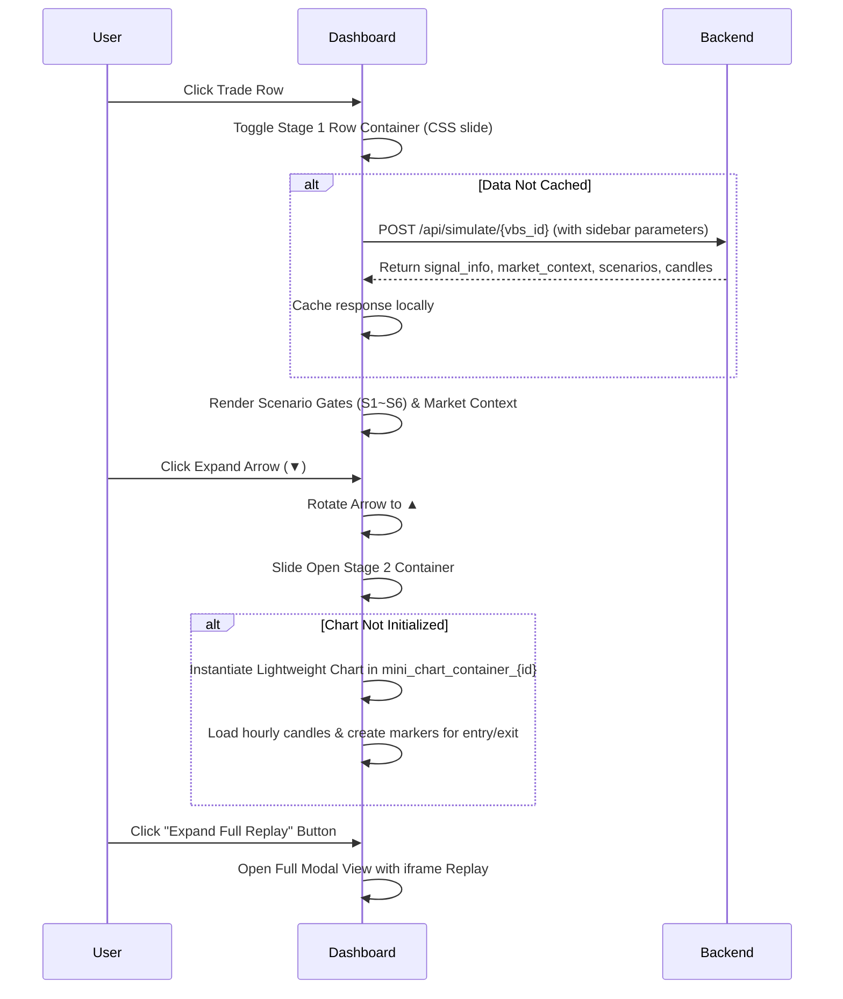

# Implementation Plan: V2.3 Trade Log & Expandable Row Integration

This plan describes the proposed UI/UX upgrades for the V6 VBS Strategy Backtest Dashboard. It addresses layout misalignment under small zoom levels, updates the system versioning to V2.3, and adds a multi-stage expandable row layout to the Trade Execution Log using interactive Lightweight Charts.

---

## User Review Required

> [!IMPORTANT]
> **Key Architecture Decisions:**
> 1. **Zero-Click Reflex Alignment**: The expandable row UI will be styled using the HSL-based dark glassmorphic styles defined in `/eais-design-swarm`. It will match the existing palette of `#0b0e14` and `#c084fc`.
> 2. **Double-Expansion Workflow**: 
>    - **Stage 1 (Click Row)**: Dynamically fetches signal context via `/api/simulate/{vbs_id}` (synchronized with custom parameters from the sidebar) and renders a clean breakdown of S1 ~ S6 execution states and Daily Market Context.
>    - **Stage 2 (Click Arrow)**: Instantiates a mini-chart (height: `220px`) inside the row to illustrate the precise entry and exit locations.
> 3. **Performance Optimization**: Mini-charts will be lazily initialized only when Stage 2 is expanded, preventing browser lagging when scrolling a long list of trades.

## Open Questions

> [!NOTE]
> **1. API Versioning Alignment**:
> The UI is being upgraded to denote "V2.3". We propose mapping `/api/v23/*` endpoints (like `/api/v23/aggregate`, `/api/v23/equity`, `/api/v23/trades`) to the existing V2.2 backend handlers as aliases to ensure semantic versioning consistency, while maintaining full backward compatibility. Do you agree with this approach?
>
> **2. Mini Chart Timeframe**:
> For the Stage 2 mini-charts, do you want to show the **1-hour hourly candles** (same as the main candlestick replay chart), or do you want to show **daily candles** for a higher-level view? (We recommend 1-hour candles as it matches the exact entry/exit bars).

---

## Proposed Changes

### 1. Dashboard Layout & Styling

#### [MODIFY] [backtest_dashboard.html](file:///c:/Users/pesil/working/mj_trading/TradingViewProject/nerves/workers/trading/static/backtest_dashboard.html)

* **Real Metrics Card Alignment Fix**:
  - Update `.kpi-metric-item` to use `display: flex; flex-direction: column; align-items: flex-start;` so that labels (`.k`) and values (`.v`) stack vertically instead of wrapping into adjacent grid columns.
  - Update `.v22-kpi-strip` to use `grid-template-columns: repeat(auto-fit, minmax(180px, 1fr));` to allow cards to wrap nicely if the viewport is narrow.
  
* **Version Upgrade**:
  - Replace occurrences of "V2.2" with "V2.3" in the headers, labels, and text descriptions to denote the log upgrade.
  
* **Expandable Row UI Implementation**:
  - Modify the `renderV22Trades` function to insert a hidden row `<tr class="expand-detail-row" id="expand_row_${t.vbs_id}" style="display:none;">` directly beneath each trade row.
  - Attach a click listener to each trade row `tr` (excluding clicks on the VBS ID `<a>` tag) to toggle the Stage 1 expansion.
  
* **HTML Structure of the Expandable Row**:
  ```html
  <tr class="expand-detail-row" id="expand_row_${vbs_id}" style="display: none; background: rgba(20, 26, 38, 0.4);">
      <td colspan="10" style="padding: 0; border-bottom: 1px solid var(--panel-border);">
          <div class="expand-container" style="padding: 16px; display: flex; flex-direction: column; gap: 16px;">
              <!-- Stage 1 Content: Gates & Context -->
              <div class="stage-1-grid" style="display: grid; grid-template-columns: 1.2fr 1fr; gap: 20px;">
                  <!-- Left: Scenario Gates -->
                  <div class="gates-column">
                      <div class="expand-section-title">Scenario Validation Gates (S1 ~ S6)</div>
                      <div class="scenario-mini-grid" id="mini_scenarios_${vbs_id}">
                          <!-- Dynamic scenario cards with Executed/Filtered badges -->
                      </div>
                  </div>
                  <!-- Right: Market Context -->
                  <div class="context-column">
                      <div class="expand-section-title">Daily Market Context at Entry</div>
                      <div class="context-mini-grid" id="mini_context_${vbs_id}">
                          <!-- Metrics like RSI, MACD, Volume Ratio, ATR -->
                      </div>
                  </div>
              </div>
              
              <!-- Divider with dynamic down arrow -->
              <div class="expand-arrow-divider" style="display: flex; justify-content: center; align-items: center; border-top: 1px solid rgba(42, 58, 89, 0.2); padding-top: 8px; margin-top: 8px;">
                  <button class="arrow-btn" onclick="toggleStage2(event, ${vbs_id})" style="background: none; border: none; color: var(--text-muted); cursor: pointer; padding: 4px 16px; transition: color 0.2s;">
                      <span class="arrow-icon" id="arrow_icon_${vbs_id}" style="display: inline-block; transition: transform 0.2s ease;">▼</span>
                  </button>
              </div>
              
              <!-- Stage 2 Content: Interactive mini chart -->
              <div class="stage-2-container" id="stage_2_${vbs_id}" style="display: none; flex-direction: column; gap: 12px; margin-top: 8px;">
                  <div style="display: flex; justify-content: space-between; align-items: center;">
                      <div class="expand-section-title">Hourly Candlestick Replay</div>
                      <button class="nav-link-btn" onclick="openReplayModal(${vbs_id})" style="padding: 4px 12px; font-size: 11px;">
                          <span>🎬 Expand Full Replay</span>
                      </button>
                  </div>
                  <div id="mini_chart_container_${vbs_id}" style="width: 100%; height: 220px; border-radius: 8px; overflow: hidden; background: #131722;"></div>
              </div>
          </div>
      </td>
  </tr>
  ```

* **Javascript Interactive Logic**:
  - Add `toggleTradeRow(vbsId)`: Toggles Stage 1 expansion. If expanding, checks if data has been fetched. If not, fetches `/api/simulate/{vbsId}` using the active parameters from the sidebar. Renders Stage 1 metadata.
  - Add `toggleStage2(event, vbsId)`: Toggles the Stage 2 mini chart. Rotates the arrow icon (`▼` to `▲`). Lazily creates the Lightweight Chart instance using the cached candle data, adding the BUY/SELL and Exit markers to the mini series.

---

### 2. Design Visualizations

Below is a sequence diagram representing the double-expansion interactive flow:



---

## Verification Plan

### Automated Verification
- Verify that there are no Javascript runtime errors when loading the page and interacting with the rows.
- Ensure that the FastAPI health endpoint `/health` remains fully responsive.

### Manual Verification
- Open the dashboard at `http://localhost:9109/?t=12345` under a narrow browser window or zoomed state to verify that the KPI metrics line up perfectly.
- Expand a row in the Trade Execution Log to check:
  1. If S1 ~ S6 executability cards and reasons are displayed correctly.
  2. If the dynamic down arrow functions correctly.
  3. If the mini Lightweight Chart renders with high visual fidelity, showing markers for entry and exit.
  4. If clicking "Expand Full Replay" opens the modal popup correctly.
