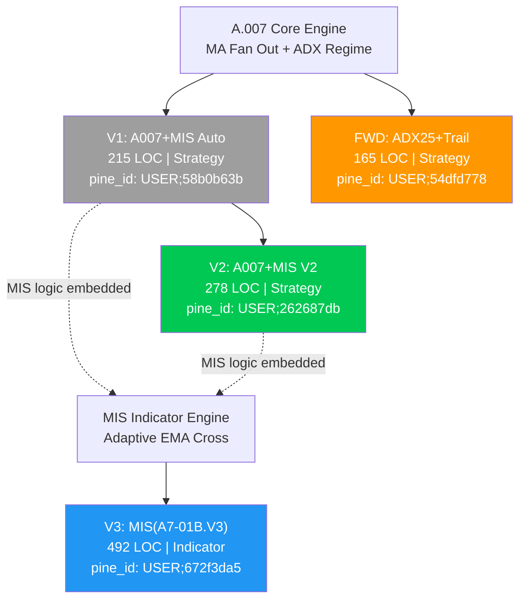
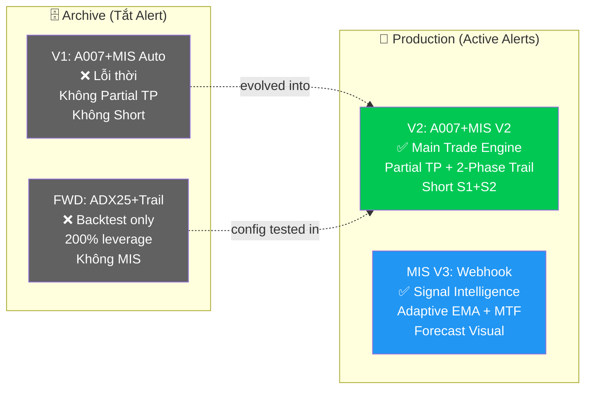

# 🧬 Gia Hệ A.007: V1 → FWD → V2 + MIS(A7-01B.V3)

## Cây Tiến Hoá (Evolution Tree)



---

## 📊 Ma Trận So Sánh Toàn Bộ (4 Scripts)

### A. Entry Logic — AI SO SÁNH TỪ SOURCE CODE

| Dimension | V1 (215 LOC) | FWD (165 LOC) | V2 (278 LOC) | MIS V3 (492 LOC) |
|-----------|-------------|---------------|-------------|-----------------|
| **Loại** | `strategy()` v5 | `strategy()` v5 | `strategy()` v5 | `indicator()` v6 |
| **Lõi A.007** | ✅ `bull_start` | ✅ `bull_start` | ✅ `bull_start` | ❌ Không có |
| **Lõi MIS** | ✅ EMA+RSI+MACD+Vol | ❌ Không có | ✅ EMA+RSI+MACD+Vol | ✅ Adaptive EMA Cross |
| **Combo mode** | `require_both` | — (chỉ A.007) | `require_both` | — (chỉ MIS) |

#### Chi tiết Entry Conditions:

**V1 Long Entry:**
```pine
a007 = bull_start AND slope_ok AND trending(ADX>20) AND no_squeeze(BB>5%) AND volexp_ok
mis  = EMA20>50>200 AND RSI(50-70) AND MACD_cross_up AND Vol>SMA(20)*1.5
long = require_both ? (a007 AND mis) : (a007 OR mis)
```

**FWD Long Entry (Simplified A.007 only):**
```pine
entry_ok = bull_start AND slope_ok AND trending(ADX>25) AND no_squeeze AND volexp_ok
// Không có MIS — chỉ A.007 thuần với ADX siết chặt hơn (25 vs 20)
```

**V2 Long Entry (= V1 + improvements):**
```pine
// Giống hệt V1 về entry logic
a007 = bull_start AND slope_ok AND trending(ADX>20) AND no_squeeze AND volexp_ok
mis  = EMA20>50>200 AND RSI(50-70) AND MACD_cross_up AND Vol>SMA(20)*1.5
long = require_both ? (a007 AND mis) : (a007 OR mis)
// Thêm: Date Range filter + position check
long_entry = long_entry_raw AND in_window AND strategy.position_size <= 0
```

**MIS V3 Long Entry (Hoàn toàn khác):**
```pine
longCondition = ta.crossover(adaptiveFastEMA, adaptiveSlowEMA) AND barstate.isconfirmed
// adaptiveFast: 5m→5, 15m→8, 1H→20
// adaptiveSlow: 5m→13, 15m→21, 1H→50
// Không cần ADX, Volume, MACD, BB — chỉ 2 EMA cắt nhau
```

---

### B. Exit Logic

| Exit Type | V1 | FWD | V2 | MIS V3 |
|-----------|:--:|:---:|:--:|:------:|
| **Bull End** (MA fan collapse) | ✅ | ✅ | ✅ | ❌ |
| **ATR Trail** (ratchet up) | ✅ `2.5×` cố định | ✅ `2.5×` cố định | ✅ `2.5×`→`1.0×` sau TP1 | ✅ `1.5×` cố định |
| **Time Stop** (max hold bars) | ✅ 20 bars | ⚠️ OFF default | ✅ 20 bars | ❌ |
| **MIS SL** (ATR-based) | ✅ `ATR×2.0` | ❌ | ❌ (thay bằng Partial TP) | ✅ 3 modes |
| **EMA Cross ngược** | ❌ | ❌ | ❌ | ✅ `close < fastEMA` |
| **Partial TP** | ❌ | ❌ | ✅ **50% @ +1R** | ❌ |
| **Date Range** | ❌ | ✅ (OFF default) | ✅ | ❌ |

> [!IMPORTANT]
> **V2 tiến hoá quan trọng nhất so với V1:** Chiến lược **2-Phase Trail**.
> - Trước TP1: Trail `ATR × 2.5` (lỏng, cho price chạy)
> - Sau TP1 (đã chốt 50%): Trail siết xuống `ATR × 1.0` (bảo vệ lợi nhuận phần còn lại)
>
> V1 và FWD đều dùng trail cố định `2.5×` suốt vòng đời trade → dễ bị quét stop trước khi TP.

---

### C. Short Logic

| | V1 | FWD | V2 | MIS V3 |
|---|:--:|:---:|:--:|:------:|
| **Short có?** | ❌ **KHÔNG** | ❌ **KHÔNG** | ✅ **CÓ** | ✅ **CÓ** |
| **Điều kiện** | — | — | S1+S2 Dual Confirm | EMA Cross Down (đơn giản) |
| **S1** | — | — | RSI↓70 + Bearish bar + Bull>30 bars | — |
| **S2** | — | — | FastMA↓MedMA + Bull>30 bars | — |
| **Combo** | — | — | S1 recent(5 bars) **AND** S2 recent | — |
| **SL** | — | — | ATR × 1.5 | ATR × 2.0 (configurable) |
| **TP** | — | — | ATR × 2.0 | RRR × SL (3.5:1 default) |
| **Max hold** | — | — | 15 bars | Unlimited |

> [!TIP]
> V2 Short cực kỳ an toàn: yêu cầu **market đã bull ≥ 30 bars** trước (chỉ short "đỉnh đã chín"), rồi cần **2 tín hiệu xác nhận** trong khoảng 5 bars gần nhau. MIS V3 short bất kỳ lúc nào EMA cross → rủi ro hơn.

---

### D. Risk Management

| | V1 | FWD | V2 | MIS V3 |
|---|---|---|---|---|
| **SL Mode** | Fixed ATR×2.0 | Chỉ Trail | 2-Phase Trail | 3 modes (ATR/Fixed/%) |
| **TP Mode** | ATR×3.0 (hardcoded) | Không có TP | Partial TP @ +1R | Fixed RRR hoặc Trailing |
| **RRR Preset** | ~1.5:1 | — | ~1.0:1 (TP1) + trail | Scalp/Cons/Std/**Aggressive 3.5:1** |
| **Partial Close** | ❌ | ❌ | ✅ 50% @ TP1 | ❌ |
| **Trail tightening** | ❌ | ❌ | ✅ 2.5× → 1.0× | ❌ |
| **Position sizing** | % of equity | % of equity (200%!) | % of equity | N/A (indicator) |

> [!WARNING]
> **FWD dùng `manual_qty = 200%`** — đây là cấu hình backtest cực aggressive (leverage 2x). KHÔNG nên dùng cho Production.

---

### E. Webhook / Payload

| | V1 | FWD | V2 | MIS V3 |
|---|---|---|---|---|
| **Có alert()?** | ❌ Không | ❌ Không | ✅ 4 alerts | ✅ 4 alerts |
| **Payload format** | — | — | Raw JSON (manual) | VBS_Webhook_Lib (structured) |
| **`source` field** | — | — | ❌ Không gửi | ✅ `"indicator"` |
| **`indicator_name`** | — | — | ❌ Không gửi | ✅ `"MIS(A7-01B.V3)"` |
| **Server Pipeline** | — | — | → `SignalReceived` → Trade | → `IndicatorSignalReceived` → Dashboard |
| **SL/TP trong payload** | — | — | ❌ Không | ✅ Có (metadata) |
| **Confidence Score** | — | — | ❌ Không | ✅ 85 (configurable) |

---

### F. Visual Features

| | V1 | FWD | V2 | MIS V3 |
|---|---|---|---|---|
| **MA Ribbon** | ✅ 3-MA + Bull Fill | ✅ 3-MA + Bull Fill | ✅ 3-MA + Bull Fill | ✅ 2-EMA Adaptive |
| **MIS EMAs** | ✅ 20/50/200 | ❌ | ✅ 20/50/200 | ❌ (dùng adaptive) |
| **MTF Daily** | ❌ | ❌ | ❌ | ✅ EMA 20/50 Daily |
| **MTF 1H** | ❌ | ❌ | ❌ | ✅ EMA 20/50 1H |
| **Trail line** | ✅ | ✅ | ✅ | ✅ |
| **TP1 target** | ❌ | ❌ | ✅ Circles | ✅ Line + Label |
| **Forecast Zones** | ❌ | ❌ | ❌ | ✅ Box (green/red) |
| **Sideway warning** | ✅ bgcolor | ✅ bgcolor | ✅ bgcolor | ❌ |
| **BB Squeeze** | ✅ bgcolor | ✅ bgcolor | ✅ bgcolor | ❌ |
| **Status Table** | ✅ 8-row | ✅ 7-row | ❌ | ✅ 9-row |
| **Filtered signals** | ❌ | ✅ Gray X | ❌ | ❌ |

---

## 🎯 Tổng Kết: Vai Trò Từng Script



| Script | Vai trò | Alert? | Lý do |
|--------|---------|--------|-------|
| **V1** | 🗄️ Archive | ❌ Xoá | V2 thay thế hoàn toàn, thêm Partial TP + Short |
| **FWD** | 🗄️ Archive | ❌ Không cài | Chỉ dùng backtest (200% leverage, không MIS) |
| **V2** | 🚀 **Main Trade** | ✅ Active | Phiên bản hoàn chỉnh nhất: 10 filters + 2-phase trail + short S1+S2 |
| **MIS V3** | 🔭 **Signal Radar** | ✅ Active | Tín hiệu sớm + visual forecast + MTF reference |

---

## ⚡ Điểm Setup Khác Biệt Quan Trọng (Settings)

| Setting | V1 | FWD | V2 | MIS V3 |
|---------|:--:|:---:|:--:|:------:|
| **ADX Threshold** | 20 | **25** 🔺 | 20 | — |
| **BB Squeeze** | ✅ ON | ❌ **OFF** | ✅ ON | — |
| **Time Stop** | ✅ 20 bars | ❌ **OFF** | ✅ 20 bars | — |
| **Trail ATR mult** | 2.5 | 2.5 | **2.5 → 1.0** 🔺 | 1.5 |
| **Qty Override** | ❌ (10%) | ✅ **(200%!)** 🔺 | ❌ (10%) | — |
| **Slope filter** | ❌ | ❌ | ❌ | — |
| **Vol expanding** | ❌ | ❌ | ❌ | — |
| **EMA lengths** | Fixed 20/50/100 | Fixed 20/50/100 | Fixed 20/50/100 | **Adaptive** (TF-based) |
| **SL Mode** | ATR×2.0 only | Trail only | 2-Phase | **3 modes** |
| **RRR** | ~1.5:1 | — | 1.0:1 (TP1) | **3.5:1** (preset) |
| **Webhook** | ❌ | ❌ | ✅ Raw JSON | ✅ VBS_Webhook_Lib |
| **Short** | ❌ | ❌ | ✅ S1+S2 | ✅ Simple cross |

> [!NOTE]
> **FWD là "cấu hình chiến thắng" từ backtest** (ADX 25, BB OFF, Time Stop OFF, 200% qty). Những insights này đã được **nhúng một phần vào V2** nhưng giữ conservative hơn cho production (ADX 20, BB ON, 10% qty).
