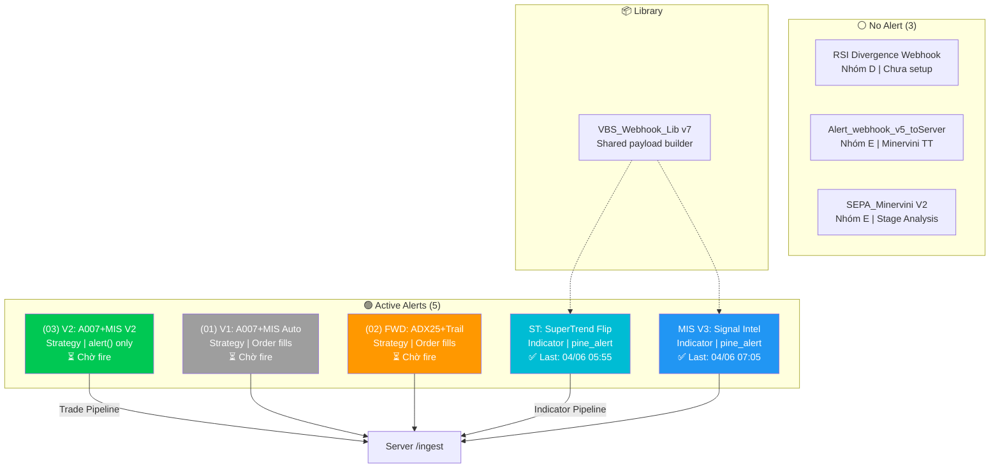
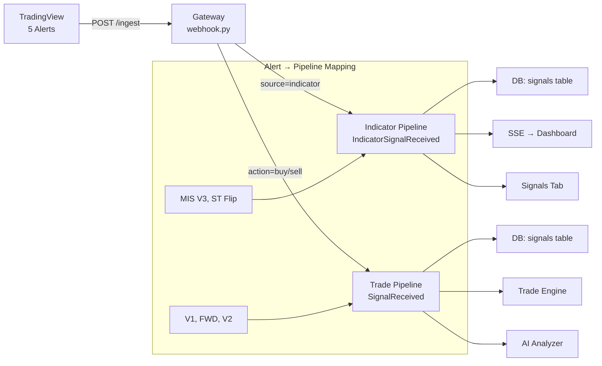

# 📊 TradingView Signal Architecture — Full Analysis (9 Scripts / 5 Groups)

> **Symbol:** BINANCE:BTCUSDT | **Timeframe:** 5m | **Server:** `https://trading.utopiavn.co/ingest`
> **Date:** 2026-06-04 | **Active Alerts:** 5/9 | **TradingView Alert Quota:** Limited

---

## 1. Inventory — 9 Scripts

| # | Script Name | Pine ID | Type | Version | LOC | Nhóm |
|---|------------|---------|------|---------|-----|------|
| 1 | A.007 + MIS v1 Combined | `USER;58b0b63b` | Strategy v5 | 33.0 | 215 | A+B |
| 2 | A.007 FWD (ADX25+Trail) | `USER;54dfd778` | Strategy v5 | 51.0 | 165 | A |
| 3 | A.007 + MIS v2 Combined | `USER;262687db` | Strategy v5 | 7.0 | 278 | A+B |
| 4 | MIS(A7-01B.V3) Webhook | `USER;672f3da5` | Indicator v6 | 14.0 | 492 | B* |
| 5 | SuperTrend Flip Webhook | `USER;fdfb43e5` | Indicator v6 | 9.0 | 182 | C |
| 6 | RSI Divergence Webhook | `USER;0b24eb3f` | Indicator | 3.0 | — | D |
| 7 | Alert_webhook_v5_toServer | `USER;c4b4e2c6` | Indicator | 4.0 | — | E |
| 8 | SEPA_Minervini V2 | `USER;328536aa` | Strategy | 3.0 | — | E |
| 9 | VBS_Webhook_Lib | `USER;b5340585` | Library v7 | 7.0 | — | Shared |

> **B*:** MIS V3 dùng Adaptive EMA Cross — khác logic "classic MIS" (EMA20>50>200+RSI+MACD+Vol) trong V1/V2.

---

## 2. Phân Nhóm Chi Tiết (5 Groups)

### Nhóm A: A.007 — MA Crossover + ADX Regime Filter

```
Entry: bull_start = (FastMA > MedMA > SlowMA) lần đầu tiên
Filters: ADX > threshold + BB Width ≥ 5% + (optional) Slope + VolExp
Exit: bull_end (MA collapse) OR ATR Trail OR Time Stop
```

| Thuộc tính | V1 | FWD | V2 |
|-----------|:--:|:---:|:--:|
| MA Type | EMA (configurable) | EMA (configurable) | EMA (configurable) |
| Fast/Med/Slow | 20/50/100 | 20/50/100 | 20/50/100 |
| ADX Threshold | **20** | **25** 🔺 | **20** |
| BB Squeeze Block | ✅ ON | ❌ OFF | ✅ ON |
| Time Stop | ✅ 20 bars | ❌ OFF | ✅ 20 bars |
| Slope Filter | ❌ | ❌ | ❌ |
| Vol Expanding | ❌ | ❌ | ❌ |
| **Đặc biệt** | Baseline | Backtest winner config | + Partial TP + 2-Phase Trail |

**Overlap:** V1 ⊂ V2 (V2 là superset của V1, thêm Partial TP + Short S1+S2)

---

### Nhóm B: MIS — Multi-Indicator Signal

Có **2 phiên bản logic hoàn toàn khác nhau:**

#### B1: Classic MIS (nhúng trong V1 & V2)
```
Entry: EMA20 > EMA50 > EMA200
     + RSI ∈ (50, 70)
     + MACD Cross Up
     + Volume > SMA(20) × 1.5
```
- Yêu cầu **4 điều kiện** cùng true
- Tần suất tín hiệu: **Rất thấp** (đặc biệt khi combo với A.007 `require_both=true`)

#### B2: Adaptive MIS (MIS V3 — Indicator độc lập)
```
Entry: ta.crossover(adaptiveFastEMA, adaptiveSlowEMA)
       + barstate.isconfirmed
```
- EMA tự điều chỉnh theo timeframe: 5m→(5,13), 15m→(8,21), 1H→(20,50)
- Tần suất tín hiệu: **Cao** (chỉ cần 2 EMA cắt nhau)
- Thêm: MTF Daily/1H EMA, Forecast Zones, 3-mode SL, RRR Presets

**Overlap:** B1 ≠ B2 (logic khác hoàn toàn, không trùng lặp)

---

### Nhóm C: SuperTrend Flip + Market Regime

```
Entry: ta.change(stDir) < 0 (Bull Flip)
     + Volume Filter (optional, OFF)
     + RSI Zone 30-70 (optional, ON)
     + Market Regime: ADX > 20 AND close > EMA200
Exit:  ta.change(stDir) > 0 (Bear Flip)
```
- **SuperTrend:** Period=7, Mult=3.5 (Walk-Forward optimized)
- **SL:** ATR × 1.5 | **TP:** RRR × SL (default 2.0)
- Dùng `VBS_Webhook_Lib` để build payload chuẩn
- **Hoàn toàn độc lập** — không dùng MA Crossover hay MACD

---

### Nhóm D: RSI Divergence (Momentum Oscillator)

```
Entry: Phát hiện Regular/Hidden Divergence giữa Price và RSI
       (Price tạo Higher High nhưng RSI tạo Lower High → Bearish Divergence)
```
- Logic: So sánh Pivot High/Low của giá vs RSI qua Lookback period
- **Hoàn toàn độc lập** — không dùng MA, SuperTrend, hay Volume
- **Trạng thái:** Chưa từng fire (4 ngày) → Có thể cần điều chỉnh thông số Lookback

---

### Nhóm E: Minervini SEPA / VCP (Stage Analysis)

```
SEPA Criteria (Mark Minervini's Trend Template):
  - Price > SMA150 > SMA200
  - SMA200 trending up ≥ 1 tháng
  - Price ≥ 25% above 52-week low
  - Price within 25% of 52-week high
  - RS Rating ≥ 70
VCP (Volatility Contraction Pattern):
  - Giảm dần biên độ dao động qua các base
```
- **2 scripts:** `Alert_webhook_v5_toServer` (Indicator) + `SEPA_Minervini V2` (Strategy)
- Thiết kế cho **Stock screening** (cổ phiếu), chưa rõ mức độ phù hợp với Crypto 5m
- **Hoàn toàn độc lập** — dựa trên Stage Analysis, không dùng MA Crossover hay RSI Divergence

---

## 3. Ma Trận Trùng Lặp (Overlap Matrix)

|  | V1 | FWD | V2 | MIS V3 | ST Flip | RSI Div | SEPA |
|--|:--:|:---:|:--:|:------:|:------:|:------:|:----:|
| **V1** | — | 🔴 80% | 🔴 95% | 🟡 30% | 🟢 0% | 🟢 0% | 🟢 0% |
| **FWD** | 🔴 80% | — | 🔴 70% | 🟢 0% | 🟢 0% | 🟢 0% | 🟢 0% |
| **V2** | 🔴 95% | 🔴 70% | — | 🟡 30% | 🟢 0% | 🟢 0% | 🟢 0% |
| **MIS V3** | 🟡 30% | 🟢 0% | 🟡 30% | — | 🟢 0% | 🟢 0% | 🟢 0% |
| **ST Flip** | 🟢 0% | 🟢 0% | 🟢 0% | 🟢 0% | — | 🟢 0% | 🟢 0% |
| **RSI Div** | 🟢 0% | 🟢 0% | 🟢 0% | 🟢 0% | 🟢 0% | — | 🟢 0% |
| **SEPA** | 🟢 0% | 🟢 0% | 🟢 0% | 🟢 0% | 🟢 0% | 🟢 0% | — |

**Ghi chú:**
- 🔴 80-95%: V1/FWD/V2 trùng lặp nặng (cùng lõi A.007)
- 🟡 30%: MIS V3 chia sẻ "MIS" trong tên nhưng logic khác hoàn toàn
- 🟢 0%: Hoàn toàn độc lập

---

## 4. Webhook Payload — So Sánh Format

### Strategy Alerts (V1, FWD, V2) — Manual JSON Template
```json
{
  "secret": "7086c59c...89104",
  "action": "{{strategy.order.action}}",
  "symbol": "{{ticker}}",
  "price": "{{close}}",
  "quoteQty": "{{strategy.order.contracts}}",
  "interval": "{{interval}}",
  "position_size": "{{strategy.position_size}}",
  "signal": "V1_A007MIS_AUTO"
}
```
→ Server: `is_indicator = false` → **SignalReceived** → Trade Pipeline

### V2 Built-in alert() — Raw JSON (hardcoded in Pine)
```json
{
  "secret": "7086c59c...89104",
  "action": "buy",
  "symbol": "BTCUSDT",
  "price": 63266.38,
  "quoteQty": 12.5,
  "interval": "5",
  "signal": "A007+MIS_LONG"
}
```
→ Server: `is_indicator = false` → **SignalReceived** → Trade Pipeline

### Indicator Alerts (MIS V3, ST Flip) — VBS_Webhook_Lib
```json
{
  "secret": "7086c59c...89104",
  "source": "indicator",
  "indicator_name": "MIS(A7-01B.V3)",
  "symbol": "BTCUSDT",
  "action": "buy",
  "signal_type": "entry",
  "direction": "long",
  "price": 63266.38,
  "interval": "5",
  "exchange": "binance",
  "confidence_score": 85,
  "metadata": {
    "atr_value": 450.2,
    "sl": 62365.8,
    "tp": 66416.7,
    "trail_stop": 62590.7
  }
}
```
→ Server: `is_indicator = true` → **IndicatorSignalReceived** → Dashboard Signals Tab

---

## 5. TradingView Alert Quota — Chiến Lược Phân Bổ

> [!WARNING]
> TradingView giới hạn số lượng Alert theo gói:
> - **Basic:** 2 alerts
> - **Essential:** 20 alerts  
> - **Plus:** 100 alerts
> - **Premium:** 400 alerts
> 
> Hiện tại bạn đang có **5 active alerts**. Nếu gói của bạn giới hạn, hãy ưu tiên theo bảng dưới.

### Xếp Hạng Ưu Tiên (Nếu phải cắt giảm)

| Priority | Alert | Nhóm | Lý do giữ |
|:--------:|-------|------|-----------|
| **P1** ⭐ | V2: A007+MIS V2 | A+B | Main Trade Engine — phiên bản hoàn chỉnh nhất |
| **P2** ⭐ | MIS V3: Webhook | B* | Signal Intelligence — tần suất cao, visual đẹp, dashboard |
| **P3** | ST: SuperTrend Flip | C | Confirmation độc lập — logic khác hoàn toàn |
| **P4** | FWD: ADX25+Trail | A | Backtest winner config (ADX 25) — so sánh signal quality |
| **P5** | V1: A007+MIS Auto | A+B | Archive — V2 thay thế hoàn toàn |
| **P6** | RSI Divergence | D | Chưa hoạt động — cần tune thông số |
| **P7** | SEPA/VCP | E | Thiết kế cho cổ phiếu — cần validate cho Crypto |

### Kịch Bản Theo Quota

| Quota | Giữ lại | Bỏ |
|:-----:|---------|-----|
| **2 alerts** | V2 + MIS V3 | Tất cả còn lại |
| **5 alerts** | V2 + MIS V3 + ST Flip + FWD + V1 | RSI Div, SEPA |
| **7+ alerts** | Giữ tất cả + thêm RSI Div + SEPA | — |

---

## 6. Trạng Thái Hiện Tại (5 Active Alerts)



---

## 7. Server Pipeline — Cách Gateway Xử Lý Tín Hiệu



| Alert Source | Pipeline | Hành động Server |
|-------------|----------|-----------------|
| V1, FWD, V2 (Strategy) | **Trade Pipeline** | Insert signal → Emit `SignalReceived` → Trade Engine evaluate |
| MIS V3, ST Flip (Indicator) | **Indicator Pipeline** | Insert signal → Emit `IndicatorSignalReceived` → Dashboard + SSE |

---

## 8. Khuyến Nghị Tiếp Theo

### Ngắn hạn (Tuần này)
- [x] ~~Setup 5 alerts (V1, FWD, V2, MIS V3, ST Flip)~~ ✅ Hoàn tất
- [ ] Chờ V1/FWD/V2 fire lần đầu → verify payload trên Dashboard
- [ ] Kiểm tra Dashboard Signals Tab xem MIS V3 + ST Flip có hiển thị đúng

### Trung hạn (Tuần sau)
- [ ] Tune RSI Divergence thông số (Lookback, RSI threshold) → test trên chart → setup Alert nếu ổn
- [ ] Evaluate SEPA/VCP cho Crypto (có thể cần adapt từ Stock → Crypto logic)
- [ ] So sánh signal quality giữa V1 vs FWD vs V2 sau 1 tuần dữ liệu thực

### Dài hạn
- [ ] Tạo **Correlation Dashboard** trên Server: khi V2 + ST Flip + MIS V3 cùng fire → High Confidence Signal
- [ ] Cân nhắc gộp V1+FWD vào V2 (xoá V1/FWD, giải phóng quota cho RSI Div + SEPA)
