# 🔍 Retrospective: Dev → Staging → Main Process Gaps

## Bối cảnh — PR #81 (Sprint 7.5 & 7.6)

PR #81 merged thành công nhưng phải qua **7 lần push**, **3 lần viết lại security fix**, và **nhiều vòng lặp sửa lint** trước khi CI xanh. Đây là dấu hiệu rõ ràng rằng quy trình **thiếu các cổng kiểm soát chất lượng** ở giai đoạn sớm.

---

## 📊 Các Lỗ Hổng Quy Trình Phát Hiện

### GAP-1: Không có Local CodeQL Pre-check

| Hiện trạng | Hệ quả |
|---|---|
| CodeQL chỉ chạy trên GitHub CI | Phát hiện CWE-22 **sau khi push**, mất 3 iterations để resolve |

**Bài học**: CodeQL alert chỉ hiện sau 1-2 phút chạy trên CI. Mỗi vòng fix → push → chờ CI = **~5 phút lãng phí**.

> [!IMPORTANT]
> **Cần**: Script local `pre-push` chạy CodeQL CLI hoặc Semgrep scan trước khi push.

---

### GAP-2: Lint Không Enforce Pre-push

| Hiện trạng | Hệ quả |
|---|---|
| Ruff chạy trên CI nhưng không block push | E501, W293, F401, F841 phát hiện **sau 3-4 commits** |

**Bài học**: 10+ lỗi lint trivial (trailing whitespace, dòng dài) lẽ ra phải bị chặn ở local, không nên đến CI.

> [!IMPORTANT]
> **Cần**: Git pre-commit hook chạy `ruff check --select E,W,F` + `ruff format --check`.

---

### GAP-3: Không có Staging Deployment Gate

| Hiện trạng | Hệ quả |
|---|---|
| `staging.yml` tồn tại nhưng không bắt buộc trước merge | Code merge vào main mà **chưa qua staging deploy** |

**Bài học**: Pipeline hiện tại: `Dev → CI (lint+test) → Merge`. Thiếu hoàn toàn bước **deploy staging → smoke test → approve**.

> [!WARNING]
> **Cần**: Branch protection rule yêu cầu `Staging Smoke Test` pass trước khi merge.

---

### GAP-4: Không có Code Review Requirement

| Hiện trạng | Hệ quả |
|---|---|
| PR merged bởi cùng người tạo | Không có peer review, self-merge |

**Bài học**: Dù bot (Angati) đã viết code và chạy test, nhưng **không ai review logic nghiệp vụ**. CWE-22 false positive quyết định dismiss không qua review.

> [!CAUTION]
> **Cần**: Tối thiểu 1 approval trước merge (có thể là Angati review + human approve).

---

### GAP-5: Merge Conflict Drift

| Hiện trạng | Hệ quả |
|---|---|
| Branch chạy song song với main mà không rebase/merge thường xuyên | 4 workflow files conflict khi merge |

**Bài học**: Main được cập nhật CI/CD (concurrency, permissions) trong khi branch cũng sửa CI/CD → conflict.

> [!TIP]
> **Cần**: Tự động rebase/merge main vào feature branch hàng ngày (hoặc khi main có push mới).

---

### GAP-6: Reactive Security thay vì Proactive

| Hiện trạng | Hệ quả |
|---|---|
| Security scan chỉ chạy trên CI sau push | 3 vòng lặp fix CWE-22 vì không biết CodeQL sẽ flag gì |

**Timeline thực tế**:
```
Push 1 → CodeQL: 4 alerts (path injection + log injection + cyclic import + unused var)
Push 2 → CodeQL: 1 alert (path injection vẫn còn)  
Push 3 → CodeQL: 1 alert (taint vẫn trace qua fresh path)
→ Dismiss as false positive
```

> [!IMPORTANT]
> **Cần**: Chạy `codeql database create` + `codeql database analyze` locally trước push.

---

### GAP-7: Không có Quality Score / Readiness Gate

| Hiện trạng | Hệ quả |
|---|---|
| PR merge dựa trên "CI xanh" | Không đánh giá tổng thể chất lượng code mới |

**Bài học**: "CI xanh" chỉ có nghĩa lint pass + tests pass. Không đánh giá:
- Code coverage delta
- Cyclomatic complexity
- Duplicate code ratio
- Technical debt ratio

---

## 🎯 Đề Xuất Pipeline Mới: Dev → Staging → Main

```mermaid
graph LR
    A[Dev Local] -->|pre-commit: ruff + semgrep| B[Push to Branch]
    B -->|CI auto| C[CI Gate: Lint + Unit + Integration]
    C -->|pass| D[CodeQL + Security Scan]
    D -->|pass| E[Deploy to Staging]
    E -->|auto| F[Staging Smoke Test]
    F -->|pass| G[Quality Gate: Coverage + Complexity]
    G -->|pass| H[PR Review Required]
    H -->|1 approve| I[Merge to Main]
    I -->|auto| J[Deploy Production]
```



### So sánh:

| Bước | Hiện tại | Đề xuất |
|------|----------|---------|
| Pre-commit lint | ❌ Không có | ✅ `ruff check` + `ruff format` |
| Pre-push security | ❌ Không có | ✅ Semgrep / CodeQL CLI |
| CI Lint + Tests | ✅ Có | ✅ Giữ nguyên |
| CodeQL | ✅ Có (CI) | ✅ + Local pre-check |
| Staging Deploy | ⚠️ Có nhưng không bắt buộc | ✅ Required check |
| Staging Smoke | ⚠️ Có nhưng không bắt buộc | ✅ Required check |
| Quality Gate | ❌ Không có | ✅ Coverage ≥80%, complexity ≤15 |
| Code Review | ❌ Không bắt buộc | ✅ 1 approval required |
| Auto-rebase | ❌ Không có | ✅ Daily merge main |

---

## 📝 SCAR Registry (Bài học ghi nhận)

| SCAR ID | Mô tả | Severity |
|---------|--------|----------|
| SCAR-005 | CodeQL taint analysis traces through ALL Python string ops (split/join/relpath). `startswith()` is NOT a recognized sanitizer. Must dismiss or use allowlist. | HIGH |
| SCAR-006 | `dorny/paths-filter` ignores `base` on `pull_request` events — only relevant for `push`. Wrap in conditional. | LOW |
| SCAR-007 | Merge conflicts accumulate when feature branch and main both modify CI/CD files. Rebase frequently. | MEDIUM |
| SCAR-008 | Multiple lint fix commits (E501, W293, F401) indicate missing pre-commit hooks. Enforce locally. | MEDIUM |

---

## ⏭️ Hành Động Tiếp Theo

1. **Ngay**: Tạo `.pre-commit-config.yaml` với ruff hooks
2. **Tuần này**: Cấu hình branch protection rules (1 review, staging smoke required)
3. **Sprint tiếp**: Integrate CodeQL CLI hoặc Semgrep vào local workflow
4. **Trung hạn**: Thiết lập quality gate (coverage, complexity metrics)
