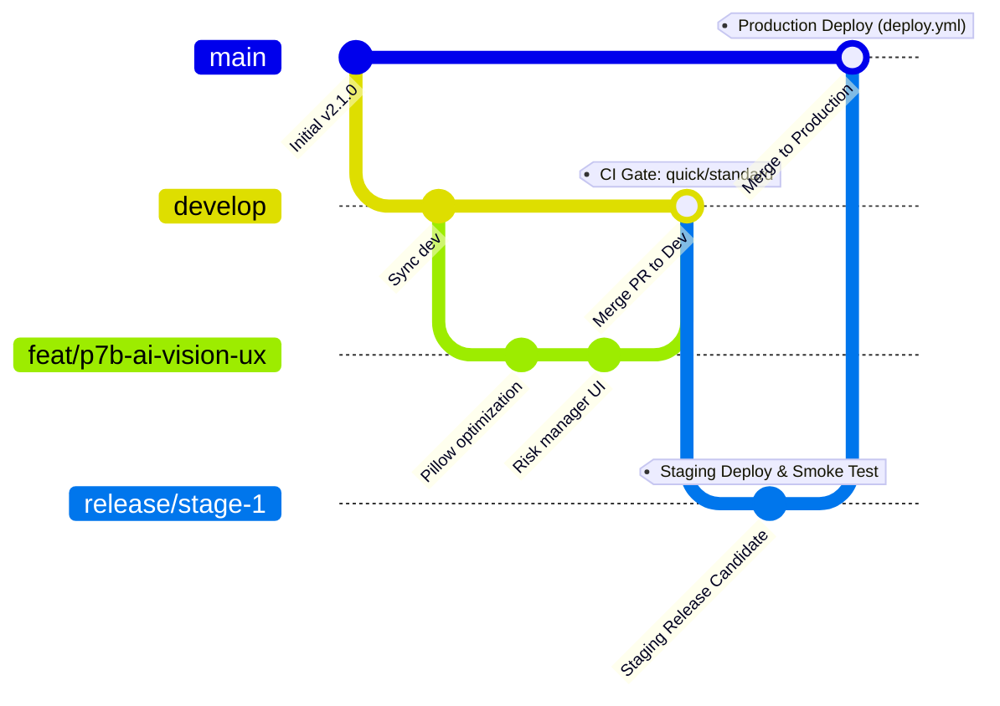

# 📊 Server C Audit & Merge Strategy Proposal

Tài liệu này trình bày kết quả phân tích kỹ thuật về các sự cố liên quan đến `agy` trên **Server C** và đề xuất phương án tối ưu cho quy trình merge nhánh tính năng (`Branch B - AI/UX`) vào môi trường sản xuất.

---

## 1. Kết quả Audit & Phân tích Sự cố trên Server C

Qua kiểm tra nhật ký hệ thống (`journalctl`) và log container (`docker logs`) trên **Server C**, chúng tôi ghi nhận các điểm mấu chốt sau:

### A. Sự cố "Agy sập 2 lần và Fallback sang API"
*   **Thực tế hệ thống:** Tiến trình `agy-bridge` (chạy trực tiếp trên host PID `1354815`) và container `tradingbot-analyzer` **chưa từng bị crash vật lý** (uptime lần lượt là 1.8 ngày và 31 giờ).
*   **Nguyên nhân Fallback:** Log hệ thống ghi nhận chính xác **2 lần fallback sang Gemini** xảy ra vào ngày **04/06/2026 17:09:02**:
    ```
    RAG: Claude CLI fail (Claude CLI rc=1: ). Trying SDK fallback...
    RAG: Falling back to Gemini...
    ```
    Nguyên nhân là do Claude CLI (OAuth session) bị lỗi xác thực hoặc hết hạn, đồng thời biến `ANTHROPIC_API_KEY` chưa được cấu hình (đang để giá trị mock `sk-ant-dummy...`), dẫn đến hệ thống kích hoạt cơ chế phòng ngự **Circuit Breaker** để chuyển đổi sang Gemini API trực tiếp (`gemini-direct`/`gemini-fallback`).

### B. Lỗi "Permission denied: /screenshots/"
*   **Bối cảnh:** Trước đây hệ thống gặp lỗi:
    ```
    [ERROR] capture_client: mplfinance rendering failed: [Errno 13] Permission denied: '/screenshots/chart_BTCUSDT_5.png'
    ```
*   **Lý do:** Thư mục `/screenshots` là một Docker Volume mount ngoài root, ban đầu được tạo dưới quyền sở hữu của `root`. Trong khi đó, container chạy dưới quyền user không có đặc quyền `trader` (UID/GID `999`), gây ra lỗi từ chối ghi file.
*   **Trạng thái hiện tại:** **ĐÃ ĐƯỢC KHẮC PHỤC** vào lúc `19:20` ngày `06/06`. Hiện tại quyền sở hữu đã được phân lại thành `999:999` (`trader`), các biểu đồ dạng `chart_BTCUSDT_5.png` đã được sinh và ghi thành công mà không có lỗi phát sinh thêm.

### C. Phát hiện Bug logic của `CliHealthTracker` (Vòng lặp suy thoái)
Hệ thống giám sát sức khỏe `agy-bridge` hiện có một lỗi thiết kế nghiêm trọng trong file [agy-bridge.py](file:///c:/Users/pesil/working/mj_trading/TradingViewProject/deploy/agy-bridge.py):
*   Khi `agy-bridge` ở trạng thái `parallel` (chạy song song CLI và SDK để tối ưu latency), nếu SDK (gọi API HTTP trực tiếp) hoàn thành trước CLI (~11s so với ~12s), CLI sẽ bị cancel.
*   Hàm `_run_parallel` khi thấy CLI chưa hoàn thành sẽ tự động đánh dấu CLI là thất bại (`cli_health.record(success=False)`).
*   Điều này khiến **Failure Rate của CLI tăng lên 90%** một cách giả tạo, giam giữ hệ thống vĩnh viễn ở trạng thái **degraded** (parallel mode), tiêu tốn x2 token mặc dù CLI không hề bị sập thực sự.

---

## 2. Đề xuất Quy trình Merge & Branching Strategy

Quy trình hiện tại của dự án đã có cấu hình CI/CD rất bài bản trong thư mục `.github/workflows/`. Dựa trên kiến trúc hạ tầng và các workflow có sẵn (`ci.yml`, `staging.yml`, `deploy.yml`), chúng tôi đề xuất phương án **Trunk-Based Development kết hợp Staging (Release-oriented)** thay vì GitFlow cổ điển để giảm thiểu xung đột.

### Sơ đồ quy trình (Git Merge Workflow)



### Chi tiết các bước triển khai:

| Bước | Nhánh | Hành động & Kích hoạt CI/CD | Mục tiêu |
| :--- | :--- | :--- | :--- |
| **1. Dev & Local QA** | `feat/p7b-ai-vision-ux` | Chạy bộ công cụ kiểm thử cục bộ (`python scripts/local_security_gate.py` hoặc `angati qa`). | Đảm bảo code sạch, 0 lỗi Ruff lint và đạt tiêu chuẩn bảo mật mini-MDASH trước khi push. |
| **2. Integration** | PR sang `develop` | Tạo Pull Request từ `feat/*` sang `develop`. Kích hoạt `ci.yml` (chạy lint + fast/standard unit tests). | Kiểm tra xung đột logic với các nhánh khác. `develop` hoạt động như một môi trường tích hợp chung. |
| **3. Staging** | `release/stage-1` | Merge `develop` vào `release/stage-1`. Kích hoạt `staging.yml` tự động deploy lên staging và chạy **Staging Smoke Tests**. | Xác thực hệ thống chạy thực tế với dữ liệu live (dry run), đảm bảo các cổng API/CDP kết nối thông suốt. |
| **4. Production** | `main` | Merge `release/stage-1` vào `main`. Kích hoạt `deploy.yml` tự động build Docker images mới và deploy lên **Server A + Server C** (Tier 1 hoặc Tier 2). | Cập nhật hệ thống production chính thức một cách an toàn, có cơ chế tự động **Rollback** nếu liveness check thất bại. |

---

## 3. Lý do lựa chọn Phương án này (Architectural Trade-offs)

1.  **Tương thích 100% với CI/CD hiện tại:** Cả `ci.yml` và `deploy.yml` đều được viết để hỗ trợ các nhánh `develop`, `release/*` và `main`. Việc áp dụng luồng này không yêu cầu cấu hình lại YAML.
2.  **Cách ly rủi ro (Risk Isolation):** Branch `release/stage-1` đóng vai trò là chốt chặn cuối cùng (Staging Gate). Nếu code mới làm hỏng cơ chế vẽ biểu đồ hay gây treo API, Staging Smoke Test sẽ cảnh báo trước khi mã nguồn chạm tới `main`.
3.  **Tự động hóa hoàn toàn (Zero-Click Production):** Khi PR vào `main` được chấp thuận, Docker image sẽ tự động được đóng gói và cập nhật trực tiếp lên VPS của Server C mà không cần thao tác thủ công.
