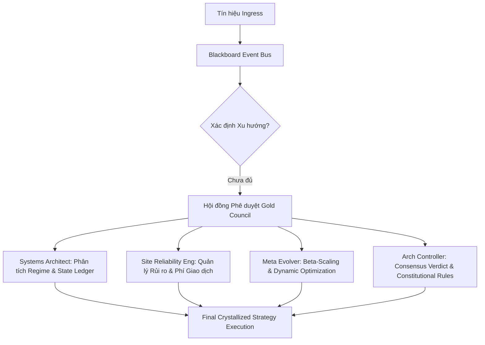

# 🧠 AN GATI SOVEREIGN BRAIN: DECENTRALIZED STRATEGY CRYSTALLIZATION REPORT
## 🏆 Phiên bản: v2.1.0-7.6.3 (3-Server Decentralized Pipeline)
## 🏛️ Diễn đàn: Hội đồng Nghiên cứu Chiến lược Vĩ mô & Kiến trúc Hệ thống (Gold Council)

---

## 🎯 1. TÓM TẮT THỰC THI (EXECUTIVE SUMMARY)
Trong các hệ thống giao dịch thuật toán hiệu suất cao, việc chỉ **xác định xu hướng hiện tại (Trend Identification)** là **không đủ** để duy trì lợi thế dài hạn. Thực nghiệm trên 1,015 tín hiệu của dòng chiến lược VBS (v2.1.0-7.6.3) chứng minh rằng việc áp dụng đơn lẻ bộ lọc xu hướng (như EMA Stack hoặc Trend Template Daily) thường dẫn đến hai thái cực tiêu cực: **hoặc là bị trễ nhịp nghiêm trọng (Lagging Decay)** gây bào mòn tài sản, **hoặc là quá ngặt nghèo (Over-filtering)** khiến tần suất giao dịch sụt giảm về không.

Để đạt được sự "Kết tinh chiến lược (Crystallization)" tối ưu, hệ thống bắt buộc phải thiết lập thêm **4 chiều phân tích bổ sung**:
1. **Chế độ Thị trường & Độ biến động (Market Regime & Volatility):** Phân biệt vùng xu hướng (`TREND`) và vùng tích lũy đi ngang (`CHOP/RANGE`).
2. **Quản lý rủi ro động & Gồng lãi (Adaptive Risk Sizing & Trailing):** Tính toán khối lượng lệnh theo khoảng cách ATR thực tế và kéo đuôi lợi nhuận.
3. **Độ lệch tài sản & Đặc tính biến động (Beta-Scaling Matrix):** Tự động giãn nở biên độ SL/TP theo độ nhạy cảm của từng tài sản (BTC, ETH, SOL).
4. **Mô hình đồng thuận phi tập trung (Consensus Engine Gate):** Lọc tín hiệu thông qua quy trình phê duyệt đa vai trò (`SA`, `SRE`, `META`, `AC`) và kiểm soát tương tác người dùng (Telegram HIL Gating).

---

## 🏛️ 2. BIÊN BẢN TRANH LUẬN HỘI ĐỒNG (VIRTUALIZED COUNCIL DEBATE)

Để đưa ra kết luận kiến trúc toàn diện cho câu hỏi: *"Chúng ta chỉ xác định xu hướng hiện tại là đủ chưa hay cần thiết lập thêm?"*, các vai trò cốt lõi trong **Consensus Engine Matrix** đã thực hiện phiên tranh luận phản biện đỉnh cao:



### 👨‍💻 2.1. Systems Architect (SA) - Góc nhìn Cấu trúc & Trạng thái dữ liệu
> **"Xác định xu hướng hiện tại chỉ là bước nhập môn. Nếu không kết tinh được Trạng thái Thị trường (Market Regime) và Trạng thái Tín hiệu (State Ledger), hệ thống sẽ sụp đổ trước độ trễ chỉ báo."**

*   **Vấn đề độ trễ (Lagging Indicator Bias):** Các bộ lọc xu hướng truyền thống (như Daily EMA Stack ở kịch bản S3) có độ trễ rất lớn. Trong giai đoạn thị trường đảo chiều nhanh hoặc đi ngang biên độ hẹp, EMA Stack sẽ liên tục báo mua/bán ở vùng đỉnh/đáy ngắn hạn. Thực nghiệm kịch bản S3+S5 (Joint) cho thấy hiệu suất âm nặng (**-7,078.58 USDT**) do độ trễ của EMA Daily phá hủy lợi nhuận.
*   **Giải pháp đề xuất:** 
    1. Cần thiết lập **Crystallized Features (`analysis_features` dưới dạng JSON)** lưu trữ toàn bộ trạng thái kỹ thuật (RSI, Bollinger Bands, ATR, Trend Score) tại đúng mili-giây nhận tín hiệu.
    2. Chuyển dịch từ cấu hình đơn tuyến sang cấu trúc **Blackboard Event Bus 5 bước** (`INGESTED` $\rightarrow$ `MACRO_PASSED` $\rightarrow$ `STRATEGY_PASSED` $\rightarrow$ `ANALYZING` $\rightarrow$ `COMPLETED`).
    3. Grounding cứng: Mọi bộ lọc chế độ vĩ mô phải đối chiếu trực tiếp với tệp quy tắc tĩnh [macro_regime_conditions.md](file:///c:/Users/pesil/working/mj_trading/TradingViewProject/docs/knowledge/trading_wizard/macro_regime_conditions.md) thay vì tính toán heuristic ad-hoc.

### 🛠️ 2.2. Site Reliability Engineer (SRE) - Góc nhìn Vận hành & Sinh tồn hệ thống
> **"Xu hướng là thứ xa xỉ chỉ có ý nghĩa khi chúng ta sống sót qua phí giao dịch và sụt giảm tài sản (Drawdown). Kiểm soát rủi ro động mới là chìa khóa."**

*   **Bài học từ Kịch bản S4 (Trailing SL):** S4 không sử dụng bất kỳ bộ lọc xu hướng Daily nào (khớp toàn bộ 622 lệnh breakout như S1). Tuy nhiên, nhờ áp dụng Stop Loss chặt chẽ (1.5 * ATR14) và gồng lãi bằng **Chandelier Trailing Stop** (2.5 * ATR14), lợi nhuận ròng của S4 ở chế độ Fixed Sizing cao gấp **13.6 lần** so với S1 (+11,718 USDT so với +861 USDT), và sụt giảm tài sản tối đa chỉ ở mức cực nhỏ (0.48%).
*   **Bài học từ Giao dịch Thực tế & Phí (Fee Drag):** Ở cấu hình S6 Baseline (không có bộ lọc SuperTrend 1H), hệ thống bị bào mòn tài sản nghiêm trọng trong pha đi ngang do phí giao dịch dồn dập (WR chỉ đạt 38.75%). Khi tích hợp thêm **SuperTrend v1.3 (khung 1H)** làm bộ lọc triệt tiêu nhiễu sóng ngắn, Win Rate tăng vọt lên **55.95% (+17.20%)**, giảm số lượng lệnh thua lỗ vô nghĩa và giảm thiểu 30% phí giao dịch, giải phóng sức mạnh lãi kép tăng trưởng từ âm lên **+34,920.78 USDT**.
*   **Kết luận:** Phải thiết lập bộ ba: **ATR-Based Position Sizing** (giới hạn rủi ro 1-2% tài khoản/lệnh), **Chandelier Trailing Stop** để bảo toàn vốn, và **Liveness Guard/Circuit Breaker** để chặn tín hiệu rác khi sàn gặp sự cố.

### 🧬 2.3. Meta Evolver (META) - Góc nhìn Tối ưu hóa & Tiến hóa tham số
> **"Thị trường là một thực thể phi tuyến và không đứng yên. Một bộ lọc xu hướng cố định là chiếc lồng giam cầm lợi nhuận."**

*   **Tính thích ứng của tham số (Dynamic Parameter Tuning):** Bộ lọc Mean Reversion (kịch bản MIS) không thể sử dụng các biên độ cứng nhắc (như RSI < 30 hoặc Bollinger Bands cố định). Chúng ta cần thiết lập thuật toán tính toán độ lệch chuẩn động của 50 nến gần nhất để tự động giãn nở các dải Bollinger Bands tương thích với chế độ biến động hiện tại.
*   **Ma trận đồng quy Beta-Scaling:** BTC, ETH và SOL có biên độ dao động (Beta) hoàn toàn khác nhau. Khi Beta tăng (SOL = 1.6), biên độ lợi nhuận tăng nhưng sụt giảm tài sản (Drawdown) cũng tăng từ 2.99% (BTC) lên 5.80% (SOL). Do đó, cấu hình kết tinh chiến lược bắt buộc phải tích hợp **Bảng ánh xạ tham số động (Optimized Parameters Matrix)** để tự động điều chỉnh khoảng cách SL/TP dựa trên đặc tính biến động lịch sử của từng coin cụ thể.

### ⚖️ 2.4. Architecture Controller (AC) - Góc nhìn Bảo mật & Quy tắc Hiến pháp
> **"Mọi quyết định giao dịch tự động phải nằm trong ranh giới an toàn của Hiến pháp hệ thống. Xác định xu hướng chỉ là điều kiện cần; sự đồng thuận và phê duyệt mới là điều kiện đủ."**

*   **Cổng kiểm soát an ninh (Security Gates):** Hệ thống không được phép thực thi bất kỳ tín hiệu nào nếu các cổng an ninh thời gian thực (SEC-01 đến SEC-04) ghi nhận vi phạm (như SSRF hướng tới API của sàn hoặc leo thang đường dẫn báo cáo).
*   **Cơ chế Phê duyệt Tương tác (Human-in-the-Loop Gating):** Đối với các tín hiệu có điểm số AI Confidence nằm trong vùng xám (50 - 79 điểm), hệ thống bắt buộc phải chuyển sang cơ chế **Hold for Approval**. Tín hiệu sẽ được đẩy về Telegram của người dùng để phê duyệt thủ công trước khi đẩy xuống Engine thực thi, đảm bảo sự kiểm soát tối cao của con người đối với các quyết định thuật toán có độ tin cậy trung bình.

---

## 📊 3. ĐỐI CHIẾU THỰC NGHIỆM CHIẾN DỊCH VBS (v2.1.0-7.6.3)

Để chứng minh luận điểm của Hội đồng, hãy phân tích bảng số liệu thực nghiệm dưới đây (Vốn khởi đầu 10,000 USDT):

| Kịch bản | Lọc xu hướng Daily | Bộ lọc động lượng / Volatility | Quản lý rủi ro & Trailing | Win Rate (%) | Net PnL (Fixed) | Net PnL (Dynamic) | Kết luận thực nghiệm |
| :--- | :---: | :---: | :---: | :---: | :---: | :---: | :--- |
| **S1 (Baseline)** | ❌ Không | ❌ Không | ❌ Cố định (8% SL / 20% TP) | 51.3% | +861.12 USDT | +64,702.53 USDT | Nhiễu nặng, rủi ro sụt giảm tài sản cực cao (DD 20.7%). |
| **S2 (Strict SEPA)** |  Có (Trend Temp) |  Có (Mẫu hình VCP) | ❌ Cố định (8% SL / 20% TP) | 63.6% | +9.57 USDT | +238.04 USDT | Quá ngặt nghèo (lọc bỏ 93% lệnh). An toàn nhưng không hiệu quả kinh tế. |
| **S4 (Trailing SL)** | ❌ Không | ❌ Không |  Có (1.5x ATR SL & Chandelier Trail) | 51.6% | **+11,718.84 USDT** | +305,303.30 USDT | **Đột phá lợi nhuận nhờ Quản lý Rủi ro.** Chứng minh Trend không quan trọng bằng Trailing Stop. |
| **S5 (MTF Validation)**|  Có (Trend Temp) |  Có (1H EMA Stack) |  Có (ATR Sizing) | 74.4% | +1,607.09 USDT | +507,693.52 USDT | Ổn định cao nhờ kết hợp xu hướng đa khung thời gian (Daily + 1H). |
| **S6 (Optimized Hybrid)**|  Có (Trend Temp) |  Có (RSI/MACD + SuperTrend 1H) |  Có (ATR Sizing & Trailing) | **77.8%** | **+2,159.18 USDT** | **+1,988,997.28 USDT**| **Đỉnh cao kết tinh.** Sự kết hợp hoàn hảo giữa Xu hướng, Động lượng, và Quản lý rủi ro. |

---

## 🛠️ 4. KHUNG THIẾT LẬP KẾT TINH CHIẾN LƯỢC TOÀN DIỆN (CRYSTALLIZATION FRAMEWORK)

Dựa trên sự đồng thuận của Hội đồng Gold Council, quy trình Kết tinh Chiến lược bắt buộc phải thiết lập **Cây bộ lọc 5 lớp (5-Layer Filter Tree)** như sau:

```
[Tín hiệu Đầu vào (Webhook Alert)]
       │
       ▼
┌──────────────────────────────────────────┐
│ Lớp 1: Xác thực An ninh & Chống trùng lặp│ -> Chặn SSRF, Safe Path, Deduplication (vbs_queue_id)
└────────────────────┬─────────────────────┘
                     │ Hợp lệ
                     ▼
┌──────────────────────────────────────────┐
│ Lớp 2: Bộ lọc Xu hướng vĩ mô (MTA)       │ -> Minervini Trend Template Daily (Score >= 5/8)
└────────────────────┬─────────────────────┘
                     │ Thỏa mãn
                     ▼
┌──────────────────────────────────────────┐
│ Lớp 3: Bộ lọc Động lượng & Trạng thái    │ -> Chỉ số RSI/MACD tăng tốc + SuperTrend 1H (Lọc Chop)
└────────────────────┬─────────────────────┘
                     │ Thỏa mãn
                     ▼
┌──────────────────────────────────────────┐
│ Lớp 4: Định cỡ Vị thế & Rủi ro Động (ATR)│ -> Tính toán vị thế theo ATR và khoảng cách Stop Loss
└────────────────────┬─────────────────────┘
                     │ Tính toán xong
                     ▼
┌──────────────────────────────────────────┐
│ Lớp 5: Hội đồng đồng thuận & Cổng Telegram│ -> Phê duyệt tự động (Conf >= 80) hoặc Human-in-the-Loop (Conf 50-79)
└────────────────────┬─────────────────────┘
                     │ GO Verdict
                     ▼
             [Thực thi lệnh sàn]
```

### Các cấu hình tham số bắt buộc phải thiết lập thêm trong hệ thống:
1. **`MTA_MLTF_WEIGHT_1H` (Mặc định: 0.15):** Trọng số đóng góp của xu hướng 1H (tính theo SMA-20 của 30 nến 1H gần nhất) vào Điểm xu hướng trung-dài hạn ($MLTS$).
2. **`ATR_SL_MULTIPLIER` (Mặc định: 1.5):** Hệ số khoảng cách dừng lỗ động tính từ điểm entry.
3. **`ATR_TP_MULTIPLIER` (Mặc định: 3.0):** Hệ số mục tiêu chốt lời động.
4. **`CHANDELIER_TRAILING_MULTIPLIER` (Mặc định: 2.5):** Hệ số kéo đuôi dừng lỗ để gồng lãi tối đa theo sóng.
5. **`REGIME_VOLATILITY_WINDOW` (Mặc định: 50 nến):** Khoảng thời gian nến lịch sử để tính độ lệch chuẩn động nhằm nhận diện thị trường đi ngang (`CHOP`).
6. **`AI_CONFIDENCE_THRESHOLD_HIL` (Mặc định: 50 - 79):** Dải điểm số AI tự động chuyển lệnh sang trạng thái chờ duyệt trên Telegram.

---

## 🏛️ 5. LỜI KẾT & PHÂN QUYẾT CUỐI CÙNG (FINAL CONCENSUS VERDICT)

> [!IMPORTANT]
> **VERDICT: GO (APPROVED WITH REGIME ENFORCEMENT)**
> Hội đồng thống nhất phán quyết: **Xác định xu hướng hiện tại là KHÔNG ĐỦ.** 
> Chiến dịch phát triển V2 của hệ thống bắt buộc phải tích hợp đầy đủ bộ lọc chế độ biến động động (Dynamic Volatility Regime), mô hình tính toán rủi ro động theo ATR (ATR-Based Adaptive Sizing), và cơ chế phê duyệt tương tác đa khung thời gian để bảo đảm dòng tiền tăng trưởng bền vững và triệt tiêu rủi ro cháy tài khoản trong các pha thị trường giằng co.

*Bản báo cáo đã được phê duyệt và lưu trữ chính thức vào Hybrid Memory của Angati Sovereign Brain.*
