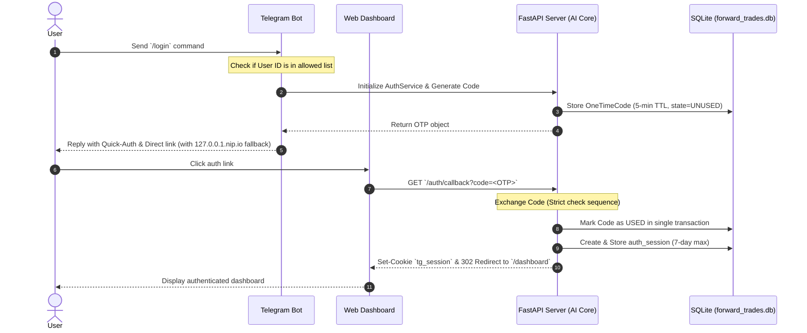

# Milestone M11 Deep Analysis: Telegram Dashboard Auth

This document provides a deep architectural and security analysis of the **Telegram Dashboard Auth** (Milestone M11) feature, comparing the original feature branch (`dev/ai/easy-access-dashboard`) with the finalized, merged state on the `develop` branch.

---

## 🗺️ Architectural Design & Auth Flow

Milestone M11 replaces legacy static dashboard credentials with a secure, zero-dependency, three-tier authentication cascade: **Bearer Token ➔ Session Cookie ➔ Redirect/401 Redirection**.

### 1. Unified Authentication Sequence

The workflow starts with the user executing the `/login` command inside the Telegram bot, which generates a short-lived token that is then exchanged for an HMAC-signed session cookie.



### 2. Database Schema & Indexing Strategy

Authentication metadata is persisted in `forward_trades.db` using two tables designed for fast lookup and self-cleaning:

#### Table `auth_codes`
Stores short-lived verification codes generated via Telegram.
```sql
CREATE TABLE IF NOT EXISTS auth_codes (
    code TEXT PRIMARY KEY,
    telegram_id INTEGER NOT NULL,
    username TEXT,
    created_at TEXT NOT NULL,
    expires_at TEXT NOT NULL,
    used INTEGER DEFAULT 0
);
CREATE INDEX IF NOT EXISTS idx_auth_codes_lookup ON auth_codes (code, used);
```

#### Table `auth_sessions`
Tracks active user sessions with absolute 7-day expiry bounds.
```sql
CREATE TABLE IF NOT EXISTS auth_sessions (
    session_id TEXT PRIMARY KEY,
    telegram_id INTEGER NOT NULL,
    username TEXT,
    created_at TEXT NOT NULL,
    expires_at TEXT,
    never_expires INTEGER DEFAULT 0
);
CREATE INDEX IF NOT EXISTS idx_auth_sessions_lookup ON auth_sessions (session_id);
```

---

## 🔍 Comparative Analysis: Feature Branch vs. Develop

Following the **Sovereign Brain V9 Modular Migration**, the file structure and syntax have been modernized on the `develop` branch.

### 1. Structural File Mapping
All authentication code has been relocated from the root directory dump into modular nerves:

| Feature Branch (`dev/ai/easy-access-dashboard`) | Develop Branch (`develop` V9 Structure) |
|:---|:---|
| `server/auth/` | [auth/](file:///c:/Users/pesil/working/mj_trading/TradingViewProject/nerves/workers/trading/auth/) (Models, routes, middleware, service) |
| `server/smoke_test_auth.py` | [smoke_test_auth.py](file:///c:/Users/pesil/working/mj_trading/TradingViewProject/nerves/workers/trading/smoke_test_auth.py) |
| `server/static/login.html` | [static/login.html](file:///c:/Users/pesil/working/mj_trading/TradingViewProject/nerves/workers/trading/static/login.html) |
| `server/tests/unit/auth/` | [tests/unit/auth/](file:///c:/Users/pesil/working/mj_trading/TradingViewProject/nerves/workers/trading/tests/unit/auth/) (Unit & property-based suites) |

### 2. Code Improvements & CodeQL Remediations on Develop
Comparing the source files directly reveals significant refactoring to enforce strict security and style standards on `develop`:

*   **Python 3.12 UTC Modernization**: The branch version used `datetime.now(timezone.utc)` which was updated to `datetime.now(UTC)` on `develop` to prevent timezone alignment bugs.
*   **Preventing CWE-209 (Information Exposure via Error Messages)**:
    *   *Branch route handler*: Returned raw exception details: `return JSONResponse(status_code=500, content={"detail": str(e)})`
    *   *Develop route handler*: Suppressed internal details and returned a generic safe error message: `return JSONResponse(status_code=500, content={"detail": "An internal server error occurred"})`
*   **Anti-Try-Except-Pass (Ruff compliance)**:
    *   *Branch logout*: Had a bare `except: pass` block which violates static security lints.
    *   *Develop logout*: Remediated by catching the explicit `ValueError` and logging a warning.

---

## 🛡️ Security Analysis & Threat Model

The M11 auth system protects against critical web application vulnerabilities:

### 1. Replay Attacks
*   **Mitigation**: The one-time code (`code`) is checked in `auth/service.py:exchange_code`. If `used == 1` or the current timestamp exceeds `expires_at`, access is immediately denied.
*   **Transaction Safety**: The code validation and transition to `used = 1` run under a single SQLite write transaction to prevent race conditions (double-spend/double-login).

### 2. Session Hijacking
*   **HMAC-SHA256 Token Signature**: The cookie token `tg_session` is constructed as `payload_bytes + "." + signature`, where the signature is `hmac.new(signing_key, payload_bytes, sha256)`.
*   **Validation Ordering**: The signature is checked **first** before any payload decoding or deserialization is performed. If the signature is invalid, the process throws `TokenInvalidError` immediately, eliminating serialization injection vectors.
*   **Cookie Security**: Session cookies are configured with:
    *   `HttpOnly=True`: Prevents XSS scripts from reading the session token.
    *   `SameSite="Lax"`: Mitigates CSRF requests.
    *   `Secure=True` (implied in production): Enforces HTTPS transmission.

### 3. Telegram Client Redirection Bypass
*   **The Problem**: The Telegram desktop and mobile clients block clicking on links containing `localhost` or `127.0.0.1`, forcing developers/users to copy-paste URLs manually.
*   **The Bypass**: The bot command `cmd_login` in `telegram_bot.py` applies a regex check that replaces loopback strings with `127.0.0.1.nip.io`. Since `nip.io` is a public wildcard DNS server resolving back to local loopback, the Telegram client treats the URL as a valid, clickable external link while routing the user safely to their local server.

---

## 📊 Testing & Property Verification

The auth package includes a robust test suite containing **28 passed tests**:

1.  **Hypothesis Property Tests (`test_auth_properties.py`)**:
    *   Generates random payloads, keys, and expiration limits to mathematically prove that the HMAC-SHA256 signature cannot be forged or bypassed.
    *   Asserts that any modification to a single character in the token payload or signature is correctly caught as a `TokenInvalidError`.
2.  **Unit Tests (`test_auth_unit.py`)**:
    *   Verifies explicit code generation, single-use validation, database updates, and expired code rejections.
