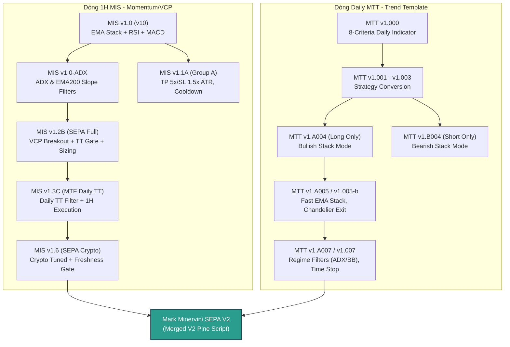

# Phả Hệ Tiến Hóa Chiến Lược (Strategy Genealogy)

Tài liệu này ghi lại chi tiết chuỗi tiến hóa mã nguồn Pine Script và tri thức giao dịch được đúc kết qua các chiến dịch backtest và tối ưu hóa của Angati TradingView Project.

---

## 🗺️ Bản Đồ Phả Hệ Tiến Hóa (Strategy Genealogy Map)

---

## 🧬 Dòng Phát Triển 1H MIS (Multi-Indicator Strategy)

Dòng MIS tập trung vào việc bắt các điểm đột phá (Breakout) động lượng trên khung thời gian nhỏ (1H) kết hợp với các bộ lọc xu hướng lớn.

### 1. MIS v1.0 (v10) - *Baseline*
- **Cơ chế chính**: Giao dịch 2 chiều (Long/Short) dựa trên sự cắt nhau của MACD khi có xác nhận xu hướng từ EMA 20/50/200 và RSI vượt ngưỡng 50.
- **Tham số**: SL = 2.0x ATR, TP = 3.0x ATR (R:R = 1.5).
- **Điểm yếu**: Thất bại nặng nề trong giai đoạn thị trường đi ngang (Chop/Rangebound), lỗ lũy kế -28.98 USDT trong nửa đầu năm 2025.

### 2. MIS v1.0-ADX - *Lọc xu hướng*
- **Cải tiến**: Thêm bộ lọc ADX(14) >= 25 để tránh giao dịch khi thị trường không có xu hướng mạnh. Thêm bộ lọc độ dốc EMA 200 (Slope) để xác định xu hướng dài hạn.
- **Kết quả**: Cải thiện hiệu suất trong các chu kỳ tích lũy nhưng bỏ lỡ các điểm đảo chiều nhanh.

### 3. MIS v1.1A - *Tối ưu hóa tham số (Group A)*
- **Cải tiến**:
  - Tối ưu R:R bằng cách thu hẹp Stop Loss (ATR SL 1.5) và mở rộng Take Profit (ATR TP 5.0), đẩy tỷ lệ R:R lên **3.3**.
  - Tích hợp 8 nến Cooldown sau khi thoát lệnh để triệt tiêu chuỗi lệnh thua liên tiếp khi thị trường quét 2 đầu.
  - Sử dụng Chandelier trailing stop (ATR 3.0) để bảo vệ lợi nhuận. Tắt chế độ Short mặc định.
- **Hiệu suất**: Nâng cao kỳ vọng toán học (Expectancy) trên mỗi lệnh một cách rõ rệt.

### 4. MIS v1.2B - *Chuyển dịch SEPA (Group B)*
- **Cải tiến**:
  - Thay thế chỉ báo MACD bằng điểm mua đột phá mẫu hình **VCP (Volatility Contraction Pattern)**: Volume kiệt quệ (dry-up < 60% Vol MA) và biên độ nến thắt chặt (tightness < 70% ATR).
  - Tích hợp bộ lọc Trend Template 8 tiêu chí của Mark Minervini để xác nhận cổ phiếu/crypto đang ở Giai đoạn 2 (Stage 2 Uptrend).
  - Áp dụng Quản lý vốn theo rủi ro cố định (Risk-based position sizing) và chốt chặn Stop Loss cứng 8% không thương lượng.

### 5. MIS v1.3C - *Đa khung thời gian (MTF)*
- **Cải tiến**: Khắc phục lỗi "lệch khung thời gian" của v12B. Thay vì tính Trend Template trên khung 1H (khiến SMA 200 chỉ bằng 8 ngày giao dịch), v13C tính toán Trend Template trên chart **Daily** qua lệnh `request.security`, và thực hiện điểm mua VCP trên chart **1H**.
- **Hiệu suất**: Trở thành kịch bản sinh lời mạnh nhất trong các thử nghiệm kiểm thử mở rộng với win rate 61.4% và Profit Factor vượt trội.

### 6. MIS v1.6 - *Tối ưu Crypto*
- **Cải tiến**: Bỏ giới hạn RSI trần (RSI < 70) vì crypto khi vào sóng tăng thường duy trì trạng thái quá mua (Overbought) rất lâu. Thêm cổng kiểm định độ tươi của Stage 2 (Stage 2 Freshness Gate) để tránh mua đuổi ở cuối chu kỳ tăng.

---

## 🧬 Dòng Phát Triển Daily MTT (Minervini Trend Template)

Dòng MTT được thiết kế cho các nhà giao dịch giữ lệnh trung-dài hạn trên khung Daily, bám theo xu hướng lớn của thị trường.

### 1. MTT v1.000 - v1.003 - *Định hình Chiến lược*
- **Cơ chế chính**: Chuyển đổi bộ lọc 8 tiêu chí Trend Template của Mark Minervini thành chiến lược vào lệnh khi đường giá Daily nằm trong cấu trúc EMA stack (EMA 20 > EMA 50 > EMA 100).

### 2. MTT v1.A004 / v1.B005 - *Phân nhánh Long/Short*
- **Cải tiến**: Chia tách mã nguồn thành nhánh A (Long-only cho thị trường Uptrend) và nhánh B (Short-only/Hedging cho thị trường Downtrend) để tối ưu hóa hiệu suất riêng biệt.
- **Tối ưu**: Sử dụng Chandelier trailing stop để bám sát xu hướng dài hạn mà không bị quét ra sớm bởi nhiễu thị trường.

### 3. MTT v1.A007 - *Lọc nhiễu Regime*
- **Cải tiến**: Tích hợp các bộ lọc trạng thái thị trường nâng cao được phân tích cụ thể tại [strategy_MTT_v1.007_regime_detection_report.md](file:///C:/Users/pesil/working/mj_trading/TradingViewProject/docs/reports/strategy_MTT_v1.007_regime_detection_report.md):
  - Chặn đi ngang bằng ADX < 20.
  - Chặn các vùng nén Bollinger Bands Squeeze (BB width < 5.0%) - nơi giá dễ quét 2 đầu trước khi bùng nổ.
  - Time-based Stop: Tự động đóng lệnh sau 20 nến nếu vị thế không sinh lợi nhuận để giải phóng vốn.

---

## 🤝 Sự Hợp Nhất: Mark Minervini SEPA Strategy V2

Chiến lược V2 ([minervini_strategy.pine](file:///C:/Users/pesil/working/mj_trading/TradingViewProject/pine/v2/minervini_strategy.pine)) là đỉnh cao của sự hợp nhất hai dòng chiến lược:
1. **Daily Trend Follower (MTT v1.005-b/A007)**: Bám theo xu hướng dài hạn Daily EMA stack, phù hợp cho Spot/Hold.
2. **1H SEPA / Momentum (MIS v1.6/v13C)**: Đột phá VCP ngắn hạn khung 1H, tối ưu hóa R:R, phù hợp cho giao dịch Futures đòn bẩy.

### Ma Trận So Sánh Hiệu Suất Chiến Dịch (compounding 2% Risk) - Xem thêm [BACKTEST_REPORTS_INDEX.md](file:///C:/Users/pesil/working/mj_trading/TradingViewProject/docs/reports/v2.1.0-7.6.3/BACKTEST_REPORTS_INDEX.md)

| Kịch Bản | Mô Tả Chiến Thuật | Win Rate | Profit Factor | Drawdown | Net Profit |
| :---: | :--- | :---: | :---: | :---: | :--- |
| **S2** | MIS v12b (Strict SEPA 1H) | **93.5%** | **6.49** | **24.93%** | +15,474.88 USDT |
| **S3** | Strategy MTT (Daily EMA Stack) | 81.4% | 2.00 | 86.86% | +106,863.28 USDT |
| **S5** | MIS v13c (MTF Daily TT + 1H Entry) | 61.4% | 1.09 | 92.63% | **+297,107.88 USDT** |

*Bài học*:
- **S2** mang lại sự an toàn tuyệt đối với Max Drawdown cực thấp (24.93%) và tỷ lệ thắng gần như hoàn hảo (93.5%), nhưng bỏ lỡ nhiều cơ hội.
- **S5** mang lại lợi nhuận bùng nổ nhất nhờ kết hợp đa khung thời gian (Daily TT + 1H Entry), nhưng đi kèm biến động tài khoản rất lớn.
