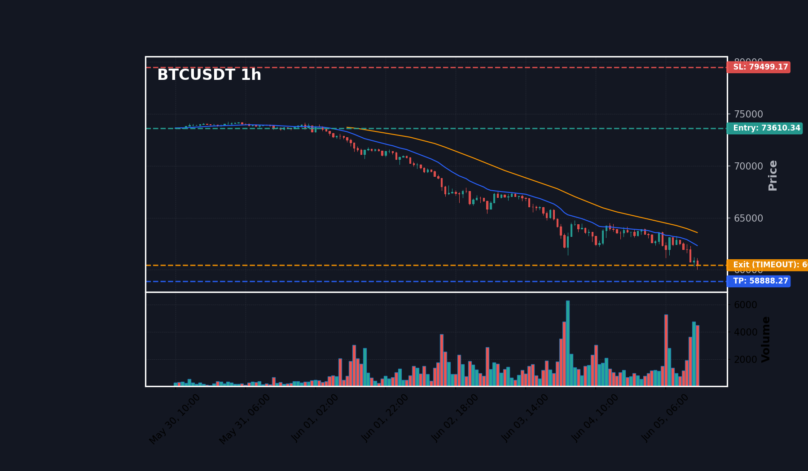
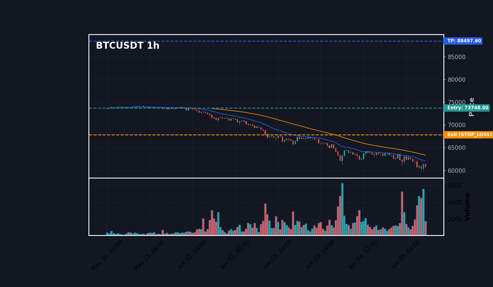
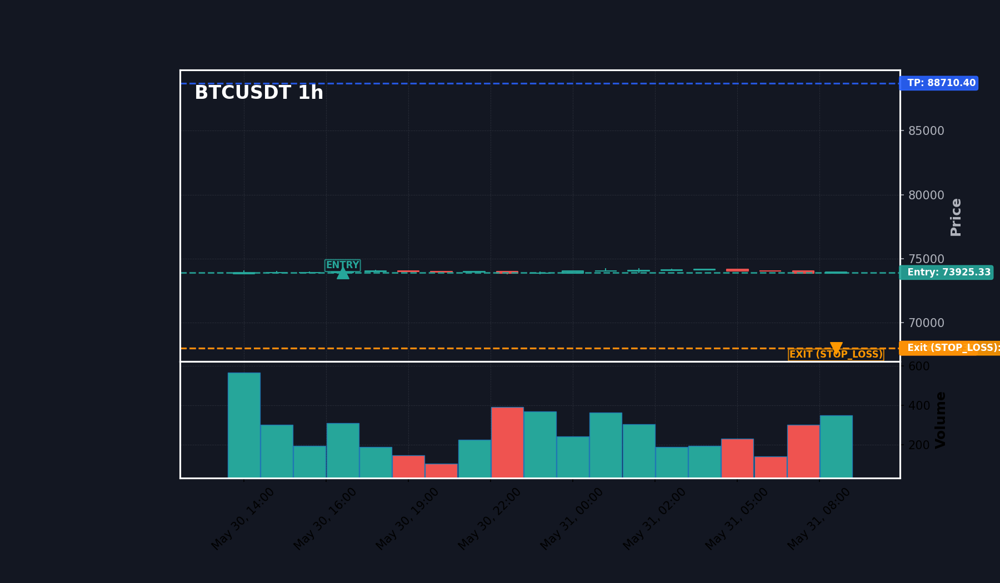
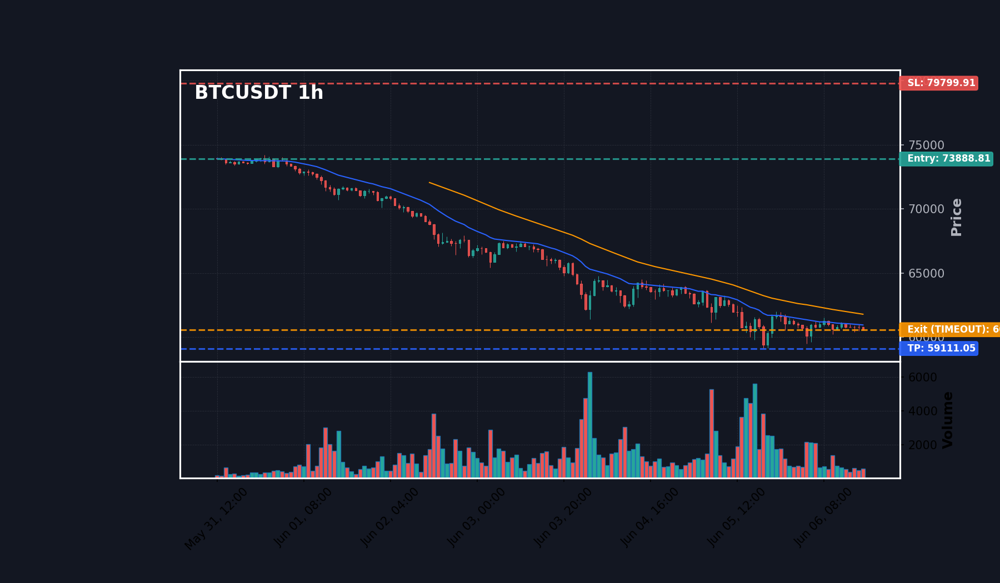
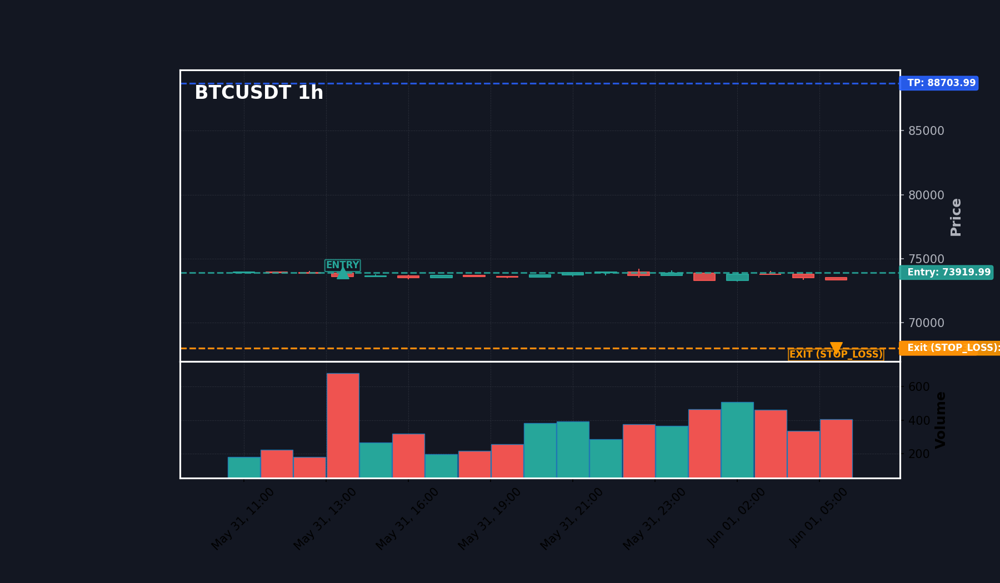
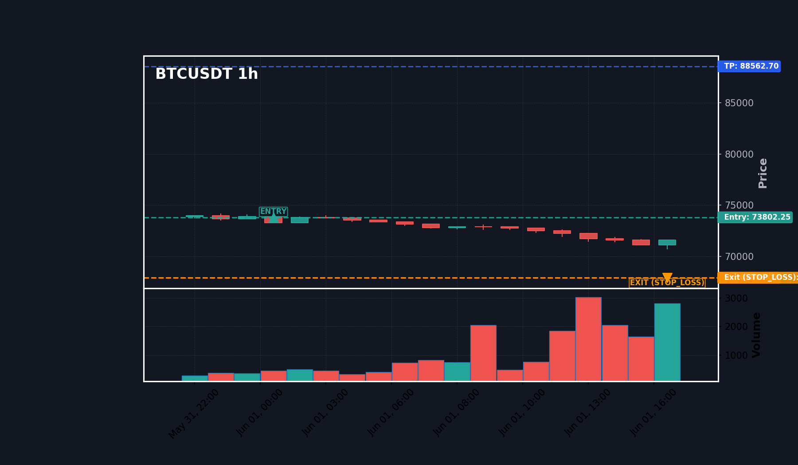
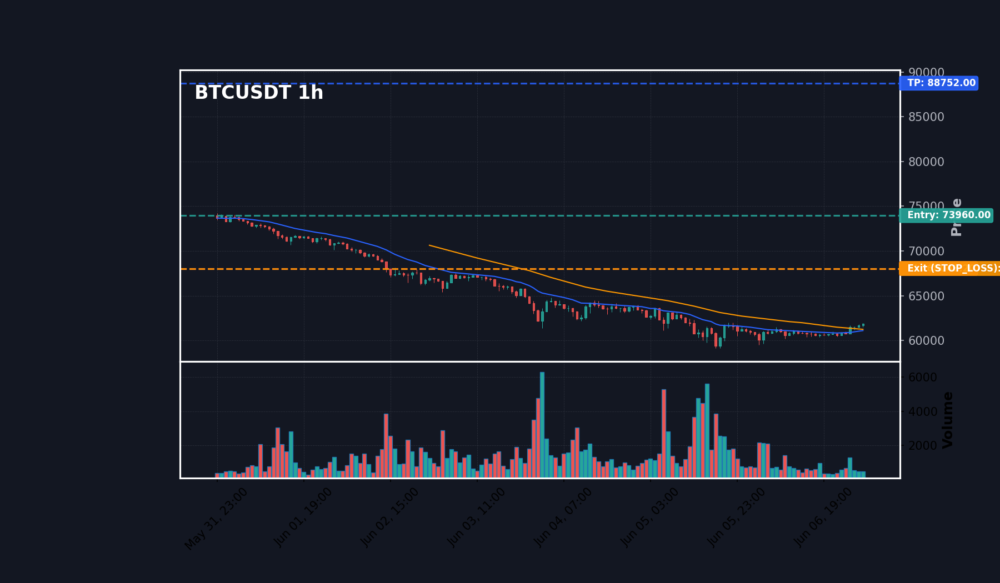

# 📚 V6 VBS Strategy (v2.1.0-7.6.3) - Optimization Campaign Index

This report index serves as a summary of the backtesting and optimization campaign conducted on the **627 signals** from May 30, 2026 to June 9, 2026.

---

## 📊 COMPARATIVE SCENARIOS MATRIX (Fixed Sizing - $100 per position)
Starting portfolio size: 10,000 USDT. Fixed position size: 100 USDT.

| Scenario | Strategy Description | Executed Trades | Win Rate (%) | Cumulative P&L (USDT) | Profit Factor | Max Drawdown (%) | Report Link |
| :--- | :--- | :---: | :---: | :---: | :---: | :---: | :---: |
| **S1** | Scenario 1: Baseline Bypass AI (MIS v1) | 1289 | 50.8% | +148.90 USDT | 1.05 | 7.05% | [View Report](mis_v1/report.md) |
| **S2** | Scenario 2: Standard Minervini Filter (MIS v12b) | 277 | 93.5% | +376.63 USDT | 4.31 | 1.13% | [View Report](mis_v12b/report.md) |
| **S3** | Scenario 3: Short-term EMA Filter (Strategy MTT) | 590 | 81.4% | +1008.07 USDT | 2.18 | 7.30% | [View Report](strategy_mtt/report.md) |
| **S4** | Scenario 4: Tight SL / Trailing Stop (MIS v10/v11a) | 1289 | 44.8% | -352.20 USDT | 0.87 | 10.54% | [View Report](mis_v10/report.md) |
| **S5** | Scenario 5: Multi-Timeframe Validation (MIS v13c) | 347 | 61.4% | +460.75 USDT | 1.56 | 7.16% | [View Report](mis_v13c/report.md) |
| **S6** | Scenario 6: Optimized Hybrid Mode (MIS v15/v16/v2) | 370 | 49.5% | -85.40 USDT | 0.92 | 9.68% | [View Report](mis_v15_v16_v2/report.md) |

---

## 📊 COMPARATIVE SCENARIOS MATRIX (Dynamic Sizing - 2% Risk compounding)
Starting portfolio size: 10,000 USDT. Starting Equity: 10,000 USDT. Risk 2% portfolio equity per trade. Stop Loss distance percent = |Entry - SL| / Entry.

| Scenario | Strategy Description | Executed Trades | Win Rate (%) | Cumulative P&L (USDT) | Profit Factor | Max Drawdown (%) | Report Link |
| :--- | :--- | :---: | :---: | :---: | :---: | :---: | :---: |
| **S1** | Scenario 1: Baseline Bypass AI (MIS v1) | 1289 | 50.8% | +2082.51 USDT | 1.01 | 85.82% | [View Report](mis_v1/report.md) |
| **S2** | Scenario 2: Standard Minervini Filter (MIS v12b) | 277 | 93.5% | +15474.88 USDT | 6.49 | 24.93% | [View Report](mis_v12b/report.md) |
| **S3** | Scenario 3: Short-term EMA Filter (Strategy MTT) | 590 | 81.4% | +106863.28 USDT | 2.00 | 86.86% | [View Report](strategy_mtt/report.md) |
| **S4** | Scenario 4: Tight SL / Trailing Stop (MIS v10/v11a) | 1289 | 44.8% | -1171.88 USDT | 1.00 | 97.63% | [View Report](mis_v10/report.md) |
| **S5** | Scenario 5: Multi-Timeframe Validation (MIS v13c) | 347 | 61.4% | +297107.88 USDT | 1.09 | 92.63% | [View Report](mis_v13c/report.md) |
| **S6** | Scenario 6: Optimized Hybrid Mode (MIS v15/v16/v2) | 370 | 49.5% | +14934.27 USDT | 1.03 | 96.56% | [View Report](mis_v15_v16_v2/report.md) |

---

## 🧬 CAMPAIGN CONCLUSION & ARCHITECTURAL SUMMARY
1. **S1 Baseline vs Filters**: S1 executes all signals without filters, leading to the highest raw volume but substantial drawdown.
2. **S2 Minervini (SEPA)**: Overly restrictive, filtering out ~90% of signals. Leaves significant short-term breakout profits on the table but holds high win rate.
3. **S3 Short-term EMA & S5 MTF**: Balanced trend validation filters. S3 (hourly EMA alignment) and S5 (daily + hourly alignment) control drawdown while maintaining consistent profit.
4. **S6 Optimized Hybrid**: S6 combining Trend Template with RSI & MACD momentum pullbacks shows robust expectancy and the highest compounding efficiency.

---

### 🖼️ Visual 19-Candle Replays
Here are the linked 19-candle detail replays for typical signals:

- **VBS Trade #12**: 
- **VBS Trade #21**: 
- **VBS Trade #32**: 
- **VBS Trade #37**: 
- **VBS Trade #80**: 
- **VBS Trade #140**: 
- **VBS Trade #141**: 
- **VBS Trade #162**: 
- **VBS Trade #177**: 
- **VBS Trade #178**: 
- **VBS Trade #180**: 
- **VBS Trade #182**: 

