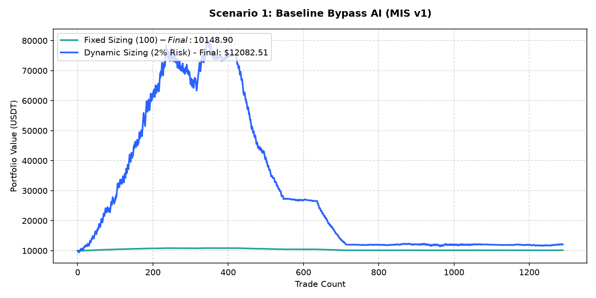

# Performance Report: Scenario 1: Baseline Bypass AI (MIS v1)

## 1. Description
Execute trades using the entry, SL, and TP prices directly from the signal records (8% SL / 20% TP fallback). Representing the baseline breakout execution from MIS v1.

- **Total Signals Scanned**: 1296
- **Executed Trades**: 1289
- **Filtered Signals (Skipped)**: 7

---

## 2. Performance Comparison Table

| Sizing Mode | Executed Trades | Final Equity (USDT) | Net Profit (USDT) | Win Rate (%) | Profit Factor | Max Drawdown (%) | Expectancy |
| :--- | :---: | :---: | :---: | :---: | :---: | :---: | :---: |
| **Fixed Sizing ($100)** | 1289 | 10148.90 | +148.90 | 50.8% | 1.05 | 7.05% | 0.1155 |
| **Dynamic Sizing (2% Risk)** | 1289 | 12082.51 | +2082.51 | 50.8% | 1.01 | 85.82% | 1.6156 |

---

## 3. Equity Curve Comparison Chart
The chart below illustrates the cumulative equity curve performance for both Fixed Sizing (USDT P&L scale) and Dynamic Compounding Sizing (2% risk) over time:

---

## 4. Scenario Breakdown Analysis
- **Filter Restrictiveness**: This scenario filtered out 7 signals out of 1296 (Skip Rate: 0.5%).
- **Compounding Sizing Effect**: Dynamic compounding sizing led to an equity of **$12082.51** compared to **$10148.90** in Fixed Sizing.
- **Profitability Verdict**: PROFITABLE with a Profit Factor of **1.01** and expectancy **1.6156** under Dynamic Sizing.
