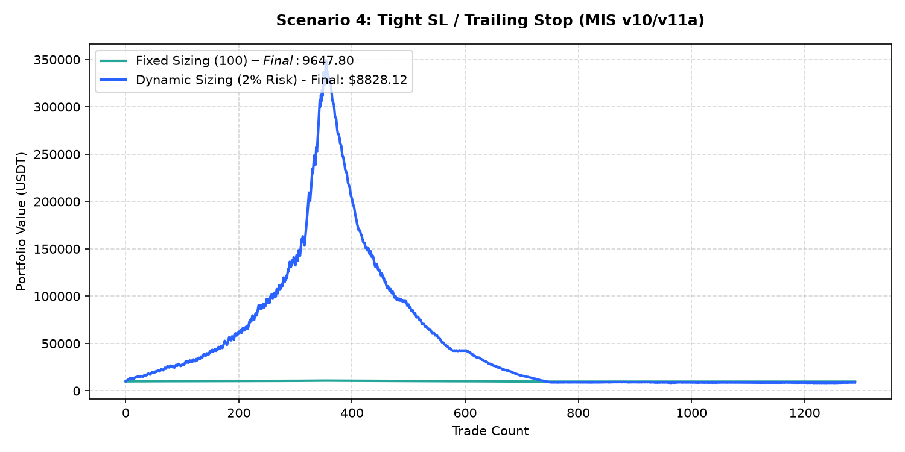

# Performance Report: Scenario 4: Tight SL / Trailing Stop (MIS v10/v11a)

## 1. Description
Volatility-adjusted execution: Entry SL tightened to 1.5 * daily ATR14, TP set to 3.0 * ATR14. Chandelier trailing stop trails the extreme high/low since entry by 2.5 * ATR14. Representing the tight SL and trailing stops from MIS v10/v11a.

- **Total Signals Scanned**: 1296
- **Executed Trades**: 1289
- **Filtered Signals (Skipped)**: 7

---

## 2. Performance Comparison Table

| Sizing Mode | Executed Trades | Final Equity (USDT) | Net Profit (USDT) | Win Rate (%) | Profit Factor | Max Drawdown (%) | Expectancy |
| :--- | :---: | :---: | :---: | :---: | :---: | :---: | :---: |
| **Fixed Sizing ($100)** | 1289 | 9647.80 | -352.20 | 44.8% | 0.87 | 10.54% | -0.2732 |
| **Dynamic Sizing (2% Risk)** | 1289 | 8828.12 | -1171.88 | 44.8% | 1.00 | 97.63% | -0.9091 |

---

## 3. Equity Curve Comparison Chart
The chart below illustrates the cumulative equity curve performance for both Fixed Sizing (USDT P&L scale) and Dynamic Compounding Sizing (2% risk) over time:

---

## 4. Scenario Breakdown Analysis
- **Filter Restrictiveness**: This scenario filtered out 7 signals out of 1296 (Skip Rate: 0.5%).
- **Compounding Sizing Effect**: Dynamic compounding sizing led to an equity of **$8828.12** compared to **$9647.80** in Fixed Sizing.
- **Profitability Verdict**: UNPROFITABLE with a Profit Factor of **1.00** and expectancy **-0.9091** under Dynamic Sizing.
