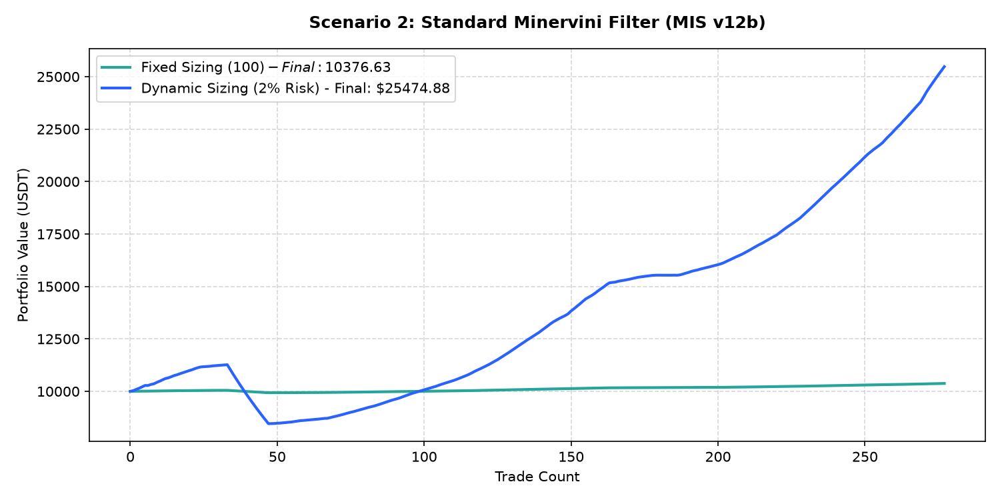

# Performance Report: Scenario 2: Standard Minervini Filter (MIS v12b)

## 1. Description
Strict Minervini SEPA rules: Daily Trend Template score >= 5, daily VCP filter met (vol_contracting < 50%, range_contracting < 50% ATR, near_boundary within 10% of 52w high/low). Representing the strict SEPA setup from MIS v12b.

- **Total Signals Scanned**: 1296
- **Executed Trades**: 277
- **Filtered Signals (Skipped)**: 1019

---

## 2. Performance Comparison Table

| Sizing Mode | Executed Trades | Final Equity (USDT) | Net Profit (USDT) | Win Rate (%) | Profit Factor | Max Drawdown (%) | Expectancy |
| :--- | :---: | :---: | :---: | :---: | :---: | :---: | :---: |
| **Fixed Sizing ($100)** | 277 | 10376.63 | +376.63 | 93.5% | 4.31 | 1.13% | 1.3597 |
| **Dynamic Sizing (2% Risk)** | 277 | 25474.88 | +15474.88 | 93.5% | 6.49 | 24.93% | 55.8660 |

---

## 3. Equity Curve Comparison Chart
The chart below illustrates the cumulative equity curve performance for both Fixed Sizing (USDT P&L scale) and Dynamic Compounding Sizing (2% risk) over time:

---

## 4. Scenario Breakdown Analysis
- **Filter Restrictiveness**: This scenario filtered out 1019 signals out of 1296 (Skip Rate: 78.6%).
- **Compounding Sizing Effect**: Dynamic compounding sizing led to an equity of **$25474.88** compared to **$10376.63** in Fixed Sizing.
- **Profitability Verdict**: PROFITABLE with a Profit Factor of **6.49** and expectancy **55.8660** under Dynamic Sizing.
