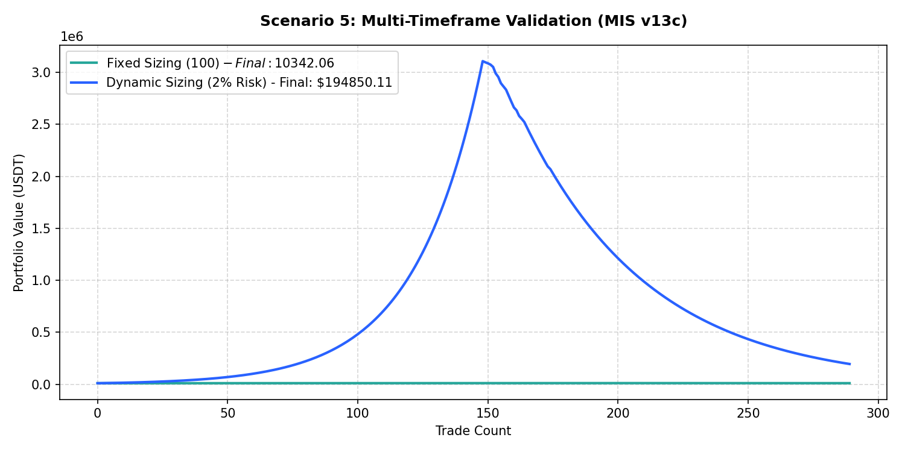

# Performance Report: Scenario 5: Multi-Timeframe Validation (MIS v13c)

## 1. Description
Multi-timeframe validation: Daily Trend Template score >= 5, AND hourly execution trend aligned (hourly EMA20 > EMA50 > EMA200 for long, opposite for short). Representing the MTF daily trend template check from MIS v13c.

- **Total Signals Scanned**: 1015
- **Executed Trades**: 289
- **Filtered Signals (Skipped)**: 726

---

## 2. Performance Comparison Table

| Sizing Mode | Executed Trades | Final Equity (USDT) | Net Profit (USDT) | Win Rate (%) | Profit Factor | Max Drawdown (%) | Expectancy |
| :--- | :---: | :---: | :---: | :---: | :---: | :---: | :---: |
| **Fixed Sizing ($100)** | 289 | 10342.06 | +342.06 | 51.2% | 1.40 | 7.55% | 1.1836 |
| **Dynamic Sizing (2% Risk)** | 289 | 194850.11 | +184850.11 | 51.2% | 1.06 | 93.73% | 639.6198 |

---

## 3. Equity Curve Comparison Chart
The chart below illustrates the cumulative equity curve performance for both Fixed Sizing (USDT P&L scale) and Dynamic Compounding Sizing (2% risk) over time:

---

## 4. Scenario Breakdown Analysis
- **Filter Restrictiveness**: This scenario filtered out 726 signals out of 1015 (Skip Rate: 71.5%).
- **Compounding Sizing Effect**: Dynamic compounding sizing led to an equity of **$194850.11** compared to **$10342.06** in Fixed Sizing.
- **Profitability Verdict**: PROFITABLE with a Profit Factor of **1.06** and expectancy **639.6198** under Dynamic Sizing.
