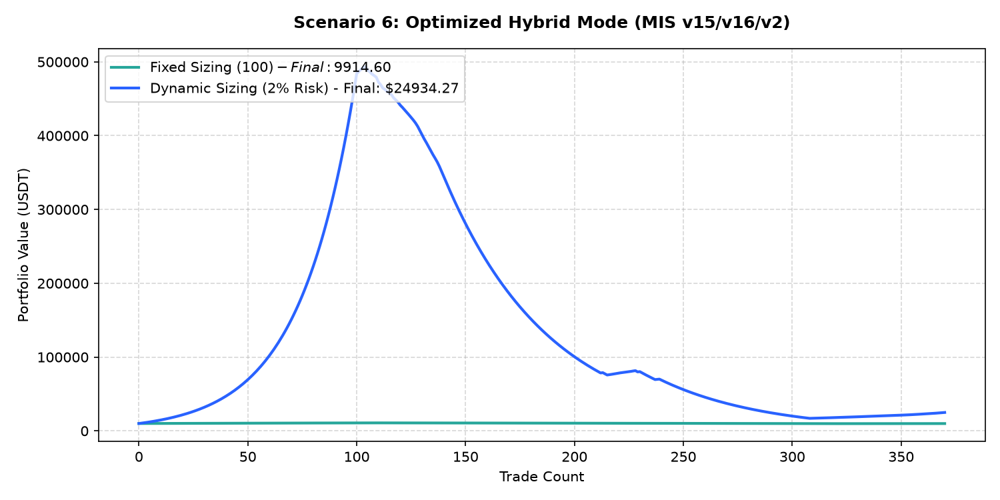

# Performance Report: Scenario 6: Optimized Hybrid Mode (MIS v15/v16/v2)

## 1. Description
Hybrid momentum pullback: Daily Trend Template score >= 5, daily RSI 14 >= 50 (long) or <= 50 (short), daily MACD line > MACD signal line (long) or opposite (short). Representing the optimized hybrid V2 configuration.

- **Total Signals Scanned**: 1296
- **Executed Trades**: 370
- **Filtered Signals (Skipped)**: 926

---

## 2. Performance Comparison Table

| Sizing Mode | Executed Trades | Final Equity (USDT) | Net Profit (USDT) | Win Rate (%) | Profit Factor | Max Drawdown (%) | Expectancy |
| :--- | :---: | :---: | :---: | :---: | :---: | :---: | :---: |
| **Fixed Sizing ($100)** | 370 | 9914.60 | -85.40 | 49.5% | 0.92 | 9.68% | -0.2308 |
| **Dynamic Sizing (2% Risk)** | 370 | 24934.27 | +14934.27 | 49.5% | 1.03 | 96.56% | 40.3629 |

---

## 3. Equity Curve Comparison Chart
The chart below illustrates the cumulative equity curve performance for both Fixed Sizing (USDT P&L scale) and Dynamic Compounding Sizing (2% risk) over time:

---

## 4. Scenario Breakdown Analysis
- **Filter Restrictiveness**: This scenario filtered out 926 signals out of 1296 (Skip Rate: 71.5%).
- **Compounding Sizing Effect**: Dynamic compounding sizing led to an equity of **$24934.27** compared to **$9914.60** in Fixed Sizing.
- **Profitability Verdict**: PROFITABLE with a Profit Factor of **1.03** and expectancy **40.3629** under Dynamic Sizing.
