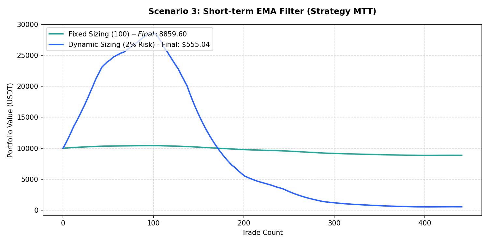

# Performance Report: Scenario 3: Short-term EMA Filter (Strategy MTT)

## 1. Description
Hourly / daily short-term trend stack validation: Daily price > EMA20 > EMA50 > EMA100 (long) or Price < EMA20 < EMA50 < EMA100 (short). Representing the short-term EMA trend stack from MTT v1.005-b.

- **Total Signals Scanned**: 1015
- **Executed Trades**: 441
- **Filtered Signals (Skipped)**: 574

---

## 2. Performance Comparison Table

| Sizing Mode | Executed Trades | Final Equity (USDT) | Net Profit (USDT) | Win Rate (%) | Profit Factor | Max Drawdown (%) | Expectancy |
| :--- | :---: | :---: | :---: | :---: | :---: | :---: | :---: |
| **Fixed Sizing ($100)** | 441 | 8859.60 | -1140.40 | 26.5% | 0.28 | 15.11% | -2.5859 |
| **Dynamic Sizing (2% Risk)** | 441 | 555.04 | -9444.96 | 26.5% | 0.66 | 98.11% | -21.4171 |

---

## 3. Equity Curve Comparison Chart
The chart below illustrates the cumulative equity curve performance for both Fixed Sizing (USDT P&L scale) and Dynamic Compounding Sizing (2% risk) over time:

---

## 4. Scenario Breakdown Analysis
- **Filter Restrictiveness**: This scenario filtered out 574 signals out of 1015 (Skip Rate: 56.6%).
- **Compounding Sizing Effect**: Dynamic compounding sizing led to an equity of **$555.04** compared to **$8859.60** in Fixed Sizing.
- **Profitability Verdict**: UNPROFITABLE with a Profit Factor of **0.66** and expectancy **-21.4171** under Dynamic Sizing.
