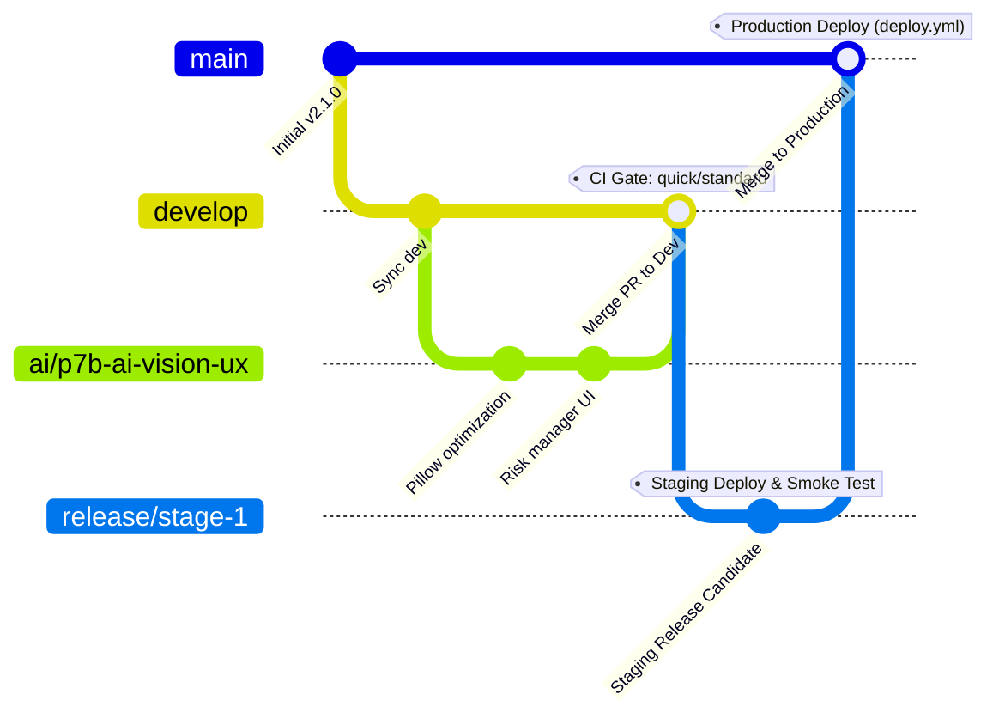

# 📖 Hướng Dẫn Quy Trình Merge & Branching (Trunk-Based + Staging)

Tài liệu này chuẩn hóa quy trình phát triển, tích hợp và triển khai mã nguồn trong hệ sinh thái Angati, áp dụng mô hình **Trunk-Based Development kết hợp Staging (Release-oriented)** nhằm giảm thiểu tối đa xung đột mã nguồn và đảm bảo an toàn tuyệt đối cho môi trường Giao dịch Live.

---

## 1. Sơ đồ Quy trình Git Merge Workflow

Quy trình tích hợp mã nguồn được kiểm soát thông qua các cổng thử nghiệm tự động (Harness Gates) của hệ thống CI/CD:



---

## 2. Quy Định và Vai Trò Của Từng Nhánh

### Nhánh 1: Nhánh Tính Năng Con (Feature Branches - Quy chuẩn 2-Nhánh-1-Quy-tắc)
*   **Mục tiêu:** Nơi các kỹ sư phát triển tính năng độc lập, phân nhóm rõ ràng theo tiền tố:
    *   **Nhóm A: Nhánh `infra/*` (Infrastructure & Core)**
        *   *Phạm vi:* Chứa hạ tầng, refactor, logic lõi (Core Logic) và thuật toán giao dịch (Strategy).
        *   *Mục tiêu:* Độ ổn định cao tuyệt đối. (Ví dụ: `infra/strategy-crystallization`).
    *   **Nhóm B: Nhánh `ai/*` (AI & UX)**
        *   *Phạm vi:* Chứa các tính năng trí tuệ nhân tạo, giao diện người dùng (UI/UX) và tương tác.
        *   *Mục tiêu:* Tốc độ phát triển và trải nghiệm người dùng nhanh chóng. (Ví dụ: `ai/p7b-ai-vision-ux`).
    *   *Tiền tố cũ:* Khai tử hoàn toàn tiền tố `feat/*` và `feature/*`.
*   **Quy tắc:**
    1.  Tách nhánh từ `develop`.
    2.  **Trước khi commit:** Bắt buộc chạy kiểm thử chất lượng và bảo mật cục bộ:
        ```bash
        python scripts/local_security_gate.py check
        ```
        Để tự động hóa, chạy `python scripts/local_security_gate.py setup` một lần để cài đặt pre-commit hooks.
    3.  Đảm bảo mã nguồn đạt tiêu chuẩn **0 lỗi Ruff Lint** và vượt qua các cổng Mini-MDASH trước khi push.

### Nhánh 2: `develop` (Integration Branch - Giữ nguyên trạng)
*   **Mục tiêu:** Điểm tích hợp chung cho cả nhánh `infra/*` và `ai/*` đang phát triển song song.
*   **Quy tắc:**
    1.  Không được push trực tiếp lên `develop`. Mọi thay đổi phải thông qua **Pull Request (PR)** từ các nhánh con.
    2.  Nhánh `develop` được giữ nguyên tên để bảo toàn cấu hình CI/CD hiện có và tránh làm sập pipeline. Khi PR vào `develop`, hệ thống CI sẽ tự động chạy `test_depth: quick` (unit tests nhẹ, ~3 phút).

### Nhánh Sửa Lỗi: `fix/*` và `hotfix/*`
*   **Mục tiêu:** Sửa lỗi hệ thống cục bộ hoặc khẩn cấp.
*   **Quy tắc:**
    1.  Để hỗ trợ CI/CD chạy đúng bộ kiểm thử Standard (~8 phút) hoặc Hotfix+Deploy, **bắt buộc** giữ nguyên tiền tố `fix/*` hoặc `hotfix/*`.
    2.  Phân luồng lỗi theo cấu trúc:
        *   `fix/infra-<topic>` (Sửa lỗi Core/Hạ tầng - Nhóm A)
        *   `fix/ai-<topic>` (Sửa lỗi AI/UX - Nhóm B)
        *   `hotfix/<infra-hoặc-ai>-<topic>` (Sửa lỗi khẩn cấp trực tiếp lên production)

### Nhánh Nghiên Cứu: `research/*` hoặc `spike/*`
*   **Mục tiêu:** Thử nghiệm thuật toán, phân tích số liệu không tích hợp trực tiếp vào production.
*   **Quy tắc:** Bắt buộc dùng tiền tố `research/` hoặc `spike/` để CI/CD bỏ qua kiểm thử (`test_depth: skip`).

### Nhánh 3: `release/stage-1` (Release & Staging Branch)
*   **Mục tiêu:** Môi trường tiền sản xuất (Staging) để xác thực hệ thống với dữ liệu thực tế và chạy kiểm thử khói.
*   **Quy tắc:**
    1.  Khi các tính năng trên `develop` đã ổn định và sẵn sàng cho một chu kỳ phát hành, tạo PR để merge từ `develop` sang `release/stage-1`.
    2.  Hành động này kích hoạt [ci.yml](file:///c:/Users/pesil/working/mj_trading/TradingViewProject/.github/workflows/ci.yml) với mức độ `test_depth: full` (chạy toàn bộ 575+ tests gồm E2E & Security, ~20 phút).
    3.  Khi CI thành công, [staging.yml](file:///c:/Users/pesil/working/mj_trading/TradingViewProject/.github/workflows/staging.yml) sẽ tự động deploy bản build mới lên môi trường Staging và chạy **Staging Smoke Tests** (kiểm thử liveness, kết nối API, CDP Keep-Alive).

### Nhánh 4: `main` (Production Branch)
*   **Mục tiêu:** Nhánh chứa mã nguồn ổn định nhất đang chạy trực tiếp trên các máy chủ giao dịch sản xuất.
*   **Quy tắc:**
    1.  Chỉ merge từ `release/stage-1` vào `main` sau khi tất cả các kiểm thử khói trên Staging đạt trạng thái **PASS**.
    2.  Sau khi merge vào `main`, workflow [deploy.yml](file:///c:/Users/pesil/working/mj_trading/TradingViewProject/.github/workflows/deploy.yml) sẽ tự động kích hoạt để build Docker images mới và cập nhật trực tiếp lên các VPS sản xuất (**Server A + Server C**) mà không cần bất kỳ can thiệp thủ công nào.

---

## 3. Kiến Thức Tích Lũy Kỹ Thuật (Knowledge Ingestion)

> [!IMPORTANT]
> **Các bài học đắt giá cần ghi nhớ cho chu kỳ phát triển sau:**
> *   **Hải quan Ngữ nghĩa (SCAR-001):** Không bao giờ merge code nếu chưa chạy qua Mini-MDASH Scanner để phát hiện sớm các cấu hình cứng nhạy cảm (như Mock API Key).
> *   **OS Safeguard (SCAR-002):** Khi deploy trên môi trường sản xuất (như Server C), hãy chắc chắn phân quyền ghi chính xác cho user không đặc quyền (`trader` - UID `999:999`) trên các thư mục dùng chung (như `/screenshots`), tránh để thư mục thuộc quyền sở hữu của `root`.
> *   **Tránh bẫy phản hồi suy thoái của Circuit Breaker:** Khi viết các sidecar HTTP như `agy-bridge.py` để chạy chế độ đua song song (CLI vs API), các tác vụ bị hủy do đối phương thắng cuộc **không được phép** ghi nhận là lỗi hệ thống (`success=False`). Luôn dùng cơ chế **Tự phục hồi thăm dò (Self-Healing Probing)** định kỳ để cập nhật trạng thái khả dụng thực tế của CLI.
