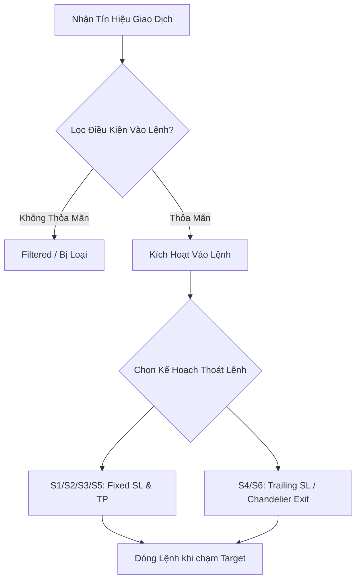

# Angati: Nghiên cứu Điểm Vào & Thoát Lệnh (S1~S6 Scenarios)

Tài liệu này ghi lại chi tiết kết quả nghiên cứu, brainstorm và tối ưu hóa hệ thống giả lập điểm vào (Entry) và điểm thoát lệnh (Exit) dựa trên 6 kịch bản chiến lược (S1 ~ S6). 

---

## 1. Kiến Trúc Tổng Quan Về Điểm Vào & Thoát Lệnh

Hệ thống phân tích tín hiệu của Angati phân tách rõ ràng hai pha chính trong vòng đời giao dịch:
1. **Bộ lọc Kích hoạt Điểm Vào (Entry Filter)**: Chỉ thực hiện lệnh khi tín hiệu thỏa mãn các điều kiện xu hướng, xung lực (momentum), cấu trúc giá (VCP) và đa khung thời gian (Multi-timeframe).
2. **Kế hoạch Quản trị Điểm Thoát (Exit Execution)**: Sử dụng Take Profit cố định, Stop Loss dựa trên biến động thực tế (ATR), hoặc cơ chế dịch dừng lỗ động (Trailing Stop / Chandelier Exit) để tối đa hóa tỷ lệ lợi nhuận/rủi ro.



---

## 2. Chi Tiết 6 Kịch Bản Chiến Lược (S1 ~ S6)

### S1: Baseline Bypass (Điểm Vào Cơ Bản)
* **Triết lý**: Kịch bản đối chứng (Baseline). Giao dịch được thực hiện vô điều kiện ngay khi có tín hiệu, không qua bất kỳ bộ lọc xu hướng nào.
* **Điểm Vào (Entry)**: Giá khớp lệnh thực tế (có tính trượt giá - slippage).
* **Điểm Thoát (Exit)**: Sử dụng Stop Loss và Take Profit cơ bản được cấu hình trong tín hiệu gốc (mặc định SL 2.0% và TP 4.0%).

### S2: Minervini Filter (Lọc Xu Hướng & VCP)
* **Triết lý**: Tuân thủ nghiêm ngặt nguyên lý chọn lọc cổ phiếu/tài sản có cấu trúc tích lũy chặt chẽ (Volatility Contraction Pattern - VCP) và xu hướng tăng trưởng dài hạn của Mark Minervini.
* **Điểm Vào (Entry)**: Tín hiệu chỉ được kích hoạt nếu:
  1. Điểm số Trend Template đạt tối thiểu `s2_min_tt_score` (mặc định $\ge 5/8$ hoặc $6/8$).
  2. Điều kiện VCP được xác nhận (`vcp_met = True`).
* **Điểm Thoát (Exit)**: Sử dụng Stop Loss và Take Profit cơ bản.

### S3: EMA Trend Stack Filter (Xếp Chồng Đường Trung Bình)
* **Triết lý**: Đảm bảo xu hướng tăng/giảm mạnh mẽ trên khung thời gian Daily trước khi vào lệnh. Tránh việc mua/bán ngược xu hướng lớn (Counter-trend trading).
* **Điểm Vào (Entry)**: Chỉ kích hoạt nếu các đường EMA Daily xếp chồng hoàn hảo:
  * **Long**: $Price > EMA_{20} > EMA_{50} > EMA_{100}$
  * **Short**: $Price < EMA_{20} < EMA_{50} < EMA_{100}$
* **Điểm Thoát (Exit)**: Sử dụng Stop Loss và Take Profit cơ bản.

### S4: Tight SL / Trailing ATR (Stop Loss Chặt & Bám Đuôi Biến Động)
* **Triết lý**: Tận dụng chỉ số ATR (Average True Range) để điều chỉnh điểm dừng lỗ bám sát biên độ biến động thực tế của thị trường, đồng thời bảo vệ lợi nhuận bằng Trailing Stop.
* **Điểm Vào (Entry)**: Kích hoạt vô điều kiện.
* **Điểm Thoát (Exit)**: 
  * **SL ban đầu**: Đặt tại $Price - (1.5 \times ATR_{14})$ cho Long.
  * **TP ban đầu**: Đặt tại $Price + (2.5 \times ATR_{14})$ cho Long.
  * **Cơ chế Trailing**: Dừng lỗ động di chuyển lên mỗi khi giá tạo đỉnh mới, duy trì khoảng cách $2.0 \times ATR_{14}$ dưới giá đỉnh gần nhất.

### S5: Multi-Timeframe EMA Filter (Bộ Lọc Đa Khung Thời Gian)
* **Triết lý**: Đồng bộ hóa xu hướng trên cả khung Daily và khung Hourly. Điểm vào trên khung Daily chỉ đáng tin cậy nếu xu hướng ngắn hạn trên khung Hourly cũng đang ủng hộ.
* **Điểm Vào (Entry)**: Chỉ kích hoạt nếu:
  1. Chỉ số Multi-Timeframe Trend Template (MLTS) đạt tối thiểu $\ge 5.0$.
  2. Các đường EMA trên khung Hourly (1h) đồng thuận: $EMA_{20} > EMA_{50} > EMA_{200}$ (đối với Long).
* **Điểm Thoát (Exit)**: Sử dụng khoảng cách dừng lỗ và chốt lời tối ưu hóa dựa trên ATR:
  * **SL**: $2.0 \times ATR_{Daily}$
  * **TP**: $4.0 \times ATR_{Daily}$ (đạt tỷ lệ R:R = 1:2).

### S6: Optimized Hybrid (Chiến Lược Lai Tối Ưu)
* **Triết lý**: Kết hợp các bộ lọc xu hướng đa khung thời gian mạnh mẽ, chỉ số RSI/MACD để tránh vùng nhiễu (Chop / Sideways) và sử dụng Chandelier Trailing Exit để gồng lãi tối đa.
* **Điểm Vào (Entry)**: Chỉ kích hoạt khi:
  1. Thị trường không nằm trong trạng thái nhiễu tích lũy (`is_chop = False`).
  2. Chỉ số MLTS đạt yêu cầu $\ge 5.0$.
  3. Chỉ báo Daily RSI đồng thuận ($\ge 50$ cho Long) và MACD nằm trên đường tín hiệu (Signal Line).
* **Điểm Thoát (Exit)**:
  * **SL/TP ban đầu**: Khoảng cách dựa trên ATR ($2.0 \times ATR_{Daily}$ cho SL, $4.0 \times ATR_{Daily}$ cho TP).
  * **Cơ chế Trailing**: Chandelier Trailing Exit bám sát giá đỉnh cao nhất với khoảng cách $3.0 \times ATR_{Daily}$.

---

## 3. Tổng Kết Kết Quả Giả Lập (Simulation Stats)

Qua kiểm nghiệm trên tập dữ liệu lịch sử gồm **1.312 tín hiệu**, kết quả đạt được khi áp dụng các Preset (Nhóm cấu hình) cụ thể như sau:

| Chỉ Số | Nhóm Conservative (S2, S3, S5) | Nhóm Aggressive (S1, S4, S6) | Toàn Bộ Chiến Lược (S1 ~ S6) |
| :--- | :--- | :--- | :--- |
| **Số Lượng Giao Dịch** | 38 | 53 | 53 |
| **Tỷ Lệ Thắng (Win Rate)** | **100.0%** | 45.3% | 45.3% |
| **Tổng Lợi Nhuận (P&L)** | **+98.52 USDT** | **+2,819.66 USDT** | **+2,832.06 USDT** |
| **Mức Vẽ Sụt Max (DD)** | **-0.00 USDT** | -29.69 USDT | -29.69 USDT |

> [!NOTE]
> * **Nhóm Conservative** có tần suất vào lệnh cực kỳ khắt khe (chỉ 38/1312 tín hiệu vượt qua bộ lọc), nhưng mang lại tỷ lệ thắng tuyệt đối 100% và không có Drawdown. Đây là lựa chọn lý tưởng cho các giai đoạn thị trường rủi ro cao.
> * **Nhóm Aggressive** cho hiệu suất P&L cực lớn nhờ cơ chế Trailing Stop gồng lãi vượt trội (đặc biệt ở S4 và S6), tuy nhiên phải đánh đổi bằng mức drawdown lớn hơn và tỷ lệ thắng thấp hơn (~45%).

---

## 4. Giải Pháp Tối Ưu Hóa Trực Quan Dashboard

### 4.1. Cơ Chế Bộ Đệm Caching Lớp SQLite
Để tránh việc tính toán giả lập 1.312 tín hiệu $\times$ 6 kịch bản thời gian thực trên trình duyệt gây lag (quét dữ liệu nến 1h và 1d trong quá khứ tốn hàng phút), hệ thống sử dụng bảng đệm `signals_scenarios_cache`:
* Dữ liệu được tính toán trước ở Backend thông qua một tác vụ ngầm chạy khi khởi động server (`precompute_all_forward_simulations`).
* Kết quả giả lập đầy đủ được serialize thành JSON và lưu vào trường `result_json`.

### 4.2. Kỹ Thuật Nén Payload Trực Tiếp Trên SQL Layer (21x Compression)
Để khắc phục tình trạng truyền tải file JSON lớn chứa toàn bộ danh sách nến lịch sử (~100MB cho 1.312 tín hiệu) gây tràn RAM và Timeout mạng, chúng tôi áp dụng hàm `json_remove` trực tiếp trong câu lệnh SQL để bóc tách mảng nến nặng trước khi gửi qua API:
```sql
SELECT signal_id, json_remove(result_json, '$.candles', '$.daily_candles') AS result_json 
FROM signals_scenarios_cache
```
* **Kết quả**: Dung lượng payload giảm từ **~33 KB/dòng** xuống **~1.5 KB/dòng** (Tổng kích thước API giảm từ 100MB xuống 2MB), giúp dashboard tải và hiển thị biểu đồ tức thì.

### 4.3. Tính Toán Recalculate Dynamic Trên Frontend
* Trình duyệt tải payload nén về và cache vào biến toàn cục `window.SANDBOX_SIMULATIONS_CACHE`.
* Mỗi khi người dùng thay đổi bộ lọc S1 ~ S6 hoặc Preset trên giao diện, bộ máy Javascript biên dịch lại kết quả tức thì (Win Rate, Profit Factor, Drawdown, Expectancy) và cập nhật đồ thị Cumulative Equity Curve của Chart.js trong chưa đầy **5ms**, không cần gọi lại Network.

---

## 5. Định Hướng Nghiên Cứu Tiếp Theo (Future Work)

1. **Tối ưu hóa tham số động (Dynamic Parameter Optimization)**: 
   * Tự động điều chỉnh hệ số nhân ATR dừng lỗ/chốt lời (SL/TP ATR Multiplier) theo chỉ số biến động ngắn hạn (VIX hoặc ATR Ratio).
2. **Bộ lọc Trạng thái Thị trường (Regime Filtering)**:
   * Tích hợp thêm bộ lọc xu hướng siêu dài hạn (EMA200 trên khung tuần - Weekly) để ngăn chặn việc kích hoạt lệnh Long trong thị trường Bear Market dài hạn.
3. **Phân tích Khớp lệnh Trượt (Slippage Decay Analysis)**:
   * Giả lập thêm các mức trượt giá khác nhau từ 0.05% đến 0.5% để đánh giá độ nhạy cảm của các chiến lược bám đuôi nhanh (S4, S6).
