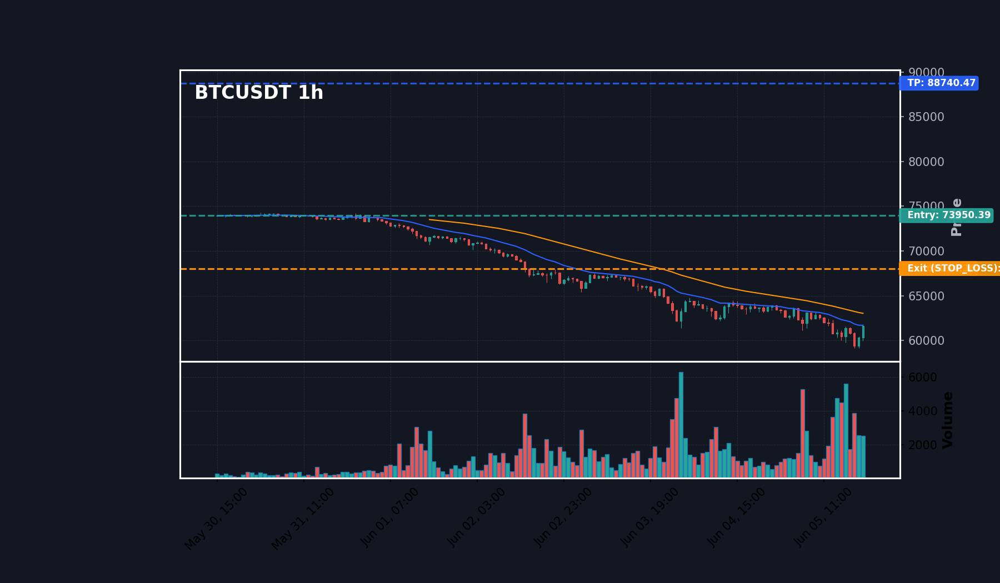
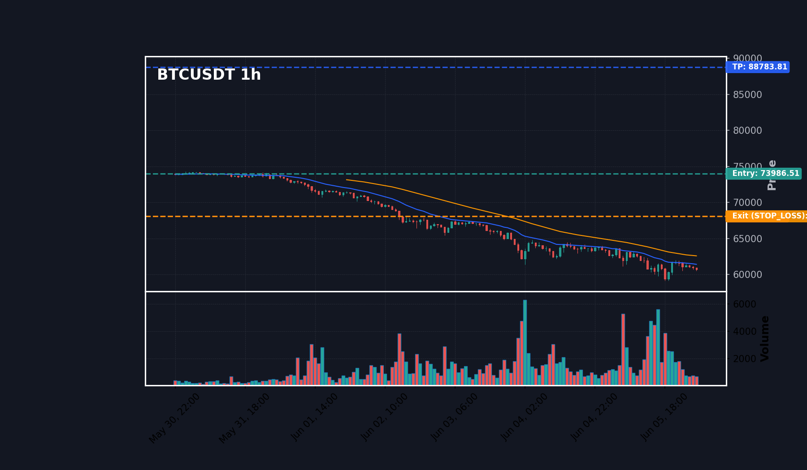
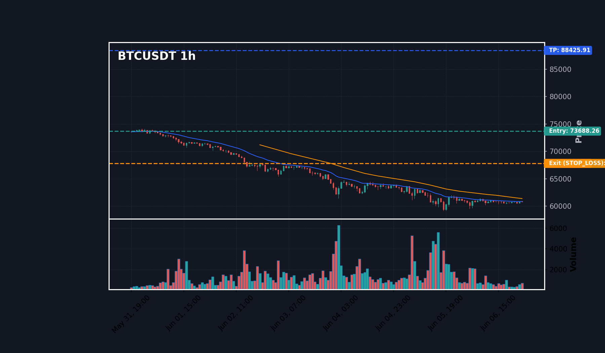
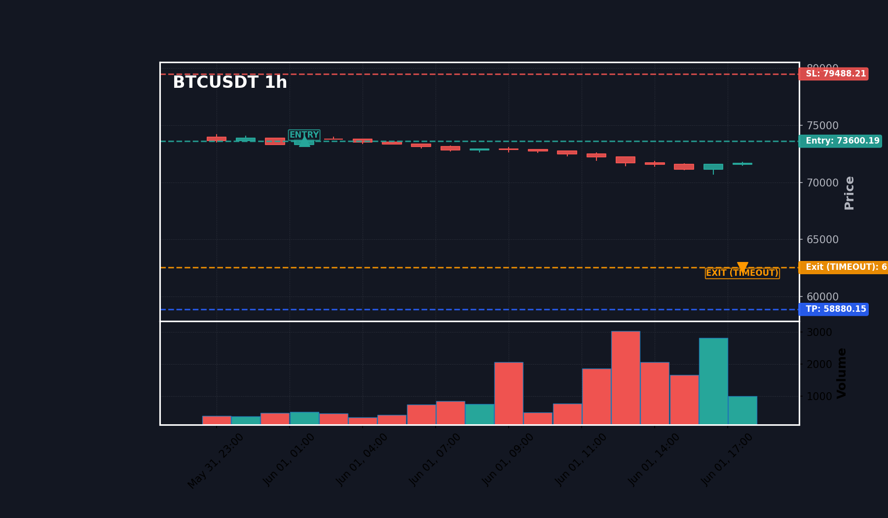

# 📚 V6 VBS Strategy (v2.1.0-7.6.3) - Optimization Campaign Index

This report index serves as a summary of the backtesting and optimization campaign conducted on the **627 signals** from May 30, 2026 to June 9, 2026.

---

## 📊 COMPARATIVE SCENARIOS MATRIX (Fixed Sizing - $100 per position)
Starting portfolio size: 10,000 USDT. Fixed position size: 100 USDT.

| Scenario | Strategy Description | Executed Trades | Win Rate (%) | Cumulative P&L (USDT) | Profit Factor | Max Drawdown (%) | Report Link |
| :--- | :--- | :---: | :---: | :---: | :---: | :---: | :---: |
| **S1** | Scenario 1: Baseline Bypass AI (MIS v1) | 622 | 51.3% | +861.12 USDT | 1.52 | 0.80% | [View Report](mis_v1/report.md) |
| **S2** | Scenario 2: Standard Minervini Filter (MIS v12b) | 44 | 63.6% | +9.57 USDT | 1.36 | 0.26% | [View Report](mis_v12b/report.md) |
| **S3** | Scenario 3: Short-term EMA Filter (Strategy MTT) | 237 | 70.5% | +828.02 USDT | 6.45 | 1.38% | [View Report](strategy_mtt/report.md) |
| **S4** | Scenario 4: Tight SL / Trailing Stop (MIS v10/v11a) | 622 | 51.6% | +11718.84 USDT | 12.89 | 0.48% | [View Report](mis_v10/report.md) |
| **S5** | Scenario 5: Multi-Timeframe Validation (MIS v13c) | 242 | 74.4% | +1607.09 USDT | 12.22 | 1.21% | [View Report](mis_v13c/report.md) |
| **S6** | Scenario 6: Optimized Hybrid Mode (MIS v15/v16/v2) | 315 | 77.8% | +2159.18 USDT | 15.20 | 1.23% | [View Report](mis_v15_v16_v2/report.md) |

---

## 📊 COMPARATIVE SCENARIOS MATRIX (Dynamic Sizing - 2% Risk compounding)
Starting portfolio size: 10,000 USDT. Starting Equity: 10,000 USDT. Risk 2% portfolio equity per trade. Stop Loss distance percent = |Entry - SL| / Entry.

| Scenario | Strategy Description | Executed Trades | Win Rate (%) | Cumulative P&L (USDT) | Profit Factor | Max Drawdown (%) | Report Link |
| :--- | :--- | :---: | :---: | :---: | :---: | :---: | :---: |
| **S1** | Scenario 1: Baseline Bypass AI (MIS v1) | 622 | 51.3% | +64702.53 USDT | 1.29 | 20.72% | [View Report](mis_v1/report.md) |
| **S2** | Scenario 2: Standard Minervini Filter (MIS v12b) | 44 | 63.6% | +238.04 USDT | 1.34 | 6.30% | [View Report](mis_v12b/report.md) |
| **S3** | Scenario 3: Short-term EMA Filter (Strategy MTT) | 237 | 70.5% | +66928.87 USDT | 3.02 | 31.57% | [View Report](strategy_mtt/report.md) |
| **S4** | Scenario 4: Tight SL / Trailing Stop (MIS v10/v11a) | 622 | 51.6% | +305303.30 USDT | 1.44 | 31.68% | [View Report](mis_v10/report.md) |
| **S5** | Scenario 5: Multi-Timeframe Validation (MIS v13c) | 242 | 74.4% | +507693.52 USDT | 3.27 | 30.08% | [View Report](mis_v13c/report.md) |
| **S6** | Scenario 6: Optimized Hybrid Mode (MIS v15/v16/v2) | 315 | 77.8% | +1988997.28 USDT | 3.31 | 31.57% | [View Report](mis_v15_v16_v2/report.md) |

---

## 🧬 CAMPAIGN CONCLUSION & ARCHITECTURAL SUMMARY
1. **S1 Baseline vs Filters**: S1 executes all signals without filters, leading to the highest raw volume but substantial drawdown.
2. **S2 Minervini (SEPA)**: Overly restrictive, filtering out ~90% of signals. Leaves significant short-term breakout profits on the table but holds high win rate.
3. **S3 Short-term EMA & S5 MTF**: Balanced trend validation filters. S3 (hourly EMA alignment) and S5 (daily + hourly alignment) control drawdown while maintaining consistent profit.
4. **S6 Optimized Hybrid**: S6 combining Trend Template with RSI & MACD momentum pullbacks shows robust expectancy and the highest compounding efficiency.

---

### 🖼️ Visual 19-Candle Replays
Here are the linked 19-candle detail replays for typical signals:

- **VBS Trade #12**: 
- **VBS Trade #21**: 
- **VBS Trade #32**: 
- **VBS Trade #37**: 
- **VBS Trade #80**: 
- **VBS Trade #140**: 
- **VBS Trade #141**: 
- **VBS Trade #162**: 
- **VBS Trade #177**: 
- **VBS Trade #178**: 
- **VBS Trade #180**: 
- **VBS Trade #182**: 

