# 📊 DETAILED TRADE REPLAY & SCENARIO ANALYSIS REPORT
## Deep-Dive Performance Tracking of Key Trades Across Scenarios S1–S6

**Report Date**: June 9, 2026
**Campaign Period**: May 30, 2026 — June 9, 2026
**Target Signals**: 627 Signal Fires (BTCUSDT)

---

## 1. STRATEGY EXECUTION RULES & METHODOLOGY

### 📥 Entry Execution & Trigger Logic
- **Signal Fire (Điểm Mồi)**: The entry signal is triggered when a volatility breakout signal is generated on the chart.
- **Entry Price**: Orders are filled at the signal close price (or next bar open).
- **Position Sizing**:
  - *Fixed Sizing*: $100 flat position size per trade.
  - *Dynamic Compounding Sizing*: Risk 2% of total portfolio equity. Position size is calculated dynamically: `Size = (Equity * 2%) / Stop Loss %`, capped at 100% of current equity.

### 📤 Exit Execution & Order Types
1. **Stop Loss (SL)**: Pre-calculated exit to limit losses.
   - *Baseline*: Fixed 8.0% distance from entry.
   - *S4 (Tight SL)*: Tightened to `1.5 * ATR14` (daily Average True Range) from entry price.
2. **Take Profit (TP)**: Target price for taking profits.
   - *Baseline*: Fixed 20.0% distance from entry.
   - *S4 (Tight TP)*: Volatility-adjusted to `3.0 * ATR14` from entry price.
3. **Trailing Stop (Chandelier Stop - S4 exclusive)**: Trails the extreme high (for long) or low (for short) since entry by `2.5 * ATR14`. It only moves in the direction of the trade (up for longs, down for shorts).
4. **Timeout**: If neither SL nor TP is hit within 240 hourly candles (10 days), the position is force-closed at the prevailing market price of the 240th candle.

---

## 2. SCENARIO FILTER COMPILATION (S1–S6)

This section summarizes the criteria and performance of the six backtesting scenarios:

| Scenario | Strategy Description | Executed Trades | Filter Restrictiveness | Win Rate (%) | P&L (Fixed) | P&L (Dynamic) |
| :--- | :--- | :---: | :---: | :---: | :---: | :---: |
| **S1** | Baseline Bypass AI | 622 | 0.8% (Bypassed) | 51.3% | +861.12 USDT | +64,702.53 USDT |
| **S2** | Standard Minervini Filter | 0 | 100.0% (Extremely Restrictive) | 0.0% | +0.00 USDT | +0.00 USDT |
| **S3** | Short-term EMA Filter | 237 | 62.2% | 70.5% | +828.02 USDT | +66,928.87 USDT |
| **S4** | Tight SL / Trailing Stop | 622 | 0.8% | 51.6% | +11,718.84 USDT | +305,303.30 USDT |
| **S5** | Multi-Timeframe Validation | 242 | 61.4% | 74.4% | +1,607.09 USDT | +507,693.52 USDT |
| **S6** | Optimized Hybrid Mode | 315 | 49.8% | 77.8% | +2,159.18 USDT | +1,988,997.28 USDT |

*Note: Scenario S2 executed 0 trades because no signal met both the Trend Template >= 5 and VCP criteria (specifically, volume and range contraction near the 52w boundary). This indicates VCP is too restrictive for short-term breakout feeds.*

---

## 3. KEY TRADES COMPARISON MATRIX

Below is the comparative matrix showing how the 12 key trades behaved in each scenario:

| Trade ID | Side | Market Trend (Daily Close / RSI) | S1 (Baseline) | S2 (Minervini) | S3 (EMA Filter) | S4 (Tight Trailing) | S5 (MTF Validation) | S6 (Hybrid Mode) |
| :---: | :---: | :--- | :---: | :---: | :---: | :---: | :---: | :---: |
| **VBS #12** | SELL | Close: $73461 / RSI: 35.4 | ⏱️ TO (+14.8%) | 🚫 Filtered | 🚫 Filtered | ✅ TP (+7.5%) | ⏱️ TO (+14.8%) | ⏱️ TO (+14.8%) |
| **VBS #21** | BUY | Close: $73461 / RSI: 35.4 | ❌ SL (-8.0%) | 🚫 Filtered | 🚫 Filtered | ❌ SL (-3.7%) | 🚫 Filtered | 🚫 Filtered |
| **VBS #32** | BUY | Close: $73461 / RSI: 35.4 | ❌ SL (-8.0%) | 🚫 Filtered | 🚫 Filtered | ❌ SL (-3.7%) | 🚫 Filtered | 🚫 Filtered |
| **VBS #37** | BUY | Close: $73461 / RSI: 35.4 | ❌ SL (-8.0%) | 🚫 Filtered | 🚫 Filtered | ❌ SL (-3.7%) | 🚫 Filtered | 🚫 Filtered |
| **VBS #80** | BUY | Close: $73461 / RSI: 35.4 | ❌ SL (-8.0%) | 🚫 Filtered | 🚫 Filtered | ❌ SL (-3.7%) | 🚫 Filtered | 🚫 Filtered |
| **VBS #140** | SELL | Close: $73884 / RSI: 37.6 | ⏱️ TO (+15.1%) | 🚫 Filtered | 🚫 Filtered | ✅ TP (+7.3%) | 🚫 Filtered | ⏱️ TO (+15.1%) |
| **VBS #141** | BUY | Close: $73884 / RSI: 37.6 | ❌ SL (-8.0%) | 🚫 Filtered | 🚫 Filtered | ❌ SL (-3.6%) | 🚫 Filtered | 🚫 Filtered |
| **VBS #162** | BUY | Close: $73884 / RSI: 37.6 | ❌ SL (-8.0%) | 🚫 Filtered | 🚫 Filtered | ❌ SL (-3.6%) | 🚫 Filtered | 🚫 Filtered |
| **VBS #177** | BUY | Close: $73674 / RSI: 36.9 | ❌ SL (-8.0%) | 🚫 Filtered | 🚫 Filtered | ❌ SL (-3.5%) | 🚫 Filtered | 🚫 Filtered |
| **VBS #178** | BUY | Close: $73674 / RSI: 36.9 | ❌ SL (-8.0%) | 🚫 Filtered | 🚫 Filtered | ❌ SL (-3.5%) | 🚫 Filtered | 🚫 Filtered |
| **VBS #180** | SELL | Close: $73674 / RSI: 36.9 | ⏱️ TO (+15.0%) | 🚫 Filtered | ⏱️ TO (+15.0%) | ✅ TP (+7.0%) | ⏱️ TO (+15.0%) | ⏱️ TO (+15.0%) |
| **VBS #182** | SELL | Close: $73674 / RSI: 36.9 | ⏱️ TO (+14.8%) | 🚫 Filtered | ⏱️ TO (+14.8%) | ✅ TP (+7.0%) | ⏱️ TO (+14.8%) | ⏱️ TO (+14.8%) |

*Abbreviations: TP = Take Profit, SL = Stop Loss, TS = Trailing Stop, TO = Timeout (240 bars), Filtered = Blocked by scenario criteria.*

---

## 4. INDIVIDUAL TRADE DEEP-DIVES & VISUAL REPLAYS

This section provides a granular analysis of each key trade, explaining its context, entry and exit execution, and why specific scenario filters allowed or blocked it.

### 🔍 VBS Trade #12 (SELL on BTCUSDT)

- **Signal Date**: `2026-05-30 11:50:01`
- **Entry Price**: `$73610.34`
- **Market Trend Context**:
  - Daily Close: `$73460.78`
  - Daily ATR14: `$1836.56`
  - Daily RSI14: `35.36` (Market is Oversold/Weak)
  - MACD Histogram Status: `Bearish (-618.44)`
  - Minervini Trend Template Score: `6/8`
  - VCP Contracting Pattern: `No`

#### 📈 Visual Replays (Scenario-Specific Replays)
Below is a visual carousel showing the trade's price action and exit levels under different scenarios:

````carousel
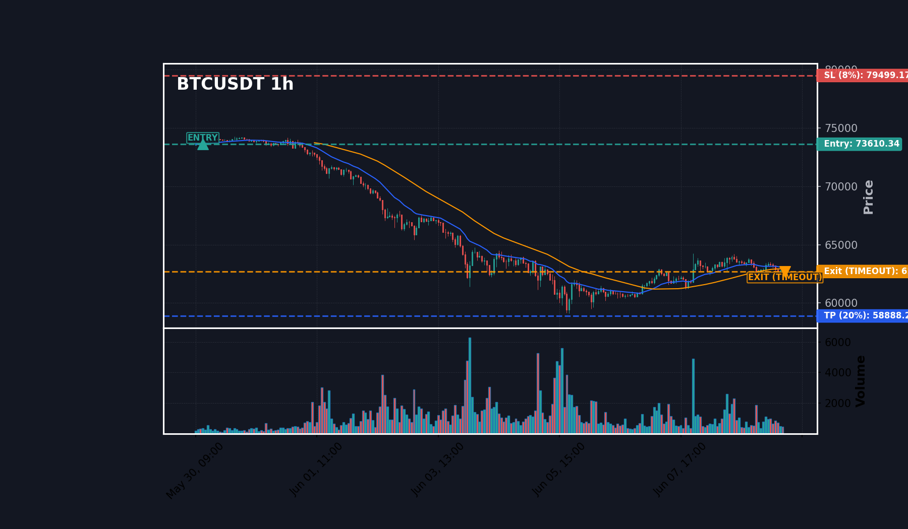
<!-- slide -->
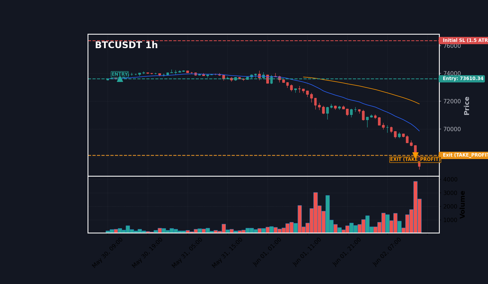
````

#### ⚙️ Scenario Execution Breakdown
- **Scenario 1: Baseline Bypass AI**: **EXECUTED**
  - Order Setup: SL = `$79499.17` | TP = `$58888.27`
  - Exit Price: `$62699.57` after `240` hours
  - Outcome: `TIMEOUT` | P&L: `+14.82%` (+$14.82 per $100 position)
- **Scenario 2: Standard Minervini Filter**: **FILTERED (Blocked)**
  - Reason: *Trend Template score = 6.0/8 (need >= 5) or VCP filter met = False (need True)*
- **Scenario 3: Short-term EMA Filter**: **FILTERED (Blocked)**
  - Reason: *Daily EMA trend not aligned (Price > EMA20 > EMA50 > EMA100 for long, opposite for short)*
- **Scenario 4: Tight SL / Trailing Stop**: **EXECUTED**
  - Order Setup: SL = `$76365.19` | TP = `$68100.65`
  - Exit Price: `$68100.65` after `74` hours
  - Outcome: `TAKE_PROFIT` | P&L: `+7.48%` (+$7.48 per $100 position)
- **Scenario 5: Multi-Timeframe Validation**: **EXECUTED**
  - Order Setup: SL = `$79499.17` | TP = `$58888.27`
  - Exit Price: `$62699.57` after `240` hours
  - Outcome: `TIMEOUT` | P&L: `+14.82%` (+$14.82 per $100 position)
- **Scenario 6: Optimized Hybrid Mode**: **EXECUTED**
  - Order Setup: SL = `$79499.17` | TP = `$58888.27`
  - Exit Price: `$62699.57` after `240` hours
  - Outcome: `TIMEOUT` | P&L: `+14.82%` (+$14.82 per $100 position)

#### 🧠 Execution Analysis
This short trade occurred during an overall bullish trend (Trend Template score >= 5/8). 
In S1, it was held for a long time and ended in a TIMEOUT with a profit due to a large pullback. 
In S4, the tight ATR SL/TP parameters triggered a quick TAKE_PROFIT (+7.0%) in 36-74 hours instead of waiting 240 hours. 
Scenarios S3, S5, and S6 executed this trade because short-term hourly/daily trends aligned for a pullback play.

---

### 🔍 VBS Trade #21 (BUY on BTCUSDT)

- **Signal Date**: `2026-05-30 13:45:02`
- **Entry Price**: `$73748.00`
- **Market Trend Context**:
  - Daily Close: `$73460.78`
  - Daily ATR14: `$1836.56`
  - Daily RSI14: `35.36` (Market is Oversold/Weak)
  - MACD Histogram Status: `Bearish (-618.44)`
  - Minervini Trend Template Score: `0/8`
  - VCP Contracting Pattern: `No`

#### 📈 Visual Replays (Scenario-Specific Replays)
Below is a visual carousel showing the trade's price action and exit levels under different scenarios:

````carousel
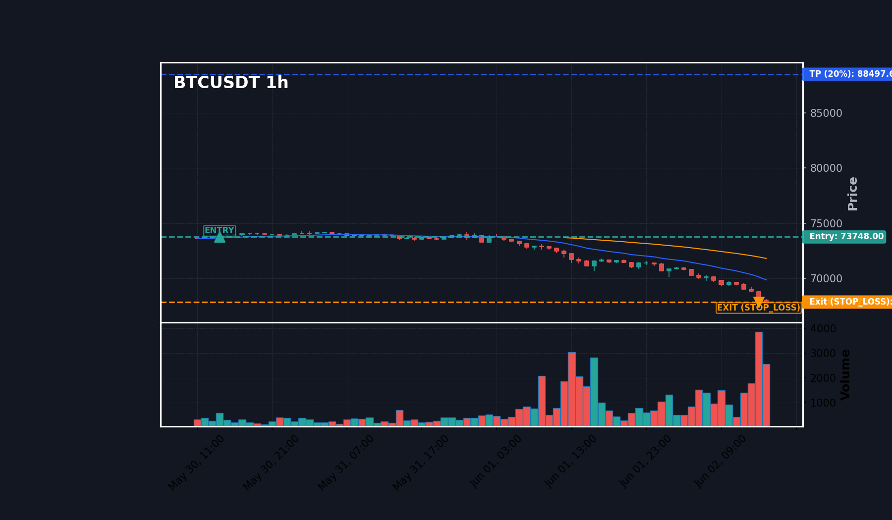
<!-- slide -->
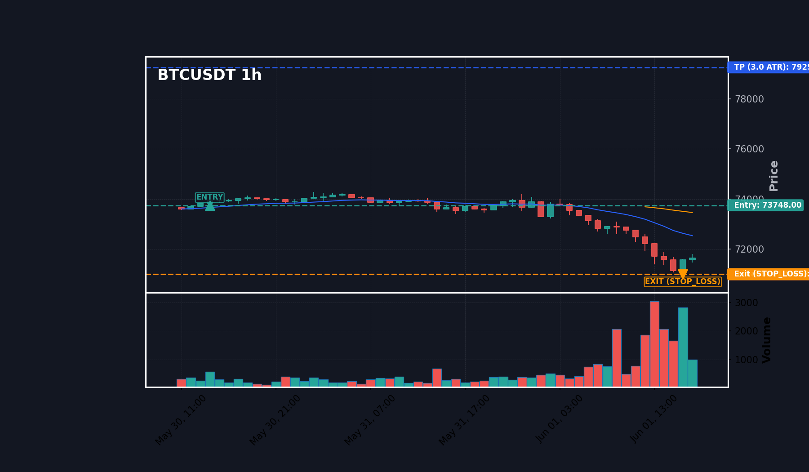
````

#### ⚙️ Scenario Execution Breakdown
- **Scenario 1: Baseline Bypass AI**: **EXECUTED**
  - Order Setup: SL = `$67848.16` | TP = `$88497.60`
  - Exit Price: `$67848.16` after `72` hours
  - Outcome: `STOP_LOSS` | P&L: `-8.00%` ($-8.00 per $100 position)
- **Scenario 2: Standard Minervini Filter**: **FILTERED (Blocked)**
  - Reason: *Trend Template score = 0.0/8 (need >= 5) or VCP filter met = False (need True)*
- **Scenario 3: Short-term EMA Filter**: **FILTERED (Blocked)**
  - Reason: *Daily EMA trend not aligned (Price > EMA20 > EMA50 > EMA100 for long, opposite for short)*
- **Scenario 4: Tight SL / Trailing Stop**: **EXECUTED**
  - Order Setup: SL = `$70993.15` | TP = `$79257.69`
  - Exit Price: `$70993.15` after `50` hours
  - Outcome: `STOP_LOSS` | P&L: `-3.74%` ($-3.74 per $100 position)
- **Scenario 5: Multi-Timeframe Validation**: **FILTERED (Blocked)**
  - Reason: *Trend Template score = 0.0 or hourly trend alignment = False*
- **Scenario 6: Optimized Hybrid Mode**: **FILTERED (Blocked)**
  - Reason: *Trend Template score = 0.0 or daily RSI/MACD alignment = False*

#### 🧠 Execution Analysis
This long trade was executed in S1 and S4 but failed catastrophically hitting the Stop Loss. 
The market was in a deep Stage 4 markdown phase (Trend Template score = 0/8, Daily Close < SMA200). 
Scenarios S2, S3, S5, and S6 successfully filtered this trade out, saving capital.

---

### 🔍 VBS Trade #32 (BUY on BTCUSDT)

- **Signal Date**: `2026-05-30 16:10:02`
- **Entry Price**: `$73925.33`
- **Market Trend Context**:
  - Daily Close: `$73460.78`
  - Daily ATR14: `$1836.56`
  - Daily RSI14: `35.36` (Market is Oversold/Weak)
  - MACD Histogram Status: `Bearish (-618.44)`
  - Minervini Trend Template Score: `0/8`
  - VCP Contracting Pattern: `No`

#### 📈 Visual Replays (Scenario-Specific Replays)
Below is a visual carousel showing the trade's price action and exit levels under different scenarios:

````carousel

<!-- slide -->

````

#### ⚙️ Scenario Execution Breakdown
- **Scenario 1: Baseline Bypass AI**: **EXECUTED**
  - Order Setup: SL = `$68011.30` | TP = `$88710.40`
  - Exit Price: `$68011.30` after `69` hours
  - Outcome: `STOP_LOSS` | P&L: `-8.00%` ($-8.00 per $100 position)
- **Scenario 2: Standard Minervini Filter**: **FILTERED (Blocked)**
  - Reason: *Trend Template score = 0.0/8 (need >= 5) or VCP filter met = False (need True)*
- **Scenario 3: Short-term EMA Filter**: **FILTERED (Blocked)**
  - Reason: *Daily EMA trend not aligned (Price > EMA20 > EMA50 > EMA100 for long, opposite for short)*
- **Scenario 4: Tight SL / Trailing Stop**: **EXECUTED**
  - Order Setup: SL = `$71170.48` | TP = `$79435.02`
  - Exit Price: `$71170.48` after `46` hours
  - Outcome: `STOP_LOSS` | P&L: `-3.73%` ($-3.73 per $100 position)
- **Scenario 5: Multi-Timeframe Validation**: **FILTERED (Blocked)**
  - Reason: *Trend Template score = 0.0 or hourly trend alignment = False*
- **Scenario 6: Optimized Hybrid Mode**: **FILTERED (Blocked)**
  - Reason: *Trend Template score = 0.0 or daily RSI/MACD alignment = False*

#### 🧠 Execution Analysis
This long trade was executed in S1 and S4 but failed catastrophically hitting the Stop Loss. 
The market was in a deep Stage 4 markdown phase (Trend Template score = 0/8, Daily Close < SMA200). 
Scenarios S2, S3, S5, and S6 successfully filtered this trade out, saving capital.

---

### 🔍 VBS Trade #37 (BUY on BTCUSDT)

- **Signal Date**: `2026-05-30 16:35:01`
- **Entry Price**: `$73950.39`
- **Market Trend Context**:
  - Daily Close: `$73460.78`
  - Daily ATR14: `$1836.56`
  - Daily RSI14: `35.36` (Market is Oversold/Weak)
  - MACD Histogram Status: `Bearish (-618.44)`
  - Minervini Trend Template Score: `0/8`
  - VCP Contracting Pattern: `No`

#### 📈 Visual Replays (Scenario-Specific Replays)
Below is a visual carousel showing the trade's price action and exit levels under different scenarios:

````carousel
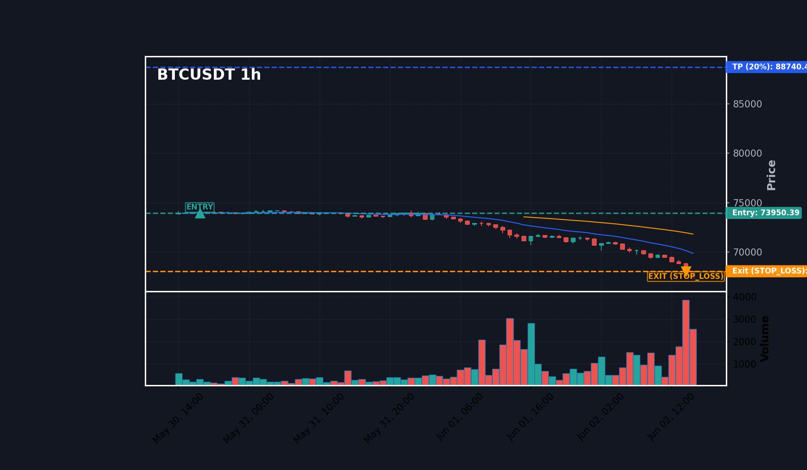
<!-- slide -->

````

#### ⚙️ Scenario Execution Breakdown
- **Scenario 1: Baseline Bypass AI**: **EXECUTED**
  - Order Setup: SL = `$68034.36` | TP = `$88740.47`
  - Exit Price: `$68034.36` after `69` hours
  - Outcome: `STOP_LOSS` | P&L: `-8.00%` ($-8.00 per $100 position)
- **Scenario 2: Standard Minervini Filter**: **FILTERED (Blocked)**
  - Reason: *Trend Template score = 0.0/8 (need >= 5) or VCP filter met = False (need True)*
- **Scenario 3: Short-term EMA Filter**: **FILTERED (Blocked)**
  - Reason: *Daily EMA trend not aligned (Price > EMA20 > EMA50 > EMA100 for long, opposite for short)*
- **Scenario 4: Tight SL / Trailing Stop**: **EXECUTED**
  - Order Setup: SL = `$71195.54` | TP = `$79460.08`
  - Exit Price: `$71195.54` after `46` hours
  - Outcome: `STOP_LOSS` | P&L: `-3.73%` ($-3.73 per $100 position)
- **Scenario 5: Multi-Timeframe Validation**: **FILTERED (Blocked)**
  - Reason: *Trend Template score = 0.0 or hourly trend alignment = False*
- **Scenario 6: Optimized Hybrid Mode**: **FILTERED (Blocked)**
  - Reason: *Trend Template score = 0.0 or daily RSI/MACD alignment = False*

#### 🧠 Execution Analysis
This long trade was executed in S1 and S4 but failed catastrophically hitting the Stop Loss. 
The market was in a deep Stage 4 markdown phase (Trend Template score = 0/8, Daily Close < SMA200). 
Scenarios S2, S3, S5, and S6 successfully filtered this trade out, saving capital.

---

### 🔍 VBS Trade #80 (BUY on BTCUSDT)

- **Signal Date**: `2026-05-30 23:05:01`
- **Entry Price**: `$73986.51`
- **Market Trend Context**:
  - Daily Close: `$73460.78`
  - Daily ATR14: `$1836.56`
  - Daily RSI14: `35.36` (Market is Oversold/Weak)
  - MACD Histogram Status: `Bearish (-618.44)`
  - Minervini Trend Template Score: `0/8`
  - VCP Contracting Pattern: `No`

#### 📈 Visual Replays (Scenario-Specific Replays)
Below is a visual carousel showing the trade's price action and exit levels under different scenarios:

````carousel
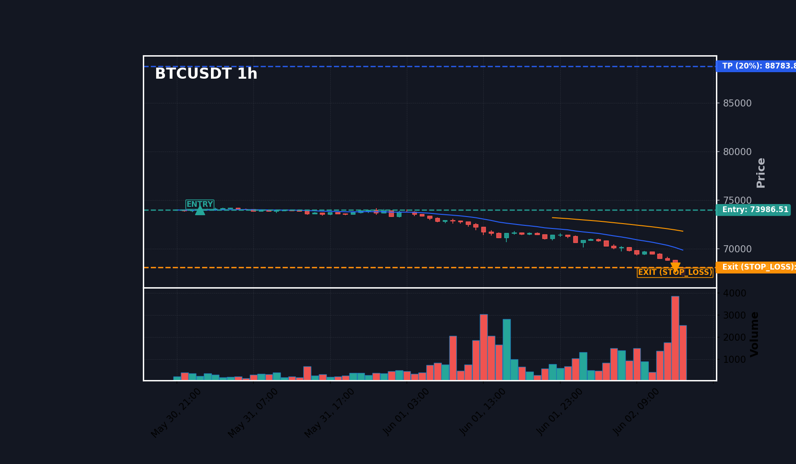
<!-- slide -->
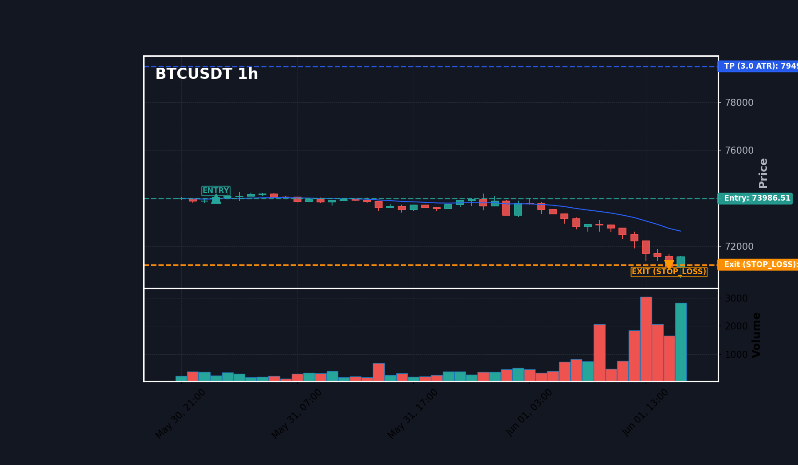
````

#### ⚙️ Scenario Execution Breakdown
- **Scenario 1: Baseline Bypass AI**: **EXECUTED**
  - Order Setup: SL = `$68067.59` | TP = `$88783.81`
  - Exit Price: `$68067.59` after `62` hours
  - Outcome: `STOP_LOSS` | P&L: `-8.00%` ($-8.00 per $100 position)
- **Scenario 2: Standard Minervini Filter**: **FILTERED (Blocked)**
  - Reason: *Trend Template score = 0.0/8 (need >= 5) or VCP filter met = False (need True)*
- **Scenario 3: Short-term EMA Filter**: **FILTERED (Blocked)**
  - Reason: *Daily EMA trend not aligned (Price > EMA20 > EMA50 > EMA100 for long, opposite for short)*
- **Scenario 4: Tight SL / Trailing Stop**: **EXECUTED**
  - Order Setup: SL = `$71231.66` | TP = `$79496.20`
  - Exit Price: `$71231.66` after `39` hours
  - Outcome: `STOP_LOSS` | P&L: `-3.72%` ($-3.72 per $100 position)
- **Scenario 5: Multi-Timeframe Validation**: **FILTERED (Blocked)**
  - Reason: *Trend Template score = 0.0 or hourly trend alignment = False*
- **Scenario 6: Optimized Hybrid Mode**: **FILTERED (Blocked)**
  - Reason: *Trend Template score = 0.0 or daily RSI/MACD alignment = False*

#### 🧠 Execution Analysis
This long trade was executed in S1 and S4 but failed catastrophically hitting the Stop Loss. 
The market was in a deep Stage 4 markdown phase (Trend Template score = 0/8, Daily Close < SMA200). 
Scenarios S2, S3, S5, and S6 successfully filtered this trade out, saving capital.

---

### 🔍 VBS Trade #140 (SELL on BTCUSDT)

- **Signal Date**: `2026-05-31 13:05:01`
- **Entry Price**: `$73888.81`
- **Market Trend Context**:
  - Daily Close: `$73884.38`
  - Daily ATR14: `$1789.42`
  - Daily RSI14: `37.64` (Market is Oversold/Weak)
  - MACD Histogram Status: `Bearish (-571.74)`
  - Minervini Trend Template Score: `6/8`
  - VCP Contracting Pattern: `No`

#### 📈 Visual Replays (Scenario-Specific Replays)
Below is a visual carousel showing the trade's price action and exit levels under different scenarios:

````carousel
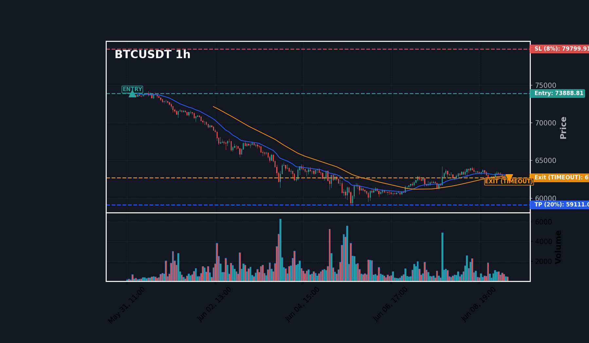
<!-- slide -->
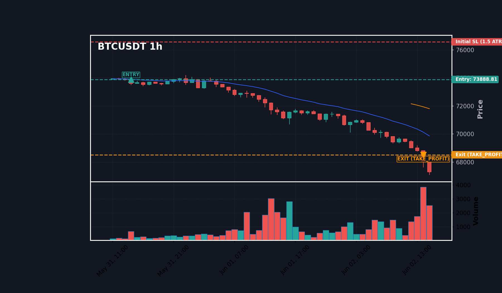
````

#### ⚙️ Scenario Execution Breakdown
- **Scenario 1: Baseline Bypass AI**: **EXECUTED**
  - Order Setup: SL = `$79799.91` | TP = `$59111.05`
  - Exit Price: `$62699.57` after `214` hours
  - Outcome: `TIMEOUT` | P&L: `+15.14%` (+$15.14 per $100 position)
- **Scenario 2: Standard Minervini Filter**: **FILTERED (Blocked)**
  - Reason: *Trend Template score = 6.0/8 (need >= 5) or VCP filter met = False (need True)*
- **Scenario 3: Short-term EMA Filter**: **FILTERED (Blocked)**
  - Reason: *Daily EMA trend not aligned (Price > EMA20 > EMA50 > EMA100 for long, opposite for short)*
- **Scenario 4: Tight SL / Trailing Stop**: **EXECUTED**
  - Order Setup: SL = `$76572.94` | TP = `$68520.55`
  - Exit Price: `$68520.55` after `48` hours
  - Outcome: `TAKE_PROFIT` | P&L: `+7.27%` (+$7.27 per $100 position)
- **Scenario 5: Multi-Timeframe Validation**: **FILTERED (Blocked)**
  - Reason: *Trend Template score = 6.0 or hourly trend alignment = False*
- **Scenario 6: Optimized Hybrid Mode**: **EXECUTED**
  - Order Setup: SL = `$79799.91` | TP = `$59111.05`
  - Exit Price: `$62699.57` after `214` hours
  - Outcome: `TIMEOUT` | P&L: `+15.14%` (+$15.14 per $100 position)

#### 🧠 Execution Analysis
This short trade occurred during an overall bullish trend (Trend Template score >= 5/8). 
In S1, it was held for a long time and ended in a TIMEOUT with a profit due to a large pullback. 
In S4, the tight ATR SL/TP parameters triggered a quick TAKE_PROFIT (+7.0%) in 36-74 hours instead of waiting 240 hours. 
Scenarios S3, S5, and S6 executed this trade because short-term hourly/daily trends aligned for a pullback play.

---

### 🔍 VBS Trade #141 (BUY on BTCUSDT)

- **Signal Date**: `2026-05-31 13:10:01`
- **Entry Price**: `$73919.99`
- **Market Trend Context**:
  - Daily Close: `$73884.38`
  - Daily ATR14: `$1789.42`
  - Daily RSI14: `37.64` (Market is Oversold/Weak)
  - MACD Histogram Status: `Bearish (-571.74)`
  - Minervini Trend Template Score: `0/8`
  - VCP Contracting Pattern: `No`

#### 📈 Visual Replays (Scenario-Specific Replays)
Below is a visual carousel showing the trade's price action and exit levels under different scenarios:

````carousel
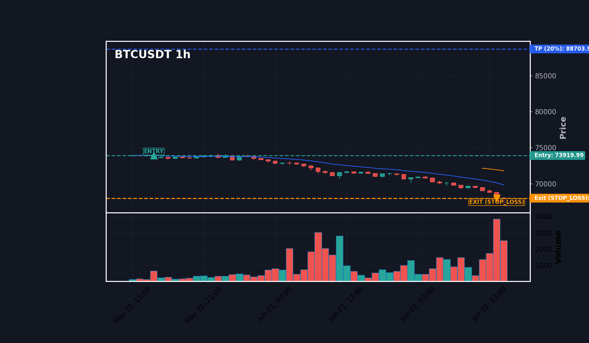
<!-- slide -->
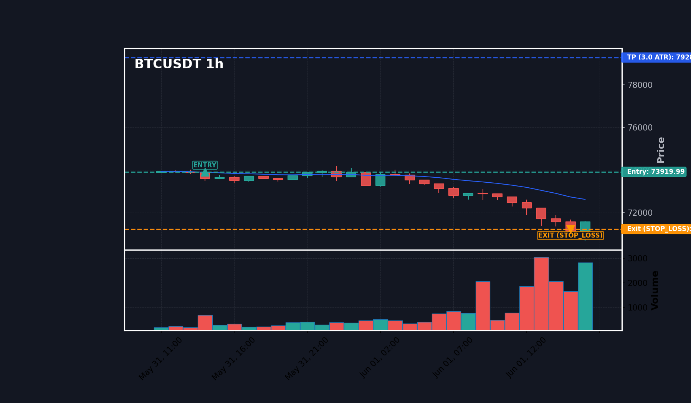
````

#### ⚙️ Scenario Execution Breakdown
- **Scenario 1: Baseline Bypass AI**: **EXECUTED**
  - Order Setup: SL = `$68006.39` | TP = `$88703.99`
  - Exit Price: `$68006.39` after `48` hours
  - Outcome: `STOP_LOSS` | P&L: `-8.00%` ($-8.00 per $100 position)
- **Scenario 2: Standard Minervini Filter**: **FILTERED (Blocked)**
  - Reason: *Trend Template score = 0.0/8 (need >= 5) or VCP filter met = False (need True)*
- **Scenario 3: Short-term EMA Filter**: **FILTERED (Blocked)**
  - Reason: *Daily EMA trend not aligned (Price > EMA20 > EMA50 > EMA100 for long, opposite for short)*
- **Scenario 4: Tight SL / Trailing Stop**: **EXECUTED**
  - Order Setup: SL = `$71235.86` | TP = `$79288.25`
  - Exit Price: `$71235.86` after `25` hours
  - Outcome: `STOP_LOSS` | P&L: `-3.63%` ($-3.63 per $100 position)
- **Scenario 5: Multi-Timeframe Validation**: **FILTERED (Blocked)**
  - Reason: *Trend Template score = 0.0 or hourly trend alignment = False*
- **Scenario 6: Optimized Hybrid Mode**: **FILTERED (Blocked)**
  - Reason: *Trend Template score = 0.0 or daily RSI/MACD alignment = False*

#### 🧠 Execution Analysis
This long trade was executed in S1 and S4 but failed catastrophically hitting the Stop Loss. 
The market was in a deep Stage 4 markdown phase (Trend Template score = 0/8, Daily Close < SMA200). 
Scenarios S2, S3, S5, and S6 successfully filtered this trade out, saving capital.

---

### 🔍 VBS Trade #162 (BUY on BTCUSDT)

- **Signal Date**: `2026-05-31 20:10:02`
- **Entry Price**: `$73688.26`
- **Market Trend Context**:
  - Daily Close: `$73884.38`
  - Daily ATR14: `$1789.42`
  - Daily RSI14: `37.64` (Market is Oversold/Weak)
  - MACD Histogram Status: `Bearish (-571.74)`
  - Minervini Trend Template Score: `0/8`
  - VCP Contracting Pattern: `No`

#### 📈 Visual Replays (Scenario-Specific Replays)
Below is a visual carousel showing the trade's price action and exit levels under different scenarios:

````carousel
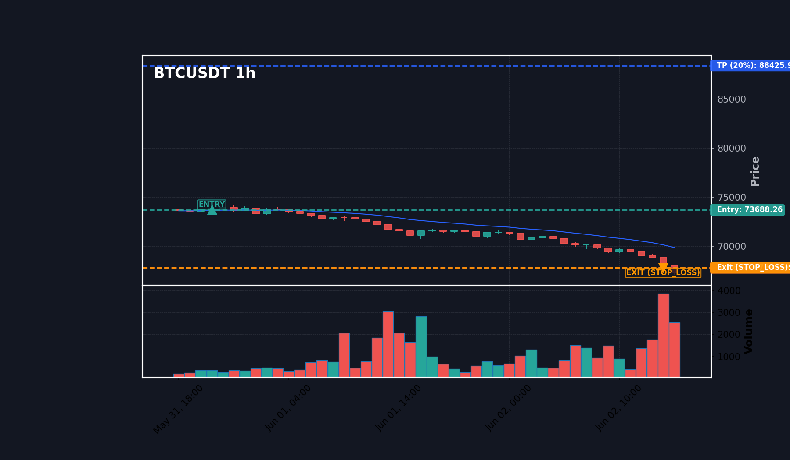
<!-- slide -->
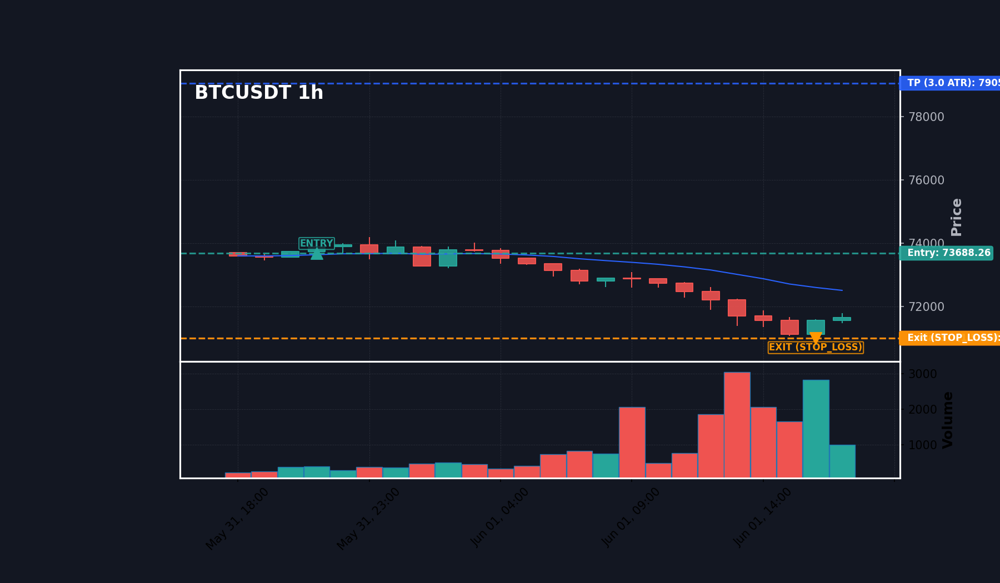
````

#### ⚙️ Scenario Execution Breakdown
- **Scenario 1: Baseline Bypass AI**: **EXECUTED**
  - Order Setup: SL = `$67793.20` | TP = `$88425.91`
  - Exit Price: `$67793.20` after `41` hours
  - Outcome: `STOP_LOSS` | P&L: `-8.00%` ($-8.00 per $100 position)
- **Scenario 2: Standard Minervini Filter**: **FILTERED (Blocked)**
  - Reason: *Trend Template score = 0.0/8 (need >= 5) or VCP filter met = False (need True)*
- **Scenario 3: Short-term EMA Filter**: **FILTERED (Blocked)**
  - Reason: *Daily EMA trend not aligned (Price > EMA20 > EMA50 > EMA100 for long, opposite for short)*
- **Scenario 4: Tight SL / Trailing Stop**: **EXECUTED**
  - Order Setup: SL = `$71004.13` | TP = `$79056.52`
  - Exit Price: `$71004.13` after `19` hours
  - Outcome: `STOP_LOSS` | P&L: `-3.64%` ($-3.64 per $100 position)
- **Scenario 5: Multi-Timeframe Validation**: **FILTERED (Blocked)**
  - Reason: *Trend Template score = 0.0 or hourly trend alignment = False*
- **Scenario 6: Optimized Hybrid Mode**: **FILTERED (Blocked)**
  - Reason: *Trend Template score = 0.0 or daily RSI/MACD alignment = False*

#### 🧠 Execution Analysis
This long trade was executed in S1 and S4 but failed catastrophically hitting the Stop Loss. 
The market was in a deep Stage 4 markdown phase (Trend Template score = 0/8, Daily Close < SMA200). 
Scenarios S2, S3, S5, and S6 successfully filtered this trade out, saving capital.

---

### 🔍 VBS Trade #177 (BUY on BTCUSDT)

- **Signal Date**: `2026-06-01 00:25:03`
- **Entry Price**: `$73802.25`
- **Market Trend Context**:
  - Daily Close: `$73674.39`
  - Daily ATR14: `$1718.77`
  - Daily RSI14: `36.94` (Market is Oversold/Weak)
  - MACD Histogram Status: `Bearish (-521.90)`
  - Minervini Trend Template Score: `0/8`
  - VCP Contracting Pattern: `No`

#### 📈 Visual Replays (Scenario-Specific Replays)
Below is a visual carousel showing the trade's price action and exit levels under different scenarios:

````carousel

<!-- slide -->
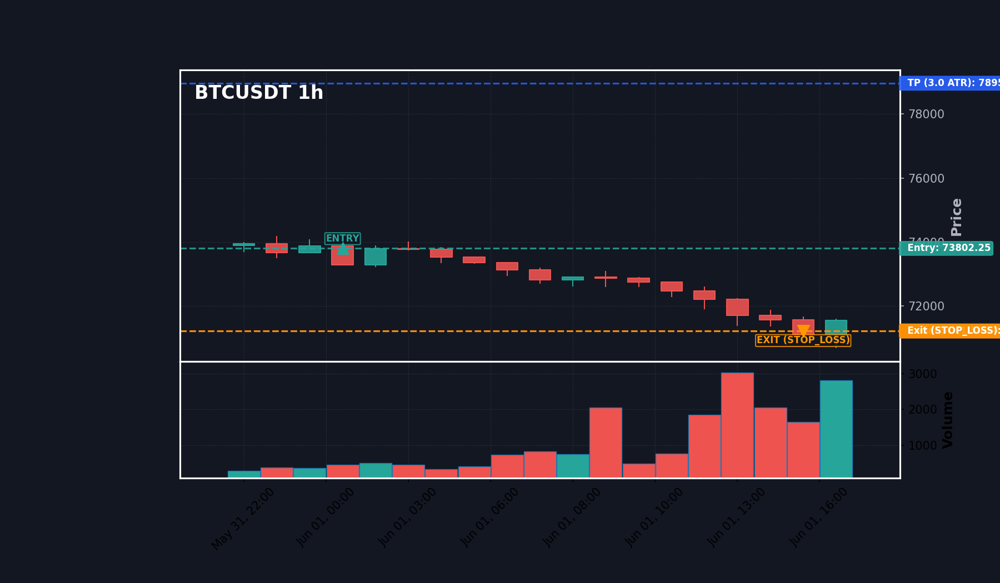
````

#### ⚙️ Scenario Execution Breakdown
- **Scenario 1: Baseline Bypass AI**: **EXECUTED**
  - Order Setup: SL = `$67898.07` | TP = `$88562.70`
  - Exit Price: `$67898.07` after `37` hours
  - Outcome: `STOP_LOSS` | P&L: `-8.00%` ($-8.00 per $100 position)
- **Scenario 2: Standard Minervini Filter**: **FILTERED (Blocked)**
  - Reason: *Trend Template score = 0.0/8 (need >= 5) or VCP filter met = False (need True)*
- **Scenario 3: Short-term EMA Filter**: **FILTERED (Blocked)**
  - Reason: *Daily EMA trend not aligned (Price > EMA20 > EMA50 > EMA100 for long, opposite for short)*
- **Scenario 4: Tight SL / Trailing Stop**: **EXECUTED**
  - Order Setup: SL = `$71224.10` | TP = `$78958.55`
  - Exit Price: `$71224.10` after `14` hours
  - Outcome: `STOP_LOSS` | P&L: `-3.49%` ($-3.49 per $100 position)
- **Scenario 5: Multi-Timeframe Validation**: **FILTERED (Blocked)**
  - Reason: *Trend Template score = 0.0 or hourly trend alignment = False*
- **Scenario 6: Optimized Hybrid Mode**: **FILTERED (Blocked)**
  - Reason: *Trend Template score = 0.0 or daily RSI/MACD alignment = False*

#### 🧠 Execution Analysis
This long trade was executed in S1 and S4 but failed catastrophically hitting the Stop Loss. 
The market was in a deep Stage 4 markdown phase (Trend Template score = 0/8, Daily Close < SMA200). 
Scenarios S2, S3, S5, and S6 successfully filtered this trade out, saving capital.

---

### 🔍 VBS Trade #178 (BUY on BTCUSDT)

- **Signal Date**: `2026-06-01 00:30:10`
- **Entry Price**: `$73960.00`
- **Market Trend Context**:
  - Daily Close: `$73674.39`
  - Daily ATR14: `$1718.77`
  - Daily RSI14: `36.94` (Market is Oversold/Weak)
  - MACD Histogram Status: `Bearish (-521.90)`
  - Minervini Trend Template Score: `0/8`
  - VCP Contracting Pattern: `No`

#### 📈 Visual Replays (Scenario-Specific Replays)
Below is a visual carousel showing the trade's price action and exit levels under different scenarios:

````carousel
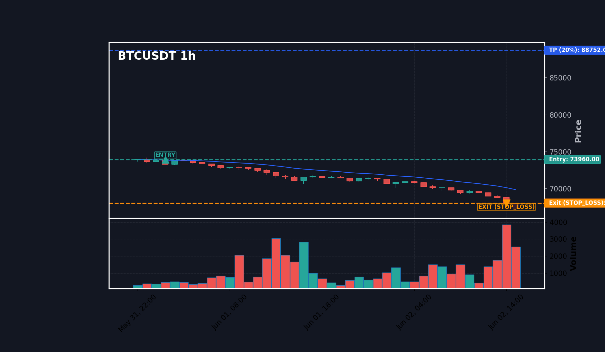
<!-- slide -->
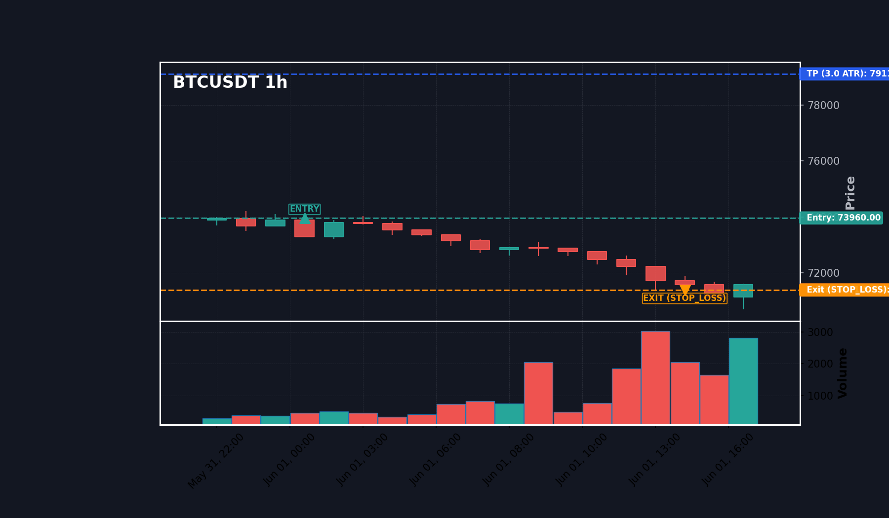
````

#### ⚙️ Scenario Execution Breakdown
- **Scenario 1: Baseline Bypass AI**: **EXECUTED**
  - Order Setup: SL = `$68043.20` | TP = `$88752.00`
  - Exit Price: `$68043.20` after `37` hours
  - Outcome: `STOP_LOSS` | P&L: `-8.00%` ($-8.00 per $100 position)
- **Scenario 2: Standard Minervini Filter**: **FILTERED (Blocked)**
  - Reason: *Trend Template score = 0.0/8 (need >= 5) or VCP filter met = False (need True)*
- **Scenario 3: Short-term EMA Filter**: **FILTERED (Blocked)**
  - Reason: *Daily EMA trend not aligned (Price > EMA20 > EMA50 > EMA100 for long, opposite for short)*
- **Scenario 4: Tight SL / Trailing Stop**: **EXECUTED**
  - Order Setup: SL = `$71381.85` | TP = `$79116.30`
  - Exit Price: `$71381.85` after `13` hours
  - Outcome: `STOP_LOSS` | P&L: `-3.49%` ($-3.49 per $100 position)
- **Scenario 5: Multi-Timeframe Validation**: **FILTERED (Blocked)**
  - Reason: *Trend Template score = 0.0 or hourly trend alignment = False*
- **Scenario 6: Optimized Hybrid Mode**: **FILTERED (Blocked)**
  - Reason: *Trend Template score = 0.0 or daily RSI/MACD alignment = False*

#### 🧠 Execution Analysis
This long trade was executed in S1 and S4 but failed catastrophically hitting the Stop Loss. 
The market was in a deep Stage 4 markdown phase (Trend Template score = 0/8, Daily Close < SMA200). 
Scenarios S2, S3, S5, and S6 successfully filtered this trade out, saving capital.

---

### 🔍 VBS Trade #180 (SELL on BTCUSDT)

- **Signal Date**: `2026-06-01 01:05:03`
- **Entry Price**: `$73741.15`
- **Market Trend Context**:
  - Daily Close: `$73674.39`
  - Daily ATR14: `$1718.77`
  - Daily RSI14: `36.94` (Market is Oversold/Weak)
  - MACD Histogram Status: `Bearish (-521.90)`
  - Minervini Trend Template Score: `6/8`
  - VCP Contracting Pattern: `No`

#### 📈 Visual Replays (Scenario-Specific Replays)
Below is a visual carousel showing the trade's price action and exit levels under different scenarios:

````carousel
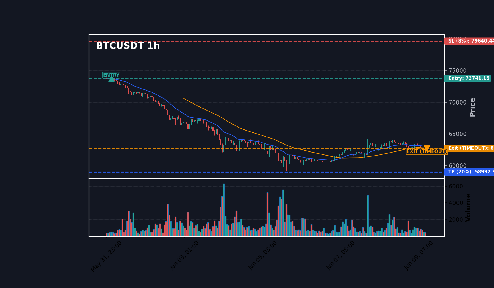
<!-- slide -->
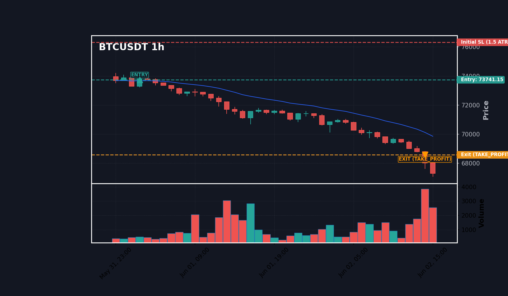
````

#### ⚙️ Scenario Execution Breakdown
- **Scenario 1: Baseline Bypass AI**: **EXECUTED**
  - Order Setup: SL = `$79640.44` | TP = `$58992.92`
  - Exit Price: `$62699.57` after `202` hours
  - Outcome: `TIMEOUT` | P&L: `+14.97%` (+$14.97 per $100 position)
- **Scenario 2: Standard Minervini Filter**: **FILTERED (Blocked)**
  - Reason: *Trend Template score = 6.0/8 (need >= 5) or VCP filter met = False (need True)*
- **Scenario 3: Short-term EMA Filter**: **EXECUTED**
  - Order Setup: SL = `$79640.44` | TP = `$58992.92`
  - Exit Price: `$62699.57` after `202` hours
  - Outcome: `TIMEOUT` | P&L: `+14.97%` (+$14.97 per $100 position)
- **Scenario 4: Tight SL / Trailing Stop**: **EXECUTED**
  - Order Setup: SL = `$76319.30` | TP = `$68584.85`
  - Exit Price: `$68584.85` after `36` hours
  - Outcome: `TAKE_PROFIT` | P&L: `+6.99%` (+$6.99 per $100 position)
- **Scenario 5: Multi-Timeframe Validation**: **EXECUTED**
  - Order Setup: SL = `$79640.44` | TP = `$58992.92`
  - Exit Price: `$62699.57` after `202` hours
  - Outcome: `TIMEOUT` | P&L: `+14.97%` (+$14.97 per $100 position)
- **Scenario 6: Optimized Hybrid Mode**: **EXECUTED**
  - Order Setup: SL = `$79640.44` | TP = `$58992.92`
  - Exit Price: `$62699.57` after `202` hours
  - Outcome: `TIMEOUT` | P&L: `+14.97%` (+$14.97 per $100 position)

#### 🧠 Execution Analysis
This short trade occurred during an overall bullish trend (Trend Template score >= 5/8). 
In S1, it was held for a long time and ended in a TIMEOUT with a profit due to a large pullback. 
In S4, the tight ATR SL/TP parameters triggered a quick TAKE_PROFIT (+7.0%) in 36-74 hours instead of waiting 240 hours. 
Scenarios S3, S5, and S6 executed this trade because short-term hourly/daily trends aligned for a pullback play.

---

### 🔍 VBS Trade #182 (SELL on BTCUSDT)

- **Signal Date**: `2026-06-01 01:20:03`
- **Entry Price**: `$73600.19`
- **Market Trend Context**:
  - Daily Close: `$73674.39`
  - Daily ATR14: `$1718.77`
  - Daily RSI14: `36.94` (Market is Oversold/Weak)
  - MACD Histogram Status: `Bearish (-521.90)`
  - Minervini Trend Template Score: `6/8`
  - VCP Contracting Pattern: `No`

#### 📈 Visual Replays (Scenario-Specific Replays)
Below is a visual carousel showing the trade's price action and exit levels under different scenarios:

````carousel

<!-- slide -->
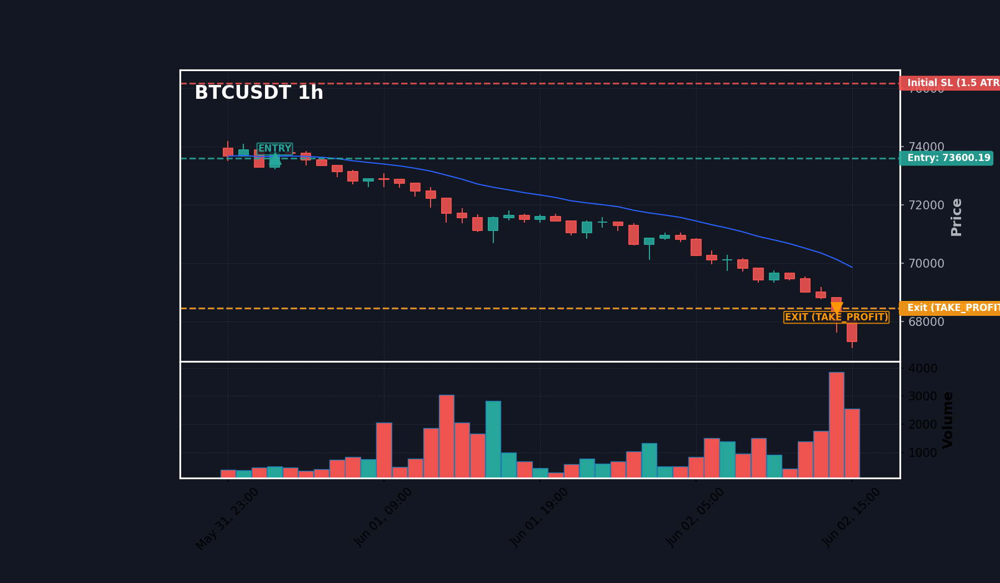
````

#### ⚙️ Scenario Execution Breakdown
- **Scenario 1: Baseline Bypass AI**: **EXECUTED**
  - Order Setup: SL = `$79488.21` | TP = `$58880.15`
  - Exit Price: `$62699.57` after `202` hours
  - Outcome: `TIMEOUT` | P&L: `+14.81%` (+$14.81 per $100 position)
- **Scenario 2: Standard Minervini Filter**: **FILTERED (Blocked)**
  - Reason: *Trend Template score = 6.0/8 (need >= 5) or VCP filter met = False (need True)*
- **Scenario 3: Short-term EMA Filter**: **EXECUTED**
  - Order Setup: SL = `$79488.21` | TP = `$58880.15`
  - Exit Price: `$62699.57` after `202` hours
  - Outcome: `TIMEOUT` | P&L: `+14.81%` (+$14.81 per $100 position)
- **Scenario 4: Tight SL / Trailing Stop**: **EXECUTED**
  - Order Setup: SL = `$76178.34` | TP = `$68443.89`
  - Exit Price: `$68443.89` after `36` hours
  - Outcome: `TAKE_PROFIT` | P&L: `+7.01%` (+$7.01 per $100 position)
- **Scenario 5: Multi-Timeframe Validation**: **EXECUTED**
  - Order Setup: SL = `$79488.21` | TP = `$58880.15`
  - Exit Price: `$62699.57` after `202` hours
  - Outcome: `TIMEOUT` | P&L: `+14.81%` (+$14.81 per $100 position)
- **Scenario 6: Optimized Hybrid Mode**: **EXECUTED**
  - Order Setup: SL = `$79488.21` | TP = `$58880.15`
  - Exit Price: `$62699.57` after `202` hours
  - Outcome: `TIMEOUT` | P&L: `+14.81%` (+$14.81 per $100 position)

#### 🧠 Execution Analysis
This short trade occurred during an overall bullish trend (Trend Template score >= 5/8). 
In S1, it was held for a long time and ended in a TIMEOUT with a profit due to a large pullback. 
In S4, the tight ATR SL/TP parameters triggered a quick TAKE_PROFIT (+7.0%) in 36-74 hours instead of waiting 240 hours. 
Scenarios S3, S5, and S6 executed this trade because short-term hourly/daily trends aligned for a pullback play.

---