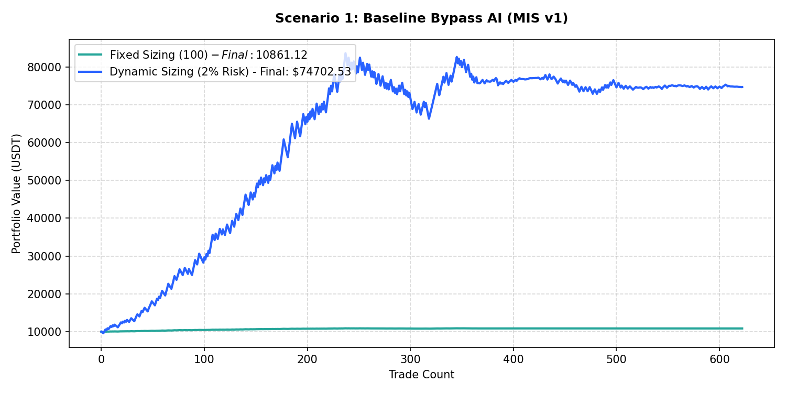

# Performance Report: Scenario 1: Baseline Bypass AI (MIS v1)

## 1. Description
Execute trades using the entry, SL, and TP prices directly from the signal records (8% SL / 20% TP fallback). Representing the baseline breakout execution from MIS v1.

- **Total Signals Scanned**: 627
- **Executed Trades**: 622
- **Filtered Signals (Skipped)**: 5

---

## 2. Performance Comparison Table

| Sizing Mode | Executed Trades | Final Equity (USDT) | Net Profit (USDT) | Win Rate (%) | Profit Factor | Max Drawdown (%) | Expectancy |
| :--- | :---: | :---: | :---: | :---: | :---: | :---: | :---: |
| **Fixed Sizing ($100)** | 622 | 10861.12 | +861.12 | 51.3% | 1.52 | 0.80% | 1.3844 |
| **Dynamic Sizing (2% Risk)** | 622 | 74702.53 | +64702.53 | 51.3% | 1.29 | 20.72% | 104.0234 |

---

## 3. Equity Curve Comparison Chart
The chart below illustrates the cumulative equity curve performance for both Fixed Sizing (USDT P&L scale) and Dynamic Compounding Sizing (2% risk) over time:

---

## 4. Scenario Breakdown Analysis
- **Filter Restrictiveness**: This scenario filtered out 5 signals out of 627 (Skip Rate: 0.8%).
- **Compounding Sizing Effect**: Dynamic compounding sizing led to an equity of **$74702.53** compared to **$10861.12** in Fixed Sizing.
- **Profitability Verdict**: PROFITABLE with a Profit Factor of **1.29** and expectancy **104.0234** under Dynamic Sizing.
