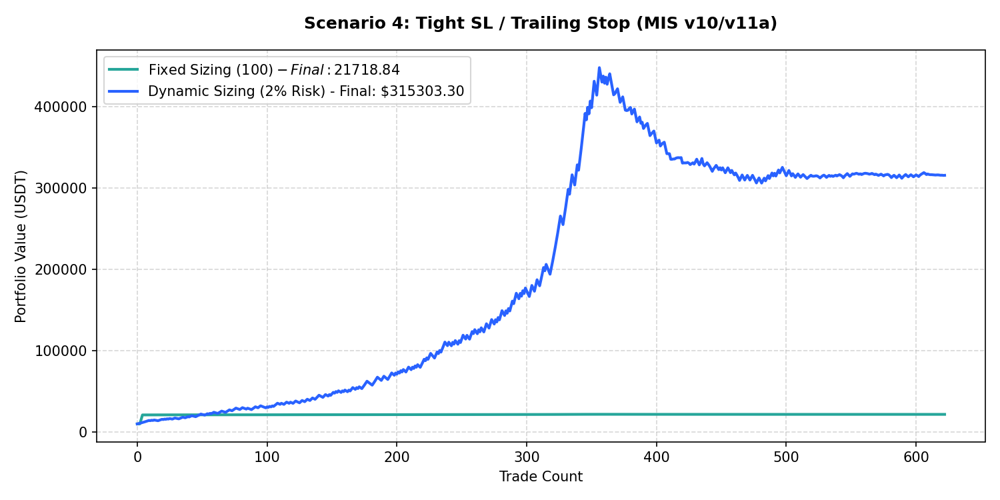

# Performance Report: Scenario 4: Tight SL / Trailing Stop (MIS v10/v11a)

## 1. Description
Volatility-adjusted execution: Entry SL tightened to 1.5 * daily ATR14, TP set to 3.0 * ATR14. Chandelier trailing stop trails the extreme high/low since entry by 2.5 * ATR14. Representing the tight SL and trailing stops from MIS v10/v11a.

- **Total Signals Scanned**: 627
- **Executed Trades**: 622
- **Filtered Signals (Skipped)**: 5

---

## 2. Performance Comparison Table

| Sizing Mode | Executed Trades | Final Equity (USDT) | Net Profit (USDT) | Win Rate (%) | Profit Factor | Max Drawdown (%) | Expectancy |
| :--- | :---: | :---: | :---: | :---: | :---: | :---: | :---: |
| **Fixed Sizing ($100)** | 622 | 21718.84 | +11718.84 | 51.6% | 12.89 | 0.48% | 18.8406 |
| **Dynamic Sizing (2% Risk)** | 622 | 315303.30 | +305303.30 | 51.6% | 1.44 | 31.68% | 490.8413 |

---

## 3. Equity Curve Comparison Chart
The chart below illustrates the cumulative equity curve performance for both Fixed Sizing (USDT P&L scale) and Dynamic Compounding Sizing (2% risk) over time:

---

## 4. Scenario Breakdown Analysis
- **Filter Restrictiveness**: This scenario filtered out 5 signals out of 627 (Skip Rate: 0.8%).
- **Compounding Sizing Effect**: Dynamic compounding sizing led to an equity of **$315303.30** compared to **$21718.84** in Fixed Sizing.
- **Profitability Verdict**: PROFITABLE with a Profit Factor of **1.44** and expectancy **490.8413** under Dynamic Sizing.
