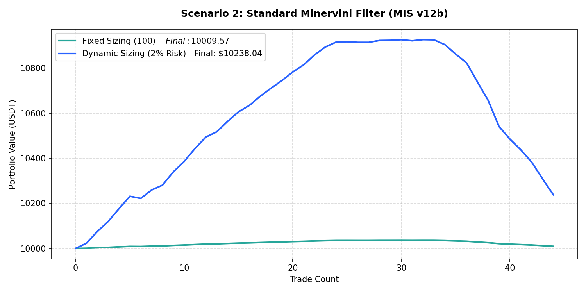

# Performance Report: Scenario 2: Standard Minervini Filter (MIS v12b)

## 1. Description
Strict Minervini SEPA rules: Daily Trend Template score >= 5, daily VCP filter met (vol_contracting < 50%, range_contracting < 50% ATR, near_boundary within 10% of 52w high/low). Representing the strict SEPA setup from MIS v12b.

- **Total Signals Scanned**: 627
- **Executed Trades**: 44
- **Filtered Signals (Skipped)**: 583

---

## 2. Performance Comparison Table

| Sizing Mode | Executed Trades | Final Equity (USDT) | Net Profit (USDT) | Win Rate (%) | Profit Factor | Max Drawdown (%) | Expectancy |
| :--- | :---: | :---: | :---: | :---: | :---: | :---: | :---: |
| **Fixed Sizing ($100)** | 44 | 10009.57 | +9.57 | 63.6% | 1.36 | 0.26% | 0.2176 |
| **Dynamic Sizing (2% Risk)** | 44 | 10238.04 | +238.04 | 63.6% | 1.34 | 6.30% | 5.4100 |

---

## 3. Equity Curve Comparison Chart
The chart below illustrates the cumulative equity curve performance for both Fixed Sizing (USDT P&L scale) and Dynamic Compounding Sizing (2% risk) over time:

---

## 4. Scenario Breakdown Analysis
- **Filter Restrictiveness**: This scenario filtered out 583 signals out of 627 (Skip Rate: 93.0%).
- **Compounding Sizing Effect**: Dynamic compounding sizing led to an equity of **$10238.04** compared to **$10009.57** in Fixed Sizing.
- **Profitability Verdict**: PROFITABLE with a Profit Factor of **1.34** and expectancy **5.4100** under Dynamic Sizing.
