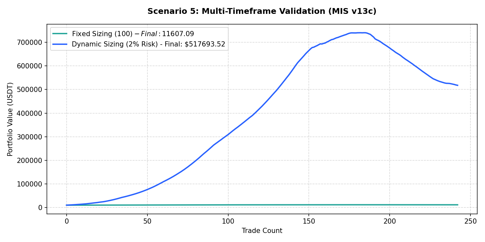

# Performance Report: Scenario 5: Multi-Timeframe Validation (MIS v13c)

## 1. Description
Multi-timeframe validation: Daily Trend Template score >= 5, AND hourly execution trend aligned (hourly EMA20 > EMA50 > EMA200 for long, opposite for short). Representing the MTF daily trend template check from MIS v13c.

- **Total Signals Scanned**: 627
- **Executed Trades**: 242
- **Filtered Signals (Skipped)**: 385

---

## 2. Performance Comparison Table

| Sizing Mode | Executed Trades | Final Equity (USDT) | Net Profit (USDT) | Win Rate (%) | Profit Factor | Max Drawdown (%) | Expectancy |
| :--- | :---: | :---: | :---: | :---: | :---: | :---: | :---: |
| **Fixed Sizing ($100)** | 242 | 11607.09 | +1607.09 | 74.4% | 12.22 | 1.21% | 6.6409 |
| **Dynamic Sizing (2% Risk)** | 242 | 517693.52 | +507693.52 | 74.4% | 3.27 | 30.08% | 2097.9071 |

---

## 3. Equity Curve Comparison Chart
The chart below illustrates the cumulative equity curve performance for both Fixed Sizing (USDT P&L scale) and Dynamic Compounding Sizing (2% risk) over time:

---

## 4. Scenario Breakdown Analysis
- **Filter Restrictiveness**: This scenario filtered out 385 signals out of 627 (Skip Rate: 61.4%).
- **Compounding Sizing Effect**: Dynamic compounding sizing led to an equity of **$517693.52** compared to **$11607.09** in Fixed Sizing.
- **Profitability Verdict**: PROFITABLE with a Profit Factor of **3.27** and expectancy **2097.9071** under Dynamic Sizing.
