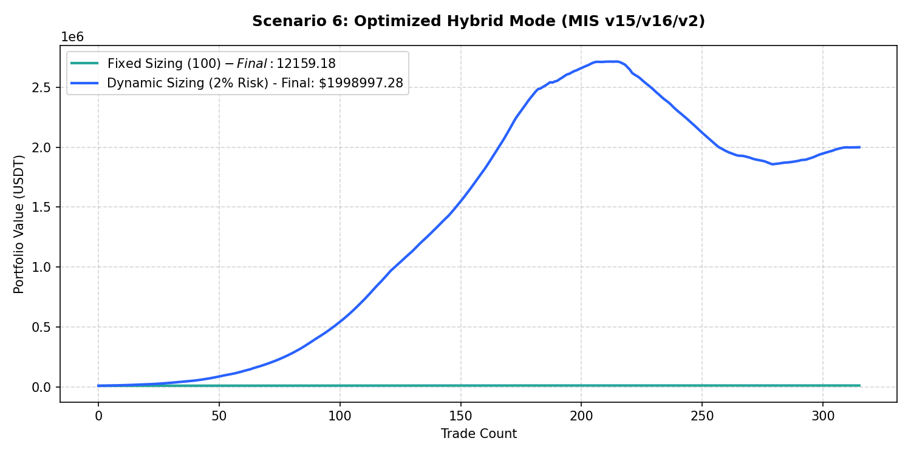

# Performance Report: Scenario 6: Optimized Hybrid Mode (MIS v15/v16/v2)

## 1. Description
Hybrid momentum pullback: Daily Trend Template score >= 5, daily RSI 14 >= 50 (long) or <= 50 (short), daily MACD line > MACD signal line (long) or opposite (short). Representing the optimized hybrid V2 configuration.

- **Total Signals Scanned**: 627
- **Executed Trades**: 315
- **Filtered Signals (Skipped)**: 312

---

## 2. Performance Comparison Table

| Sizing Mode | Executed Trades | Final Equity (USDT) | Net Profit (USDT) | Win Rate (%) | Profit Factor | Max Drawdown (%) | Expectancy |
| :--- | :---: | :---: | :---: | :---: | :---: | :---: | :---: |
| **Fixed Sizing ($100)** | 315 | 12159.18 | +2159.18 | 77.8% | 15.20 | 1.23% | 6.8545 |
| **Dynamic Sizing (2% Risk)** | 315 | 1998997.28 | +1988997.28 | 77.8% | 3.31 | 31.57% | 6314.2771 |

---

## 3. Equity Curve Comparison Chart
The chart below illustrates the cumulative equity curve performance for both Fixed Sizing (USDT P&L scale) and Dynamic Compounding Sizing (2% risk) over time:

---

## 4. Scenario Breakdown Analysis
- **Filter Restrictiveness**: This scenario filtered out 312 signals out of 627 (Skip Rate: 49.8%).
- **Compounding Sizing Effect**: Dynamic compounding sizing led to an equity of **$1998997.28** compared to **$12159.18** in Fixed Sizing.
- **Profitability Verdict**: PROFITABLE with a Profit Factor of **3.31** and expectancy **6314.2771** under Dynamic Sizing.
