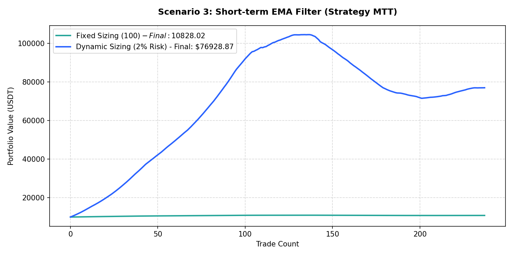

# Performance Report: Scenario 3: Short-term EMA Filter (Strategy MTT)

## 1. Description
Hourly / daily short-term trend stack validation: Daily price > EMA20 > EMA50 > EMA100 (long) or Price < EMA20 < EMA50 < EMA100 (short). Representing the short-term EMA trend stack from MTT v1.005-b.

- **Total Signals Scanned**: 627
- **Executed Trades**: 237
- **Filtered Signals (Skipped)**: 390

---

## 2. Performance Comparison Table

| Sizing Mode | Executed Trades | Final Equity (USDT) | Net Profit (USDT) | Win Rate (%) | Profit Factor | Max Drawdown (%) | Expectancy |
| :--- | :---: | :---: | :---: | :---: | :---: | :---: | :---: |
| **Fixed Sizing ($100)** | 237 | 10828.02 | +828.02 | 70.5% | 6.45 | 1.38% | 3.4938 |
| **Dynamic Sizing (2% Risk)** | 237 | 76928.87 | +66928.87 | 70.5% | 3.02 | 31.57% | 282.4003 |

---

## 3. Equity Curve Comparison Chart
The chart below illustrates the cumulative equity curve performance for both Fixed Sizing (USDT P&L scale) and Dynamic Compounding Sizing (2% risk) over time:

---

## 4. Scenario Breakdown Analysis
- **Filter Restrictiveness**: This scenario filtered out 390 signals out of 627 (Skip Rate: 62.2%).
- **Compounding Sizing Effect**: Dynamic compounding sizing led to an equity of **$76928.87** compared to **$10828.02** in Fixed Sizing.
- **Profitability Verdict**: PROFITABLE with a Profit Factor of **3.02** and expectancy **282.4003** under Dynamic Sizing.
