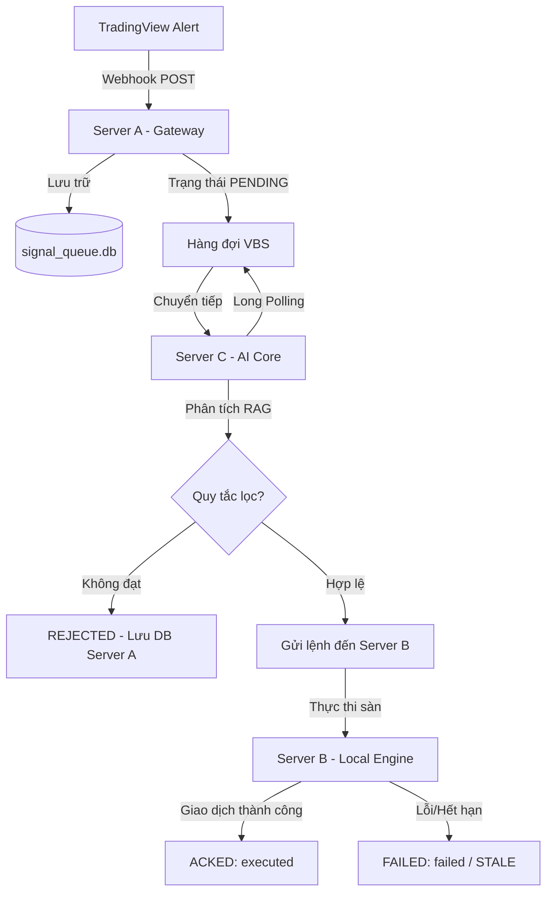

# 📈 Báo Cáo Tổng Hợp Tín Hiệu (Signals) từ Server A

> [!NOTE]
> Báo cáo được tự động tổng hợp từ cơ sở dữ liệu `signal_queue.db` trên **Server A (Gateway VPS)**.
> Khoảng thời gian: từ **2026-05-30 08:59:08** đến **2026-06-02 22:05:04**.

## 📊 Thống Kê Tổng Quan

- **Tổng số tín hiệu đã nhận**: 285
- **Cặp giao dịch**: **BTCUSDT**: 280, **ETHUSDT**: 2, **TESTUSDT**: 3
- **Hành động**: **sell**: 134, **buy**: 149, ****: 1, **alert**: 1
- **Sàn giao dịch**: **BINANCE**: 283, **WEEX**: 2

### Trạng thái hàng đợi (Queue Status)
| Trạng thái | Số lượng | Mô tả |
| :--- | :--- | :--- |
| `ACKED` | 56 | Tín hiệu đã được Server C nhận và phản hồi thành công |
| `FAILED` | 87 | Tín hiệu gặp lỗi trong quá trình xử lý/gửi đi |
| `STALE` | 131 | Tín hiệu hết hạn (TTL) do không được xử lý kịp thời |
| `PENDING` | 11 | Tín hiệu đang nằm trong hàng đợi chờ xử lý |

### Kết quả thực thi (Ack Status)
| Kết quả (Ack Status) | Số lượng | Mô tả |
| :--- | :--- | :--- |
| `executed` | 53 | Giao dịch đã được thực thi thành công trên sàn |
| `failed` | 87 | Thực thi thất bại (do kết nối, API hoặc lỗi tham số) |
| `rejected` | 5 | Tín hiệu bị loại bỏ bởi bộ lọc AI / Quy tắc giao dịch (ví dụ: Minervini) |
| `chưa xử lý` | 140 | Tín hiệu chưa có kết quả (STALE hoặc PENDING) |

## 🔄 Sơ đồ Luồng Tín Hiệu (Signal Lifecycle)

## ⚠️ Phân Tích Lỗi & Tín Hiệu Bị Từ Chối (Rejections & Failures)

Dưới đây là một số tín hiệu bị từ chối hoặc gặp lỗi tiêu biểu:

| ID | Thời gian | Cặp | Hành động | Kết quả | Chi tiết lỗi |
| :--- | :--- | :--- | :--- | :--- | :--- |
| 283 | 2026-06-02 21:55:02 | BTCUSDT | `sell` | `failed` | Connection timeout to host http://100.98.220.19:5002/api/execute-trade |
| 282 | 2026-06-02 21:30:04 | BTCUSDT | `buy` | `failed` | Connection timeout to host http://100.98.220.19:5002/api/execute-trade |
| 226 | 2026-06-02 00:15:05 | BTCUSDT | `sell` | `failed` | Connection timeout to host http://100.98.220.19:5002/api/execute-trade |
| 224 | 2026-06-02 00:05:03 | BTCUSDT | `sell` | `failed` | Connection timeout to host http://100.98.220.19:5002/api/execute-trade |
| 215 | 2026-06-01 22:20:03 | BTCUSDT | `buy` | `failed` | Connection timeout to host http://100.98.220.19:5002/api/execute-trade |
| 164 | 2026-05-31 20:45:02 | BTCUSDT | `buy` | `failed` | N/A |
| 147 | 2026-05-31 15:25:01 | BTCUSDT | `buy` | `failed` | N/A |
| 140 | 2026-05-31 13:05:01 | BTCUSDT | `sell` | `failed` | N/A |
| 115 | 2026-05-31 06:40:01 | BTCUSDT | `buy` | `failed` | N/A |
| 113 | 2026-05-31 06:15:02 | BTCUSDT | `sell` | `failed` | N/A |
| 104 | 2026-05-31 03:14:53 | BTCUSDT | `buy` | `failed` | N/A |
| 99 | 2026-05-31 02:29:46 | BTCUSDT | `sell` | `failed` | N/A |
| 90 | 2026-05-31 01:55:01 | BTCUSDT | `sell` | `failed` | N/A |
| 89 | 2026-05-31 01:25:03 | BTCUSDT | `buy` | `failed` | N/A |
| 87 | 2026-05-31 00:55:01 | BTCUSDT | `buy` | `failed` | N/A |

*Xem chi tiết toàn bộ 92 tín hiệu lỗi ở bảng kê chi tiết bên dưới.*

## 📅 Chi Tiết Tín Hiệu Theo Ngày

### 🗓️ Ngày 2026-06-02 (62 tín hiệu)

Nhấn để xem danh sách chi tiết ngày 2026-06-02

| ID | Nhận lúc | Cặp | Lệnh | Giá | Trạng thái | Kết quả | Sàn | Lỗi / Lý do |
| :--- | :--- | :--- | :--- | :--- | :--- | :--- | :--- | :--- |
| 285 | 22:05:04 | BTCUSDT | `sell` | 67369.99 | `PENDING` | `-` | BINANCE | - |
| 284 | 22:00:06 | BTCUSDT | `buy` | 67566.01 | `PENDING` | `-` | BINANCE | - |
| 283 | 21:55:02 | BTCUSDT | `sell` | 67526.00 | `FAILED` | `failed` | BINANCE | Connection timeout to host http://100.98.220.19:5002/api/execute-trade |
| 282 | 21:30:04 | BTCUSDT | `buy` | 67887.99 | `FAILED` | `failed` | BINANCE | Connection timeout to host http://100.98.220.19:5002/api/execute-trade |
| 281 | 21:15:03 | BTCUSDT | `sell` | 67470.97 | `PENDING` | `-` | BINANCE | - |
| 280 | 20:40:04 | BTCUSDT | `buy` | 67292.01 | `PENDING` | `-` | BINANCE | - |
| 279 | 20:35:02 | BTCUSDT | `buy` | 67186.00 | `PENDING` | `-` | BINANCE | - |
| 278 | 20:25:02 | BTCUSDT | `sell` | 67019.98 | `PENDING` | `-` | BINANCE | - |
| 277 | 20:20:03 | BTCUSDT | `sell` | 67135.99 | `PENDING` | `-` | BINANCE | - |
| 276 | 20:00:13 | BTCUSDT | `buy` | 67315.14 | `PENDING` | `-` | BINANCE | - |
| 275 | 19:55:06 | BTCUSDT | `buy` | 67202.00 | `PENDING` | `-` | BINANCE | - |
| 274 | 18:55:04 | BTCUSDT | `sell` | 67124.21 | `PENDING` | `-` | BINANCE | - |
| 273 | 18:20:04 | BTCUSDT | `sell` | 67542.92 | `PENDING` | `-` | BINANCE | - |
| 272 | 18:10:04 | BTCUSDT | `buy` | 67604.00 | `STALE` | `-` | BINANCE | Expired via TTL scheduler |
| 271 | 18:05:04 | BTCUSDT | `buy` | 67537.19 | `STALE` | `-` | BINANCE | Expired via TTL scheduler |
| 270 | 17:45:05 | BTCUSDT | `sell` | 67496.25 | `STALE` | `-` | BINANCE | Expired via TTL scheduler |
| 269 | 17:40:04 | BTCUSDT | `buy` | 67661.35 | `STALE` | `-` | BINANCE | Expired via TTL scheduler |
| 268 | 17:35:04 | BTCUSDT | `sell` | 67622.01 | `STALE` | `-` | BINANCE | Expired via TTL scheduler |
| 267 | 17:25:04 | BTCUSDT | `buy` | 67801.53 | `STALE` | `-` | BINANCE | Expired via TTL scheduler |
| 266 | 17:20:05 | BTCUSDT | `buy` | 67568.54 | `STALE` | `-` | BINANCE | Expired via TTL scheduler |
| 265 | 16:55:04 | BTCUSDT | `sell` | 67545.67 | `STALE` | `-` | BINANCE | Expired via TTL scheduler |
| 264 | 16:50:04 | BTCUSDT | `buy` | 67762.00 | `STALE` | `-` | BINANCE | Expired via TTL scheduler |
| 263 | 16:40:04 | BTCUSDT | `sell` | 67610.00 | `STALE` | `-` | BINANCE | Expired via TTL scheduler |
| 262 | 16:35:04 | BTCUSDT | `sell` | 67795.31 | `STALE` | `-` | BINANCE | Expired via TTL scheduler |
| 261 | 16:15:07 | BTCUSDT | `buy` | 67928.45 | `STALE` | `-` | BINANCE | Expired via TTL scheduler |
| 260 | 12:25:04 | BTCUSDT | `buy` | 69407.48 | `STALE` | `-` | BINANCE | Expired via TTL scheduler |
| 259 | 12:00:08 | BTCUSDT | `sell` | 69461.72 | `STALE` | `-` | BINANCE | Expired via TTL scheduler |
| 258 | 11:55:02 | BTCUSDT | `buy` | 69587.25 | `STALE` | `-` | BINANCE | Expired via TTL scheduler |
| 257 | 11:40:04 | BTCUSDT | `buy` | 69516.74 | `STALE` | `-` | BINANCE | Expired via TTL scheduler |
| 256 | 11:20:04 | BTCUSDT | `sell` | 69450.01 | `STALE` | `-` | BINANCE | Expired via TTL scheduler |
| 255 | 11:15:05 | BTCUSDT | `sell` | 69552.00 | `STALE` | `-` | BINANCE | Expired via TTL scheduler |
| 254 | 11:10:03 | BTCUSDT | `buy` | 69602.00 | `STALE` | `-` | BINANCE | Expired via TTL scheduler |
| 253 | 11:05:04 | BTCUSDT | `sell` | 69587.25 | `STALE` | `-` | BINANCE | Expired via TTL scheduler |
| 252 | 11:00:07 | BTCUSDT | `buy` | 69652.19 | `STALE` | `-` | BINANCE | Expired via TTL scheduler |
| 251 | 10:55:02 | BTCUSDT | `buy` | 69662.12 | `STALE` | `-` | BINANCE | Expired via TTL scheduler |
| 250 | 10:35:03 | BTCUSDT | `sell` | 69512.00 | `STALE` | `-` | BINANCE | Expired via TTL scheduler |
| 249 | 10:30:05 | BTCUSDT | `buy` | 69646.01 | `STALE` | `-` | BINANCE | Expired via TTL scheduler |
| 248 | 10:25:03 | BTCUSDT | `sell` | 69544.39 | `STALE` | `-` | BINANCE | Expired via TTL scheduler |
| 247 | 10:20:03 | BTCUSDT | `buy` | 69724.16 | `STALE` | `-` | BINANCE | Expired via TTL scheduler |
| 246 | 10:10:04 | BTCUSDT | `buy` | 69636.00 | `STALE` | `-` | BINANCE | Expired via TTL scheduler |
| 245 | 07:50:03 | BTCUSDT | `sell` | 70125.24 | `STALE` | `-` | BINANCE | Expired via TTL scheduler |
| 244 | 07:40:03 | BTCUSDT | `buy` | 70204.22 | `STALE` | `-` | BINANCE | Expired via TTL scheduler |
| 243 | 05:15:06 | BTCUSDT | `buy` | 70810.01 | `STALE` | `-` | BINANCE | Expired via TTL scheduler |
| 242 | 05:00:10 | BTCUSDT | `sell` | 70810.00 | `STALE` | `-` | BINANCE | Expired via TTL scheduler |
| 240 | 04:50:03 | BTCUSDT | `sell` | 70909.98 | `STALE` | `-` | BINANCE | Expired via TTL scheduler |
| 241 | 04:50:03 | BTCUSDT | `sell` | 70909.98 | `STALE` | `-` | BINANCE | Expired via TTL scheduler |
| 239 | 04:30:06 | BTCUSDT | `buy` | 70975.89 | `STALE` | `-` | BINANCE | Expired via TTL scheduler |
| 238 | 04:25:03 | BTCUSDT | `sell` | 70876.49 | `STALE` | `-` | BINANCE | Expired via TTL scheduler |
| 237 | 04:20:03 | BTCUSDT | `buy` | 70888.00 | `STALE` | `-` | BINANCE | Expired via TTL scheduler |
| 236 | 04:10:04 | BTCUSDT | `sell` | 70794.45 | `STALE` | `-` | BINANCE | Expired via TTL scheduler |
| 235 | 03:50:03 | BTCUSDT | `sell` | 70950.83 | `STALE` | `-` | BINANCE | Expired via TTL scheduler |
| 234 | 03:00:10 | BTCUSDT | `buy` | 70846.49 | `ACKED` | `executed` | BINANCE | - |
| 233 | 02:30:08 | BTCUSDT | `buy` | 70807.51 | `ACKED` | `executed` | BINANCE | - |
| 232 | 02:25:03 | BTCUSDT | `buy` | 70547.55 | `ACKED` | `executed` | BINANCE | - |
| 231 | 01:30:08 | BTCUSDT | `sell` | 71207.77 | `ACKED` | `executed` | BINANCE | - |
| 230 | 01:25:03 | BTCUSDT | `sell` | 71289.99 | `ACKED` | `executed` | BINANCE | - |
| 229 | 01:15:05 | BTCUSDT | `buy` | 71369.99 | `ACKED` | `executed` | BINANCE | - |
| 228 | 01:05:04 | BTCUSDT | `sell` | 71261.99 | `ACKED` | `executed` | BINANCE | - |
| 227 | 00:55:03 | BTCUSDT | `buy` | 71277.38 | `ACKED` | `executed` | BINANCE | - |
| 226 | 00:15:05 | BTCUSDT | `sell` | 71268.01 | `FAILED` | `failed` | BINANCE | Connection timeout to host http://100.98.220.19:5002/api/execute-trade |
| 225 | 00:10:05 | BTCUSDT | `sell` | 71282.26 | `ACKED` | `executed` | BINANCE | - |
| 224 | 00:05:03 | BTCUSDT | `sell` | 71325.85 | `FAILED` | `failed` | BINANCE | Connection timeout to host http://100.98.220.19:5002/api/execute-trade |

### 🗓️ Ngày 2026-06-01 (51 tín hiệu)

Nhấn để xem danh sách chi tiết ngày 2026-06-01

| ID | Nhận lúc | Cặp | Lệnh | Giá | Trạng thái | Kết quả | Sàn | Lỗi / Lý do |
| :--- | :--- | :--- | :--- | :--- | :--- | :--- | :--- | :--- |
| 223 | 23:50:03 | BTCUSDT | `buy` | 71542.00 | `ACKED` | `executed` | BINANCE | - |
| 222 | 23:35:02 | BTCUSDT | `buy` | 71327.29 | `ACKED` | `executed` | BINANCE | - |
| 221 | 23:30:08 | BTCUSDT | `sell` | 71248.00 | `ACKED` | `executed` | BINANCE | - |
| 220 | 22:50:03 | BTCUSDT | `buy` | 71378.00 | `ACKED` | `executed` | BINANCE | - |
| 219 | 22:40:03 | BTCUSDT | `sell` | 71127.45 | `ACKED` | `executed` | BINANCE | - |
| 218 | 22:30:05 | BTCUSDT | `buy` | 71284.30 | `ACKED` | `executed` | BINANCE | - |
| 217 | 22:25:02 | BTCUSDT | `sell` | 71142.78 | `STALE` | `-` | BINANCE | Expired via TTL scheduler |
| 215 | 22:20:03 | BTCUSDT | `buy` | 71172.60 | `FAILED` | `failed` | BINANCE | Connection timeout to host http://100.98.220.19:5002/api/execute-trade |
| 216 | 22:20:03 | BTCUSDT | `buy` | 71172.60 | `STALE` | `-` | BINANCE | Expired via TTL scheduler |
| 214 | 21:05:02 | BTCUSDT | `sell` | 71420.19 | `STALE` | `-` | BINANCE | Expired via TTL scheduler |
| 213 | 20:55:04 | BTCUSDT | `sell` | 71504.00 | `STALE` | `-` | BINANCE | Expired via TTL scheduler |
| 212 | 20:20:03 | BTCUSDT | `buy` | 71616.07 | `STALE` | `-` | BINANCE | Expired via TTL scheduler |
| 211 | 20:15:08 | BTCUSDT | `buy` | 71570.80 | `STALE` | `-` | BINANCE | Expired via TTL scheduler |
| 210 | 20:05:04 | BTCUSDT | `sell` | 71536.07 | `STALE` | `-` | BINANCE | Expired via TTL scheduler |
| 209 | 19:55:08 | BTCUSDT | `buy` | 71542.48 | `STALE` | `-` | BINANCE | Expired via TTL scheduler |
| 208 | 19:50:06 | BTCUSDT | `sell` | 71520.41 | `STALE` | `-` | BINANCE | Expired via TTL scheduler |
| 207 | 19:30:11 | BTCUSDT | `buy` | 71621.61 | `STALE` | `-` | BINANCE | Expired via TTL scheduler |
| 206 | 19:00:23 | BTCUSDT | `sell` | 71498.64 | `STALE` | `-` | BINANCE | Expired via TTL scheduler |
| 205 | 18:55:04 | BTCUSDT | `buy` | 71545.21 | `STALE` | `-` | BINANCE | Expired via TTL scheduler |
| 204 | 18:45:06 | BTCUSDT | `sell` | 71506.67 | `STALE` | `-` | BINANCE | Expired via TTL scheduler |
| 203 | 18:40:04 | BTCUSDT | `buy` | 71581.99 | `STALE` | `-` | BINANCE | Expired via TTL scheduler |
| 202 | 18:30:07 | BTCUSDT | `buy` | 71545.15 | `STALE` | `-` | BINANCE | Expired via TTL scheduler |
| 201 | 18:20:03 | BTCUSDT | `sell` | 71399.58 | `STALE` | `-` | BINANCE | Expired via TTL scheduler |
| 200 | 18:15:09 | BTCUSDT | `sell` | 71477.46 | `STALE` | `-` | BINANCE | Expired via TTL scheduler |
| 199 | 17:35:04 | BTCUSDT | `sell` | 71540.00 | `STALE` | `-` | BINANCE | Expired via TTL scheduler |
| 198 | 16:45:05 | BTCUSDT | `buy` | 71344.00 | `STALE` | `-` | BINANCE | Expired via TTL scheduler |
| 197 | 16:35:06 | BTCUSDT | `buy` | 71200.84 | `STALE` | `-` | BINANCE | Expired via TTL scheduler |
| 196 | 10:45:05 | BTCUSDT | `buy` | 72704.49 | `ACKED` | `executed` | BINANCE | - |
| 195 | 09:55:03 | BTCUSDT | `sell` | 72867.90 | `ACKED` | `executed` | BINANCE | - |
| 194 | 09:40:04 | BTCUSDT | `sell` | 72980.00 | `ACKED` | `executed` | BINANCE | - |
| 193 | 09:05:03 | BTCUSDT | `buy` | 72966.16 | `ACKED` | `executed` | BINANCE | - |
| 192 | 09:00:08 | BTCUSDT | `buy` | 72902.65 | `ACKED` | `executed` | BINANCE | - |
| 191 | 04:45:06 | BTCUSDT | `buy` | 73491.99 | `ACKED` | `executed` | BINANCE | - |
| 190 | 04:25:03 | BTCUSDT | `sell` | 73434.87 | `ACKED` | `executed` | BINANCE | - |
| 189 | 04:00:07 | BTCUSDT | `sell` | 73769.06 | `ACKED` | `executed` | BINANCE | - |
| 188 | 03:55:03 | BTCUSDT | `sell` | 73752.81 | `ACKED` | `executed` | BINANCE | - |
| 187 | 03:40:03 | BTCUSDT | `sell` | 73892.00 | `STALE` | `-` | BINANCE | Expired via TTL scheduler |
| 186 | 03:10:03 | BTCUSDT | `buy` | 73973.48 | `STALE` | `-` | BINANCE | Expired via TTL scheduler |
| 185 | 02:45:05 | BTCUSDT | `buy` | 73782.01 | `STALE` | `-` | BINANCE | Expired via TTL scheduler |
| 184 | 02:40:03 | BTCUSDT | `buy` | 73572.27 | `STALE` | `-` | BINANCE | Expired via TTL scheduler |
| 183 | 02:10:04 | BTCUSDT | `buy` | 73520.00 | `STALE` | `-` | BINANCE | Expired via TTL scheduler |
| 182 | 01:20:03 | BTCUSDT | `sell` | 73600.19 | `STALE` | `-` | BINANCE | Expired via TTL scheduler |
| 181 | 01:10:04 | BTCUSDT | `sell` | 73596.79 | `STALE` | `-` | BINANCE | Expired via TTL scheduler |
| 180 | 01:05:03 | BTCUSDT | `sell` | 73741.15 | `STALE` | `-` | BINANCE | Expired via TTL scheduler |
| 179 | 01:00:08 | BTCUSDT | `sell` | 73885.00 | `STALE` | `-` | BINANCE | Expired via TTL scheduler |
| 178 | 00:30:10 | BTCUSDT | `buy` | 73960.00 | `STALE` | `-` | BINANCE | Expired via TTL scheduler |
| 177 | 00:25:03 | BTCUSDT | `buy` | 73802.25 | `STALE` | `-` | BINANCE | Expired via TTL scheduler |
| 176 | 00:20:04 | BTCUSDT | `sell` | 73730.26 | `STALE` | `-` | BINANCE | Expired via TTL scheduler |
| 175 | 00:15:07 | BTCUSDT | `buy` | 73806.15 | `STALE` | `-` | BINANCE | Expired via TTL scheduler |
| 174 | 00:10:03 | BTCUSDT | `sell` | 73753.75 | `STALE` | `-` | BINANCE | Expired via TTL scheduler |
| 173 | 00:05:04 | BTCUSDT | `buy` | 73861.33 | `STALE` | `-` | BINANCE | Expired via TTL scheduler |

### 🗓️ Ngày 2026-05-31 (88 tín hiệu)

Nhấn để xem danh sách chi tiết ngày 2026-05-31

| ID | Nhận lúc | Cặp | Lệnh | Giá | Trạng thái | Kết quả | Sàn | Lỗi / Lý do |
| :--- | :--- | :--- | :--- | :--- | :--- | :--- | :--- | :--- |
| 172 | 23:55:04 | BTCUSDT | `buy` | 73682.52 | `STALE` | `-` | BINANCE | Expired via TTL scheduler |
| 171 | 23:35:03 | BTCUSDT | `sell` | 73698.00 | `STALE` | `-` | BINANCE | Expired via TTL scheduler |
| 170 | 23:25:03 | BTCUSDT | `sell` | 73817.59 | `STALE` | `-` | BINANCE | Expired via TTL scheduler |
| 169 | 22:10:04 | BTCUSDT | `buy` | 73821.99 | `STALE` | `-` | BINANCE | Expired via TTL scheduler |
| 168 | 22:05:04 | BTCUSDT | `sell` | 73714.97 | `STALE` | `-` | BINANCE | Expired via TTL scheduler |
| 167 | 21:45:03 | BTCUSDT | `buy` | 73746.00 | `STALE` | `-` | BINANCE | Expired via TTL scheduler |
| 166 | 21:40:02 | BTCUSDT | `buy` | 73678.14 | `STALE` | `-` | BINANCE | Expired via TTL scheduler |
| 165 | 21:30:03 | BTCUSDT | `sell` | 73650.51 | `STALE` | `-` | BINANCE | Expired via TTL scheduler |
| 164 | 20:45:02 | BTCUSDT | `buy` | 73692.83 | `FAILED` | `failed` | BINANCE | - |
| 163 | 20:40:02 | BTCUSDT | `sell` | 73674.36 | `STALE` | `-` | BINANCE | Expired via TTL scheduler |
| 162 | 20:10:02 | BTCUSDT | `buy` | 73688.26 | `STALE` | `-` | BINANCE | Expired via TTL scheduler |
| 161 | 20:05:02 | BTCUSDT | `buy` | 73623.53 | `STALE` | `-` | BINANCE | Expired via TTL scheduler |
| 160 | 19:25:01 | BTCUSDT | `sell` | 73508.13 | `STALE` | `-` | BINANCE | Expired via TTL scheduler |
| 159 | 19:20:02 | BTCUSDT | `buy` | 73614.00 | `STALE` | `-` | BINANCE | Expired via TTL scheduler |
| 158 | 18:50:02 | BTCUSDT | `sell` | 73614.12 | `STALE` | `-` | BINANCE | Expired via TTL scheduler |
| 157 | 18:35:01 | BTCUSDT | `buy` | 73660.01 | `STALE` | `-` | BINANCE | Expired via TTL scheduler |
| 156 | 18:30:03 | BTCUSDT | `sell` | 73630.21 | `STALE` | `-` | BINANCE | Expired via TTL scheduler |
| 155 | 18:05:02 | BTCUSDT | `sell` | 73638.85 | `STALE` | `-` | BINANCE | Expired via TTL scheduler |
| 154 | 17:30:02 | BTCUSDT | `buy` | 73598.32 | `STALE` | `-` | BINANCE | Expired via TTL scheduler |
| 153 | 16:15:03 | BTCUSDT | `sell` | 73617.58 | `STALE` | `-` | BINANCE | Expired via TTL scheduler |
| 152 | 16:10:02 | BTCUSDT | `buy` | 73705.53 | `STALE` | `-` | BINANCE | Expired via TTL scheduler |
| 151 | 16:05:02 | BTCUSDT | `buy` | 73688.99 | `STALE` | `-` | BINANCE | Expired via TTL scheduler |
| 150 | 15:45:03 | BTCUSDT | `sell` | 73638.46 | `STALE` | `-` | BINANCE | Expired via TTL scheduler |
| 149 | 15:40:01 | BTCUSDT | `sell` | 73718.81 | `STALE` | `-` | BINANCE | Expired via TTL scheduler |
| 148 | 15:25:02 | BTCUSDT | `buy` | 73742.00 | `STALE` | `-` | BINANCE | Expired via TTL scheduler |
| 147 | 15:25:01 | BTCUSDT | `buy` | 73742.00 | `FAILED` | `failed` | BINANCE | - |
| 146 | 14:10:01 | BTCUSDT | `buy` | 73860.01 | `STALE` | `-` | BINANCE | Expired via TTL scheduler |
| 145 | 13:50:01 | BTCUSDT | `sell` | 73866.00 | `STALE` | `-` | BINANCE | Expired via TTL scheduler |
| 144 | 13:40:02 | BTCUSDT | `sell` | 73904.28 | `STALE` | `-` | BINANCE | Expired via TTL scheduler |
| 143 | 13:35:01 | BTCUSDT | `sell` | 73953.28 | `STALE` | `-` | BINANCE | Expired via TTL scheduler |
| 142 | 13:15:02 | BTCUSDT | `buy` | 73948.21 | `STALE` | `-` | BINANCE | Expired via TTL scheduler |
| 141 | 13:10:01 | BTCUSDT | `buy` | 73919.99 | `STALE` | `-` | BINANCE | Expired via TTL scheduler |
| 140 | 13:05:01 | BTCUSDT | `sell` | 73888.81 | `FAILED` | `failed` | BINANCE | - |
| 139 | 12:55:01 | BTCUSDT | `sell` | 73893.47 | `STALE` | `-` | BINANCE | Expired via TTL scheduler |
| 138 | 12:45:02 | BTCUSDT | `buy` | 73974.89 | `STALE` | `-` | BINANCE | Expired via TTL scheduler |
| 137 | 12:40:01 | BTCUSDT | `buy` | 73941.00 | `STALE` | `-` | BINANCE | Expired via TTL scheduler |
| 136 | 12:35:02 | BTCUSDT | `sell` | 73906.01 | `STALE` | `-` | BINANCE | Expired via TTL scheduler |
| 135 | 12:25:02 | BTCUSDT | `sell` | 73933.36 | `STALE` | `-` | BINANCE | Expired via TTL scheduler |
| 134 | 12:20:02 | BTCUSDT | `buy` | 73992.37 | `STALE` | `-` | BINANCE | Expired via TTL scheduler |
| 133 | 12:15:02 | BTCUSDT | `buy` | 73917.99 | `STALE` | `-` | BINANCE | Expired via TTL scheduler |
| 132 | 12:05:01 | BTCUSDT | `sell` | 73874.00 | `STALE` | `-` | BINANCE | Expired via TTL scheduler |
| 131 | 11:35:01 | BTCUSDT | `sell` | 73926.10 | `STALE` | `-` | BINANCE | Expired via TTL scheduler |
| 130 | 11:00:03 | BTCUSDT | `buy` | 73900.00 | `STALE` | `-` | BINANCE | Expired via TTL scheduler |
| 129 | 10:55:01 | BTCUSDT | `buy` | 73865.60 | `STALE` | `-` | BINANCE | Expired via TTL scheduler |
| 128 | 10:35:02 | BTCUSDT | `buy` | 73833.99 | `STALE` | `-` | BINANCE | Expired via TTL scheduler |
| 127 | 10:00:03 | BTCUSDT | `sell` | 73841.79 | `STALE` | `-` | BINANCE | Expired via TTL scheduler |
| 126 | 09:55:02 | BTCUSDT | `sell` | 73894.82 | `STALE` | `-` | BINANCE | Expired via TTL scheduler |
| 125 | 09:50:01 | BTCUSDT | `buy` | 73995.11 | `STALE` | `-` | BINANCE | Expired via TTL scheduler |
| 124 | 09:20:02 | BTCUSDT | `buy` | 73974.66 | `STALE` | `-` | BINANCE | Expired via TTL scheduler |
| 123 | 09:05:01 | BTCUSDT | `sell` | 73868.57 | `STALE` | `-` | BINANCE | Expired via TTL scheduler |
| 122 | 09:00:03 | BTCUSDT | `buy` | 73937.61 | `STALE` | `-` | BINANCE | Expired via TTL scheduler |
| 121 | 08:55:01 | BTCUSDT | `buy` | 73895.22 | `STALE` | `-` | BINANCE | Expired via TTL scheduler |
| 120 | 08:40:01 | BTCUSDT | `sell` | 73886.02 | `STALE` | `-` | BINANCE | Expired via TTL scheduler |
| 119 | 08:35:01 | BTCUSDT | `sell` | 73906.80 | `STALE` | `-` | BINANCE | Expired via TTL scheduler |
| 118 | 08:25:01 | BTCUSDT | `buy` | 73975.63 | `STALE` | `-` | BINANCE | Expired via TTL scheduler |
| 117 | 08:20:01 | BTCUSDT | `buy` | 73940.48 | `STALE` | `-` | BINANCE | Expired via TTL scheduler |
| 116 | 06:45:02 | BTCUSDT | `sell` | 74068.00 | `STALE` | `-` | BINANCE | Expired via TTL scheduler |
| 115 | 06:40:01 | BTCUSDT | `buy` | 74087.83 | `FAILED` | `failed` | BINANCE | - |
| 114 | 06:25:01 | BTCUSDT | `buy` | 74028.07 | `STALE` | `-` | BINANCE | Expired via TTL scheduler |
| 113 | 06:15:02 | BTCUSDT | `sell` | 74000.00 | `FAILED` | `failed` | BINANCE | - |
| 112 | 05:30:03 | BTCUSDT | `sell` | 74165.99 | `ACKED` | `executed` | BINANCE | - |
| 111 | 04:35:02 | BTCUSDT | `sell` | 74151.21 | `ACKED` | `executed` | BINANCE | - |
| 110 | 04:25:03 | BTCUSDT | `buy` | 74191.01 | `ACKED` | `executed` | BINANCE | - |
| 109 | 04:20:02 | BTCUSDT | `sell` | 74138.39 | `ACKED` | `executed` | BINANCE | - |
| 108 | 04:20:01 | BTCUSDT | `buy` | 74138.39 | `ACKED` | `executed` | BINANCE | - |
| 107 | 04:15:02 | BTCUSDT | `sell` | 74118.00 | `ACKED` | `executed` | BINANCE | - |
| 106 | 03:58:22 | BTCUSDT | `buy` | 74000.00 | `ACKED` | `executed` | BINANCE | - |
| 105 | 03:40:01 | BTCUSDT | `sell` | 74154.76 | `ACKED` | `executed` | BINANCE | - |
| 104 | 03:14:53 | BTCUSDT | `buy` | 74149.99 | `FAILED` | `failed` | BINANCE | - |
| 103 | 03:05:02 | BTCUSDT | `buy` | 74099.62 | `ACKED` | `executed` | BINANCE | - |
| 102 | 03:00:04 | BTCUSDT | `buy` | 74090.84 | `ACKED` | `executed` | BINANCE | Duplicate signal already stored locally |
| 101 | 02:55:02 | BTCUSDT | `buy` | 73992.14 | `ACKED` | `executed` | BINANCE | - |
| 100 | 02:30:03 | BTCUSDT | `sell` | 73970.01 | `ACKED` | `executed` | BINANCE | - |
| 99 | 02:29:46 | BTCUSDT | `sell` | 73980.00 | `FAILED` | `failed` | BINANCE | - |
| 98 | 02:20:07 | ETHUSDT | `` | 3500.00 | `ACKED` | `executed` | BINANCE | - |
| 97 | 02:13:26 | TESTUSDT | `buy` | 100.50 | `STALE` | `executed` | BINANCE | Test cleanup |
| 96 | 02:13:02 | TESTUSDT | `sell` | 100.50 | `STALE` | `executed` | BINANCE | Test cleanup |
| 95 | 02:13:00 | TESTUSDT | `buy` | 100.50 | `STALE` | `-` | BINANCE | Test cleanup |
| 94 | 02:10:02 | BTCUSDT | `buy` | 74107.04 | `ACKED` | `executed` | BINANCE | - |
| 93 | 02:05:01 | BTCUSDT | `buy` | 74081.98 | `ACKED` | `executed` | BINANCE | - |
| 92 | 02:00:03 | BTCUSDT | `sell` | 74058.01 | `ACKED` | `executed` | BINANCE | - |
| 90 | 01:55:01 | BTCUSDT | `sell` | 74063.15 | `FAILED` | `failed` | BINANCE | - |
| 91 | 01:55:01 | BTCUSDT | `sell` | 74063.15 | `ACKED` | `executed` | BINANCE | - |
| 89 | 01:25:03 | BTCUSDT | `buy` | 74273.99 | `FAILED` | `failed` | BINANCE | - |
| 88 | 00:55:02 | BTCUSDT | `buy` | 74022.43 | `ACKED` | `executed` | BINANCE | - |
| 87 | 00:55:01 | BTCUSDT | `buy` | 74022.43 | `FAILED` | `failed` | BINANCE | - |
| 86 | 00:40:01 | BTCUSDT | `sell` | 73952.00 | `FAILED` | `failed` | BINANCE | - |
| 85 | 00:05:01 | BTCUSDT | `buy` | 73876.31 | `ACKED` | `executed` | BINANCE | - |

### 🗓️ Ngày 2026-05-30 (84 tín hiệu)

Nhấn để xem danh sách chi tiết ngày 2026-05-30

| ID | Nhận lúc | Cặp | Lệnh | Giá | Trạng thái | Kết quả | Sàn | Lỗi / Lý do |
| :--- | :--- | :--- | :--- | :--- | :--- | :--- | :--- | :--- |
| 84 | 23:55:01 | BTCUSDT | `buy` | 73865.33 | `ACKED` | `executed` | BINANCE | - |
| 83 | 23:50:01 | BTCUSDT | `buy` | 73840.00 | `ACKED` | `executed` | BINANCE | - |
| 81 | 23:15:02 | BTCUSDT | `sell` | 73848.74 | `FAILED` | `failed` | BINANCE | {'success': False, 'status': 'auto_rejected', 'error': 'Auto-rejected: confidence score 30 is below minimum threshold 50'} |
| 82 | 23:15:02 | BTCUSDT | `sell` | 73848.74 | `FAILED` | `failed` | BINANCE | {'success': False, 'error': "Exchange routing failed: Primary 'BINANCE' and fallback are both unavailable"} |
| 78 | 23:05:01 | BTCUSDT | `buy` | 73986.52 | `FAILED` | `failed` | BINANCE | {'success': False, 'status': 'auto_rejected', 'error': 'Auto-rejected: confidence score 30 is below minimum threshold 50'} |
| 79 | 23:05:01 | BTCUSDT | `buy` | 73986.51 | `FAILED` | `failed` | BINANCE | {'success': False, 'status': 'auto_rejected', 'error': 'Auto-rejected: confidence score 30 is below minimum threshold 50'} |
| 80 | 23:05:01 | BTCUSDT | `buy` | 73986.51 | `ACKED` | `executed` | BINANCE | - |
| 75 | 22:05:02 | BTCUSDT | `sell` | 73868.56 | `FAILED` | `failed` | BINANCE | - |
| 76 | 22:05:02 | BTCUSDT | `sell` | 73868.56 | `FAILED` | `failed` | BINANCE | - |
| 77 | 22:05:02 | BTCUSDT | `sell` | 73868.56 | `FAILED` | `failed` | BINANCE | - |
| 74 | 22:00:05 | BTCUSDT | `buy` | 73981.99 | `FAILED` | `failed` | BINANCE | - |
| 73 | 22:00:04 | BTCUSDT | `buy` | 73981.99 | `FAILED` | `failed` | BINANCE | - |
| 72 | 21:50:01 | BTCUSDT | `sell` | 73952.83 | `FAILED` | `failed` | BINANCE | - |
| 71 | 21:45:02 | BTCUSDT | `sell` | 73978.20 | `FAILED` | `failed` | BINANCE | - |
| 70 | 21:35:01 | BTCUSDT | `sell` | 73984.09 | `FAILED` | `failed` | BINANCE | - |
| 69 | 21:15:02 | BTCUSDT | `buy` | 73988.20 | `FAILED` | `failed` | BINANCE | - |
| 68 | 21:00:06 | BTCUSDT | `buy` | 73979.84 | `FAILED` | `failed` | BINANCE | - |
| 67 | 20:55:02 | BTCUSDT | `buy` | 73966.69 | `FAILED` | `failed` | BINANCE | - |
| 66 | 20:05:02 | BTCUSDT | `sell` | 73938.01 | `FAILED` | `failed` | BINANCE | - |
| 65 | 20:00:03 | BTCUSDT | `sell` | 74016.65 | `FAILED` | `failed` | BINANCE | - |
| 64 | 19:55:03 | BTCUSDT | `sell` | 74031.44 | `FAILED` | `failed` | BINANCE | - |
| 63 | 19:50:03 | BTCUSDT | `buy` | 74062.09 | `FAILED` | `failed` | BINANCE | - |
| 61 | 19:40:02 | BTCUSDT | `buy` | 74040.02 | `FAILED` | `failed` | BINANCE | - |
| 62 | 19:40:02 | BTCUSDT | `buy` | 74040.02 | `FAILED` | `failed` | BINANCE | - |
| 60 | 19:30:02 | BTCUSDT | `sell` | 73993.76 | `FAILED` | `failed` | BINANCE | - |
| 59 | 19:25:02 | BTCUSDT | `sell` | 74011.16 | `FAILED` | `failed` | BINANCE | - |
| 58 | 19:15:02 | BTCUSDT | `buy` | 74040.71 | `FAILED` | `failed` | BINANCE | - |
| 57 | 19:10:01 | BTCUSDT | `sell` | 74010.46 | `FAILED` | `failed` | BINANCE | - |
| 56 | 18:35:03 | BTCUSDT | `buy` | 74035.98 | `FAILED` | `failed` | BINANCE | - |
| 54 | 18:30:02 | BTCUSDT | `sell` | 73969.36 | `FAILED` | `failed` | BINANCE | - |
| 55 | 18:30:02 | BTCUSDT | `sell` | 73969.36 | `FAILED` | `failed` | BINANCE | - |
| 52 | 17:45:02 | BTCUSDT | `buy` | 73955.94 | `FAILED` | `failed` | BINANCE | - |
| 53 | 17:45:02 | BTCUSDT | `buy` | 73955.94 | `FAILED` | `failed` | BINANCE | - |
| 51 | 17:40:02 | BTCUSDT | `buy` | 73925.34 | `FAILED` | `failed` | BINANCE | - |
| 49 | 17:35:02 | BTCUSDT | `sell` | 73860.00 | `FAILED` | `failed` | BINANCE | - |
| 50 | 17:35:02 | BTCUSDT | `sell` | 73860.00 | `FAILED` | `failed` | BINANCE | - |
| 48 | 17:32:53 | BTCUSDT | `sell` | 73839.01 | `FAILED` | `failed` | BINANCE | - |
| 47 | 17:30:04 | BTCUSDT | `sell` | 73934.86 | `FAILED` | `failed` | BINANCE | - |
| 45 | 17:25:02 | BTCUSDT | `buy` | 74012.98 | `FAILED` | `failed` | BINANCE | - |
| 46 | 17:25:02 | BTCUSDT | `buy` | 74012.98 | `FAILED` | `failed` | BINANCE | - |
| 44 | 17:22:16 | BTCUSDT | `buy` | 74023.11 | `FAILED` | `failed` | BINANCE | - |
| 42 | 17:10:02 | BTCUSDT | `sell` | 73887.00 | `FAILED` | `failed` | BINANCE | - |
| 43 | 17:10:02 | BTCUSDT | `sell` | 73887.00 | `FAILED` | `failed` | BINANCE | - |
| 41 | 16:55:01 | BTCUSDT | `buy` | 73931.04 | `FAILED` | `failed` | BINANCE | - |
| 39 | 16:50:02 | BTCUSDT | `sell` | 73927.59 | `FAILED` | `failed` | BINANCE | - |
| 40 | 16:50:02 | BTCUSDT | `sell` | 73927.59 | `FAILED` | `failed` | BINANCE | - |
| 38 | 16:35:02 | BTCUSDT | `buy` | 73950.39 | `FAILED` | `failed` | BINANCE | - |
| 37 | 16:35:01 | BTCUSDT | `buy` | 73950.39 | `FAILED` | `failed` | BINANCE | - |
| 36 | 16:30:03 | BTCUSDT | `sell` | 73909.99 | `FAILED` | `failed` | BINANCE | - |
| 35 | 16:25:02 | BTCUSDT | `sell` | 73918.15 | `FAILED` | `failed` | BINANCE | - |
| 34 | 16:20:02 | BTCUSDT | `sell` | 73922.48 | `FAILED` | `failed` | BINANCE | - |
| 33 | 16:15:03 | BTCUSDT | `buy` | 73968.03 | `FAILED` | `failed` | BINANCE | - |
| 32 | 16:10:02 | BTCUSDT | `buy` | 73925.33 | `FAILED` | `failed` | BINANCE | - |
| 31 | 16:10:01 | BTCUSDT | `buy` | 73925.33 | `FAILED` | `failed` | BINANCE | - |
| 30 | 16:05:02 | BTCUSDT | `sell` | 73901.58 | `FAILED` | `failed` | BINANCE | - |
| 29 | 16:05:01 | BTCUSDT | `sell` | 73901.58 | `FAILED` | `failed` | BINANCE | - |
| 28 | 16:00:06 | BTCUSDT | `buy` | 73930.14 | `FAILED` | `failed` | BINANCE | - |
| 27 | 15:50:02 | BTCUSDT | `buy` | 73910.90 | `FAILED` | `failed` | BINANCE | - |
| 26 | 15:40:02 | BTCUSDT | `sell` | 73868.98 | `FAILED` | `failed` | BINANCE | - |
| 25 | 15:30:02 | BTCUSDT | `buy` | 73940.01 | `FAILED` | `failed` | BINANCE | - |
| 24 | 15:25:02 | BTCUSDT | `sell` | 73887.04 | `FAILED` | `failed` | BINANCE | - |
| 23 | 15:15:03 | BTCUSDT | `buy` | 74030.01 | `FAILED` | `failed` | BINANCE | - |
| 22 | 15:05:02 | BTCUSDT | `sell` | 73895.85 | `FAILED` | `failed` | BINANCE | - |
| 21 | 13:45:02 | BTCUSDT | `buy` | 73748.00 | `FAILED` | `failed` | BINANCE | - |
| 20 | 13:36:13 | BTCUSDT | `sell` | 73683.47 | `FAILED` | `failed` | BINANCE | - |
| 18 | 13:35:02 | BTCUSDT | `sell` | 73695.16 | `FAILED` | `failed` | BINANCE | - |
| 19 | 13:35:02 | BTCUSDT | `sell` | 73695.16 | `FAILED` | `failed` | BINANCE | - |
| 17 | 12:31:51 | BTCUSDT | `buy` | 73707.05 | `FAILED` | `failed` | BINANCE | - |
| 16 | 12:25:01 | BTCUSDT | `buy` | 73644.17 | `FAILED` | `failed` | BINANCE | - |
| 15 | 12:20:02 | BTCUSDT | `buy` | 73638.68 | `ACKED` | `rejected` | BINANCE | RAG analysis rejected signal — does not meet Minervini criteria |
| 14 | 12:00:05 | BTCUSDT | `sell` | 73602.02 | `FAILED` | `failed` | BINANCE | - |
| 13 | 11:55:01 | BTCUSDT | `buy` | 73615.00 | `FAILED` | `failed` | BINANCE | - |
| 12 | 11:50:01 | BTCUSDT | `sell` | 73610.34 | `ACKED` | `rejected` | BINANCE | RAG analysis rejected signal — does not meet Minervini criteria |
| 11 | 11:40:01 | BTCUSDT | `buy` | 73616.00 | `FAILED` | `failed` | BINANCE | {'success': False, 'error': "Exchange routing failed: Primary 'BINANCE' and fallback are both unavailable"} |
| 9 | 11:15:02 | BTCUSDT | `sell` | 73614.56 | `ACKED` | `executed` | BINANCE | - |
| 10 | 11:15:02 | BTCUSDT | `sell` | 73614.56 | `FAILED` | `failed` | BINANCE | {'success': False, 'error': "Exchange routing failed: Primary 'BINANCE' and fallback are both unavailable"} |
| 8 | 10:24:40 | BTCUSDT | `buy` | 65000.00 | `ACKED` | `executed` | BINANCE | - |
| 7 | 10:23:24 | ETHUSDT | `alert` | 3500.00 | `FAILED` | `failed` | BINANCE | {'success': False, 'error': 'Trade execution failed'} |
| 6 | 10:23:23 | BTCUSDT | `buy` | 60000.00 | `ACKED` | `executed` | BINANCE | - |
| 5 | 09:24:40 | BTCUSDT | `buy` | 67500.00 | `ACKED` | `executed` | BINANCE | - |
| 4 | 09:12:15 | BTCUSDT | `buy` | 100.00 | `ACKED` | `executed` | BINANCE | - |
| 3 | 09:11:31 | BTCUSDT | `buy` | 100.00 | `ACKED` | `rejected` | BINANCE | RAG analysis rejected signal — does not meet Minervini criteria |
| 2 | 09:01:55 | BTCUSDT | `buy` | 68500.00 | `ACKED` | `rejected` | WEEX | RAG analysis rejected signal — does not meet Minervini criteria |
| 1 | 08:59:08 | BTCUSDT | `buy` | 68500.00 | `ACKED` | `rejected` | WEEX | RAG analysis rejected signal — does not meet Minervini criteria |

